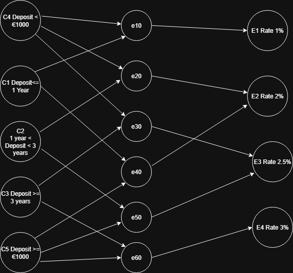
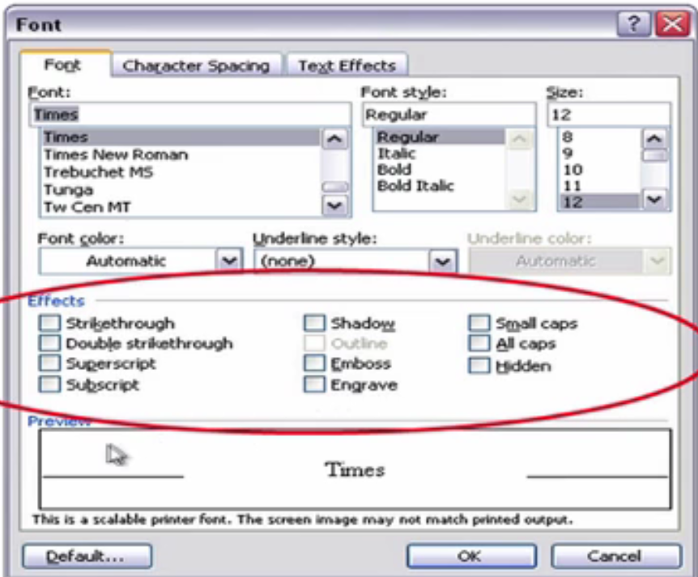
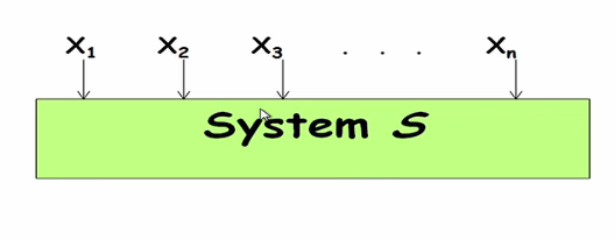

## Learning Outcomes
* Distinguish between the three strategies for combinatorial testing.
* Identify decision table-base testing and its usefulness.
* Recognize pair-wise testing.
* Discuss white-box testing and its types of strategies.

## Combinatorial Testing
### Motivation
* The behaviour of a program may be impacted by many factors:
  * Input parameters
  * Environment configurations
  * State variables
  * etc...
* Equivalence partitioning of an input variable:
  * Identify the possible types of input values requiring different processing
* If the factors are more than 2 or 3:
  * It's impractical to test all possible combinations of values of all factors
* Ofter the specific action to be performed depends on the value of a set of boolean variables
  * Controller applications
  * User interfaces

### Test Types
* Several types of combinatorial testing strategies
  * Decision table based testing
  * Cause effect graphing
  * Pair-wise testing

### Decision table based testing
* Applicable to requirements involving conditional actions
* Can be automatically translated into code
  * Conditions = inputs
  * Actions = outputs
  * Rules = test cases
* Assumes the independence of inputs

**Example 1**
<table style="border-collapse: collapse; text-align: center;">
  <thead style="background-color: #f2f2f2;">
    <tr>
      <th>Condition / Action</th>
      <th>Rule 1</th>
      <th>Rule 2</th>
      <th>Rule 3</th>
      <th>Rule 4</th>
    </tr>
  </thead>
  <tbody>
    <tr>
      <td><strong>Condition 1:</strong> Customer is a member</td>
      <td>Yes</td>
      <td>Yes</td>
      <td>No</td>
      <td>No</td>
    </tr>
    <tr>
      <td><strong>Condition 2:</strong> Purchase amount ≥ €100</td>
      <td>Yes</td>
      <td>No</td>
      <td>Yes</td>
      <td>No</td>
    </tr>
    <tr style="background-color: #d9ead3;">
      <td><strong>Action 1:</strong> Give 10% discount</td>
      <td>Yes</td>
      <td>No</td>
      <td>No</td>
      <td>No</td>
    </tr>
  </tbody>
</table>

| Test Case ID | Customer is Member? | Purchase Amount (€) | Expected 10% Discount? | Description                               |
|--------------|---------------------|---------------------|------------------------|-------------------------------------------|
| TC1          | Yes                 | 150                 | Yes                    | Member with purchase ≥ €100 gets discount |
| TC2          | Yes                 | 80                  | No                     | Member with purchase < €100 no discount   |
| TC3          | No                  | 150                 | No                     | Non-member purchase ≥ €100 no discount    |
| TC4          | No                  | 50                  | No                     | Non-member purchase < €100 no discount    |
| TC5          | Yes                 | -50                 | Invalid input          | Negative purchase amount (invalid)        |
| TC6          | No                  | "abc"               | Invalid input          | Non-numeric purchase amount (invalid)     |
| TC7          | Maybe               | 100                 | Invalid input          | Invalid membership status (invalid)       |
| TC8          | (empty)             | 120                 | Invalid input          | Missing membership status (invalid)       |


**Example 2**
<table style="border-collapse: collapse; text-align: center; width: 100%; max-width: 600px;">
  <thead style="background-color: #f2f2f2;">
    <tr>
      <th>Condition / Action</th>
      <th>Rule 1</th>
      <th>Rule 2</th>
      <th>Rule 3</th>
      <th>Rule 4</th>
    </tr>
  </thead>
  <tbody>
    <tr>
      <td><strong>Condition 1:</strong> Sides satisfy triangle inequality</td>
      <td>Yes</td>
      <td>Yes</td>
      <td>Yes</td>
      <td>No</td>
    </tr>
    <tr>
      <td><strong>Condition 2:</strong> A = B = C</td>
      <td>Yes</td>
      <td>No</td>
      <td>No</td>
      <td>—</td>
    </tr>
    <tr>
      <td><strong>Condition 3:</strong> Exactly two sides equal</td>
      <td>No</td>
      <td>Yes</td>
      <td>No</td>
      <td>—</td>
    </tr>
    <tr>
      <td><strong>Condition 4:</strong> All sides different</td>
      <td>No</td>
      <td>No</td>
      <td>Yes</td>
      <td>—</td>
    </tr>
    <tr style="background-color: #d9ead3;">
      <td><strong>Action 1:</strong> Triangle Type = Equilateral</td>
      <td>Yes</td>
      <td>No</td>
      <td>No</td>
      <td>No</td>
    </tr>
    <tr style="background-color: #fff2cc;">
      <td><strong>Action 2:</strong> Triangle Type = Isosceles</td>
      <td>No</td>
      <td>Yes</td>
      <td>No</td>
      <td>No</td>
    </tr>
    <tr style="background-color: #fff2cc;">
      <td><strong>Action 3:</strong> Triangle Type = Scalene</td>
      <td>No</td>
      <td>No</td>
      <td>Yes</td>
      <td>No</td>
    </tr>
    <tr style="background-color: #f4cccc;">
      <td><strong>Action 4:</strong> Not a triangle</td>
      <td>No</td>
      <td>No</td>
      <td>No</td>
      <td>Yes</td>
    </tr>
  </tbody>
</table>

| Test Case ID | Side A | Side B | Side C | Expected Triangle Type / Result | Description                       |
|--------------|--------|--------|--------|---------------------------------|-----------------------------------|
| TC1          | 4      | 1      | 2      | Not a triangle                  | Triangle inequality not satisfied |
| TC2          | 1      | 4      | 2      | Not a triangle                  | Triangle inequality not satisfied |
| TC3          | 1      | 2      | 4      | Not a triangle                  | Triangle inequality not satisfied |
| TC4          | 5      | 5      | 5      | Equilateral                     | All sides equal                   |
| TC5          | -1     | 5      | 5      | Invalid input                   | Negative side length              |
| TC6          | 0      | 5      | 5      | Invalid input                   | Zero-length side                  |
| TC7          | "a"    | 5      | 5      | Invalid input                   | Non-numeric input                 |
| TC8          | 5      | 5      | 3      | Isosceles                       | Exactly two sides equal           |
| TC9          | 3      | 5      | 5      | Isosceles                       | Exactly two sides equal           |
| TC10         | 5      | 3      | 5      | Isosceles                       | Exactly two sides equal           |
| TC11         | 3      | 4      | 5      | Scalene                         | All sides different               |

Formally, these must all be true:
* A + B > C
* A + C > B
* B + C > A
If any one of these conditions is false, the three lengths cannot form a valid triangle.

**Example 3**

| Condition / Action                            | Rule 1 | Rule 2 | Rule 3 | Rule 4 | Rule 5 |
|-----------------------------------------------|--------|--------|--------|--------|--------|
| **Condition 1:** Printer power on?            | No     | Yes    | Yes    | Yes    | Yes    |
| **Condition 2:** Printer connected to PC?     | —      | No     | Yes    | Yes    | Yes    |
| **Condition 3:** Paper jam?                   | —      | —      | Yes    | No     | No     |
| **Condition 4:** Ink/toner low?               | —      | —      | —      | Yes    | No     |
| **Action 1:** Turn on printer                 | Yes    | No     | No     | No     | No     |
| **Action 2:** Connect printer to PC           | No     | Yes    | No     | No     | No     |
| **Action 3:** Clear paper jam                 | No     | No     | Yes    | No     | No     |
| **Action 4:** Replace ink/toner               | No     | No     | No     | Yes    | No     |
| **Action 5:** Check printer settings/software | No     | No     | No     | No     | Yes    |


#### Quiz: Develop BB Test Cases
Policy for charging customers for certain in-flight services

>If the flight is more than half full AND the ticket cost more than €300 free meals are served unless it is a domestic flight.
The meals are charged on all domestic flights

|            Condition / Action             | Rule 1 | Rule 2 | Rule 3 | Rule 4 | Rule 5 | Rule 6 | Rule 7 | Rule 8 |
|:-----------------------------------------:|:------:|:------:|:------:|:------:|:------:|:------:|:------:|:------:|
|   **Condition 1:** More than half full?   |   N    |   N    |   N    |   Y    |   Y    |   Y    |   N    |   Y    |
| **Condition 2:** More than €300 per seat? |   N    |   N    |   Y    |   N    |   Y    |   N    |   Y    |   Y    |
|        **Condition 3:** Domestic?         |   N    |   Y    |   N    |   N    |   N    |   Y    |   Y    |   Y    |
|        **Action 1:** Serve Meals?         |        |        |        | **X**  | **X**  | **X**  |        | **X**  |
|            **Action 2:** Free?            |        |        |        |        | **X**  |        |        |        |


Reduce the table by eliminating redundant columns
Items marked with `-` mean the value doesn't impact the actions

|            Condition / Action             | Combination 1 | Combination 2 | Combination 3 | Combination 4 |
|:-----------------------------------------:|:-------------:|:-------------:|:-------------:|:-------------:|
|   **Condition 1:** More than half full?   |       N       |       Y       |       Y       |       Y       |
| **Condition 2:** More than €300 per seat? |       -       |       N       |       Y       |       Y       |
|        **Condition 3:** Domestic?         |       -       |       -       |       N       |       Y       |
|        **Action 1:** Serve Meals?         |               |     **X**     |     **X**     |     **X**     |
|            **Action 2:** Free?            |               |               |     **X**     |               |

#### Assumptions Regarding Rules
**Rules need to be complete:**
  * That is, every combination of decision table values including default combinations are present
**Rules need to be consistent:**
  * There is no two different actions for the same combinations of conditions

#### Guidelines & Observations
Decision Table testing is most appropriate for programs where:
* There's a lot of decision making
* There are important logical relationships among input variables
* There are calculations involving subsets of input variables
* There are cause and effect relationships between input and output
* There's complex computation logic

**Decision tables do not scale up well**


#### Quiz: Design Test Cases
Customers on an e-commerce site get the following discount
* A member gets 10% discount for a purchase lower than €100, else 15% discount
* Purchases using a Revolut card get 5% discount
* If the purchase amount after all discounts exceeds €100 then shipping is free

| **Conditions / Actions**                     | **Rule 1** | **Rule 2** | **Rule 3** | **Rule 4** | **Rule 5** | **Rule 6** | **Rule 7** | **Rule 8** |
|----------------------------------------------|------------|------------|------------|------------|------------|------------|------------|------------|
| **Condition 1:** Member?                     | Yes        | Yes        | Yes        | Yes        | No         | No         | No         | No         |
| **Condition 2:** Purchase amount ≥ 100€?     | Yes        | Yes        | No         | No         | Yes        | Yes        | No         | No         |
| **Condition 3:** Revolut payment?            | Yes        | No         | Yes        | No         | Yes        | No         | Yes        | No         |
| **Action 1:** Apply Member Discount (10/15%) | 15%        | 15%        | 10%        | 10%        | 0%         | 0%         | 0%         | 0%         |
| **Action 2:** Apply Revolut Discount (5%)    | Yes        | No         | Yes        | No         | Yes        | No         | Yes        | No         |
| **Action 3:** Calculate Final Amount         | ✔️         | ✔️         | ✔️         | ✔️         | ✔️         | ✔️         | ✔️         | ✔️         |
| **Action 4:** Free Shipping if final > 100€  | Yes/No\*   | Yes/No\*   | No         | No         | Yes/No\*   | Yes        | No         | No         |


| **Test Case** | **Member?** | **Purchase (€)** | **Revolut?** | **Member Discount** | **Revolut Discount** | **Final Amount (€)** | **Free Shipping?** | **Expected Outcome**                     |
|---------------|-------------|------------------|--------------|---------------------|----------------------|----------------------|--------------------|------------------------------------------|
| TC1           | Yes         | 120              | Yes          | 15%                 | 5%                   | 96.90                | ❌ No               | Discounted price below €100, no shipping |
| TC2           | Yes         | 90               | Yes          | 10%                 | 5%                   | 76.95                | ❌ No               | Lower purchase, discounted below €100    |
| TC3           | Yes         | 120              | No           | 15%                 | 0%                   | 102.00               | ✅ Yes              | Discounted price above €100, free ship   |
| TC4           | Yes         | 90               | No           | 10%                 | 0%                   | 81.00                | ❌ No               | No Revolut, not enough for free ship     |
| TC5           | No          | 120              | Yes          | 0%                  | 5%                   | 108.30               | ✅ Yes              | Only Revolut, final amount > €100        |
| TC6           | No          | 90               | Yes          | 0%                  | 5%                   | 85.50                | ❌ No               | Not enough for free shipping             |
| TC7           | No          | 120              | No           | 0%                  | 0%                   | 120.00               | ✅ Yes              | No discounts but high purchase           |
| TC8           | No          | 90               | No           | 0%                  | 0%                   | 90.00                | ❌ No               | No discounts and low purchase            |

### Cause-Effect Graphs
* Explores combinations of possible inputs
* Specific combinations of inputs (causes) and outputs (effects)
* **Avoids combinatorial explosion**
* Represented as nodes of a cause effect graph
* The graph also includes constraints and a number of intermediate nodes linking causes and effects

#### Example
If depositing less than €1000, rate of interest:
* 1% for deposit up to 1 year
* 2% for deposit over 1 year but less than 3 years
* 2.5% for deposit for 3 years and above

If depositing €1000 or more, rate of interest:
* 2% for deposit up to 1 year
* 2.5% for deposit over 1 year but less than 3 years
* 3% for deposit for 3 years and above

|    |           Causes           |
|:---|:--------------------------:|
| c1 |     Deposit <= 1 year      |
| c2 | 1 year < Deposit < 3 years |
| c3 |     Deposit >= 3 years     |
| c4 |      Deposit < €1000       |
| c5 |      Deposit >= €1000      |

|    |  Effects  |
|:---|:---------:|
| e1 |  Rate 1%  |
| e2 |  Rate 2%  |
| e3 | Rate 2.5% |
| e4 |  Rate 3%  |


* Intermediate nodes defined for combinations of causes

Then we develop a decision table

| **c1** | **c2** | **c3** | **c4** | **c5** | **e1** *(1%)* | **e2** *(2%)* | **e3** *(2.5%)* | **e4** *(3%)* |
|:------:|:------:|:------:|:------:|:------:|:-------------:|:-------------:|:---------------:|:-------------:|
|   1    |   0    |   0    |   1    |   0    |     **1**     |       0       |        0        |       0       |
|   1    |   0    |   0    |   0    |   1    |       0       |     **1**     |        0        |       0       |
|   0    |   1    |   0    |   1    |   0    |       0       |     **1**     |        0        |       0       |
|   0    |   1    |   0    |   0    |   1    |       0       |       0       |      **1**      |       0       |
|   0    |   0    |   1    |   1    |   0    |       0       |       0       |      **1**      |       0       |
|   0    |   0    |   1    |   0    |   1    |       0       |       0       |        0        |     **1**     |

* Each row should be converted to a test case

| Test Case | Deposit Duration            | Deposit Amount | Expected Rate |
|-----------|-----------------------------|----------------|---------------|
| TC1       | ≤ 1 year (c1=1)             | < €1000 (c4=1) | 1% (e1=1)     |
| TC2       | ≤ 1 year (c1=1)             | ≥ €1000 (c5=1) | 2% (e2=1)     |
| TC3       | > 1 year & < 3 years (c2=1) | < €1000 (c4=1) | 2% (e2=1)     |
| TC4       | > 1 year & < 3 years (c2=1) | ≥ €1000 (c5=1) | 2.5% (e3=1)   |
| TC5       | ≥ 3 years (c3=1)            | < €1000 (c4=1) | 2.5% (e3=1)   |
| TC6       | ≥ 3 years (c3=1)            | ≥ €1000 (c5=1) | 3% (e4=1)     |


## Pairwise Testing
* In some situations the number of possible test cases becomes extremely large
* _Example_: 50 input conditions where each one is True/False (or potentially multiple values)
  * Even if True/False the number of test cases required is $2^{50}$ = 1,125,899,906,842,624 to test all possible combinations.

### Example - Word Processor Font Options


* 0 = effect OFF
* 1 = effect ON
* $2^{10}$ = 1024 tests for all combinations of effects assuming they're independent
* IF we consider font, font style and size and assume we have 10 options for each:
  * $10^{3} \times 2^{10} = 1000 \times 1024 = 1,024,000$ ... far too many to test

### Combinatorial Testing Problem
> Assuming n number of inputs that can have more than 1 value



* Combinatorial testing problems generally follow a simple input-process-output model
* The _state_ of the system is **not** the focus of combinatorial testing

### Combinatorial Testing
* Instead of testing all possible combinations:
  * A subset of combinations is generated
* Key observation
  * **It is often the case that a fault is caused by interactions among a few factors**
* Combinatorial testing can dramatically reduce the number of test cases:
  * but remains effective in terms of fault detection!!

#### Simple Example
| Setting A | Setting B  | Setting C          |
|-----------|------------|--------------------|
| On / Off  | High / Low | Enabled / Disabled |
* All combinations = 2 × 2 × 2 = 8 tests.
* Pairwise testing reduces this to 4 tests (depending on the generator used).

  | A   | B    | C        |
  |-----|------|----------|
  | On  | High | Enabled  |
  | On  | Low  | Disabled |
  | Off | High | Disabled |
  | Off | Low  | Enabled  |

Every pair of values (A+B, A+C, B+C) appears in at least one test case.

Tools for Pairwise Testing:
* Microsoft PICT (free tool)
* pairwise.py (Python library)
* Online tools like pairwise.org
* Many test management tools (like TestRail) offer pairwise plugins.

| Pros                                 | Cons                                        |
|--------------------------------------|---------------------------------------------|
| Catches most interaction bugs        | May miss bugs caused by 3+ way interactions |
| Fewer test cases, faster testing     | Needs tool support for efficient generation |
| Better coverage than random sampling | Doesn't cover all possible cases            |


**Pairwise Reductions**

| Number of Inputs | Number of selected test data values | Number of combinations | Size of pair wise test set |
|:----------------:|:-----------------------------------:|:----------------------:|:--------------------------:|
|        7         |                  2                  |          128           |             8              |
|        13        |                  3                  |  $1.6 \times 10^{6}$   |             15             |
|        40        |                  3                  |  $1.2 \times 10^{19}$  |             21             |

| Column                                  | Meaning                                                                                   |
|-----------------------------------------|-------------------------------------------------------------------------------------------|
| **Number of Inputs**                    | How many inputs or factors you have (e.g., settings, fields, etc.)                        |
| **Number of selected test data values** | How many possible values each input can have (e.g., On/Off = 2; High/Medium/Low = 3)      |
| **Number of combinations**              | The total number of **all possible combinations** (brute force testing = test everything) |
| **Size of pairwise test set**           | How many tests you need using **pairwise testing**, just covering **all pairs**           |

**First Row:**
* 7 inputs, each with 2 possible values (True/False). 
* All combinations = $2^{7} = 128$
* Pairwise testing reduces this to 8 tests while covering every possible pairwise combination.

**Second Row:**
* 13 inputs, each with 3 possible values.
* All combinations = $3^{13} = 1.6 \times 10^{6}$
* Pairwise test set = 15 tests (huge reduction).

**Third Row:**
* 40 inputs, each with 3 values.
* All combinations = $3^{40} = 1.2 \times 10^{19}$ (completely unmanageable).
* Pairwise set = 21 tests (incredible reduction).

### Fault-Model
* A _t-way_ interaction fault:
  * Triggered by a certain combination of _t_ input values
  * A simple fault is a _1-way_ fault
  * Pairwise fault is a _t-way_ fault where _t = 2_
* In practice, the majority of software faults consist of simple and pairwise faults

#### Single-mode Bugs
* The simplest bugs are single-mode faults:
  * Occur when one option alone causes a problem, no matter what the other settings are.
  * _Example:_ In a mobile app, selecting “Dark Mode” causes the app to crash, regardless of user account, language settings, or device model.

#### Double-mode Faults
* Occurs when 2 options are combined
* _Example:_ In a mobile app, selecting “Dark Mode” causes the app to crash on iPhones running iOS 18.5 or later, regardless of user account, language settings.

#### Example of a Pairwise fault
``` python
begin
    string paymentMethod, shippingOption, discountCode;
    input(paymentMethod, shippingOption, discountCode);

    if (paymentMethod == "Card" and shippingOption == "Express") then
        output (calculateCardExpress(paymentMethod, shippingOption, discountCode));
    else if (paymentMethod == "PayPal" and shippingOption == "Standard") then
        output (calculatePaypalStandard(paymentMethod, shippingOption));
    else
        output (calculateCardExpress(paymentMethod, shippingOption, discountCode) 
              + calculatePaypalStandard(paymentMethod, shippingOption));
end

```

| Pair                                                    | Outcome                                            |
|---------------------------------------------------------|----------------------------------------------------|
| (Card, Express)                                         | ✅ Processed with `calculateCardExpress()`          |
| (PayPal, Standard)                                      | ✅ Processed with `calculatePaypalStandard()`       |
| Other pairs (e.g., Card + Standard or PayPal + Express) | ❓ Fall to **else block**, mixing both calculations |

* Certain pairs of payment method and shipping option cause odd behavior.
* Example: maybe PayPal + Express (not directly handled) triggers a wrong combination of logic.
* Pairwise testing, which checks all pairs of paymentMethod and shippingOption, would reveal it.

#### Example: Android Smart Phone Testing
* Apps should work on all combinations of platform options

| Factor                  | Example Options                       | Count |
|-------------------------|---------------------------------------|-------|
| **OS Version**          | Android 12, 13, 14                    | 3     |
| **Device Manufacturer** | Samsung, Google, Xiaomi               | 3     |
| **Screen Size**         | Small, Medium, Large, XL              | 4     |
| **CPU Type**            | ARMv7, ARM64, x86                     | 3     |
| **RAM Size**            | 2GB, 4GB, 6GB, 8GB, 12GB              | 5     |
| **Network Type**        | WiFi, 4G, 5G, Ethernet                | 4     |
| **Locale/Language**     | EN, FR, ES, DE                        | 4     |
| **Battery Level**       | Full, Medium, Low, Critical, Charging | 5     |
| **Dark Mode**           | On, Off, System Default, Scheduled    | 4     |


3×3×4×3×5×4×4×5×4=172,800
This is exhaustive testing — totally impractical!

**Pairwise Testing Solution:**
* With pairwise testing, you don’t test every possible full combination.
* You only test every possible pair of options across all factors.
* This can reduce 172,800 tests to maybe 50-100 tests, while still catching most realistic bugs caused by two-way interactions.

| Testing Approach     | Number of Tests | Practicality            |
|----------------------|-----------------|-------------------------|
| **All combinations** | 172,800         | 🚫 Impractical          |
| **Pairwise Testing** | \~50–100        | ✅ Realistic & effective |

## White-Box Testing
### What is White-Box Testing?
* Test Cases designed based on:
  * Code structure of the software
  * aka Structural testing


### Why Both White-box (WB) and Black-box (BB) Testing?
| **Reason**                 | **Explanation**                                                                                                                                                                                            |
|----------------------------|------------------------------------------------------------------------------------------------------------------------------------------------------------------------------------------------------------|
| **Different Perspectives** | **Black-box testing** focuses on **inputs and outputs** (functionality, user experience), while **white-box testing** looks inside the **code structure** (logic, flow). Together, they cover more ground. |
| **Catch Different Bugs**   | Black-box finds **missing features**, **UI errors**, and **logic flaws** from a user's view. White-box catches **hidden code defects**, **dead code**, **security gaps**, or **incorrect logic flows**.    |
| **Complement Each Other**  | BB can miss **internal code problems** if the output seems fine. WB can miss **usability** or **requirement mismatches**. Using both ensures **wider, deeper testing**.                                    |
| **Regulatory Compliance**  | In industries like **finance** or **aviation**, using both methods is often required to show full system reliability.                                                                                      |
| **Better Risk Coverage**   | Combining them helps detect issues across **functional, structural, and security aspects**, reducing overall product risk.                                                                                 |

### White-Box Testing Strategies
**Coverage-based:**
* Design test cases to cover certain software elements
**Fault-based:**
* Design test cases to expose some category of faults


**Some techniques:**

| **Technique**                                                  | **What It Means**                                                                | **What It Focuses On**                                                                               |
|----------------------------------------------------------------|----------------------------------------------------------------------------------|------------------------------------------------------------------------------------------------------|
| **Statement Coverage**                                         | Have all **lines of code** been executed at least once?                          | **Every statement** runs during tests.                                                               |
| **Branch Coverage**                                            | Have all **if/else branches** been executed?                                     | Every **decision point** is tested both **true and false**.                                          |
| **Path Coverage**                                              | Have all possible **execution paths** been followed?                             | **All paths** through the code, even combinations of branches.                                       |
| **Condition Coverage**                                         | Have all **conditions** in decisions been **true and false** at least once?      | Focus on each **individual condition**, even in complex expressions.                                 |
| **MC/DC Coverage**<br>*(Modified Condition/Decision Coverage)* | Does **each condition independently affect the decision outcome**?               | Used in **high-safety industries** (aviation, medical), more thorough than basic condition coverage. |
| **Mutation Testing**                                           | Make **small code changes (mutations)** — do your tests **catch and fail** them? | Measures test suite **effectiveness**, by checking if it detects **introduced bugs**.                |
| **Data Flow-based Testing**                                    | Focus on **how data is used** — test **definitions and uses of variables**.      | Detects issues like **uninitialized variables, wrong assignments**.                                  |

### Coverage-Based Testing vs. Fault-Based Testing
* Idea behind coverage-based testing:
  * Design test cases so that certain program elements are executed (or covered)
  * Example: Statement, Branch, Path coverage etc.

* Idea behind fault-based testing:
  * Design test cases that focus on discovering certain types of faults
  * Example: Mutation testing

### Strong & Weaker Testing
| **Strong Testing**                                                | **Weaker Testing**                                                                   |
| ----------------------------------------------------------------- | ------------------------------------------------------------------------------------ |
| Involves **more thorough, rigorous tests**                        | Involves **less thorough or shallow tests**                                          |
| Aims for **higher coverage** — e.g., path coverage, MC/DC         | Often limited to **basic tests** — e.g., statement coverage, simple functional tests |
| Finds **more subtle or complex bugs**                             | Likely to miss corner cases or deep logic errors                                     |
| Usually requires **more time and resources**                      | Faster, cheaper but riskier approach                                                 |
| Examples: white-box testing with path coverage, mutation testing  | Examples: simple black-box tests, ad hoc exploratory tests                           |
| Often required in **safety-critical systems** (aviation, medical) | May be acceptable in **non-critical** or early-stage projects                        |

**Including Complementary Testing**
* Complementary testing means intentionally including multiple different testing techniques in your overall test strategy to cover various aspects of the software, because:
* No single testing technique is enough by itself.
* Different techniques complement each other by finding different kinds of bugs.
* Including complementary testing improves test coverage, defect detection, and quality.

| Reason                              | Explanation                                                                          |
|-------------------------------------|--------------------------------------------------------------------------------------|
| **Broader Coverage**                | Combines functional (black-box), structural (white-box), performance, security, etc. |
| **Higher Confidence**               | Bugs missed by one method are caught by another                                      |
| **Risk Mitigation**                 | Reduces chances of serious defects slipping through                                  |
| **Adaptability**                    | You can balance cost, time, and risk by choosing the right mix                       |
| **Regulatory & Industry Standards** | Many standards recommend multiple test methods for compliance                        |

**Example of Including Complementary Testing:**
* Use black-box tests to verify user requirements.
* Use white-box tests to verify code branches and logic.
* Add performance tests for speed and load handling.
* Add security tests for vulnerabilities.
* Run exploratory tests to catch unexpected issues.

### Statement Coverage
* Idea: Unless a statement is executed we have no way of knowing if an error exists in that statement.
* Coverage items are executable statements
* Executable statements perform computations & control the output of the program
* Design test cases that exercise statement until an acceptable level of coverage
* Statement Coverage is the percentage of executable statements that have been executed by a test suite is calculated by:
  $$
  \frac{\textbf{No. of statements executed}}{\textbf{Total no. of executable statements}} \times 100\%
  $$

**Example**
* Exercises the executable statements in the code
* Code:
````
READ A
READ B
IF A > B THEN C = 0
ENDIF
````
**Q: How many testcases are needed to achieve 100 % statement coverage?**
**A: 1**

### Decision Coverage
* Decision is an IF, loop control (DO-WHILE, REPEAT-UNTIL) or a CASE statement with two or more possible outcomes (True – False)
* A decision is both sides of a statement
* Decision testing exercises the decisions in the code & tests the executed code based on decision outcomes
* Decision & branch coverage are **NOT** the same thing
  * Decision testing – considers **ONLY CONDITIONAL** branches in the code
  * Branch testing – considers **BOTH CONDITIONAL & UNCONDITIONAL** branches in the code
* 100% Decision Coverage implies 100% Statement coverage

**Decision Coverage**
$$
\frac{\textbf{No. of decision outcomes executed}}{\textbf{Total no. of decision outcomes}} \times 100\%
$$

### Branch Coverage

* A branch is transfer between two nodes in the control flow
* This transfer shows possible sequences in which statements are executed
* Each branch can be
  * Unconditional (i.e. straight line code)
    **OR**
  * Conditional (i.e. a decision outcome, ‘IF, THEN’)
* Coverage items are branches
* Aim is to design tests to exercise branches in the code until an acceptable level of coverage is achieved
* Branch testing focuses on the percentage of branches that have been executed by a test suite
* Difference with Decision testing is that where:
  * Decision testing focus **ONLY** on the conditional branches
  * Branch testing focuses on **BOTH** conditional & unconditional branches
* In practice Decision Testing & Branch Testing mostly give the same results


**Branch Coverage**
$$
\frac{\textbf{No. of branches exercised by the test cases}}{\textbf{Total no. of branches}} \times 100\%
$$

* 100 % Branch Coverage:
  * Ensures all branches in the code are exercised by tests
    * Conditional branches – typically
      * Decision outcomes (True – False from an ‘IF’ statement)
      * Outcome from a switch/case statement
      * Decision to exit or continue in a loop
  * Unconditional branches – Do NOT depend on a decision made in a statement
* Defects will not be found in ALL cases – Branch Coverage is not the same as path coverage
* 100 % Branch Coverage = 100% Decision Coverage = 100 % Statement Coverage – not vice versa

### Path Testing & Coverage
* Taking branch testing one step further
* Does not only execute each path, but ALSO each combination between different statements
* 100 % Path Coverage = 100 % Branch Coverage = 100% Decision Coverage = 100 % Statement Coverage – not vice versa


### Condition Coverage
* Also called multiple condition (MC) coverage
* Test case design
  * Each component of a composite conditional expression
    * Made to assume both true and false values

## Lesson Summary
Combinatorial testing is another black box testing strategy.
Equivalence class and Special Value testing become very difficult when the number of parameters rises. Combinatorial testing involves more than one attribute to test the data, the environment, and/or configuration.

There are several types of combinatorial testing strategies, they would include:
• Decision table-based testing: the tables are broken into conditions, actions and rules.
• Cause-effect graphing: maps a set of causes(inputs) to a set of effects(outputs).
• Pair-wise or all-pairs testing: tests all possible combinations of a pair of input parameters.

White-box test cases are designed based on the code structure of the program, as such is also called structural testing.

There are a number of white-box strategies, they can be broken into two types:
1. Coverage-based - Designed to test certain program elements.
2. Fault-based - Designed to expose certain categories of faults.