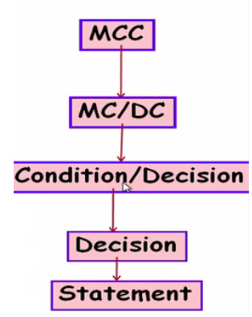

## Learning Outcomes
* Discuss the different types of condition testing.
* Recognize modified condition and decision coverage testing.

### Recap: Condition Testing
* Each atomic condition made to have both T and F value

**Example**
```java
if(a > 10 && b < 50){
    // do something
}
```
* The following would achieve basic condition coverage:
  * `a = 15, b = 30`
  * `a = 5, b = 50`
* Does basic condition testing include decision coverage? Yes, in this case but doesn't always

* Decision testing is a weak testing criteria
* Condition Testing:
  * Basic condition coverage
  * Basic condition/decision coverage
  * Multiple condition coverage
  * Modified condition and decision coverage


### Condition Testing
#### Condition / Decision Coverage
* Each atomic condition made to have both T and F value
* Decisions are also made to get T and F values
* i.e. You need each atomic condition to be T and F at least once, AND the overall decision outcome (the full if condition) to be True and False.
* Example: `if (A > 50 OR B < 30)`
  * Atomic conditions here are:
    * `A > 50` 
    * `B < 30`
  * `A = 70 (T), B = 50 (F)` and `A = 30 (F), B = 20 (T)` achieves basic condition coverage
  * Need to include `A = 20 (F), B = 50 (F)` for condition / decision coverage

#### Multiple Condition Coverage (MCC)
* Atomic conditions made to assume all possible combinations of values
* Example: `if (A > 50 OR B < 30)`
* The following test suite achieves MCC
  * `A = 30 (F), B = 20 (T)`
  * `A = 30 (F), B = 40 (F)`
  * `A = 60 (T), B = 20 (T)`
  * `A = 60 (T), B = 40 (F)`

#### Shortcomings of Condition Testing
* **Redundancy of test cases**: Condition evaluation could be compiler-dependent:
  * Short circuit evaluations of conditions
  * i.e. When a program evaluates a logical condition (like if (A || B)), it stops evaluating as soon as it knows the result.
  * If A is True, the program doesn't bother checking B—because the whole condition is already True.
* **Coverage may be Unachievable:** Possible dependencies among variables:
  * Example: `if ((var ="A") || (var = "B"))`
  * Can't both be true at the same time

#### Short-circuit Evaluation
* Example: `if (A > 50 && B < 30)`
* IF `A > 50` is FALSE the compiler doesn't evaluate `B < 30`

* Example: `if (A > 50 || B < 30)`
* IF `A > 50` is TRUE the compiler doesn't evaluate `B < 30`

#### Shortcomings of Multiple condition coverage (MCC)
* Consider a boolean expression having n atomic compoments
  * MCC is strongest
  * BUT for MCC we require $2^n$ test cases
  * Therefore, only practical if n (the number of component conditions) is small (2 or 3)

##### Example 1: Two Atomic Conditions

Condition:
```if (A || B)```

| **Test Case** | **A** | **B** | **Outcome (A OR B)** |
|----------------|-------|-------|-----------------------|
| 1              | True  | True  | True                  |
| 2              | True  | False | True                  |
| 3              | False | True  | True                  |
| 4              | False | False | False                 |

**2 atomic conditions → 2² = 4 test cases**.

##### Example 2: Three Atomic Conditions

Condition:
```if (A || B || C)```

| **Test Case** | **A** | **B** | **C** | **Outcome (A OR B OR C)** |
|----------------|-------|-------|-------|----------------------------|
| 1              | True  | True  | True  | True                       |
| 2              | True  | True  | False | True                       |
| 3              | True  | False | True  | True                       |
| 4              | True  | False | False | True                       |
| 5              | False | True  | True  | True                       |
| 6              | False | True  | False | True                       |
| 7              | False | False | True  | True                       |
| 8              | False | False | False | False                      |

**3 atomic conditions → 2³ = 8 test cases**.

---

##### Summary

| **Number of Atomic Conditions** | **Test Cases (2ⁿ)** |
|----------------------------------|---------------------|
| 2                                | 4                   |
| 3                                | 8                   |
| 4                                | 16                  |
| 5                                | 32                  |
| 6                                | 64                  |
| ...                              | ...                 |

MCC provides the **strongest coverage**, but quickly becomes **impractical** when conditions increase.

### Modified Condition/Decision Coverage (MC/DC)
* A condition coverage technique
  * **Condition**: Atomic conditions in expression
  * **Decision**: Controls the program flow
* **Motivation**: Effectively test **important combinations** of conditions without exponentially blowing up test suite size
  * **Important Combinations**: Each basic condition is shown to independently impact the outcome of each decision
* **Requires:**
  * For each basic condition C, two test cases
  * Values of all evaluation condition except C are the same
  * Compound condition as a whole evaluates to _true_ for one test case and _false_ for the other

#### Three Requirements for MC/DC
| **Requirement**                                          | **Definition**                                                                          | **Example**                                                                                                                                                                                                                                     | **Explanation**                                                                       |
|----------------------------------------------------------|-----------------------------------------------------------------------------------------|-------------------------------------------------------------------------------------------------------------------------------------------------------------------------------------------------------------------------------------------------|---------------------------------------------------------------------------------------|
| **1. Decision takes both True and False outcomes**       | The full decision must evaluate to both `True` and `False`.                             | `if (A && B)`<br>Test 1: A = true, B = true → Decision = true<br>Test 2: A = false, B = true → Decision = false                                                                                                                                 | The overall decision is tested for both true and false.                               |
| **2. Each condition takes both True and False**          | Every individual condition must evaluate to both `True` and `False`.                    | `if (A && B)`<br>Test 1: A = true, B = true<br>Test 2: A = false, B = true<br>Test 3: A = true, B = false                                                                                                                                       | A and B both take true and false across these tests.                                  |
| **3. Each condition independently affects the decision** | There must be test pairs where changing only one condition changes the decision result. | `if (A && B)`<br><br>To show A's effect:<br>• A = true, B = true → Decision = true<br>• A = false, B = true → Decision = false<br><br>To show B's effect:<br>• A = true, B = true → Decision = true<br>• A = true, B = false → Decision = false | Changing just A or just B causes the decision to flip, proving independent influence. |


#### Example: `if (A || B)`

| **Test Case** | **A** | **B** | **Outcome** | **Which condition is shown to affect outcome?** |
|----------------|-------|-------|--------------|-------------------------------------------------|
| 1              | True  | False | True         | A affects outcome (True vs False)               |
| 2              | False | False | False        |                                                 |
| 3              | False | True  | True         | B affects outcome (True vs False)               |
| 4              | False | False | False        |                                                 |

- **A**: Test cases 1 & 2 → changing A changes outcome.
- **B**: Test cases 3 & 4 → changing B changes outcome.

**MC/DC needs only 4 test cases vs 4 (MCC)**. In this case, the number is the same because it's simple.

#### Example with 3 Conditions: `if (A && B) || C`

With 3 atomic conditions:
- **MCC** → 2³ = 8 test cases.
- **MC/DC** → typically needs **4-6 test cases**, depending on dependencies.

| **Test Case** | **A** | **B** | **C** | **Outcome** | **Which condition affects outcome?** |
|----------------|-------|-------|-------|--------------|--------------------------------------|
| 1              | True  | True  | False | True         | A and B affect outcome together      |
| 2              | False | True  | False | False        | A affects outcome                    |
| 3              | True  | False | False | False        | B affects outcome                    |
| 4              | False | False | True  | True         | C affects outcome                    |
| 5              | False | False | False | False        |                                      |

**Each condition shown to independently affect decision outcome.**

**MC/DC gives high confidence without exponential explosion in test cases**.

### Test Coverage Criteria
#### Condition/Decision Coverage
* Condition: true, false
* Decision: true, false

#### Multiple Condition Coverage (MCC)
* All possible combinations of condition outcomes in a decision
* For a decision with $n$ conditions $2^n$ test cases are required

#### Modified Condition/Decision Coverage (MC/DC)
* Bug-detected effectiveness almost similar to MCC
* Linear growth in number of test cases required



## Lesson Summary
Types of Condition coverage testing:

* Basic condition coverage: Each atomic condition made to have both true and false values.
* Basic condition/decision coverage: ensures basic condition coverage testing and decision or branch condition testing.
* Multiple condition coverage (MCC): atomic conditions made to assume all possible combinations of true/false values.
* Modified condition and decision coverage (MC/DC Testing): tests the important combinations of conditions without blowing up the test suit size.

In a Condition coverage technique:
* Condition: Atomic conditions in expression
* Decision: Controls the program flow
* Atomic condition: a condition that cannot be decomposed. For example, a condition that does not contain two or more single conditions joined by a logical operator (AND, OR, etc.).