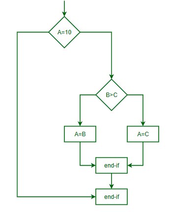
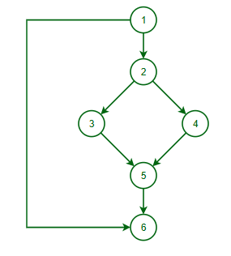
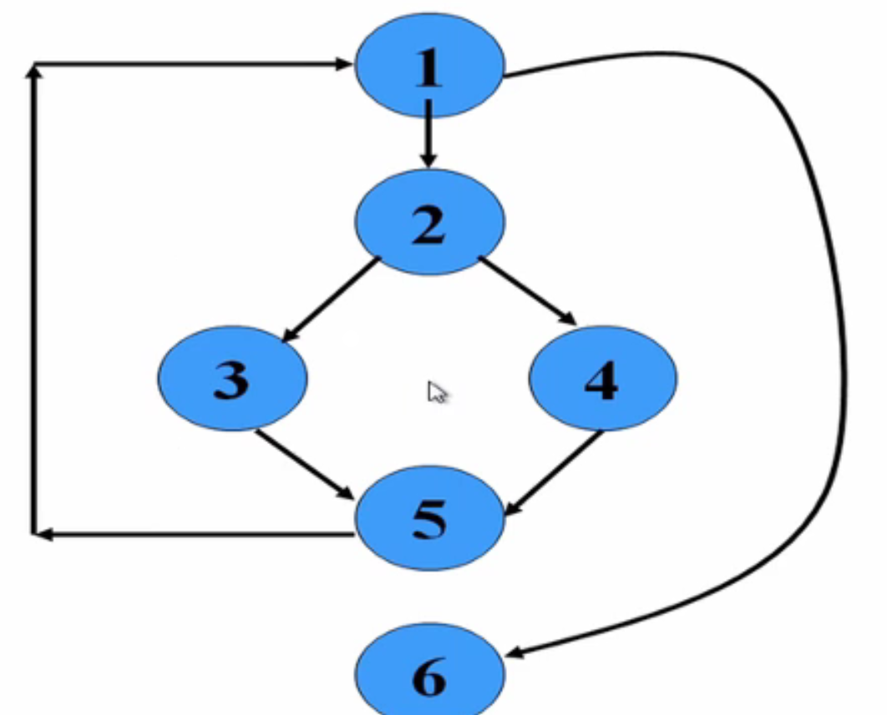
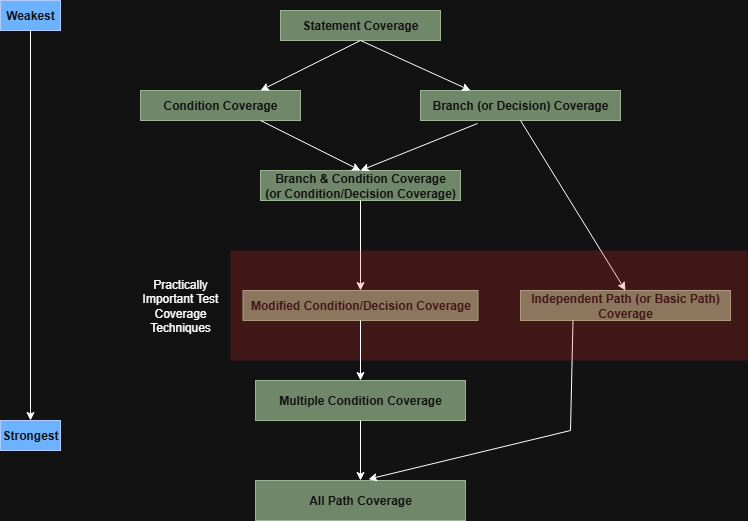
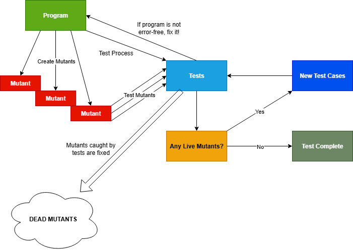

## Learning Outcomes
* Identify path coverage testing and creation of control-flow graphs.
* Discuss dataflow testing.
* Discuss mutation testing and identify its drawbacks.

## Path Testing
* Design test cases such that:
  * All linearly independent paths in the program are executed at least once
* Defined in terms of Control Flow Graph (CFG) of a program

### Path Coverage-Based Testing
* To understand the path coverage-based testing:
  * We need to learn how to draw the Control Flow Graph (CFG) of a program
* A CFG describes:
  * The sequence in which different instructions of a program get executed
  * The way control flows through the program

### How to draw a Control Flow Graph
1. Number all statements in the program.
   * Each statement or block of code is assigned a unique number.
2. Use the numbered statements as nodes in the graph.
3. Draw an edge (arrow) from one node to another if:
   * Execution of the statement represented by the first node can lead to the execution of the statement represented by the second node.
4. Include decision points (like if, while, for, switch) with outgoing edges representing possible control flow paths.

**Summary**: Nodes = statements, edges = flow of control. The graph visually represents all possible paths through the code during execution.

* Every program is composed of three basic control structures:
  1. **Sequence** — code that runs line by line in order.
  2. **Selection** — decision-making, like if or switch statements.
  3. **Iteration** — loops, like for, while, or do-while.
* If you understand how to draw Control Flow Graphs (CFG) for these basic structures,
you can draw a CFG for any program by combining these patterns.

### Control Flow Graph (CFG)
* A Control Flow Graph (CFG) is the graphical representation of control flow or computation during the execution of programs or applications. Control flow graphs are mostly used in static analysis as well as compiler applications, as they can accurately represent the flow inside a program unit.
**Example**
```
if  A = 10 then
  if B > C
     A = B
  else A = C
  endif
  endif
print A, B, C 

```
Flowchart of above example will be:


Control Flow Graph of above example will be:


### Paths
- A **path** in a Control Flow Graph (CFG) is any possible route you can take through the program from the starting node to the ending node.
- It consists of a sequence of connected nodes and edges that represent the order in which statements are executed.

### Linearly Independent Paths
- **Linearly Independent Paths** are unique paths through the CFG that introduce at least **one new edge** or **node** that is not included in any other path.
- They are important for testing because covering all linearly independent paths ensures that all parts of the program logic are exercised at least once.
- The **Cyclomatic Complexity** of a program gives the number of linearly independent paths.

#### Example:
If a CFG has 4 linearly independent paths, designing test cases to follow each of these paths will help achieve thorough coverage of the program logic.

####  Why It Matters
- Identifying linearly independent paths helps in designing more effective test cases.
- This reduces the risk of missing defects caused by untested logic branches.

#### Example of Control Flow Graph (CFG) and Linearly Independent Paths

#### Code Example
```
1. Start
2. if (A > 0)
3.     doSomething();  
4. else
5.     doSomethingElse();  
6. end
```
#### Control Flow Graph (CFG) Explanation
- Each numbered statement is represented as a node in the graph.
- The flow of control is as follows:
  - From **1 → 2**
  - If the condition is **true**: **2 → 3 → 6**
  - If the condition is **false**: **2 → 5 → 6**

#### Linearly Independent Paths Defined
- **Path 1**: 1 → 2 → 3 → 6 (condition true)
- **Path 2**: 1 → 2 → 5 → 6 (condition false)

#### Summary
- There are **2 linearly independent paths**.
- This matches the **cyclomatic complexity** of 2, calculated as:
  Cyclomatic Complexity = Number of Decisions + 1 = 1 + 1 = 2
- Designing test cases to follow each linearly independent path ensures both outcomes of the `if` condition are tested.

#### Why This Matters
- Covering all linearly independent paths helps to test all important branches of the program.
- This approach increases confidence that the logic is working correctly.

### McCabes Cyclomatic Metric
McCabe’s Cyclomatic Complexity is a software metric used to measure the **complexity of a program** by counting the number of **linearly independent paths** through its Control Flow Graph (CFG).

Cyclomatic Complexity (CC) = $E - N + 2P$

Where:
- $E$ = Number of edges (arrows in the CFG)
- $N$ = Number of nodes (statements or blocks)
- $P$ = Number of connected components (usually 1 for a single program or function)

It provides a practical way of determining the maximum number of test cases required for basic path testing

If you are analyzing just **one function** or a simple program (P = 1), the formula becomes:

CC = $E - N + 2$

Where:
- $E$ = Number of edges (arrows in the CFG)
- $N$ = Number of nodes (statements or blocks)

### Cyclomatic Complexity
* McCabes metric provides a quantitative measure of testing difficulty and the reliability
* Intuitively - Number of bounded areas increases with the number of decision nodes and loops
* The Cyclomatic Complexity of a program provides:
  * A **lower bound/minimum** on the number of test cases to be designed to guarantee coverage of all linearly independent paths
  
Another way of computing cyclomatic complexity:
* Inspect CFG
* Determine number of bounded areas in the graph

$CC = V(G) = Total number of bounded areas + 1$

Bounded area = A closed loop formed by a set of nodes and edges. It represents an independent logical path or decision structure in the program. Bounded areas typically arise from branching constructs like `if`, `while`, `for`, or `case`.

#### Example 1
Consider the following pseudocode:

```pseudocode
start
|
v
if (condition)
|         \
v          v
block1     block2
\         /
v       v
end
```

Corresponding CFG
```pseudocode
        [Start]
           |
           v
        [Condition]
         /      \
        v        v
   [Block1]   [Block2]
         \      /
          v    v
          [End]

```
Identifying Bounded Areas:
There is 1 bounded area: the loop formed between Condition, Block1, and Block2.

Therefore:
$CC = V(G) = Total number of bounded areas + 1 = 1 + 1 = 2$

#### Example 2


Therefore:
$CC = V(G) = Total number of bounded areas + 1 = 2 + 1 = 3$

### Practical Path Testing
* The tester proposes initial set of test data using their experience and judgement
* A dynamic program analyser is used to:
  * Measure which parts of the program have been tested
  * Result used to determine when enough coverage has been reached

### Derivation of Test Cases
1. Draw control flow graph
2. Determine cyclomatic complexity
3. Determine the set of linearly independent paths
4. Prepare test cases
   * Force execution along each path
   * Not practical for larger programs

#### Example
```java
int function(int x, int y){
    while( x != y){
        if(x > y){
            x = x - y;
        }else {
            y = y - x;
        }
    }
    return x;
}

```

#### Test Cases
* Number of independent paths = 3
  * 1 → 6, test case (x = 1, y = 1)
  * 1 → 2 → 3 → 5 → 1 → 6, test case (x = 1, y = 2)
  * 1 → 2 → 4 → 5 → 1 → 6, test case (x = 2, y = 1)




## Dataflow and Mutation Testing
### White-Box Testing: Recap


### Data Flow-Based Testing
* Selects test paths of a program based on the locations of definitions and uses of different variables in a program
* For a given statement numbered S:
  * DEF(S) = { X | variable X is defined (i.e., assigned a value) in statement S }
  * USES(S) = { X | variable X is used (i.e., its value is read) in statement S }
  * Example: 
    * `1: a = b;` 
      * `DEF(1) = {a}`
      * `USES(1) = {b}`
    * `2: a = a + b;` 
      * `DEF(2) = {a}`
      * `USES(2) = {a,b}`

* A variable X is said to be live at statement S1 if
  * X is defined at the state S
  * There exists a path from S to S1 not containing any definition of X

#### Example
```java
public class DataFlowExample {
  public void dataFlowExample() {
    int x = 10;                        // 1: DEF(1) = {x}, USES(1) = {}
    int y = 5;                         // 2: DEF(2) = {y}, USES(2) = {}
    if (x > y) {                       // 3: DEF(3) = {}, USES(3) = {x, y}
      x = x + y;                       // 4: DEF(4) = {x}, USES(4) = {x, y}
    } else {                           // 5: N/A - Control Structure
      y = y + 2;                       // 6: DEF(6) = {y}, USES(6) = {y}
    }                                  // 7: N/A - Control Structure
    System.out.println("x = " + x);    // 8: DEF(8) = {}, USES(8) = {x}
    System.out.println("y = " + y);    // 9: DEF(9) = {}, USES(9) = {y}
  }
}
```

#### Definition-use chain (DU chain)
* Format `[Variable Name, Statement at which it's defined, Statement when its used]`
* Example `[X, S, S1]`
  * S & S1 are statement numbers
  * X in DEF(S)
  * X in USES(S1)
  * The definition of X in the statement S is live at statement S1

#### Simple Data Flow-Based Testing Strategy
* Every DU chain in a program must be covered at least once
* Useful for selecting test paths of a program containing nested if and loop statements

## Mutation Testing
* The software is first tested using an initial test suite, typically designed using white-box testing strategies.
* Once the initial testing is complete, mutation testing is performed to evaluate the quality of the test suite.
* The core idea behind mutation testing is to make small, deliberate changes (called mutations) to the program's source code.

### Main idea
* **Insert faults into a program**
  * Check if the test suite is able to detect these
  * This either validates or invalidates the test suite

### Terminology
* Each small change made to the original program is called a **mutant**.
* The resulting modified version of the program (after applying one such change) is called a **mutated program** or simply a **mutant program**.

>If the test suite fails when run against a mutant, the mutant is said to be killed (i.e., the test detected the change).
If the test suite passes even with the mutant, the mutant is alive, indicating that the test suite might be inadequate.

### Example
Suppose the original code is:
```java
if (a == b)
```
A mutation could change it to:
```java
if (a != b) // Relational operator mutation
```
If your test suite does not fail after this change, it suggests the tests aren't covering this decision condition well enough.

### Use
* If a mutant remains alive even after all test cases have been executed:
  * **The test suite is enhanced to kill the mutant**
* The process of generating and killing of mutants can be automated by predefining a set of primitive changes that can be applied to the program

### Examples of primitive changes to a program
* Deleting a statement
* Altering an arithmetic operator
* Changing the value of a constant
* Changing a data type
* etc.

### Traditional Mutation Operators
* Deletion of a statement
* Boolean:
  * Replacement of a statement with another e.g. `==` and `>=`, `<` and `<=`
  * Replacement of boolean expressions with _true_ or _false_ e.g. `a || b` with `true`
* Replacement of arithmetic operators
  * e.g. `*` and `+`, `/` and `-`
* Replacements of variables (ensuring same scope and type)

### Underlying Hypotheses
* Mutation testing is based on the following 2 hypotheses
  1. The Competent Programmer Hypothesis (CPH)
     > The Competent Programmer Hypothesis assumes that programmers write code that is almost correct — i.e., most real-world faults are small deviations from the intended correct program.

     * Therefore, introducing small changes (mutants) simulates realistic errors.
     * If a test suite can catch these small changes, it is likely to catch actual bugs introduced by competent programmers.
  
  2. The Coupling Effect
     > The Coupling Effect suggests that test cases capable of detecting simple faults (i.e., single mutants) are also likely to detect more complex faults, which are combinations of simple faults.

     * This justifies using simple mutants for evaluating test suite effectiveness.
     * It implies that if your test suite can kill all single mutants, it’s probably good enough to detect more complicated errors too.

### The Mutation Process


### Equivalent Mutants
* An equivalent mutant is a mutated version of the program that, despite the code change, behaves identically to the original program for all possible inputs.
* Because the mutant does not change the program’s behavior, no test case can distinguish it from the original, so it can never be killed by any test.

**Why Equivalent Mutants Matter?**
* They **inflate the number of mutants** without providing useful information, potentially lowering the mutation score unfairly.
* Identifying equivalent mutants is undecidable in general, so they are usually handled heuristically (e.g., manual inspection or tooling support).

#### Example
Original Code:
```java
if (a > b) {
    doSomething();
}
```
Equivalent mutant (changing `>` to `>=` when `a` and `b` are never equal):
```java
if (a >= b) {
    doSomething();
}
```
If the program logic ensures `a` is never equal to `b`, this mutant behaves exactly the same as the original.

### Disadvantages of Mutation Testing
* Equivalent Mutants
* Computationally very expensive
  * A large number of possible mutants can be generated
* Certain types of faults are very difficult to inject
  * Only simple syntactic faults introduced

### Quiz 1
Q: Identify advantages and disadvantages of mutation testing 

Advantages:
* Can be automated
* Helps effectively strengthen black box adn coverage-based test suite

Disadvantages:
* Equivalent Mutants

## Lesson Summary 
Path coverage testing is designs cases that all linearly independent paths in the program are executed at least once.
A control flow graph describes:
• The sequence in which different instructions of a program get executed
• The way control flows through the program
With loops the number of paths can become extremely large, making all path testing impractical.

In Dataflow testing you have test cases that covers the definitions and uses of different variables in a program. Dataflow testing strategies are useful for selecting test paths of a program containing nested if and loop statements.

Mutation testing is a fault base testing technique, where you introduce a specific fault into a program and then check whether the test cases are effective against it. Mutation testing is performed after the initial testing is complete.
