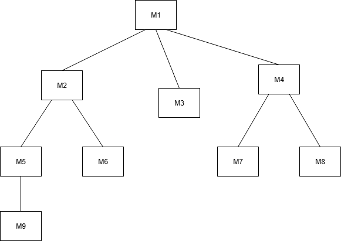
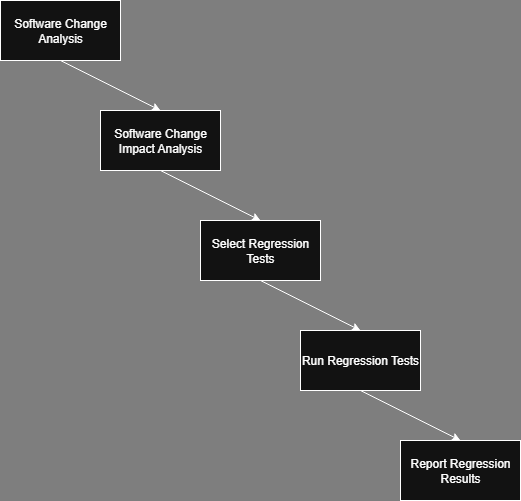

## Learning Outcomes
* Discuss different integration testing approaches.
* Discuss different system testing methods and the categories.
* Identify the use and importance of regression testing.

## Integration Testing
Integration testing focuses on verifying the interactions between modules or components after unit testing.

### Structure Chart
A Structure Chart is a hierarchical, graphical representation of a system’s modular design. It shows how modules (or components) are related and interact with each other.

* Modules are represented as boxes or rectangles.
* Lines/arrows indicate calls or control flow between modules — usually from higher-level (caller) to lower-level (callee).
* It helps visualize the system’s decomposition into smaller parts.
* The structure chart is useful for planning integration testing by showing module dependencies and guiding the order of integration.

#### Examples of Structured Design Charts
```
Main Module
  ├── Input Module
  ├── Processing Module
  │     ├── Validation Module
  │     └── Calculation Module
  └── Output Module

```



### Integration Testing Approaches
Develop the integration test plan by examining the structure chart:

#### Big Bang Approach
Integrate all modules simultaneously, then test the entire system.

_Pros_: 
*  Simple

_Cons_: 
* Difficult to isolate defects
* Error may belong to any of the modules integrated so debugging is expensive

#### Top-Down Approach
Start integrating from top-level modules downward. Requires stubs for lower modules.

_Pros_ 
* Tests high-level logic early
* Test cases reused after integrating lower level modules

_Cons_: 
* Lower modules tested late
* May not be possible to observe meaningful system function because of an absence of lower level modules which handle I/O
* Stub design becomes increasingly difficult when stubs lie far away from the level of the module

#### Bottom-Up Approach
Begin integrating from lowest-level modules upward. Requires drivers for higher modules.

_Pros_
* Tests utility modules early
   
_Cons_
* High-level logic tested late
* Drivers have to be written

#### Mixed Approach
Combine top-down and bottom-up integration strategies, integrating both top and bottom modules first, then the middle.

_Pros_ 
* Balanced coverage
* Requires less stubs and drivers

_Cons_
* More complex to manage

#### Integration Testing Phase for each approach
* In Top-Down Approach
  * Integration testing waits until all top-level modules are coded and unit tested
* In Bottom-Up Approach
  * Testing can only start after bottom level modules are ready

## System Testing
Objective: Validate a fully developed software system against its requirements

**Types of System Testing**
* Acceptance Testing
  * Alpha Testing
  * Beta Testing
  * Acceptance Testing
* Functional Testing
* Non-Functional Testing

### Acceptance Testing
##### Alpha Testing
* Alpha testing is a type of system testing performed by the test team within the development organisation before releasing the product to external users.
* The goal is to identify bugs or issues early, ensuring the system meets the specified requirements.
* Test cases for alpha testing are typically designed based on the **Software Requirements Specification (SRS)** document.

#### Beta Testing
* System testing performed by a select group of friendly customers
* Helps identify issues in real-world environments before full release
* Feedback from users is used to improve the product

#### Acceptance Testing
* System testing performed to verify the software meets business requirements
* Usually carried out by the end users or customers
* Confirms the system is ready for deployment and use in a production environment (accepted/rejected)

### Functional Testing
* Black-box test cases are designed to test the system functionality against the requirements
* Focuses on validating features, business rules, and user interactions.
* Test cases are typically derived from requirements documents, use cases, or user stories.
* Examples include smoke testing, regression testing, and sanity testing.

### Non-Functional/Performance Testing
* System testing that evaluates the software’s performance, usability, reliability, and other quality attributes.
* Focuses on how well the system performs under various conditions rather than specific behaviors.

**Test Types**
* Stress Tests
* Volume Tests
* Configuration Tests
* Compatibility Tests
* Security Tests
* Load Tests
* Recovery Tests
* Maintenance Tests
* Documentation Tests
* Usability Tests
* Environment Tests

#### Stress Testing (Endurance Eesting)
* Impose abnormal input to stress the capabilities of the software i.e. Input data volume, input data rate, processing time, utilisation of memory are tested beyond the designed capacity
* Stress testing usually involves an element of time or size
  * Such as number of records transferred per unit of time
  * The max number of users active at any time, input data size etc.
* Therefore, stress testing many not be applicable to many types of systems

**Examples**
* If an OS is supposed to support 15 multi-programmed job
  * The system is stressed by attempting to run 15+ jobs simultaneously
* A real time system might be tested to determine the impact of simultaneous arrival of several high-priority interrupts

#### Load Testing 
* Determines whether the performance of the system under different loads is acceptable
* Typically, involves gradually increasing the number of users or requests.
* Tools like **JMeter** are commonly used.

**Example**
* For a web-based application, evaluate system performance when there is a specified number of concurrent users or hits.

## Error Seeding
* A technique used to estimate the total number of defects in a system.
* Known (seeded) errors are intentionally inserted into the software.
* Based on how many of these seeded errors are found, the total number of real errors can be estimated.

### Notation:
* `N` be the total number of actual errors in the system
* `n` be the number of actual errors found during testing
* `S` be the total number of seeded (deliberate) errors
* `s` be the number of seeded errors found during testing  


### Assumption:
Seeded and real defects are equally likely to be detected.  
So, detection ratio is assumed equal:
$n / N ≈ s / S$

### Formulas:

**Estimate total real defects:**
$N ≈ (n × S) / s$

**Estimate remaining real defects:**
Remaining = N - n = n × (S - s) / s


### Example
Suppose:
- `n = 20` real defects found
- `S = 10` seeded defects
- `s = 5` seeded defects found

**Estimated total real defects:**
$N ≈ (20 × 10) / 5 = 200 / 5 = 40$

**Estimated remaining real defects:**

$N - n = 40 - 20 = 20$
or
$Remaining = 20 × (10 - 5) / 5 = 20 × 5 / 5 = 20$

**Interpretation:**  
Even though you found 20 real bugs, the system might still contain 20 more!

**Note:**  
Error seeding is only meaningful if the seeded defects are similar in complexity and visibility to actual defects.

### Quiz 1
* 100 errors were introduced deliberately
* 90 of these errors were found during testing
* 50 other errors were also found
* Find the error estimate for the code

- `n = 50` real defects found
- `S = 100` seeded defects
- `s = 90` seeded defects found

**Estimated remaining real defects:**
$n × (S - s) / s$
$50 (100-90)/90 = 5.55555555556$

### Issues with Error Seeding
* The kind of seeded errors should match closely with existing errors
  * **It is difficult to predict the types of errors that exist**
* Working solution:
  * Estimate by analysing historical data from similar projects

### Quiz 2
- `n = 150` real defects found
- `S = 100` seeded defects
- `s = 60` seeded defects found

**Estimated remaining real defects:**
$n × (S - s) / s$
$150 (100-60)/60 = 100$

## Regression Testing
Regression testing is testing done to check that a system update does not cause new errors or re-introduce errors that had been corrected earlier.

### Why Regression Testing?
* To ensure that changes such as bug fixes, enhancements, or configuration updates do not break existing functionality.
* To confirm that previously passed tests still pass after changes.
* To detect unintended side effects introduced by code modifications.
* Essential for maintaining software quality in iterative or agile development cycles.

### When to Perform Regression Testing
* After bug fixes
* After enhancements or new features are added
* After environment or configuration changes
* During continuous integration or regular development sprints

### How Regression Testing is Done
* By re-running previously executed test cases
* Often automated to save time and effort
* May use test suites focused on high-risk or frequently used features

### Tools Commonly Used
* Selenium
* JUnit/TestNG (for unit-level regression)
* Jenkins (for continuous regression integration)

### Major Regression Testing Tasks

* **RTV – Regression Test Validation**
  * Verify that the defects fixed in previous versions remain fixed.
  * Ensure the fix hasn't introduced new defects.

* **RTS – Regression Test Selection**
  * Select a relevant subset of existing test cases that are affected by recent code changes.
  * Helps reduce testing effort while still ensuring coverage.

* **RTM – Regression Test Minimization**
  * Minimize the number of regression tests to avoid redundancy.
  * Removes overlapping test cases that don’t add extra value.

* **RTP – Regression Test Prioritization**
  * Rank test cases based on risk, usage frequency, or criticality.
  * Ensures high-impact areas are tested earlier in the process.

### Software Regression Process


## Lesson Summary 
Integration testing approaches:
• Big-bang: Integrates all modules and tests them.
• Top-down: Integrates and tests the Top level modules first.
• Bottom-up: Integrates and tests the bottom level modules first.
• Mixed(sandwiched): Uses both top-down and bottom up testing approaches.

System testing is to validate a fully developed software against its requirements.
Three main types of system testing depending on who does the testing:
• Alpha testing: Is performed by developing organisation/company.
• Beta testing: is performed by select friendly customers/organisation.
• Acceptance testing: is performed by the customer.

For system testing there are two categories the tests are broken into:
• Functionality test: tests the system functionality against the requirements.
• Performance test: tests against the non-functional requirements documented in the system requirements specification document (SRS Document).

There are a variety of performance tests: Stress tests, load tests, volume tests, recovery tests, configuration tests, documentation tests, compatibility tests, usability tests, security tests, and environmental tests.

Error seeding involves introducing artificial errors into the program and checking how many of the seeded errors are detected during testing, to give an estimate of the remaining number of bugs in the program.

Regression testing is done to check that a system update does not cause new errors or reintroduce errors that had been corrected earlier.