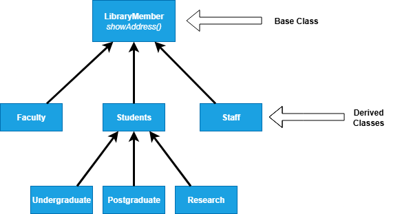
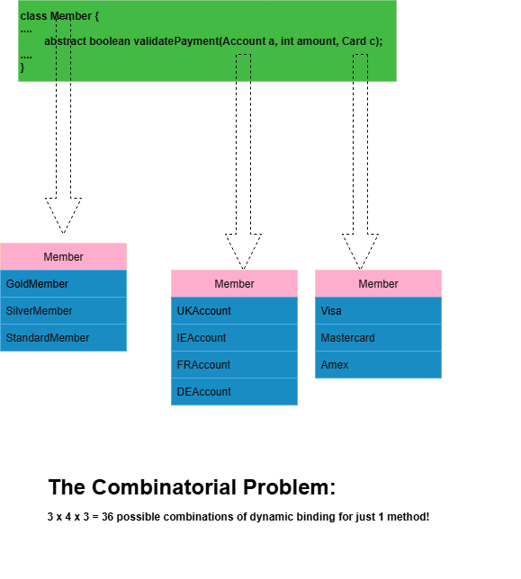
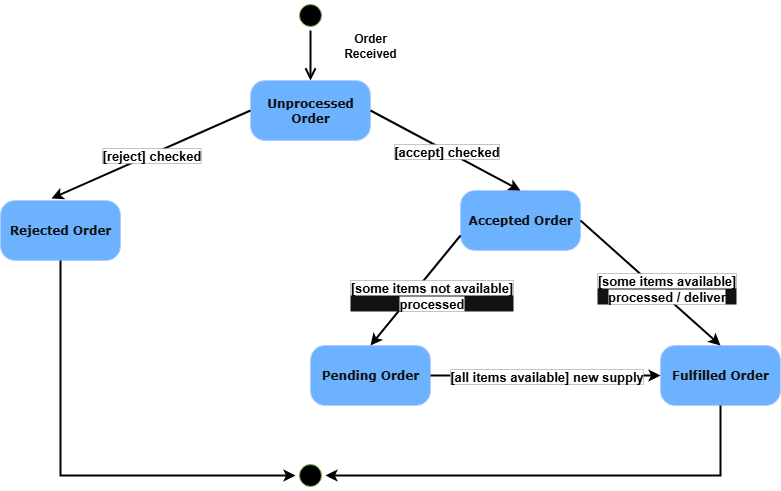

## Learning Outcomes
* Discuss why OO programming was supposed to make testing easier than procedural programming.
* Identify the differences for testing an OO program compared to a procedural program.
* Discuss the OO programming methods that can cause issues for testing.

## Introduction
* More than 50% of development effort is being spent on testing
* Quality & effective reuse of software depends to a large extent on thoroughness of testing

## Challenges in OO Testing
* **What is an appropriate unit for testing?**
    * Unlike procedural programming where functions are units, in OO testing the unit can be classes, methods, or even clusters of objects.
      * **Implications of OO features:**
          * **Encapsulation**
              * Internal state is hidden, making it harder to access and test private data directly.
              * Several solutions are possible:
                * **State reporting methods** - most feasible
                * Built-in or inherited state reporting methods.
                * Low level probes to manually inspect object attributes
                * Proof-of-correctness techniques (formal) - use mathematical logic to rigorously verify that a program meets its specifications without relying on testing.
          * **Inheritance**
              * Behavior can be inherited or overridden, complicating test coverage and requiring tests across class hierarchies.
              * Retesting of inherited methods is the rule, rather than an exception
              *  **Example:**
            ```java
            class Account {                      // Base class
                protected int balance = 100;    // 1: balance initialized to 100
    
                int getBalance() {              // 2: inherited method
                    return balance;
                }
    
                void deposit(int amount) {      // 3: inherited method
                    balance += amount;
                }
            }
    
            class SavingsAccount extends Account {   // Subclass inherits Account
                private double interestRate = 0.05;   // 4: new variable
    
                void addInterest() {                  // 5: new method
                    balance += (int)(balance * interestRate);
                }
    
                @Override
                void deposit(int amount) {            // 6: overridden method
                    // deposit with some extra logic
                    balance += amount + 10;           // bonus 10 on every deposit
                }
            }
    
            // Tests must cover:
            // - Account methods (getBalance, deposit) for base behavior
            // - Overridden deposit in SavingsAccount (line 6)
            // - New method addInterest in SavingsAccount (line 5)
            // - Ensure balance updates correctly across both classes
              ```
* **Polymorphism & Dynamic Binding**
        * Methods to be invoked are determined at runtime, making it difficult to predict and verify exact behaviors during testing.
* **State-based testing**
    * Objects maintain state, so testing must consider different object states and state transitions.
* **Test coverage analysis**
    * Coverage metrics are more complex due to dynamic dispatch and inheritance, requiring specialized strategies.
* **Integration strategies**
    * Testing object interactions and collaborations is challenging, demanding thorough integration test planning.

## What is an appropriate unit for testing in OO?

* In Object-Oriented (OO) programming, the unit of testing is less straightforward than in procedural programming.

* Possible units include:
    * **Individual Methods:** Testing behavior of single methods in isolation.
    * **Classes:** Testing the entire class as a unit, including its methods and internal state.
    * **Clusters of Objects:** Groups of collaborating objects tested together, especially when behaviors depend on interactions.

* Choosing the right unit depends on factors like:
    * Complexity of the class
    * Encapsulation level
    * Interdependencies between objects
    * The goal of the test (e.g., unit test, integration test)
* Typically, testing focuses on classes as units, but method-level testing is also common for fine-grained validation.

## Which Methods to Test Within A Class?
* **New Methods:**
  * Defined in the class under test and not inherited or overloaded by methods in a superclass
  * **Complete testing required**
* **Inherited Methods:**
    * These are methods defined in a superclass but accessible from the subclass being tested.
    * Retesting is necessary **only if**:
        * The inherited method interacts with a **new** or **redefined** method in the subclass.
        * There is a **change in the subclass’s state** that could affect the behavior of the inherited method.
* **Redefined Methods:**
  * Defined in a superclass of but redefined in the class under test
  * **Complete retesting required**

## Regression Testing Derived Class: Example
* **Principle:** inherited methods should be retested in the context of a subclass
* **Example:** if we changed a method `showAddress()` in a superclass, we need to retest `showAddress()` and other dependent methods inside all subclasses that inherit it.



## Deep Inheritance Hierarchy

* A subclass located at the bottom of a deep class hierarchy:
    * May contain only a few lines of new or overridden code.
    * But inherits a large number of features (methods, variables) from multiple ancestor classes.

    **Example:**
    ```java
    class A {
        void feature() {
            System.out.println("A's feature");
        }
    }

    class B extends A {}
    class C extends B {}
    class D extends C {}
    class E extends D {}

    class Main {
        public static void main(String[] args) {
            E obj = new E();
            obj.feature();  // Inherits behavior from A
        }
    }
    ```
    * `E` uses `feature()` defined 4 levels up in `A`. Any change in `A` can affect `E`, even if `E` itself doesn’t override anything.


* **Why is this a problem?**
    * Increases complexity and introduces **fault hazards**, as bugs may be hidden deep in the inheritance chain.
    * Makes it harder to trace behavior and interactions, especially if inherited methods are not well-documented or tested.

* **Inheritance weakens encapsulation:**
    * Subclasses become tightly coupled with the internal workings of their superclasses.
    * Changes in a superclass can have unintended effects on many subclasses, making maintenance and testing more difficult.

* A deep and wide inheritance hierarchy can defy comprehension:
    * Leads to increased bugs and reduces testability.
    * Incorrect initialization and forgotten methods may result.
    * **Class flattening**:
      * Involves combining all inherited members (fields, methods) into the subclass to create a “flattened” view.
      * Helps developers and testers understand the full behavior of a subclass without tracing through multiple ancestor classes.
      * Improves maintainability and can simplify testing by clarifying what the subclass actually contains.

  **Example:**
    ```java
    class A {
        int x = 10;
        void display() { System.out.println("A: " + x); }
    }

    class B extends A {
        int y = 20;
        void display() { System.out.println("B: " + y); }
    }

    // Flattened view of B includes x, y, and overridden display()
    ```

* A class inherits features from more than one superclass.
    * Increases the number of contexts and interactions to test, due to combined behavior.
    * Can introduce ambiguity, such as the **Diamond Problem**, where a method or field is inherited from multiple paths.

      **Example (in languages that support multiple inheritance like C++):**
      ```cpp
      class A {
      public:
          void greet() { std::cout << "Hello from A\n"; }
      };
  
      class B : public A {
      public:
          void greet() { std::cout << "Hello from B\n"; }
      };
  
      class C : public A {
      public:
          void greet() { std::cout << "Hello from C\n"; }
      };
  
      class D : public B, public C {
          // Which greet() is called? Ambiguity arises.
      };
      ```

    * Testing multiple inheritance requires carefully verifying which superclass methods are called and ensuring consistent behavior.


## Abstract and Generic Classes
* Unique to object-oriented programming
    * Provide important support for reuse and extensibility.
* Cannot be instantiated directly — must be **extended** (for abstract classes) or **parameterized** (for generic classes) to be used and tested.
* **May never be considered fully tested**
    * Every new subclass or instantiation can introduce new behaviors or interactions.
    * Requires **retesting** in the new context to ensure correctness.

### Example (Abstract Class)
* The Shape class can’t be tested on its own.
* To test area(), a subclass like Circle must be created and tested.
```java
abstract class Shape {
    abstract double area();
}

class Circle extends Shape {
    double radius;
    Circle(double r) { radius = r; }

    @Override
    double area() {
        return Math.PI * radius * radius;
    }
}
```

### Example (Generic Class)
* The Box class must be instantiated with a specific type (Box<Integer>, Box<String>, etc.) for meaningful testing.
* Different type parameters can lead to different runtime behavior and edge cases.
```java
class Box<T> {
    private T value;
    void set(T val) { value = val; }
    T get() { return value; }
}
```

### Testing an Abstract Class
* Not possible to test it directly
* Can only be indirectly testing through classes derived from it
* _So, Can never be considered as fully tested_


## Polymorphism
* **Polymorphism** allows a variable, function, or object to take on multiple forms.
* In object-oriented testing, this increases complexity because:
    * Each **possible binding** of a polymorphic component (e.g., method call) must be tested separately.
        * For example, if a superclass reference can point to 3 different subclasses, each subclass implementation must be verified.
    * It is often **difficult to identify all bindings** that can occur at runtime due to **dynamic dispatch**.
    * **Increases the chances of undetected bugs**, especially when subclass behavior diverges subtly from expectations.
    * Becomes **an obstacle to achieving full code coverage**, since not all runtime paths are obvious from static analysis.

### Example
* To fully test `speak()`, both bindings (`Dog` and `Cat`) need to be exercised.
```java
class Animal {
    void speak() {
        System.out.println("Animal speaks");
    }
}

class Dog extends Animal {
    void speak() {
        System.out.println("Dog barks");
    }
}

class Cat extends Animal {
    void speak() {
        System.out.println("Cat meows");
    }
}

public class Test {
    public static void main(String[] args) {
        Animal a;

        a = new Dog(); // One binding
        a.speak();     // Dog barks

        a = new Cat(); // Another binding
        a.speak();     // Cat meows
    }
}
```

## Dynamic Binding
* Dynamic binding implies:
  * The code that implements a given function is unknown until run time
  * Static analysis cannot be used to identify the precise dependencies in a program
* It becomes difficult to identify all possible bindings and test them




## State-Based Testing
* The concept of control flow in conventional programs:
    * Does not map readily to object-oriented (OO) programs
    * Instead, a **state model** needs to be considered
* In a state model:
    * We specify how an object's state changes in response to method calls
    * The model defines the **allowable transitions** from one state to another
* States can be constructed:
    * Using **equivalence classes** derived from instance variable values
* **Jacobson’s OOSE** (Object-Oriented Software Engineering) approach advocates:
    * Designing **test cases to cover all state transitions**
  


### State-Based Integration Testing
* Test cases can be derived from the state machine model of the class
  * Methods result in state transitions
  * Test cases are designed to exercise each transition at a state
* However, the transitions are tied to user selectable activation sequences: **Use Cases**

#### Difficulty State-Based Integration Testing
* The responsibility for managing state is spread out across many objects, not centralized in one place.
  * Cooperative control makes it difficult to achieve system state and transition coverage
* A global state model becomes too complex for practical systems
  * Rarely constructed by developers
  * A global state model is needed to show how classes interact

## Test Process Strategy
Object-Oriented development tends towards:
* Shorter methods
* Complexity shifts from testing methods to class relations
* **In this context model-based testing (grey box testing) of object-oriented programs assumes importance**


## Integrations Testing
* In object-oriented (OO) programs, there is no clear hierarchical control structure, so conventional top-down and bottom-up integration testing approaches are not directly applicable. 
* Instead, integration is typically performed using incremental strategies suited to OO design:

### Incremental Integration Strategies
1. Thread-Based Integration Testing
   * Integrates the classes needed to realize one system function or thread of control at a time.
   * Helps verify the interaction of objects that collaborate to complete specific tasks.

2. Use-Based Integration Testing
   * Begins by testing classes that do not depend on others, then progressively integrates classes that use them.
   * Useful when class dependencies form a directed acyclic graph.

3. Cluster Testing
   * Groups a set of classes that collaborate or work together (a cluster) and tests them as a unit.
   * Based on the idea that meaningful subsystems emerge from design, such as a group of related objects (e.g., a controller, model, and helper classes).

## Lesson Summary
The key points from this module are:
OO programing uses different techniques for testing compared to procedural programming. In procedural programming testing, a function is a unit for testing in OO programing a method is not the basic unit for testing, in OO programing a class is the unit of testing.

Encapsulation is not a source of errors but it prevents accessing attribute values by a debugger.  Retesting inherited methods in a derived class is mandatory, because of the new context of usage in the derived class. Overridden methods must be retested whenever a syntactic change has been made.

Integration testing works somewhat differently in OO programming it has three different strategies for testing:
1) Thread-based testing: integrates classes required to respond to one input or event.
2) Use-based testing: integrates classes required by one use case.
3) Cluster testing: integrates classes required to demonstrate one collaboration.