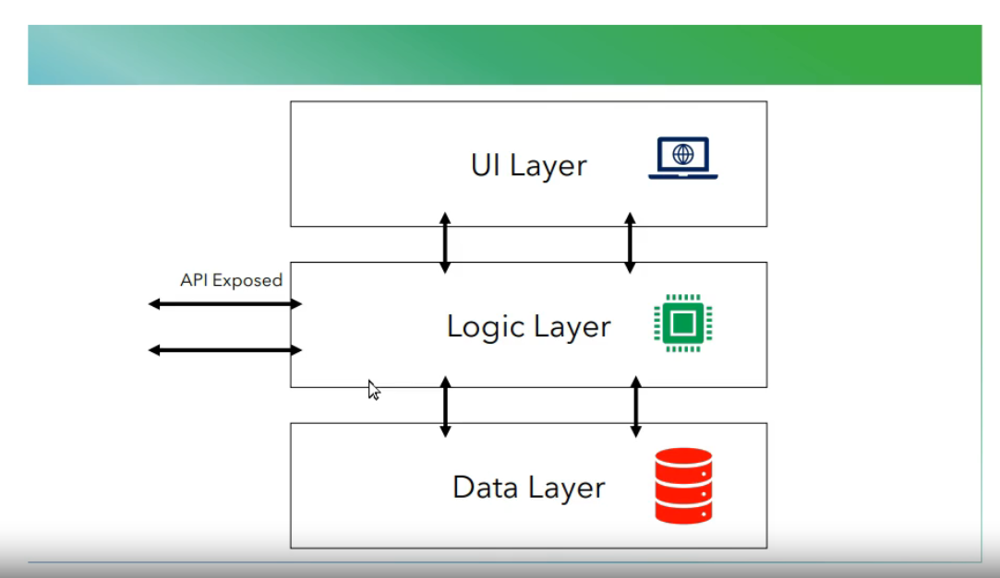
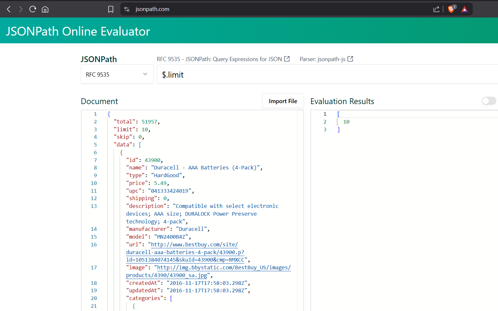
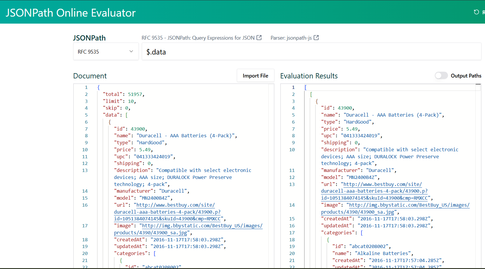
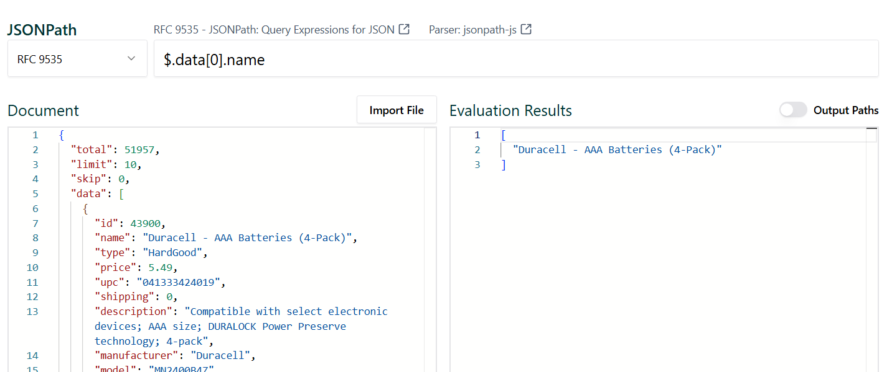
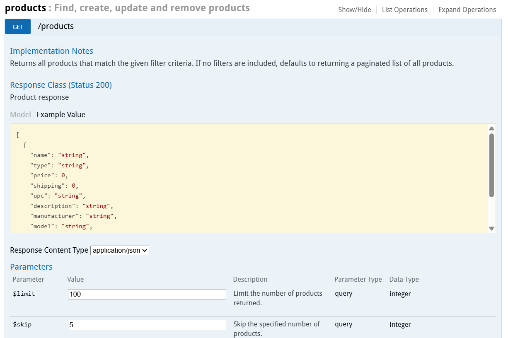

# API Testing with Karate Framework

## What is an API?

* API stands for **A**pplication **P**rogramming **I**nterface.
* In Software Development, API is the middle layer, aka the logic layer or backend layer, and lies between the front-end (UI) and database layer.
* APIs enable communication and data exchange from one software system to another.

**Example**


## What is API Testing?

* API testing is a software testing practice that focuses on verifying an API's functionality, performance, and security.

## Why API Testing is important?

* When an app is built, the functionalities are built or developed fist as APIs then integrated to the frontend layer.
* If you wait until the integration stage to find bugs in the app then you will start adding cost to the bugs.
* The later bugs are found in your system the more cost it adds to the application.
* **Example** If a bug is found after integration is complete it can be concluded it's in the UI layer if the API is already tested



## Rest APIs

* Rest stands for **REpresentational State Transfer**
* It is an architecture style that defines a set of constraints to be used for creating web services or APIs.
* In REST "REpresentational" means a resource can be represented in different formats such as plain text, JSON & XML.
* Web Services which are built using REST are called REST APIs, RESTFul APIs or web services.
* These web services provide communication between computer systems on the internet.
* REST-compliant web services allow the requesting systems to access & manipulate textual representation of web resources by using a uniform and predefined set of stateless operations.

## Client-Server Architecture of REST APIs


### 5 Common Request Types

* POST (Create)
* GET (Retrieve)
* PUT (Replace)
* PATCH (Update)
* DELETE (Delete)

With these 5 we can perform CRUD operations

### Example


**URI - Uniform Resource Identifier**
String that identifies a resource — either by location, name, or both.
_Example_

````
mailto:someone@example.com
urn:isbn:0451450523
https://example.com/resource
````

**URL - Uniform Resource Locator**
Type of **URI** that tells you how to locate a resource on the internet.
Includes: Protocol (e.g., ``https``), Hostname (e.g., ``example.com``), Path, and optionally query strings or fragments.
_Example_

````
https://example.com/resource?id=5
ftp://ftp.example.com/file.txt
````

Every **URL** is a **URI**, but not every **URI** is a **URL**.

## Karate Framework

* Karate is an open-source framework for API Test automation that uses BDD style syntax, has a rich assertion library & built-in HTML reports
* Karate framework follows the Cucumber style of writing thr program which follows the BDD approach
* It provides the users with the ability to execute the test cases in parallel & perform JSON & XML checks

_Example_


## api-playground

Sample website for testing
Can be run with ``npm start``
Available at [http://localhost:3030](http://localhost:3030)

## Swagger Documentation

Available at [http://localhost:3030/docs](http://localhost:3030/docs)

## Writing a test scenario to send a GET request via Karate framework

Updated project to the following

* Java 21
* <maven.compiler.version>3.14.0</maven.compiler.version>
* <maven.surefire.version>3.5.3</maven.surefire.version>
* <karate.version>1.4.1</karate.version>

`TestRunner.java`

```java
package bestBuy.product;

import com.intuit.karate.junit5.Karate;
import com.intuit.karate.junit5.Karate.Test;

public class TestRunner {

	@Test()
	public Karate runTest() {
		return Karate.run("productApiTest").relativeTo(getClass());
	}

}
```

`productApiTest.feature`

```java
Feature: Verify the CRUD operations for Product APIs
  From Best Buy Application

  Scenario: Verify Get all products API from Best Buy
    Given url 'http://localhost:3030'
    And path 'products'
    When method get
    Then status 200
```

Also installed Karate Plugin for IntelliJ, code successfully running after these steps

## Adding assertions to test scenarions

Copy response from Swagger documentation
Format using [jsonpath.com](https://jsonpath.com/)





Adding an assertion to the test

```java
Feature: Verify the CRUD operations for Product APIs
  From Best Buy Application

  Scenario: Verify Get all products API from Best Buy
    Given url 'http://localhost:3030'
    And path 'products'
    When method get
    Then status 200
    And match response.limit == 10
    And match response.skip != 5
```




```java
Feature: Verify the CRUD operations for Product APIs
  From Best Buy Application

  Scenario: Verify Get all products API from Best Buy
    Given url 'http://localhost:3030'
    And path 'products'
    When method get
    Then status 200
    And match response.limit == 10
    And match response.skip != 5
    And match response.data[0].name == "Duracell - AAA Batteries (4-Pack)"
```

Using contains deep searches within the object & the nested objects - seems to only go to one level though?

Sample object 
```json
[
  {
    "id": 43900,
    "name": "Duracell - AAA Batteries (4-Pack)",
    "type": "HardGood",
    "price": 5.49,
    "upc": "041333424019",
    "shipping": 0,
    "description": "Compatible with select electronic devices; AAA size; DURALOCK Power Preserve technology; 4-pack",
    "manufacturer": "Duracell",
    "model": "MN2400B4Z",
    "url": "http://www.bestbuy.com/site/duracell-aaa-batteries-4-pack/43900.p?id=1051384074145&skuId=43900&cmp=RMXCC",
    "image": "http://img.bbystatic.com/BestBuy_US/images/products/4390/43900_sa.jpg",
    "createdAt": "2016-11-17T17:58:03.298Z",
    "updatedAt": "2016-11-17T17:58:03.298Z",
    "categories": [
      {
        "id": "abcat0208002",
        "name": "Alkaline Batteries",
        "createdAt": "2016-11-17T17:57:04.285Z",
        "updatedAt": "2016-11-17T17:57:04.285Z"
      },
      {
        "id": "pcmcat248700050021",
        "name": "Housewares",
        "createdAt": "2016-11-17T17:57:05.399Z",
        "updatedAt": "2016-11-17T17:57:05.399Z"
      },
      {
        "id": "pcmcat303600050001",
        "name": "Household Batteries",
        "createdAt": "2016-11-17T17:57:04.285Z",
        "updatedAt": "2016-11-17T17:57:04.285Z"
      },
      {
        "id": "pcmcat312300050015",
        "name": "Connected Home & Housewares",
        "createdAt": "2016-11-17T17:57:04.285Z",
        "updatedAt": "2016-11-17T17:57:04.285Z"
      }
    ]
  }
]
```


```java
Feature: Verify the CRUD operations for Product APIs
  From Best Buy Application

  Scenario: Verify Get all products API from Best Buy
    Given url 'http://localhost:3030'
    And path 'products'
    When method get
    Then status 200
    And match response.limit == 10
    And match response.skip != 5
    And match response.data[0].name == "Duracell - AAA Batteries (4-Pack)"
    And match response.data[0] contains deep {"model": "MN2400B4Z"}
    And match response.data[0].categories contains deep {"name": "Alkaline Batteries"}
```

## Adding Fuzzy Assertions
```java
...
    # attribute 'total' is present
    And match response.total == '#present'
    # attribute 'total' is a number
    And match response.total == '#number'
    # attribute 'id' is NOT present
    And match response.id == '#notpresent'
    # attribute 'data' is an Array
    And match response.data == '#array'
    # size of the response is 10
    And match response.data == '#[10]'
...
```

## Write a test scenario to send GET request with query parameters


```java
  Scenario: Verify get all products with query parameters
    * def limit = 20
    Given url 'http://localhost:3030'
    And path 'products'
    And param $limit = limit
    When method get
    Then status 200
    And match response.limit == limit
    And match response.data == '#[' + limit + ']'
```

Added `Background: ` step to reduce duplication
```java
Feature: Verify the CRUD operations for Product APIs
  From Best Buy Application

  Background:
    Given url 'http://localhost:3030'
    And path 'products'

  Scenario: Verify Get all products API from Best Buy
    When method get
    Then status 200
    And match response.limit == 10
    And match response.skip != 5
    And match response.data[0].name == "Duracell - AAA Batteries (4-Pack)"
    And match response.data[0] contains deep {"model": "MN2400B4Z"}
    And match response.data[0].categories contains deep {"name": "Alkaline Batteries"}
    # attribute 'total' is present
    And match response.total == '#present'
    # attribute 'total' is a number
    And match response.total == '#number'
    # attribute 'id' is NOT present
    And match response.id == '#notpresent'
    # attribute 'data' is an Array
    And match response.data == '#array'
    # size of the response data Array is 10
    And match response.data == '#[10]'
    # query parameters

  Scenario: Verify get all products with query parameters
    * def limit = 20
    And param $limit = limit
    When method get
    Then status 200
    And match response.limit == limit
    And match response.data == '#[' + limit + ']'
```


## Write a test scenario to send POST request
Request payload is always sent as part of a POST request (JSON/XML/text)

Content type application header also needed

Sample: 
```json
{
  "name": "string",
  "type": "string",
  "price": 0,
  "shipping": 0,
  "upc": "string",
  "description": "string",
  "manufacturer": "string",
  "model": "string",
  "url": "string",
  "image": "string"
}
```

Karate Test report is location at `target/karate-reports/karate-summary.html`

```java
  Scenario: Verify add product API
    * def productName = "Apple iPhone 15"
    Given request
    """
    {
      "name": "#(productName)",
      "type": "Mobile",
      "price": 0,
      "shipping": 739,
      "upc": "string",
      "description": "#(productName)",
      "manufacturer": "Apple",
      "model": "iPhone 15",
      "url": "/apple-iphone-15",
      "image": "iphone-15.png"
    }
    """
    When method post
    # status created is 201
    Then status 201
    And match response.name == productName
```