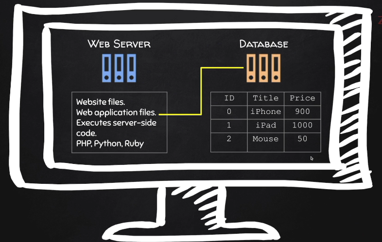

## What is Bug Hunting?

**Goal:** Discover Bugs in a target application or website
**Examples:**
* Information disclosure (show you information that you're not supposed to be able to see e.g. source code)
* Broken access control (see information belonging to other users)
* Injection vulnerabilities (very dangerous, can allow full control)
* OWASP top 10
* etc. ...

### Bug Bounty Programs
* Lots of websites have bug bounty programs that pay for valid reports of vulnerabilities
* You choose the target
* You choose the hours
* You choose the bugs (vulnerabilities you want to test for)

### Pentests
* Only 1 target
* **Goal:** Hack the target and exploit the bug(s)

## What is a Website?
* A web application installed on a server
* A server is basically just a computer with certain applications installed that allow it to act as a server
* Servers are hosted on the cloud and any computer on the internet can communicate with them (has a real IP)

### Webservers & Databases
Just an application that you can install on any computer so the computer doesn't even have to be exposed to the internet.
You can install it on your own local computer, even if it's not connected to the internet.

It specifies a certain location within your file systems and in that location you can host files.

Anybody on the same network as you, or if this computer is exposed to the internet, will be able to access the files stored within the web root.

Usually contain web application files (Website files (images, html), Web app files (code), Executes server side code e.g. PHP, Python, Ruby).

Information accessed and served by the web application is stored in a database.

