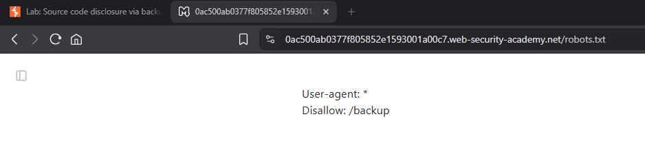
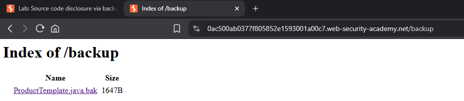
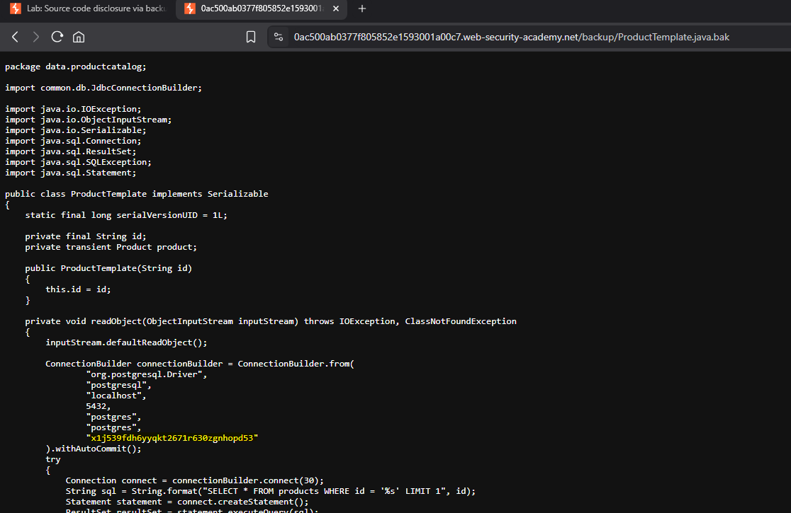
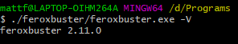

## Introduction to Information Disclosure Vulnerabilities

* **Main idea:** Allow you to access information that shouldn't be attainable or visible to you
* Information Disclosure Vulnerabilities fall under the _Cryptographic Failures_ category in the Open Worldwide Application Security Project (OWASP) top 10
* Cryptographic Failures are 2nd most common security threat
* They can help you discover hidden parts of the target application which will increase the attack surface and there increase your chances of discovering other bugs

## Discovering Database Login Credentials
[PortSwigger Website](https://portswigger.net/)


### Lab: Discovering Database Login Credentials
[PortSwigger Lab: Discovering Database Login Credentials](https://portswigger.net/web-security/information-disclosure/exploiting/lab-infoleak-via-backup-files)

This lab leaks its source code via backup files in a hidden directory. To solve the lab, identify and submit the database password, which is hard-coded in the leaked source code.

### Lab Solution
**1. robots.txt** 

A `robots.txt` file is a text file that tells search engine crawlers which URLs on a website they can or cannot access. It's essentially a set of instructions for bots, specifying which parts of a site should be excluded from indexing.

Browse to `https://0ac500ab0377f805852e1593001a00c7.web-security-academy.net/robots.txt` and notice that it reveals the existence of a `/backup` directory. 
   

**2. "backup" directory** 
Browse to `https://0ac500ab0377f805852e1593001a00c7.web-security-academy.net/backup` to find the file `ProductTemplate.java.bak`. 
   
   
    
**3. Source Code File** 
Browse to `https://0ac500ab0377f805852e1593001a00c7.web-security-academy.net/backup/ProductTemplate.java.bak` to access the source code.

**4. Database Connection String** 
In the source code, notice that the connection builder contains the hard-coded password for a Postgres database.
   


## Discovering Endpoints & Sensitive Data
[SecLists GitHub](https://github.com/danielmiessler/SecLists)

[Ferox Buster GitHub](https://github.com/epi052/feroxbuster)#
**1. Install Ferox Buster via PowerShell**

```shell
Invoke-WebRequest https://github.com/epi052/feroxbuster/releases/latest/download/x86_64-windows-feroxbuster.exe.zip -OutFile feroxbuster.zip
Expand-Archive .\feroxbuster.zip
```
**2. Check the version**
```shell
.\feroxbuster\feroxbuster.exe -V
```
Can be run from Git Bash with
```bash
./feroxbuster/feroxbuster.exe -V
```


### Lab: Information disclosure on debug page
[PortSwigger Lab: Information disclosure on debug page](https://portswigger.net/web-security/information-disclosure/exploiting/lab-infoleak-on-debug-page)

This lab contains a debug page that discloses sensitive information about the application. To solve the lab, obtain and submit the SECRET_KEY environment variable.

### Lab Solution


## Introduction to HTTP Status Codes

## Employing the Hacker/Bug Hunter Mentality to Discover Admin Login Information

## Manipulating Application Behaviour Through the HTTP POST Method

## Manipulating Application Behaviour Through the HTTP GET Method

## Intercepting Requests with Burp Proxy