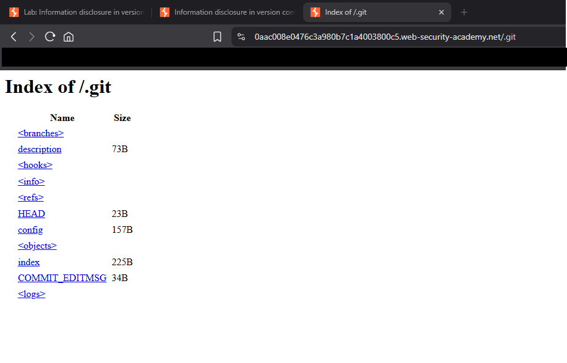

## Introduction to Information Disclosure Vulnerabilities

* **Main idea:** Allow you to access information that shouldn't be attainable or visible to you
* Information Disclosure Vulnerabilities fall under the _Cryptographic Failures_ category in the Open Worldwide Application Security Project (OWASP) top 10
* Cryptographic Failures are 2nd most common security threat
* They can help you discover hidden parts of the target application which will increase the attack surface and there increase your chances of discovering other bugs

## Discovering Database Login Credentials
[PortSwigger Website](https://portswigger.net/)


### Lab: Discovering Database Login Credentials
[PortSwigger Lab: Discovering Database Login Credentials](https://portswigger.net/web-security/information-disclosure/exploiting/lab-infoleak-via-backup-files)

This lab leaks its source code via backup files in a hidden directory. To solve the lab, identify and submit the database password, which is hard-coded in the leaked source code.

### Lab Solution
**1. robots.txt** 

A `robots.txt` file is a text file that tells search engine crawlers which URLs on a website they can or cannot access. It's essentially a set of instructions for bots, specifying which parts of a site should be excluded from indexing.

Browse to `https://0ac500ab0377f805852e1593001a00c7.web-security-academy.net/robots.txt` and notice that it reveals the existence of a `/backup` directory. 
   

**2. "backup" directory** 
Browse to `https://0ac500ab0377f805852e1593001a00c7.web-security-academy.net/backup` to find the file `ProductTemplate.java.bak`. 
   
   
    
**3. Source Code File** 
Browse to `https://0ac500ab0377f805852e1593001a00c7.web-security-academy.net/backup/ProductTemplate.java.bak` to access the source code.

**4. Database Connection String** 
In the source code, notice that the connection builder contains the hard-coded password for a Postgres database.
   


## Discovering Endpoints & Sensitive Data
[SecLists GitHub](https://github.com/danielmiessler/SecLists)

[Ferox Buster GitHub](https://github.com/epi052/feroxbuster)

### Ferox Buster
**Install Ferox Buster via PowerShell**

```shell
Invoke-WebRequest https://github.com/epi052/feroxbuster/releases/latest/download/x86_64-windows-feroxbuster.exe.zip -OutFile feroxbuster.zip
Expand-Archive .\feroxbuster.zip
```
**Check the version**
```shell
.\feroxbuster\feroxbuster.exe -V
```
Can be run from Git Bash with
```bash
./feroxbuster/feroxbuster.exe -V
```


**Run it with a word list**
[common.txt from SecLists GitHub](https://github.com/danielmiessler/SecLists/blob/master/Discovery/Web-Content/common.txt)

```shell
./feroxbuster.exe --url https://bitdiscovery.com --depth 2 --wordlist common.txt
```


**Help**
```shell
feroxbuster.exe --help
```

### Lab: Information disclosure on debug page
[PortSwigger Lab: Information disclosure on debug page](https://portswigger.net/web-security/information-disclosure/exploiting/lab-infoleak-on-debug-page)

This lab contains a debug page that discloses sensitive information about the application. To solve the lab, obtain and submit the SECRET_KEY environment variable.

### Lab Solution with Burp
1. With Burp running, browse to the home page.
2. Go to the "Target" > "Site Map" tab. Right-click on the top-level entry for the lab and select "Engagement tools" > "Find comments". Notice that the home page contains an HTML comment that contains a link called "Debug". This points to /cgi-bin/phpinfo.php.
3. In the site map, right-click on the entry for /cgi-bin/phpinfo.php and select "Send to Repeater".
4. In Burp Repeater, send the request to retrieve the file. Notice that it reveals various debugging information, including the SECRET_KEY environment variable.
5. Go back to the lab, click "Submit solution", and enter the SECRET_KEY to solve the lab.

### Lab Solution with Ferox Buster
**1. Run ferox buster against target URL**
```shell
feroxbuster.exe -u https://0a8700ac03e9a9f8807efda800610011.web-security-academy.net/ -w common.txt
```
**2. Analyse the returned URLs**


**3. Go to `/cgi-bin` directory in browser and click on file**


**4. Search for secret key**


## Introduction to HTTP Status Codes
### 1xx Informational
- **100 Continue** – The server has received the request headers; the client should proceed to send the request body.
- **101 Switching Protocols** – The requester has asked the server to switch protocols.
- **102 Processing** – The server has received and is processing the request, but no response is available yet.

### 2xx Success
- **200 OK** – The request has succeeded.
- **201 Created** – The request has succeeded, and a new resource has been created.
- **202 Accepted** – The request has been received but not yet acted upon.
- **203 Non-Authoritative Information** – The request was successful but the information may be from another source.
- **204 No Content** – The server successfully processed the request, and is not returning any content.
- **205 Reset Content** – Tells the client to reset the document view.
- **206 Partial Content** – The server is delivering only part of the resource due to a range header sent by the client.

### 3xx Redirection
- **300 Multiple Choices** – Multiple options for the resource that the client may follow.
- **301 Moved Permanently** – The resource has been moved permanently to a new URL.
- **302 Found** – The resource is temporarily located at a different URL.
- **303 See Other** – The response can be found under another URI using a GET method.
- **304 Not Modified** – The resource has not been modified since the last request.
- **307 Temporary Redirect** – The request should be repeated with another URI, but future requests should still use the original URI.
- **308 Permanent Redirect** – The resource is now permanently located at another URI.

### 4xx Client Errors
- **400 Bad Request** – The server could not understand the request due to invalid syntax.
- **401 Unauthorized** – Authentication is required and has failed or has not yet been provided.
- **402 Payment Required** – Reserved for future use.
- **403 Forbidden** – The server understood the request but refuses to authorize it.
- **404 Not Found** – The requested resource could not be found.
- **405 Method Not Allowed** – The request method is not supported for the requested resource.
- **406 Not Acceptable** – The server cannot produce a response matching the list of acceptable values.
- **407 Proxy Authentication Required** – Authentication with a proxy is required.
- **408 Request Timeout** – The server timed out waiting for the request.
- **409 Conflict** – The request could not be completed due to a conflict.
- **410 Gone** – The resource requested is no longer available and will not be available again.
- **411 Length Required** – The request did not specify the length of its content, which is required.
- **412 Precondition Failed** – One or more conditions in the request headers were not met.
- **413 Payload Too Large** – The request is larger than the server is willing or able to process.
- **414 URI Too Long** – The URI provided was too long for the server to process.
- **415 Unsupported Media Type** – The media type is not supported.
- **416 Range Not Satisfiable** – The range specified cannot be fulfilled.
- **417 Expectation Failed** – The server cannot meet the requirements of the Expect request-header field.
- **418 I'm a teapot** – A joke response code from an April Fools' joke (RFC 2324).
- **422 Unprocessable Entity** – The request was well-formed but could not be followed due to semantic errors.
- **429 Too Many Requests** – The user has sent too many requests in a given amount of time ("rate limiting").

### 5xx Server Errors
- **500 Internal Server Error** – A generic error message, given when no more specific message is suitable.
- **501 Not Implemented** – The server does not recognize the request method.
- **502 Bad Gateway** – The server received an invalid response from the upstream server.
- **503 Service Unavailable** – The server is currently unavailable (overloaded or down for maintenance).
- **504 Gateway Timeout** – The server did not receive a timely response from the upstream server.
- **505 HTTP Version Not Supported** – The HTTP version used in the request is not supported by the server.
- **507 Insufficient Storage** – The server is unable to store the representation needed to complete the request.

## Employing the Hacker/Bug Hunter Mentality to Discover Admin Login Information

### Lab: Information disclosure in version control history
[PortSwigger Lab: Information disclosure in version control history](https://portswigger.net/web-security/information-disclosure/exploiting/lab-infoleak-in-version-control-history)

This lab discloses sensitive information via its version control history. To solve the lab, obtain the password for the administrator user then log in and delete the user carlos.

### Lab Solution
LAB URL - https://0aac008e0476c3a980b7c1a4003800c5.web-security-academy.net/

**1. Run ferox buster against target URL**
```shell
feroxbuster.exe -u https://0aac008e0476c3a980b7c1a4003800c5.web-security-academy.net/ -w common.txt
```
**2. Analyse the returned URLs**


**3. Go to `.git` directory in browser**
`https://0aac008e0476c3a980b7c1a4003800c5.web-security-academy.net/.git`


**4. Download contents**
`wget -r https://0aac008e0476c3a980b7c1a4003800c5.web-security-academy.net/.git/`
* `-r`: Recursive download


**5. Explore Git history**
Explore the downloaded directory using your local Git installation. Notice that there is a commit with the message "Remove admin password from config".
Look closer at the diff for the changed admin.conf file. Notice that the commit replaced the hard-coded admin password with an environment variable ADMIN_PASSWORD instead. However, the hard-coded password is still clearly visible in the diff.


**6. Delete user account**
Go back to the lab and log in to the administrator account using the leaked password.
To solve the lab, open the admin interface and delete carlos.

## Manipulating Application Behaviour Through the HTTP POST Method
URL path parameters are processed used in the execution before returning it's response to the client.

We can manipulate this value to display useful information to us or to potentially exploit vulnerabilities.


### Examples of sending data via HTTP GET Method
- `https://target.com/index.php?from=value`
- `https://target.com/index.jsp?from=value`
- `https://target.com/index?from=value`
- `https://target.com/?from=value`

### HTTP Post
Typically used to send data from input fields of a website e.g. A login form, search etc.
These values are sent as part of the request body.


A way to intercept this data is by running a proxy i.e. Burp Suite


## Manipulating Application Behaviour Through the HTTP GET Method


### Lab: Information disclosure in error messages
[PortSwigger Lab: Information disclosure in error messages](https://portswigger.net/web-security/information-disclosure/exploiting/lab-infoleak-in-error-messages)

### Lab Solution
1. Open website
2. Select a product
3. Change the `productID` path parameter to something invalid i.e. `https://0adc00ce04e7f2c980203fcf00ab001c.web-security-academy.net/product?productId=bla` OR `https://0adc00ce04e7f2c980203fcf00ab001c.web-security-academy.net/product?productId=10000000`
4. Observe the exception thrown - The unexpected data type causes an exception, and a full stack trace is displayed in the response. This reveals that the lab is using Apache Struts 2 2.3.31.
   ```java
   Internal Server Error: java.lang.NumberFormatException: For input string: "bla"
       at java.base/java.lang.NumberFormatException.forInputString(NumberFormatException.java:67)
       at java.base/java.lang.Integer.parseInt(Integer.java:661)
       at java.base/java.lang.Integer.parseInt(Integer.java:777)
       at lab.c.w.x.y.Z(Unknown Source)
       at lab.o.go.g.z.h(Unknown Source)
       at lab.o.go.i.z.p.E(Unknown Source)
       at lab.o.go.i.e.lambda$handleSubRequest$0(Unknown Source)
       at s.x.s.t.lambda$null$3(Unknown Source)
       at s.x.s.t.N(Unknown Source)
       at s.x.s.t.lambda$uncheckedFunction$4(Unknown Source)
       at java.base/java.util.Optional.map(Optional.java:260)
       at lab.o.go.i.e.y(Unknown Source)
       at lab.server.k.a.n.l(Unknown Source)
       at lab.o.go.v.B(Unknown Source)
       at lab.o.go.v.l(Unknown Source)
       at lab.server.k.a.k.p.B(Unknown Source)
       at lab.server.k.a.k.b.lambda$handle$0(Unknown Source)
       at lab.c.t.z.p.Q(Unknown Source)
       at lab.server.k.a.k.b.Q(Unknown Source)
       at lab.server.k.a.r.V(Unknown Source)
       at s.x.s.t.lambda$null$3(Unknown Source)
       at s.x.s.t.N(Unknown Source)
       at s.x.s.t.lambda$uncheckedFunction$4(Unknown Source)
       at lab.server.gv.B(Unknown Source)
       at lab.server.k.a.r.G(Unknown Source)
       at lab.server.k.w.c.q(Unknown Source)
       at lab.server.k.q.m(Unknown Source)
       at lab.server.k.c.m(Unknown Source)
       at lab.server.gd.F(Unknown Source)
       at lab.server.gd.r(Unknown Source)
       at lab.x.e.lambda$consume$0(Unknown Source)
       at java.base/java.util.concurrent.ThreadPoolExecutor.runWorker(ThreadPoolExecutor.java:1144)
       at java.base/java.util.concurrent.ThreadPoolExecutor$Worker.run(ThreadPoolExecutor.java:642)
       at java.base/java.lang.Thread.run(Thread.java:1583)
   
   Apache Struts 2 2.3.31
   ```
5. Enter _2 2.3.31_ to solve the lab. 

This is an **Information Disclosure** bug and if there's vulnerabilities present in that version of _Apache Struts_ they could be used to exploit the application.

## Intercepting Requests with Burp Proxy


**Forward** - Lets it reach the target server
**Drop** - Stops it reaching target server


1. Select Proxy Tab & Open _zsecurity.org_
2. Make sure Intercept is ON
3. You can see the request details such as cookies etc.

Below we can see 8 request body attributes/values that can be tested for vulnerabilities.
This expands your attack surface by a great deal!!

```log
action=pagination_request&sid=5f10a8b5u7&unid=&page=3&lang=&ajax_nonce=896ddb4309&custom_data%5Bsf_taxo%5D=%7B%7D&custom_data%5Bsf_opera%5D=%7B%7D
```

The values here can be modified and the new values will be sent

They can also be modified in the _Inspector_ tab
