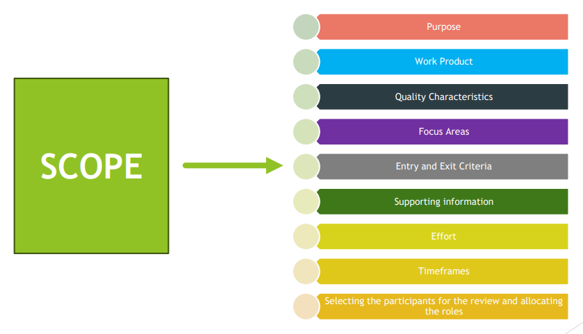
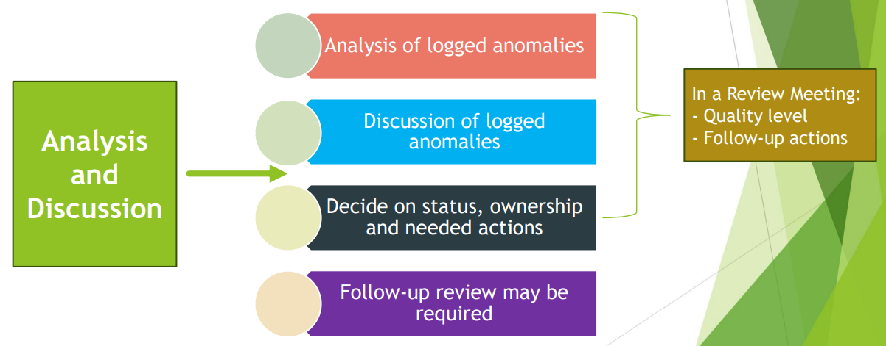
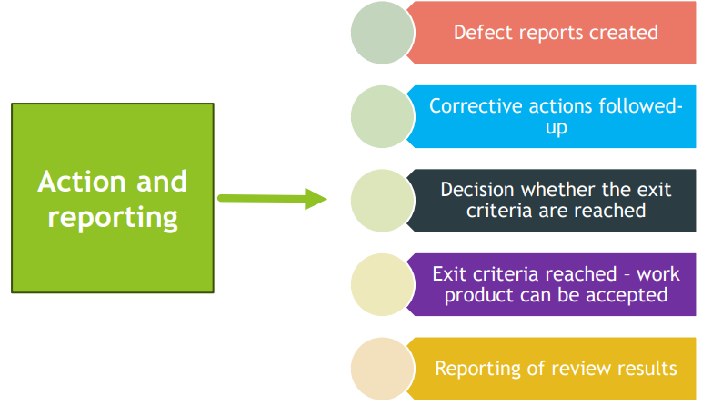
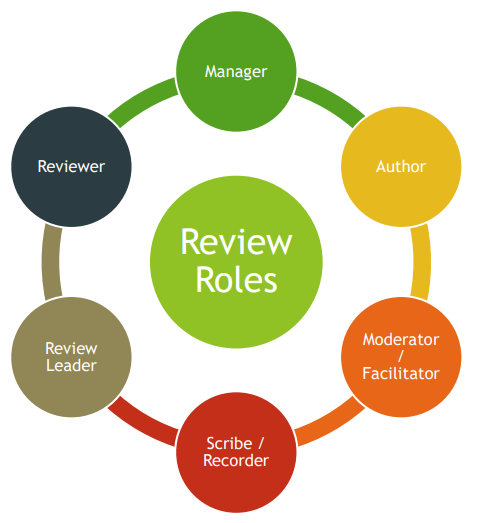

[🔙 Home](../home.md)

[🔙 Back to Index](../index.md)

# Feedback & Review Process

## Early & Frequent Feedback

* One of the cornerstones of Agile software development
* ‘Early Testing saves Time & Money’
* The Shift-Left Approach
* Test First approaches
* Continuous Integration
* Continuous Deployment

If you have to fail, **fail fast!**

### Benefits of Early & Frequent Stakeholder Feedback

* Build the right product through early communication of quality issues
  * Stakeholders have expectations on what will be delivered
  * Expectations based on stakeholder vision **will** change during the project
  * Early & Continuous feedback will identify whether the product meets these expectations
  * If the expectations are not met, this can result in:
    * Expensive reworks
    * Missed deadlines
    * Blame games
    * Project failure
* Focus on the right items by preventing misunderstandings in requirements & priorities
  * Requirements & changes to requirements are often misunderstood
  * The earlier feedback is received on requirements will prevent misunderstandings
  * The team can improve their understanding
  * Focus on the right features
    * Deliver most value to the stakeholders
    * Have the most positive impact on identified risks

## Review Process

* Generic process is structured & flexible
* Any specific review process should be tailored to that specific situation
* More formality results in more tasks per activity
* Not all work products can be covered in one review. Depends on:
  * Size
  * Complexity

### Review Process - Activities

#### Review Process - Planning

#### Review Process – Review initiation

#### Review Process – Individual review

#### Review Process - Communication & analysis

#### Review Process – Fixing & reporting

## Applying Review Techniques

### Types of Review Technique

* Review techniques can be applied in the individual review activity
* Can be used across all the review types
* Effectiveness of any technique depends on the type of review used
* Review techniques can be:
  * Ad hoc
  * Checklist-based
  * Scenarios & dry runs
  * Role-based
  * Perspective-based

#### Review Techniques – Ad hoc

* Little or no guidance on how the task should be performed
* Review of the work product is done sequentially – identifying & documenting issues as they are encountered
* Needs little preparation
* Highly dependent on skills of the reviewer
* May lead to duplicate issues reported by different reviewers

#### Review Techniques – Checklist-based

* Systematic technique – detect issues based on checklists provided by the initiator
* Consists of a set of questions based on potential defects (derived from experience)
* Checklists should be specific to the type of work product being reviewed
* Checklists should be maintained regularly (learning from the past)
* Main advantage – systematic coverage of typical defect types

#### Review Techniques – Scenarios & dry runs

* Structured guidelines on how to read through the work product
* Supports reviewers to perform ‘dry runs’ based on the expected usage of the work product
* Above is only possible if the work product is documented appropriately (i.e. use cases)
* Scenarios provide better guidelines to the reviewers than checklists

#### Review Techniques – Role-based

* Reviewers evaluate the work product from the perspective of individual stakeholder roles
* Typical roles are specific end user types & roles in the organisation such as:
  * Experienced, inexperienced
  * User administrator
  * System administrator
  * Performance tester

#### Review Techniques – Perspective-based

* Similar to the role-based technique – reviewers take on different stakeholder viewpoints
* Typical stakeholder viewpoints include end user, marketing, designer, tester, operations
* Leads to more depth in reviewing with less duplication
* Checklists are expected to be used
* Most effective technique for reviewing requirements & technical work products

## Reviews – Roles & Responsibilities

| Role                  | Responsibility                                                                                                                                                                                                                           |
| --------------------- |------------------------------------------------------------------------------------------------------------------------------------------------------------------------------------------------------------------------------------------|
| Manager               | Decides what is to be reviews Decides on planning of the review Allocates staff, budget & time Monitors ongoing cost-effectiveness Executes control decisions in the event of inadequate outcomes                        |
| Author                | Creates the work product under review Fixes defects in the work product under review                                                                                                                                                 |
| Moderator/Facilitator | Ensure effective running of meetings Mediates between various points of view Plans the review wrt time & time management Ensures a safe review environment Often the person upon which the success of the review depends |
| Scribe/Recorder       | Collects & documents all anomalies found during the individual review activity by the reviewers Records new anomalies, open points & decisions from the review                                                                   |
| Reviewer              | Reviewing of the work products Can be a project participant, SME, any other stakeholder Identify & log anomalies in work product under review May represent different perspectives                                           |
| Review Leader         | Takes overall responsibility for the review  Decides who will be involved & organises when & where it will happen                                                                                                                |

## Review Types

### Review Process - General

* Range from informal to formal
* Informal reviews are not documented & don’t follow a defined process
* Formal reviews follow a formal process including documentation & are characterised by:
  * Team participation
  * Documented results
  * Documented review procedures

### Review Process – Formal or Informal?

* Formality depends on:
  * SDLC
  * Maturity of the development process
  * Complexity of the work product to be reviewed
  * Legal or regulatory requirements
  * Need for an audit trail
* Focus depends on the agreed objectives of the review

#### Informal Review
###### AKA
Buddy check, pairing, pair review, peer review
###### Main purpose
Detecting anomalies
###### Possible Additional Purposes
Generating new ideas of solutions, quickly solving minor problems
###### Characteristics
* Not based on a formal documented process
* May not involve a review meeting
* May be performed by a colleague of the author or by more people
* Results may be documented
* Varies in usefulness depending on the reviewers
* Use of checklists is optional
* Very common in Agile development

#### Walkthrough
###### Main purpose
Find anomalies, evaluate quality, building confidence in the work product, improve the software product, consider alternative implementations, evaluate conformance to standards & specifications
###### Possible Additional Purposes
Exchanging new ideas about techniques or style variations, educating reviewers, gaining consensus, motivate authors to improve & detect anomalies
###### Characteristics
- Individual preparation before the review meeting is optional
- Review meeting is typically led by the author of the work product
- Use of checklists is optional
- May take the form of scenarios, dry runs or simulations
- Potential defect logs & review reports may be produced
- May vary from quite informal to very formal

#### Technical Review
###### Main purpose
Detecting potential defects, gaining consensus, make decisions on technical problems
###### Possible Additional Purposes
Evaluating quality & building confidence in the work product, generating new ideas, motivating & enabling authors to improve future work products, considering alternative implementations
###### Characteristics
- Reviewers should be technical peers of the author & technical experts
- Individual preparation before the review meeting is required - Led by a trained moderator (not the author)
- Use of checklists is optional
- Potential defect logs & review reports are typically produced

#### Inspection
###### Main purpose
Detecting the maximum nr of anomalies, evaluating quality & building confidence in the work product, preventing future similar defects through author learning & root cause analysis
###### Possible Additional Purposes
Motivating & enabling authors to improve future work products & the software development process, achieving consensus
###### Characteristics
- Follows a defined process with formal documented outputs, based on rules & checklists
- Uses clearly defined roles (mandatory) & may include a dedicated reader - Individual preparation before the review meeting is required
- Reviewers are peers of the author or experts in other relevant disciplines- Specified entry & exit criteria are used
- Scribe is mandatory
- Review meeting is led by a trained facilitator (not the author)
- Author cannot act as review leader, reader or scribe
- Potential defect logs & review reports are produced
- Metrics are collected & used to improve the entire software development process

## Success Factors for Reviews
* Clear, predefined objectives
* Measurable exit criteria
* The review is conducted in an atmosphere of trust; the outcome will not be used for the evaluation of the participants
* Review types are applied that are suitable to achieve the objectives
* Large work products are written & reviewed in small chunks
* Feedback is given to the participants so the process & their activities can be improved
* Participants have adequate time to prepare for the review
* Reviews are made part of the organisational culture to promote learning & improvement
* Management supports the review process
* Adequate training is give; especially for the more formal review types
* Facilitate meetings