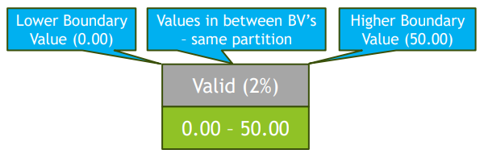

[🔙 Home](../home.md)

# Black-Box Test Techniques

## Equivalence Partitioning
* Can be applied on all testing levels
* Idea is to divide (partition) data into groups or sets for which the behaviour is assumed to be the same (test object should handle each value in a partition **equivalently**)
* Equivalent partitions are also known as equivalence classes
* Test cases designed to execute representatives from **ALL** equivalence partitions
  * Valid values are values that should be accepted by the component or system & are in a **valid equivalence partition**
  * Invalid values are values that should **NOT** be accepted by the component or system & are in an **invalid equivalence partition**
* **Test cases are designed to cover each partition once & ONLY once (valid & invalid)**
* If one condition in a partition works (or does not work) we assume they all work (or do not work) 
* Invalid equivalence partitions should be tested individually
* Each partition can be divided into sub partitions if needed
* Partitions can be identified for any data element related to the test object
* Coverage is calculated as :
  $$
  \frac{\textbf{No. of equivalence partitions tested by at least one value}}{\textbf{Total no. of identified equivalence partitions}} \times 100\%
  $$

### Points of Attention in Equivalence Partitioning
* Partitions must **NOT** overlap & must **NOT** be empty
* Partitions do **NOT** have to be ordered or bordered

### Equivalence Partitioning – Example
* Savings Account in a bank – earns different interest percentages – depending on balance
  * Balance between 0 & 50 – 2 % interest
  * Balance more than 50 but less than 1000 – 3 % interest
  * Balance of 1000 & more – 5 % interest
* Result is 3 valid partitions & 1 invalid one – invalid one was not in the spec, but needs to be tested, so we have 4 tests

| Invalid | Valid (2%)    | Valid (3%)      | Valid (5%) |
|---------|---------------|-----------------|------------|
| < 0.00  | 0.00 -> 50.00 | 50.01 -> 999.99 | > 999.99   |
* Equivalence partitioning can also be applied to the output values (%)
* Example of proper input values are -10.00, 25.00, 999.98 & 1456.55
* ‘Invalid’ partition – not one of the expected inputs for that field
* Don’t only do what is specified, but also think about things that haven’t been specified

## Boundary Value Analysis
* Can be applied at all test levels
* Extension of **EP**, generally used to test requirements that call for a range of numbers
* Can ONLY be used when the partitions are ordered
* Exercising the boundaries of equivalence partitions – min & max values of a partition
* behaviour at the boundaries of equivalence partitions are **more likely** to be incorrect than within the partitions
* 2 elements (values) belonging to the same partition – all values in between must also belong to that partition
* Boundary values are the MIN & MAX values of Equivalence Partitions
* Typically, locations of defects found by BVA at misplaced boundaries
* Coverage calculation:
  $$
  \frac{\textbf{No. of coverage items tested}}{\textbf{Total no. of identified coverage items}} \times 100\%
  $$

### Identifying Boundary Values
* Divide a set of test conditions into groups or sets for which the behaviour is assumed to be the same
* Draw up your Equivalence Partition table
* Identify the minimum & maximum values of each partition - These are your Boundary Values

### Boundary Value Analysis – Example
* Savings Account in a bank – earns different interest percentages – depending on balance
  * Balance between 0 & 50 – 2 % interest
  * Balance more than 50 but less than 1000 – 3 % interest
  * Balance of 1000 & more – 5 % interest
* Result is 3 valid partitions & 1 invalid one

| Invalid | Valid (2%)    | Valid (3%)      | Valid (5%) |
|---------|---------------|-----------------|------------|
| < 0.00  | 0.00 -> 50.00 | 50.01 -> 999.99 | > 999.99   |

| Partition                  | Low       | High       | 
|----------------------------|-----------|------------|
| Invalid < 0.00             | No low BV | -0.01      |
| Valid (2%) 0.00 -> 50.00   | 0.00      | 50.00      |
| Valid (3%) 50.01 -> 999.99 | 50.01     | 999.99     |
| Valid (5%)                 | 1000.0    | No high BV |

**Total test cases = 6** (-0.01, 0.00, 50.00, 50.01, 999.99, 1000.00)

## 2-Value Boundary Value Analysis
* Each Boundary Value has 2 coverage items
  * Boundary Value **AND** value of the closest neighbor belonging to the adjacent partition
* 100% 2-value BVA coverage – cover ALL coverage items (Boundary Values)
* Coverage calculation:

  $$
  \frac{\textbf{No. of boundary values tested}}{\textbf{Total no. of identified boundary values}} \times 100\%
  $$

### Boundary Value Analysis (2-value) applied
* Focused on testing at the **minimum** & **maximum** values of each partition
  * The min & max (boundary) values of each partition, and
  * The value of the closest neighbor belonging to the adjacent partition

| Invalid | Valid (2%)    | Valid (3%)      | Valid (5%) |
|---------|---------------|-----------------|------------|
| < 0.00  | 0.00 -> 50.00 | 50.01 -> 999.99 | > 999.99   |

| Partition                  | Low       | High       | 
|----------------------------|-----------|------------|
| Invalid < 0.00             | No low BV | -0.01      |
| Valid (2%) 0.00 -> 50.00   | 0.00      | 50.00      |
| Valid (3%) 50.01 -> 999.99 | 50.01     | 999.99     |
| Valid (5%)                 | 1000.0    | No high BV |

**Total test cases = 6** (-0.01, 0.00, 50.00, 50.01, 999.99, 1000.00)

## 3-Value Boundary Value Analysis
* Also called ‘Full Boundary Value Analysis’
* Each Boundary Value has 3 coverage items 
  * Boundary Value & the values of **BOTH** its’ Neighbours
* Part of the coverage items are NOT Boundary Values
* 100 % 3-value BVA coverage – cover ALL coverage items (Boundary Values & their neighbors)
* Coverage calculation:

  $$
  \frac{\textbf{No. of boundary values and their Neighbours exercised}}{\textbf{Total no. of identified boundary values and their Neighbours}} \times 100\%
  $$

### Boundary Value Analysis (3-value) applied
* Focused on testing at the boundaries using the Boundary Values PLUS both one value on either side of each boundary (as close as you can get) 
* Idea is to take:
  * The min & max (boundary) values of each partition, and
  * One value on each side of the boundary value as close to the boundary value as possible

| Invalid | Valid (2%)    | Valid (3%)      | Valid (5%) |
|---------|---------------|-----------------|------------|
| < 0.00  | 0.00 -> 50.00 | 50.01 -> 999.99 | > 999.99   |

| Partition                  | Low       | High       | Neighbours                    |
|----------------------------|-----------|------------|-------------------------------|
| Invalid < 0.00             | No low BV | -0.01      | -0.02, 0.00                   |
| Valid (2%) 0.00 -> 50.00   | 0.00      | 50.00      | -0.01, 0.01, 49.99, 50.01     |
| Valid (3%) 50.01 -> 999.99 | 50.01     | 999.99     | 50.00, 50.02, 999.98, 1000.00 |
| Valid (5%)                 | 1000.0    | No high BV | 999.99, 1000.01               |

**Total test cases (number of unique values) = 12** (-0.02, -0.01, 0.00, 0.01, 49.99, 50.00, 50.01, 50.02, 999.98, 999.99, 1000.00, 1000.01)

## Equivalence Partitioning & Boundary Value Analysis combined
* Try to cover more test conditions with a single test case
* A balance should be found between having too many & too few test cases
* Test partitions & boundaries separately
* Which partitions & boundaries to exercise – depends on the goal & the time pressure

## Decision Table Testing
* Can be applied at all test levels
* Useful to test implementation of system requirements that specify how different combinations of conditions resulting in different outcomes
* Effective way to record complex logic such as business rules
* Helps identify all the important combinations of conditions
* Systematic way to identify all combinations of conditions
* If a lot of combinations, or having multiple types of input that are not binary, use risk assessment or a minimised decision table to decide which rules to execute
* Decision tables can be simplified & made smaller by:
  * Deleting columns with infeasible combinations of conditions
  * Merging columns to minimise the table (ONLY if some conditions do not affect the outcome)

* Technique is to:
  1. Identify all inputs (conditions) & outputs (actions) & put them in a table as rows
  2. List all True-False combinations for each of the conditions (mostly Boolean)
  3. Identify the correct outcome for each combination – each column is a decision rule
  4. Write tests to exercise each of the rules (columns) in the decision table at least once

* Coverage items are feasible combinations of conditions (columns)
* Each column should be exercised to get 100% Decision Table coverage
* Coverage is calculated as

  $$
  \frac{\textbf{No. of exercised columns}}{\textbf{Total no. of feasible columns}} \times 100\%
  $$

### Decision table testing - Example
* Opening a credit card account
* New customer, 15% discount on purchases today
* Existing customer & loyalty card, 10% discount on purchases today
* If you have a coupon, 20% discount on purchases today (not in combination with the new customer discount)
* Discounts are added if applicable or if combination is invalid the highest discount is given

| Conditions   | Rule 1   | Rule 2   | Rule 3   | Rule 4   | Rule 5   | Rule 6   | Rule 7   | Rule 8   |
|--------------|----------|----------|----------|----------|----------|----------|----------|----------|
| New customer | T        | T        | T        | T        | F        | F        | F        | F        |
| Loyalty Card | T        | T        | F        | F        | T        | T        | F        | F        |
| Coupon       | T        | F        | T        | F        | T        | F        | T        | F        |
| **Actions**  | -------- | -------- | -------- | -------- | -------- | -------- | -------- | -------- |
| Discount %   | N/A      | N/A      | 20       | 15       | 30       | 10       | 20       | 0        |