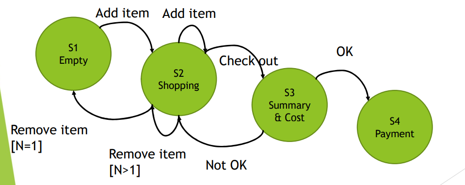

[🔙 Home](../home.md)

# State Transition Testing

* Used when an aspect of the system is in a ‘finite state machine’
  * Limited number of states
  * State is determined by rules of the machine
  * Different response on an event depending on the current conditions & previous history
* Test cases can be designed to execute valid & invalid state transitions
* Behaviour in a system is shown in a **state transition diagram model**, which shows:
  * Possible states & valid transitions
  * Events that cause or result in a transition from one state to another
  * Actions that result from a transition
* If one event from the same state can result in 2 or more different transitions, the event may be qualified by a **guard condition** (precondition for an event), standard syntax is **‘event [guard condition] / action’**
* Transitions are assumed to be instantaneous
* Transitions may result in the software taking action
* An event can cause a different action from a different state

### State Transition Tables

State transition tables are often used to identify valid & invalid transitions

* Tests can be designed to:
  * Cover a typical sequence of states
  * Exercise specific sequences of transitions
  * Exercise all states
  * Exercise all valid transitions
  * Exercise all transitions
  * Test invalid transitions
* Rows represent states, columns represent events (with or without guard conditions)
* Cell entries represent transitions & contain the target state & possible actions
* IF a cell is empty, that is an invalid transition
* Example:

    <table>
      <tr>
        <th style="background-colour: #787676;"></th>
        <th style="background-colour: #787676;">Event</th>
      </tr>
      <tr>
        <th style="background-colour: #787676;">State</th>
        <th style="background-colour: #787676;">Press OK</th>
      </tr>
      <tr>
        <td>Open</td>
        <td>Closed</td>
      </tr>
      <tr>
        <td>Closed</td>
        <td>-</td>
      </tr>
    </table>

* Test cases are usually represented as a sequence of events that:
  * Results in a sequence of state changes (and actions if needed)
  * Usually cover several transitions between states
  * Example TCL: Open, Press OK, Closed

### State Transition Testing - Coverage

There are 3 versions of coverage criteria:
1. **All states coverage**
   * Coverage items are the states
   * 100% all states coverage – all states should be visited

$$
  \frac{\textbf{No. of states visited}}{\textbf{Total no. of states}} \times 100\%
$$

2. **Valid Transitions Coverage (aka 0-switch coverage)**
   * Coverage items are single valid transitions
   * 100% valid transition coverage – exercise all valid transitions
$$
 \frac{\textbf{No. of exercised valid transitions}}{\textbf{Total no. of valid transitions}} \times 100\%
$$

3. **All Transitions Coverage**
   * Coverage items are ALL transitions (valid & invalid)
   * 100% all transition coverage:
     * Exercise all valid transitions
     * Try to exercise all invalid transitions
   * Test only one invalid transition per test case to avoid **fault masking**
   * Often a minimum requirement for mission & safety-critical software
$$
 \frac{\textbf{No. of exercised valid & invalid transitions}}{\textbf{Total no. of valid & invalid transitions}} \times 100\%
$$

#### State Transition Testing - Summary
* 100% All Transitions Coverage guarantees 100% Valid Transitions coverage & 100% All States Coverage
* 100% Valid Transitions coverage guarantees 100% All States Coverage
* Full Valid Transitions Coverage is most widely used
* All states coverage is weakest as typically it does not cover all transitions

#### State Transition Testing - Example
* Website shopping cart starts empty – purchases are selected & added to the cart. 
* Items can also be removed from the cart. 
* On checkout, a summary of basket & cost is shown & customer indicates whether this is OK or not. 
* If all is ok, then leave the summary display & go to the payment system. 
* Otherwise go back to shopping.

<table>
      <tr>
        <th style="background-colour: #787676;"></th>
        <th colspan="6" style="background-colour: #787676;">Event</th>
      </tr>
      <tr>
        <th style="background-colour: #787676;">State</th>
        <th style="background-colour: #787676;">Add item</th>
        <th style="background-colour: #787676;">Remove Item (N > 1)</th>
        <th style="background-colour: #787676;">Remove Item (N = 1)</th>
        <th style="background-colour: #787676;">Check out</th>
        <th style="background-colour: #787676;">Not OK</th>
        <th style="background-colour: #787676;">OK</th>
      </tr>
      <tr>
        <td style="background-colour: #787676;">S1 Empty</td>
        <td style="background-colour: #438007;">S2</td>
        <td style="background-colour: #bd0606;">-</td>
        <td style="background-colour: #bd0606;">-</td>
        <td style="background-colour: #bd0606;">-</td>
        <td style="background-colour: #bd0606;">-</td>
        <td style="background-colour: #bd0606;">-</td>
      </tr>
      <tr>
        <td style="background-colour: #787676;">S2 Shopping</td>
        <td style="background-colour: #438007;">S2</td>
        <td style="background-colour: #438007;">S2</td>
        <td style="background-colour: #438007;">S1</td>
        <td style="background-colour: #438007;">S3</td>
        <td style="background-colour: #bd0606;">-</td>
        <td style="background-colour: #bd0606;">-</td>
      </tr>
      <tr>
        <td style="background-colour: #787676;">S3 Summary</td>
        <td style="background-colour: #bd0606;">-</td>
        <td style="background-colour: #bd0606;">-</td>
        <td style="background-colour: #bd0606;">-</td>
        <td style="background-colour: #bd0606;">-</td>
        <td style="background-colour: #438007;">S2</td>
        <td style="background-colour: #438007;">S4</td>
      </tr>
      <tr>
        <td style="background-colour: #787676;">S4 Payment</td>
        <td style="background-colour: #bd0606;">-</td>
        <td style="background-colour: #bd0606;">-</td>
        <td style="background-colour: #bd0606;">-</td>
        <td style="background-colour: #bd0606;">-</td>
        <td style="background-colour: #bd0606;">-</td>
        <td style="background-colour: #bd0606;">-</td>
      </tr>
</table>

All the boxed that contain "-" are **invalid**
So examples of invalid transitions are:
* Try to add an item from the summary & cost state
* Try to remove an item from an empty shopping cart
* Try to enter OK while in the shopping state or when having an empty basket

A test to cover all valid transitions would be:

<table>
    <tr>
        <th style="background-colour: #787676;">State</th>
        <th style="background-colour: #787676;">Event</th>
    </tr>
    <tr>
        <td style="background-colour: #066506;">S1</td>
        <td style="background-colour: #066506;">Add Item</td>
    </tr>
    <tr>
        <td style="background-colour: #066506;">S2</td>
        <td style="background-colour: #066506;">Remove Item</td>
    </tr>
    <tr>
        <td style="background-colour: #066506;">S1</td>
        <td style="background-colour: #066506;">Add Item</td>
    </tr>
    <tr>
        <td style="background-colour: #066506;">S2</td>
        <td style="background-colour: #066506;">Add Item</td>
    </tr>
    <tr>
        <td style="background-colour: #066506;">S2</td>
        <td style="background-colour: #066506;">Remove Item</td>
    </tr>
    <tr>
        <td style="background-colour: #066506;">S2</td>
        <td style="background-colour: #066506;">Checkout</td>
    </tr>
    <tr>
        <td style="background-colour: #066506;">S3</td>
        <td style="background-colour: #066506;">Not OK</td>
    </tr>
    <tr>
        <td style="background-colour: #066506;">S2</td>
        <td style="background-colour: #066506;">Checkout</td>
    </tr>
    <tr>
        <td style="background-colour: #066506;">S3</td>
        <td style="background-colour: #066506;">Ok</td>
    </tr>
    <tr>
        <td style="background-colour: #066506;">S4</td>
        <td style="background-colour: #066506;"></td>
    </tr>
</table>

**All states coverage** = 4 / 4 * 100 = **100 %**
**Valid transitions coverage** = 7 / 7 * 100 = **100 %**
**All transitions coverage** = 7 / 24 * 100 = **29.17 %**