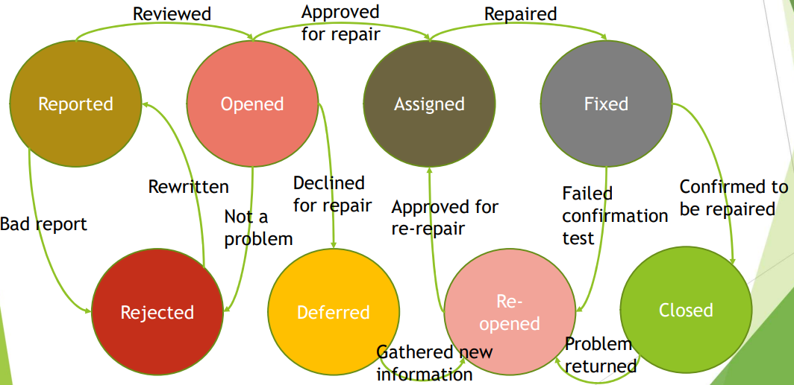

[🔙 Home](../home.md)

# Defect Management
* Any defect or anomaly should be identified & tracked from discovery to resolution
* To manage all defects to resolution, a defect management process should be in place, including workflow & rules for classification
* Workflow typically includes activities for logging, analyzing & classifying them* The way in which defects are logged depends on:
  * Context of the component or system
  * Test level
  * Software Development Lifecycle model
* Process must be agreed upon with all stakeholders involved in defect management
* ‘Defects’ are not always issues in the item under test (change request, false positive, etc)
* Defect reports have the following objectives:
  * Provide those responsible for handling & resolving reported defects with enough information to resolve the issue
  * Provide a means of tracking the quality of the work product
  * Provide ideas for development & test process improvements
* Defects can be reported in all stages of the development lifecycle
* Defects may be reported on all work products
* Defect Detection Percentage (DDP) compares field defects (found in production) with test defects (found before production) to measure the test process effectiveness
  $$
  \frac{\textbf{Defects (testers) }}{\textbf{Defects (testers) + Defects (field)}} \times 100\%
  $$
* In the defect reports, some data may automatically be included or managed
* Defects found in static testing will normally be documented differently (review meeting notes) but handled in a similar way
* Standards can be found in ISO/IEC/IEEE 29119-3) ‘Incident Reports’

## Defect Report – Typical Contents
* Unique Identifier
* Title & short summary of the anomaly
* Date when the anomaly was observed, issuing
organisation, author, author role
* Identification of the test object and test environment
* Context of the defect:
  * Development lifecycle phase
  * Test case being run
  * Test activity being performed
  * Any other relevant information
* Description of the failure incl logs, db dumps, screenshots (reproducible steps)
  * Expected and actual results
  * Severity of the defect on the stakeholder’s interests or requirements
  * Priority to fix
  * Status of the defect (open, deferred, duplicated, fixed, etc)
  * References

## Incident Report – ISO/IEC/IEEE 29119 Standard
* Overview
* Timing information
* Originator
* Context
* Description of the incident
* Originator’s assessment of the severity
* Originator’s assessment of the impact
* Risk
* Status of the incident

## Defect Report Life Cycle
