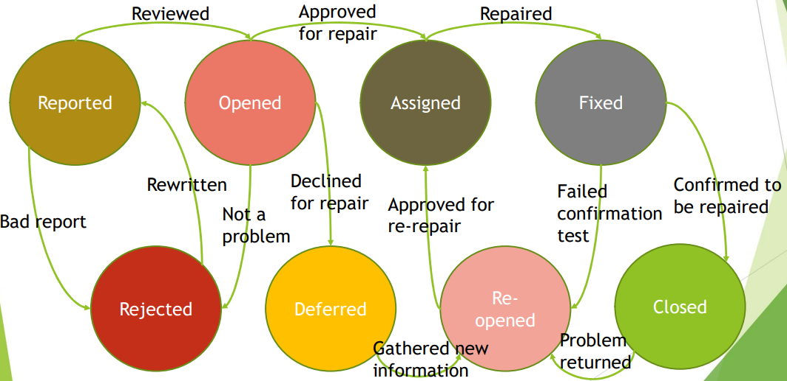

[🔙 Home](../home.md)

# Summary
## The Purpose of a Test Plan
* Documents the means and the schedule for achieving the test objectives (how and when)
* Helps to ensure that the performed test activities will meet the established criteria
* Serves as a means of communication with team members and other stakeholders
* Demonstrates that testing will be in line with the test policy and test strategy (or explains where it will not be in line)

## Typical Contents of a Test Plan
* Context of testing:
    * Scope
    * Test objectives
    * Constraints
    * Test basis
* Assumptions & constraints
* Stakeholders
    * Roles
    * Responsibilities
    * Relevance to testing
    * Hiring & training needs
* Communication
    * Forms & frequency
    * Documentation templates
* Risk register
    * Project risks
    * Product risks
* Test approach
    * Test levels & test types
    * Test techniques
    * Test deliverables
    * Entry & Exit criteria
    * Independence of testing
    * Metrics to be collected
    * Test data requirements
    * Test environment requirements
    * Deviations from strategy or policy
* Budget & Schedule

## Entry vs Exit Criteria
**Entry Criteria: ‘define the preconditions for starting a certain activity.’
Aka ‘Definition of Ready’**
* Entry Criteria not being defined or not met will make the activity:
    * More difficult
    * Time consuming
    * Most costly
    * Riskier

**Exit Criteria: ‘define what must be achieved to declare an activity completed’
Aka ‘Definition of Done’**

Both Entry & Exit criteria should be defined for:
* Each test level
* Each test type
* Differ based on the test objectives

## The Test Pyramid

## Testing Quadrants

## What is Risk?

**‘A potential event, hazard, threat or situation whose occurrence causes an adverse effect’**

Risk is characterised by two factors:

* Risk **likelihood**
    * ‘The probability of the risk occurrence’ (greater than zero & less than 1)
* Risk **impact**
    * ‘The consequences of this occurrence’ – the harm

## Risk Level

* A measure for the risk
    * The higher the risk level, the more important the treatment
* A calculated result from the combination of:
    * Risk Likelihood (greater than zero & smaller than one)
    * Risk Impact

## Project Risk
* Are related to the Management & Control of the project
* If project risks occur, this may have a negative effect on:
    * Project Schedule
    * Budget
    * Scope

**Impacts the project’s ability to achieve its objectives**

## Product Risk
* The possibility that the system or software might fail to satisfy the legitimate needs of the users and/or stakeholders
* Related to the product quality characteristics - A risk to the quality of the product

## Risk-Based Testing
* Test approach
* Risk Analysis & Risk Control are used to:
    * Select test activities
    * Prioritise test activities
    * Manage test activities

## Product Risk Analysis

* Goal – Provide awareness of product risks
    * Focus testing efforts to minimise the residual level of product risk.
* Should start early in the SDLC
* Consists of two main activities

### Risk Identification

* Generate a comprehensive list of risk
* Stakeholders use techniques to identify risks

## Product Risk Analysis= - Risk Assessment

**Risk Assessment** involves:

* Categorizing identified risks (can help in assigning mitigation actions)
* Determining the risk likelihood
* Determining the risk impact
* Prioritizing the risks
* Proposing ways to handle the risks

Two approaches (or both mixed) can be used in **Risk Assessment:**

* **Quantitative approach** – Risk level is calculated by multiplying the risk likelihood & risk impact
* **Qualitative approach** – Risk level can be determined using a risk matrix

## Product Risk Control
* Includes all measures taken as response to the Product Risk Analysis
* Consists of:
    * Risk mitigation:
        * Implement the actions proposed in risk assessment to reduce the risk level
    * Risk monitoring aims to:
        * Ensure that the mitigation actions are effective
        * Obtain further information to improve risk assessment
        * Identify emerging risks

## Test Monitoring
* **ONGOING activity comparing progress with the test plan using metrics**
* **Concerned with gathering information** about testing, which is then used to:
    * Provide feedback & visibility about test activities
    * Assess Test Progress
    * Measure whether the test exit criteria or associated tasks are satisfied
        * Targets for:
            * Coverage of product risks
            * Requirements
            * Acceptance criteria

## Test Control
* Takes & uses the information from Test Monitoring to make testing more effective & efficient (using control directives)
    * Give guidance
    * Implement corrective actions

* Control directives can include
    * Reprioritising tests when an identified risk becomes an issue
    * Re-evaluating whether a test item meets entry or exit criteria due to rework
    * Adjusting the test schedule to address a delay in the delivery of the test
      environment
    * Adding more resources when & where needed

## Test Monitoring & Control
* Supported by the evaluation of exit criteria (the definition of done for testing), which may include:
    * Checking of test results & logs against coverage criteria (requirement coverage for example)
    * Assessing component or system quality based on the test results & logs
    * Determining if more tests are needed
* Progress, deviations & information needed to determine to stop testing is reported in **Test Progress Reports**
    * Test Progress Reports
    * Test Summary Reports

## Test Completion

* Collect data from completed test activities to consolidate experience, testware & other relevant information
* Can include the following major activities:
    * Checking whether all defect reports are closed, entering change requests or Product Backlog items for any unsolved defects
    * Creating a test summary report for the stakeholders
    * Finalising & archiving the test environment, test data, test infrastructure & other testware
    * Handing over the testware to the maintenance teams, other project teams or stakeholders
    * Analysing lessons learned from the completed test activities to determine changes needed
    * Using the information gathered to improve test process maturity

## Defect Management
* Any defect or anomaly should be identified & tracked from discovery to resolution
* To manage all defects to resolution, a defect management process should be in place, including workflow & rules for classification
* Workflow typically includes activities for logging, analyzing & classifying them* The way in which defects are logged depends on:
    * Context of the component or system
    * Test level
    * Software Development Lifecycle model
* Process must be agreed upon with all stakeholders involved in defect management

## Defect Report – Typical Contents
* Unique Identifier
* Title & short summary of the anomaly
* Date when the anomaly was observed, issuing
  organisation, author, author role
* Identification of the test object and test environment
* Context of the defect:
    * Development lifecycle phase
    * Test case being run
    * Test activity being performed
    * Any other relevant information
* Description of the failure incl logs, db dumps, screenshots (reproducible steps)
    * Expected and actual results
    * Severity of the defect on the stakeholder’s interests or requirements
    * Priority to fix
    * Status of the defect (open, deferred, duplicated, fixed, etc)
    * References

## Defect Report Life Cycle

