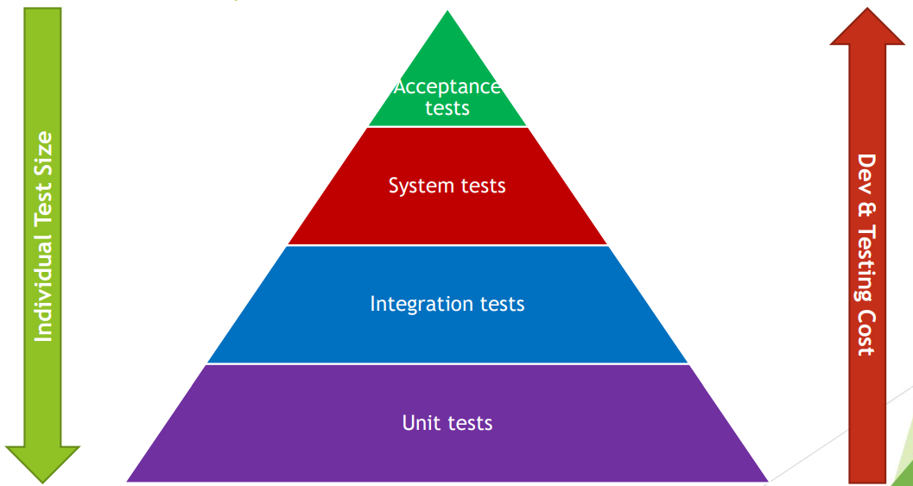
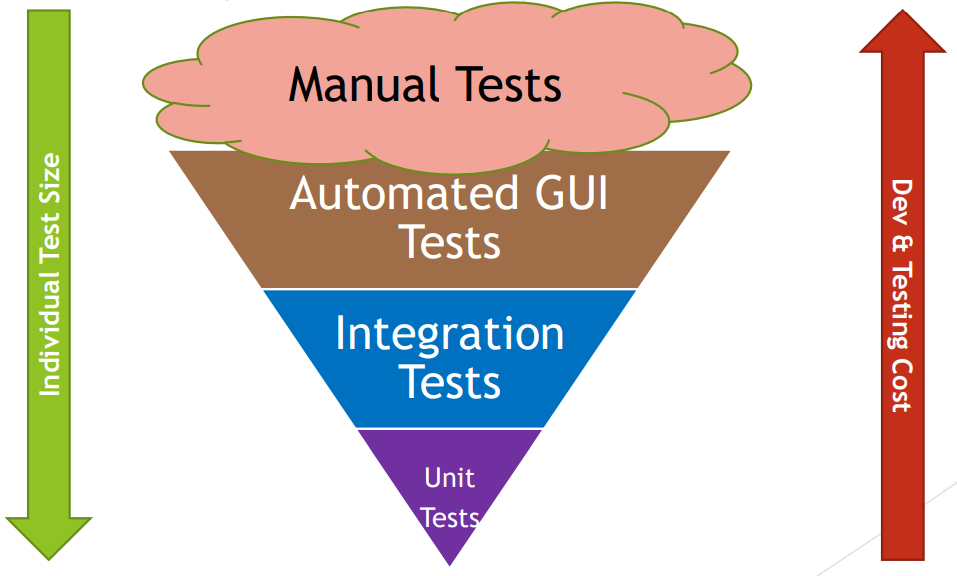
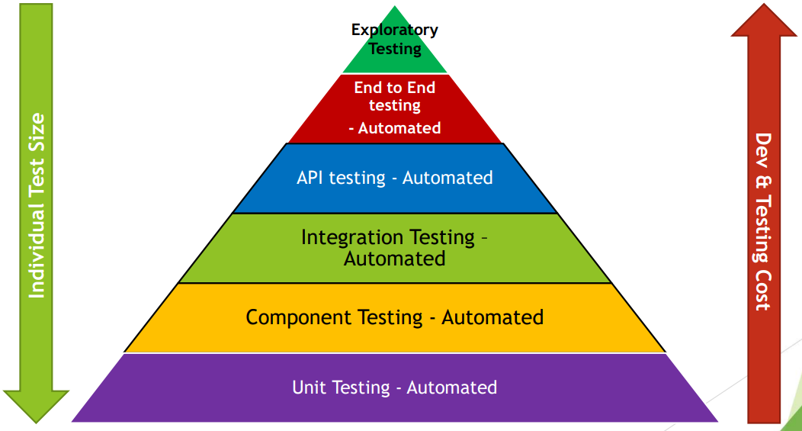

[🔙 Home](../home.md)

# The Test Pyramid
* Layers of the pyramid represent groups of tests
* Different Goals are supported by different levels of testing & test automation
* Supports the team in:
  * Test Automation
  * Test Effort Allocation
* The higher the layer
  * The lower the test granularity
  * The lower the test isolation – the larger the test
  * The higher the test execution time

## The Test Pyramid – Why?

## The Test Pyramid – Keep Thinking!!!
