## Chapter 1 - What is Cypress

Cypress is your go-to tool for testing anything that operates within a browser.
It provides the flexibility to write various types of tests - including component, end-to-end and API tests.

**What sets Cypress apart is its ability to function directly within the browser, meaning it allows us to test our application right where they intend it to operate.**

### How does it work?
Cypress operates by creating two iframes.
* One of them runs our application 
* The other one runs the Cypress script.

This setup enables Cypress to interact directly with our application, eliminating any need for a middleware - That's a significant distinction from tools like Playwright or Selenium. Unlike these tools, Cypress doesn't really rely on a web driver. It doesn't aim to automate the browser, but **focuses more on automation of the app**.


Cypress' main function is testing. While it works brilliantly with app development and testing, it might not be an optimal choice for tasks like web scraping or scripting for other websites. It's worth delving into its philosophy and to understand why it has certain limitations, such as the lack of a hover command or support for multiple browser tabs, and its limited compatibility with various browsers.

### Quiz
1. **What is the primary function of Cypress?**
   Cypress is primarily used for testing applications within a browser.

2. **How does Cypress operate**
   Cypress operates by creating two iframes; one for the application and one for the Cypress script

3. **What are some limitations of Cypress**
   Lack of a hover command, limited support for multiple browser tabs and limited browser compatibility

4. **What is Cypress's approach towards testing**
   It focuses more on automation of the app, not the browser


### Resources
[Overview of Cypress](https://www.cypress.io/app/)
[Comparison with other frameworks](https://www.cypress.io/how-it-works/)

## Chapter 2 - Installation & Project Walkthrough

Create a new project folder - _cypress-basics-tau_

### Prerequisites
* Node installed
### Initialise a project
1. `npm init -y` - the `-y` argument means say yes to all questions and setup project with default values

   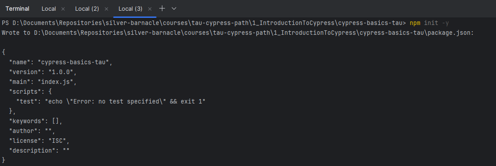

2. Install Cypress - `npm install cypress`

   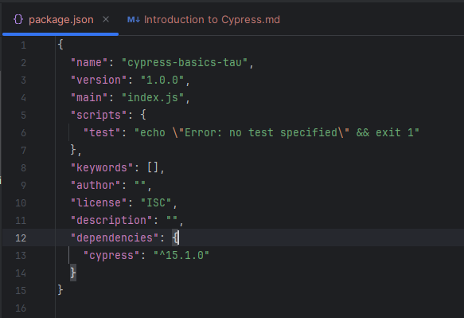

3. Open Cypress - `npx cypress open`

   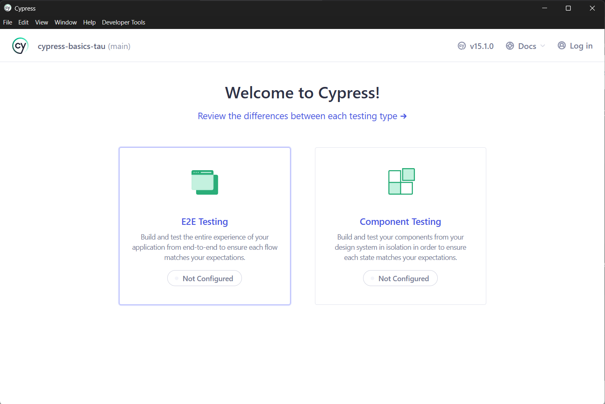

4. Select E2E Testing
5. Select Chrome
   
   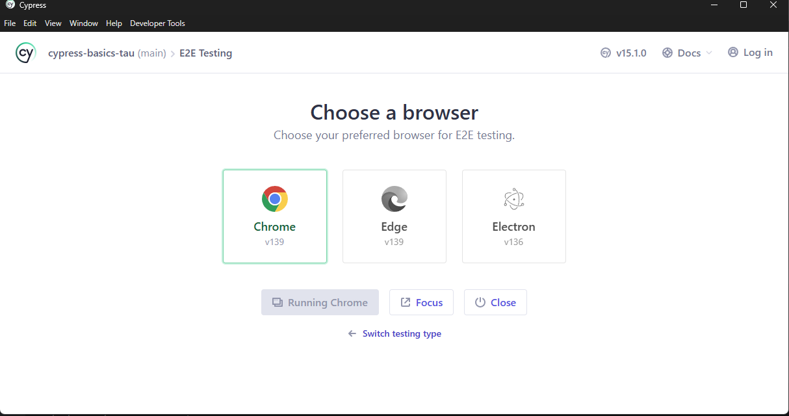

6. select option to _Scaffold example specs_ which creates some sample tests to investigate

   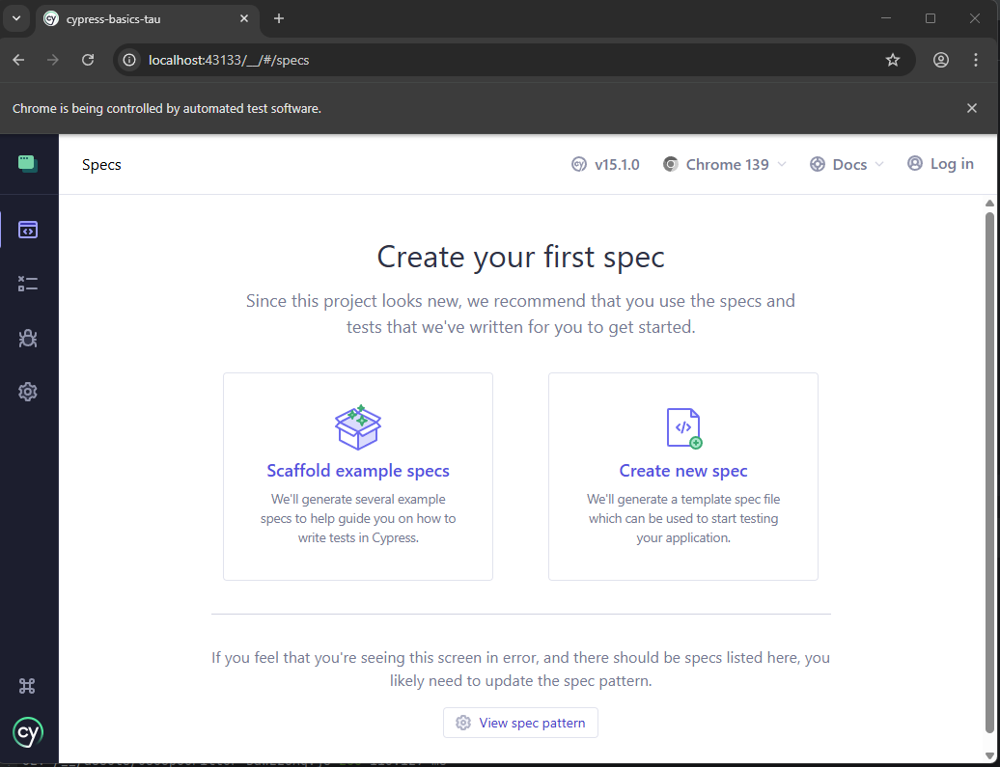

   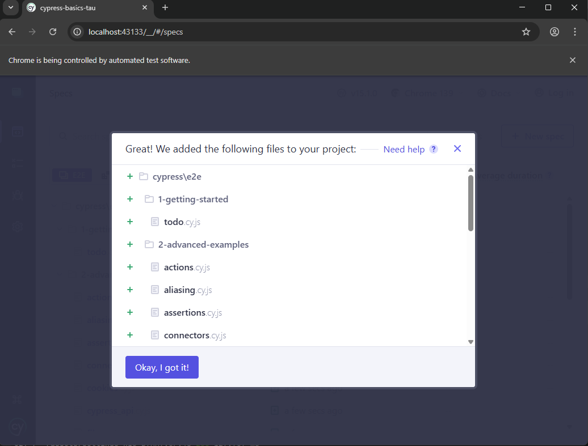

7. Observe the list of example tests created

   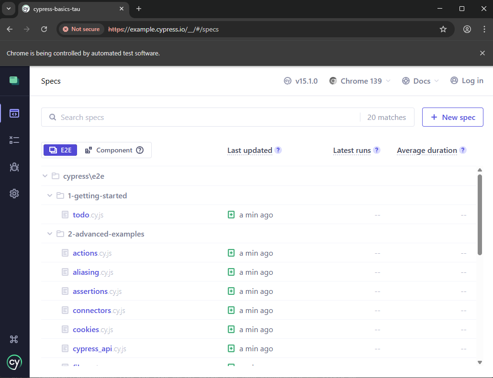

8. Clicking on a test on the list above will run it

   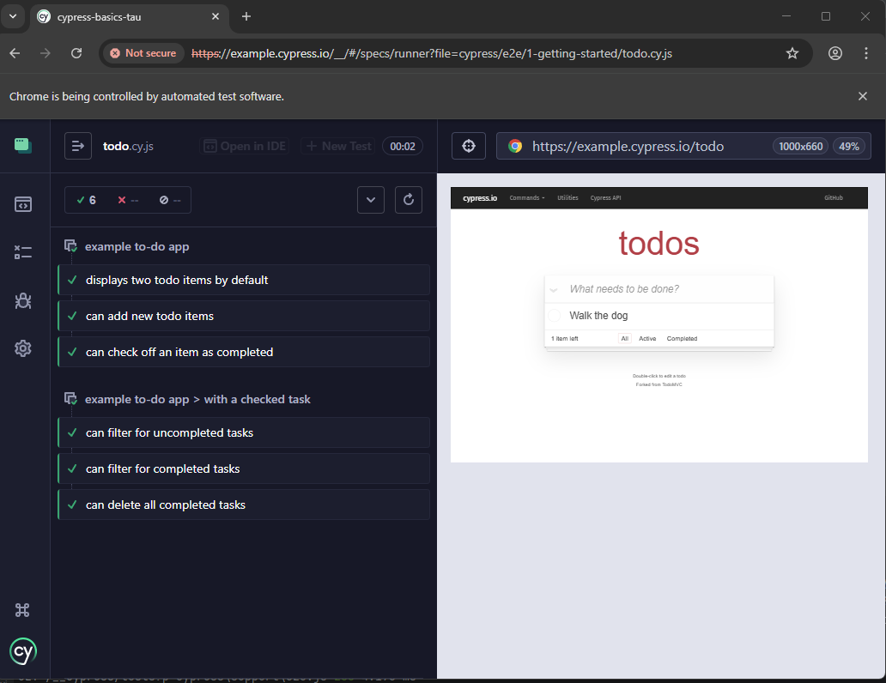

9. The browser console is available within the Cypress runner

   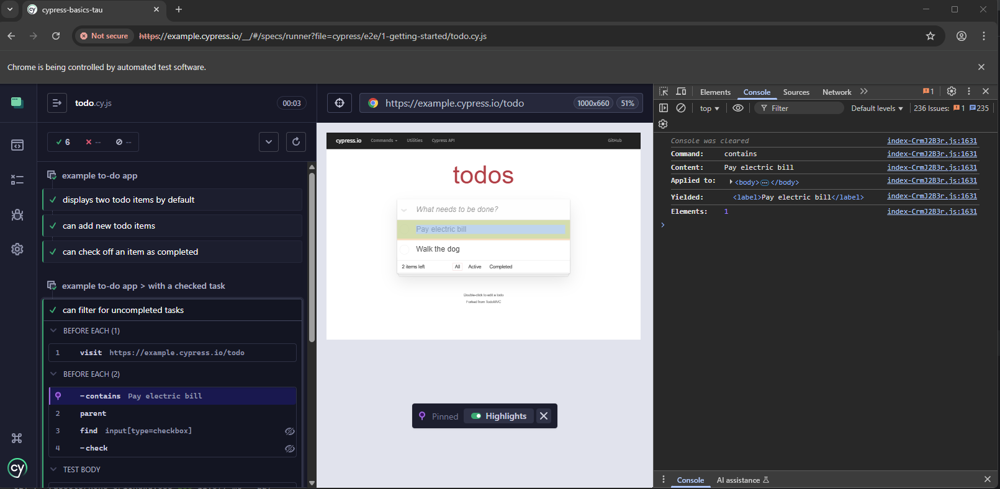
   
### Folder Structure
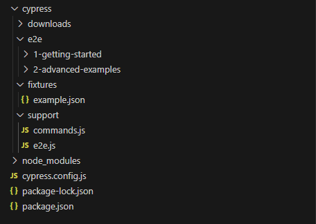

* `e2e` - this is where our tests are.
* `fixtures` - that's going to contain all of the static files we need for our testing.
* `support` folder, which is a place for our custom commands and for e2e.js, which is a file that will load before all of the tests are running.


### Quiz
1. **What is the purpose of the npm init command?**
   It initializes a node project in the current directory

2. **What does the npm install cypress command do?**
   It installs Cypress along with all its dependencies in the project

3. **What happens when you execute the npx cypress open command?**
   It opens Cypress in a user-friendly UI mode for setting up and running tests

4. **What does Cypress create when you configure it for the first time?**
   It creates configuration files and adds them to your project

5. **What can you do with the DOM snapshot feature in Cypress?**
   You can travel back in time to see how the application looked when a certain action was being done

6. **What does the cypress.config.js file allow you to do?**
   It allows you to configure settings like viewport height and width for testing in different resolutions


### Resources
[Detailed resources on Cypress installation](https://docs.cypress.io/guides/getting-started/installing-cypress)
[Detailed view of Cypress App](https://www.cypress.io/app/#visual_debugging)

## Chapter 3 - First command

### Sample Test
``` javascript
it('my first test', () => {

  cy.visit('https://cypress.io')

});
```
### Cypress Tests Repository

Download Test Code [here](https://github.com/filiphric/cypress-basics-tau/tree/main?tab=readme-ov-file)

### Trello App
Download linked repo containing sample Trello app [here](https://github.com/filiphric/trelloapp-vue-vite-ts/tree/8bdade320057e6edce60877ac8ca17bb730dacf8)

It is part of the silver-barnacle repository and located at: courses\tau-cypress-path\TrelloTestApplication
You can create boards, lists and cards. You can drag and drop cards between lists or even upload a picture to the card detail. There’s also a very simple signup and login which will allow you to create private boards

#### Installation
Super simple

1. `npm install`
2. `npm start`
3. Open your browser on `http://localhost:3000`


``` javascript
it('my first test', () => {

  cy.visit('http://localhost:3000')

});
```

### Configuration
Set up base URL 
``` js
const { defineConfig } = require("cypress");
module.exports = defineConfig({

  e2e: {
    setupNodeEvents(on, config) {
      // implement node event listeners here
    },
    baseUrl: 'http://localhost:3000',
    viewportHeight: 550,
    viewportWidth: 660,
    experimentalStudio: true,
  },

});
require('@applitools/eyes-cypress')(module);
```

Now we can just do
```js
it('my first test', () => {

  cy.visit('/')

});
```
### Quiz
1. **What function is used in Cypress to visit a URL?**
		The `cy.visit()` function is used in Cypress to visit a URL.

2. **Which framework does Cypress use for writing test cases?**
		Cypress uses the Mocha framework for writing test cases.
		
3. **What happens when you save your test file while the Cypress browser is open?**
		The test automatically reruns in the Cypress browser.
		
4. **How can you set a base URL for your Cypress tests? Where is this information stored?**
		You can set a base URL in the `cypress.config.js` file
### Resources
[Example Repository](https://github.com/filiphric/cypress-basics-tau)
[Documentation for .visit() command](https://docs.cypress.io/api/commands/visit.html#Syntax)
[Best practices for using baseUrl](https://docs.cypress.io/guides/references/best-practices.html#Setting-a-global-baseUrl)
[Nice video about the reason why Cypress runner reloads](https://www.youtube.com/watch?v=f5UaXuAc52c)

## Chapter 4 - Cypress Studio

Cypress has this really neat feature that can help us make it easier - it's called Cypress Studio.

It can be enabled in Settings -> Project Settings -> Experiments

As soon as I do that, Cypress is going to restart.

I will open my spec, and at a first glance, nothing much has changed.

But, when I hover over the name of my test, I now have this magic wand icon.

So I can add commands to my tests.

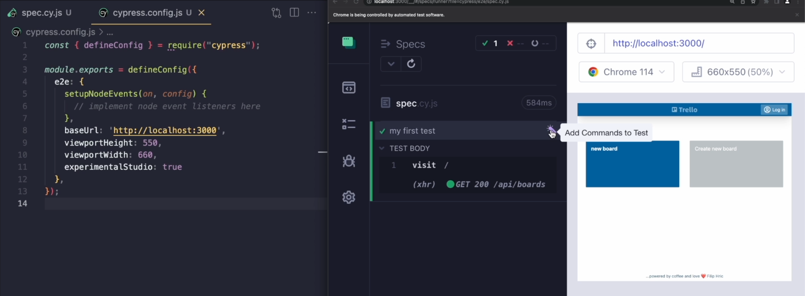

When I click that, Cypress is going to rerun my test and I can now start interacting with my page.

Whenever I click on anything, it's going to get recorded into my timeline.

If I go ahead and create a new list and hit "enter", everything is going to get recorded.

When I click on "Save Commands", Cypress is going to rerun my test.

Of course, now it's going to fail, because the state of my application has changed.
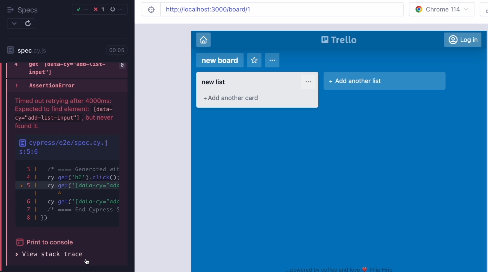


Let's now take a look into what has happened in our spec file.
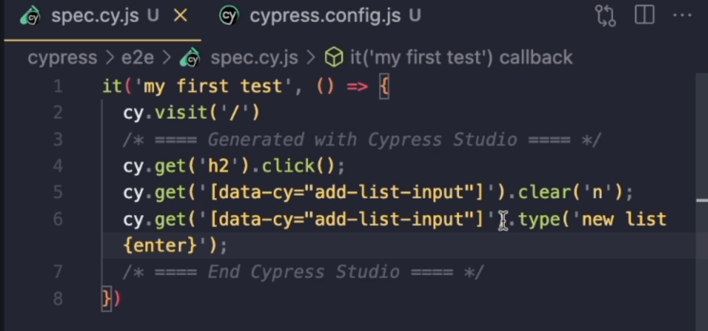

If I go back, I can see that I have some commands that were generated with Cypress Studio.

I have clicked on my h2 element, then selected an input element, which I cleared, and then typed into it.

This `clear('n')` doesn't really make sense, and it's a good testimony into the fact that the Cypress Studio is still an experimental feature.

The inevitable step after we record our test is to enhance it.

But of course, depending on the application, it can get you pretty far.


### Quiz
1. **What is Cypress Studio?**
		Cypress Studio is a feature in Cypress that records interactions with a webpage and generates test commands.
2. **How can you enable Cypress Studio in your project?**
		You can enable Cypress Studio in the project settings.
3. **What happens when you click "save commands" in Cypress Studio?**
		Cypress saves the recorded commands to your test file.
4. **Where can you find the commands generated by Cypress Studio in your project?**
		The commands generated by Cypress Studio can be found in your spec file.
### Resources
[Documentation for Cypress Studio](https://docs.cypress.io/guides/references/cypress-studio#__docusaurus_skipToContent_fallback)
[Reference for all Cypress experimental features](https://docs.cypress.io/guides/references/experiments#__docusaurus_skipToContent_fallback)

## Chapter 5 - Selectors

### Selector Playground

There's this really nice tool called selector playground which can help us find the selector that we need.

This works really well if we have unique selectors on our page.

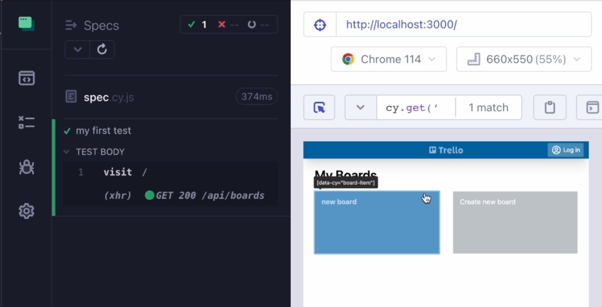


Whenever I click on an element, I will get a full view of the command that I have to use.

I can just copy that and paste it into my code.

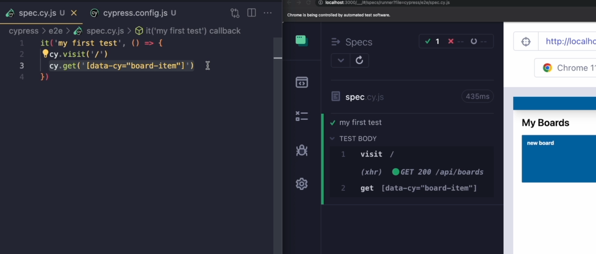

#### Example
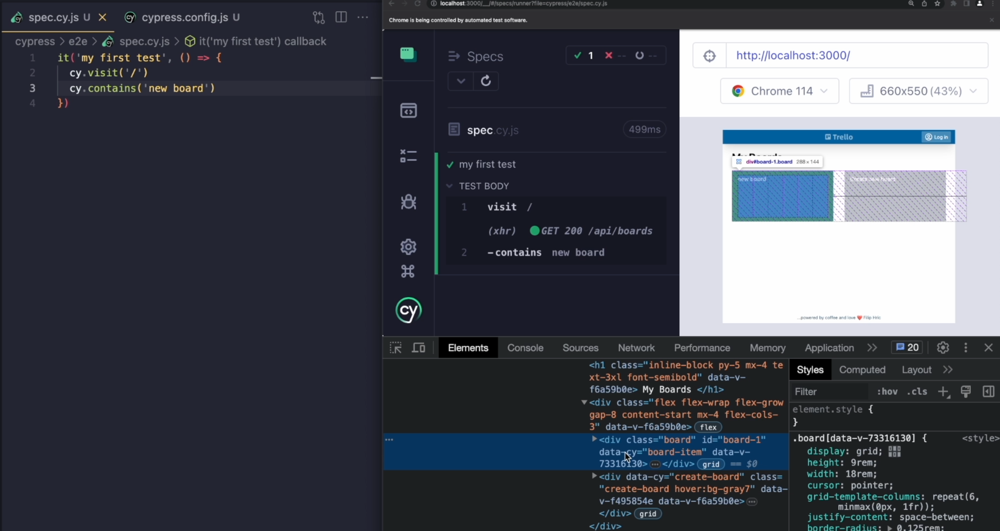

We have the `class` of `board`, `id` of `board-1`, and then also the `data-cy` attribute `board-item`.

In Cypress, we can choose any of these attributes by using the `cy.get()` command.

``` javascript
it('my first test', () => {
  cy.visit('/')
  cy.contains('new board')
  cy.get('.board') // using class
  cy.get('#board-1') // using id
  cy.get('[data-cy=board-item]') // using data-cy
})
```

#### Contains
the `contains` command can actually take two arguments, and in that case, the first argument would act exactly as our `get` command.
``` js
it('my first test', () => {
  cy.visit('/')
  cy.contains('.board', 'new board')
  cy.get('.board')
  cy.get('#board-1')
  cy.get('[data-cy=board-item]')
})
```

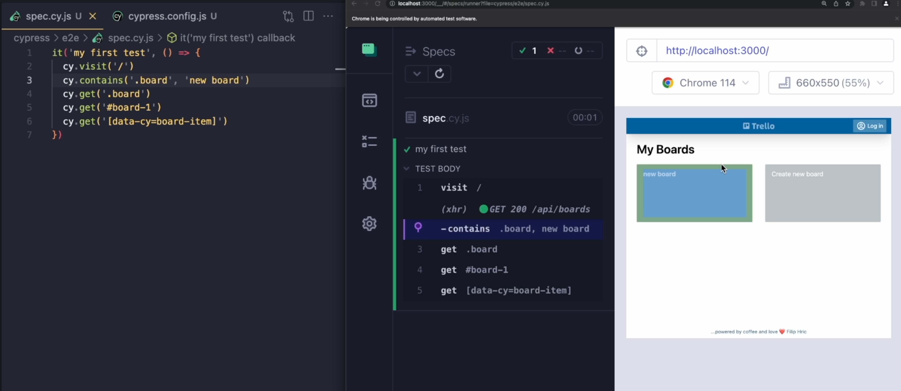


#### But can Cypress use xpaths?

Well it can if you install an additional plugin.

While installing a plugin is not a big deal, I generally don't recommend going for xpaths because you can use Cypress commands for everything xpaths can do, and even more.

Let me show you what I mean.

I'm going to create another board - let's just call it "hello board" and go back to my home page where I now have two.

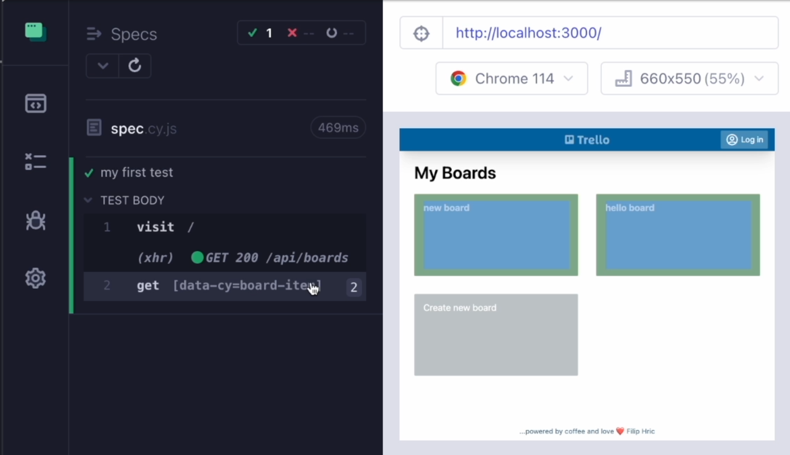

If we decide to use this selector, you'll notice that we are selecting both of our elements but we don't want to interact with both of them - just a single one.

So we can narrow down our search by chaining off another command to our get command.

For example, we'll go with `first()` to select the first element.

  

```
it('my first test', () => {
  cy.visit('/')
  cy.get('[data-cy=board-item]')
    .first()
})
```

So now we have two - when I hover over, you can see that now we have only selected the first one.

There's also a `last()` command which is going to select the last element of those two that were selected in the previous command, or we can use `eq()` and then pass a number.

This is going to select whichever element we want, numbering from number zero.

So `eq(0)` will select the first element, `eq(1)` will select the second element and so on.

These are only a couple of options that we have here.

In Cypress, we have commands like `next`, `previous`, `parent`, `children`, `find` and many more.

These allow us to traverse across the DOM in any direction we need.

It's very similar to the capabilities of xpath, but it's much more readable.

You can easily figure out what the commands are actually doing.

### Quiz
1. **What is the purpose of the Selector Playground in Cypress?**
		The Selector Playground helps to find the selector for a specific element on a page.
2. **How can you select an element in Cypress based on the text it contains?**
		You can use the `cy.contains()` command.
3. **How can you select an element in Cypress using its class, ID, or other HTML attributes?**
		You can use the `cy.get` command with a dot prefix for `class`, a hash symbol for `ID`, or square brackets for other attributes.
4. **Can you use XPaths with Cypress to select elements?**
		Yes, but you need to install an additional plugin, and it's generally not recommended as Cypress commands are more versatile.
5. **Where can you find the list of all querying commands in Cypress?**
		You can find them in the documentation at [docs.cypress.io](docs.cypress.io), under the queries tab.
### Resources
- [My blog on the topic of selectors](https://filiphric.com/cypress-basics-selecting-elements)
- [My blog about xpath vs. css selectors](https://filiphric.com/cypress-basics-xpath-vs-css-selectors)
- [My blog on the topic of .contains() command](https://filiphric.com/contains-an-overlooked-gem-in-cypress)
- [Best practices on selectors recommended by Cypress](https://docs.cypress.io/guides/references/best-practices#Selecting-Elements)
- [Documentation for .get() command](https://docs.cypress.io/api/commands/get.html#Usage)
- [Documentation for .contains() command](https://docs.cypress.io/api/commands/contains.html#Usage)
- [W3 Schools documentation for selectors](https://www.w3schools.com/cssref/css_selectors.asp)
- [Very nice diagram for explaining various relations between elements](https://frontend30.com/css-selectors-cheatsheet/)
- [Game for learning and practicing your CSS selectors](https://flukeout.github.io/)

## Chapter 6 - Interactions
**interactions.cy.js**

``` javascript
it('create a new list & a new card', () => {
  cy.visit('/board/1')
  cy.get('[data-cy="add-list-input"]')
    .type('test list{enter}') // {enter} presses the enter key after typing 'test list'
  cy.contains('Add another card')
    .click()
  cy.get('[data-cy="new-card-input"]')
    .type('test card{enter}')
})

it.only('new test', () => {
  cy.visit('/')
  cy.get('[data-cy="star"]') // by attribute name
    .first() // uses the first element found
    .click({force: true}) //forces the click even if the element is not currently visible
  cy.get('.star') // by class name
});
```
### Quiz
1. **What is the command in Cypress to enter text into an input field?**
		`cy.type()`
2. **How does Cypress emulate hitting the 'Enter' key during testing?**
		By typing `{enter}` as part of the type command argument i.e.
	``` javascript
	it('create a new list & a new card', () => {
	  cy.visit('/board/1')
	  cy.get('[data-cy="add-list-input"]')
	    .type('test list{enter}') // {enter} presses the enter key after typing 'test list'
	});
	```

3. **What does the {force: true} option in Cypress commands do?**
		It forces the action to execute even if the targeted element is not visible, disabled, or non-interactive
4. **How can you run a single test out of multiple tests in a spec file in Cypress?**
		By using the `it.only` function
### Resources
[Docs for .type() command](https://docs.cypress.io/api/commands/type.html)
[Special characters for .type() command](https://docs.cypress.io/api/commands/type.html#Arguments)
[Docs for .click() command](https://docs.cypress.io/api/commands/click.html#Syntax)
[Explanation of Cypress actionability checks](https://docs.cypress.io/guides/core-concepts/interacting-with-elements#Actionability)

## Chapter 7 - Assertions

**assertions.cy.js**
``` javascript
it('making assertions', () => {
    cy.visit('/board/1')

    cy.get('[data-cy=new-card]')
        .click()

    cy.get('[data-cy="new-card-input"]')
        .type('bread{enter}')

    cy.get('[data-cy="new-card-input"]')
        .type('milk{enter}')

    cy.get('[data-cy="card"]')
        .should('be.visible')
        .should('have.length', 2)

    cy.get('[data-cy="card-checkbox"]')
        .first()
        .check() // opposite is .uncheck(), these guarantee state rather than relying on .click()

    cy.get('[data-cy="due-date"]')
        .should('have.class', 'completed')

    cy.get('[data-cy="card-checkbox"]')
        .first()
        .should('be.visible')
        .should('be.checked')

    cy.get('[data-cy="list-name"]').should('have.value', 'shopping list') // needs to use 'have.value' as it's an input element

    cy.get('[data-cy="card-text"]').first().should('have.text', 'bread') // can use 'have.text' as it's a div element

})

after(() => {
    cy.request('DELETE', '/api/cards')
    cy.reload()
     cy.get('[data-cy="card"]')
        .should('not.exist')
})
```
### Quiz
1. **What command is used in Cypress to click on an element?**
		`cy.click()`
2. **How is the 'type' command used in Cypress to enter text into an input field?**
		`cy.get(selector).type('bread')`
3. **How can you confirm that an element is visible on the page in Cypress?**
		Using the 'should' command, for example: `cy.get(selector).should('be.visible')`
4. **What is the Cypress assertion to ensure that a certain number of elements are found?**
		`.should('have.length', 2)`
5. **In a scenario where you want an element to always be in a 'checked' state at the end of the test, which Cypress command should you use?**
		`cy.check()`
6. **How would you assert in Cypress that there’s the text 'groceries' visible in an input element?**
		`.should('have.value', 'groceries')`
### Resources
[My blog on asserting visibility of elements](https://filiphric.com/cypress-basics-check-if-element-exists)
[Docs for .should() command](https://docs.cypress.io/api/commands/should.html)
[Docs for .check() command](https://docs.cypress.io/api/commands/check.html#Syntax)
[Examples of simple assertions with the .should() command](https://docs.cypress.io/guides/references/assertions.html#Common-Assertions)


## Chapter 8 - Chaining & Retrying

### Cypress Command Types: Parent, Child, and Hybrid

Cypress commands fall into three main categories: **Parent**, **Child**, and **Hybrid** commands.  
The type determines **how they are chained** and **whether they need a previous subject**.

---

#### **1. Parent Commands**
- **Definition:**  
  Start a **new command chain**.  
  They **do not depend on a previous subject**.

- **Examples:**
```javascript
  cy.visit('/home')            // Starts a new chain
  cy.get('.card')              // Starts a new chain
  cy.request('GET', '/api')    // Starts a new chain
```

### 2. Child Commands

Definition:
Must be chained after a parent or another child command because they act on a subject provided by the previous command.

Examples:
``` javascript
cy.get('.card')          // Parent
  .click()               // Child - clicks the found element
  .should('be.visible')  // Child - checks visibility
```

Common Child Commands:
- `.click()`
- `.type()`
- `.should()`
- `.check()`
- `.select()`

### 3. Hybrid (Dual) Commands
Definition:
Can behave both as a Parent or a Child command.

Examples:
```javascript
// Used as a Parent
cy.contains('Submit')

// Used as a Child
cy.get('.form').contains('Submit')

```

### Assertions
Whenever we have an assertion in our test, Cypress is going to retry commands that go before it, but it will only retry our queries, which means that when we load our application and we have only two cards loaded and the last one does not have the text 'shampoo', Cypress is going to execute the get command again and then again the last command, and then finally, it will make that assertion again.

It will do that until the assertion passes or until we hit the timeout.

**chaining.cy.js**
``` javascript
import {
    cardsLoadRandomly,
    cardsLoadSlowly,
    cancelInterceptors
} from '../../evilCode'


before(() => {
    cy.visit('/board/1')

    // Create a new list
    cy.get('[data-cy=add-list-input]').type('grocery store{enter}')
    cy.get('[data-cy=new-card]').first()
        .click()
    cy.get('[data-cy=new-card-input]').first()
        .type('bread{enter}')
    cy.get('[data-cy=new-card-input]').first()
        .type('milk{enter}')

    // Add a 2nd new list
    cy.get('[data-cy=create-list]').click()
    cy.get('[data-cy=add-list-input]').type('chemist{enter}')
    cy.get('[data-cy=new-card]').last()
        .click()
    cy.get('[data-cy=new-card-input]').last().type('paracetemol{enter}')


})


it('date formatting', () => {

    //Get today's date and add 3 days - default due date on cards is 3 days from when it's created
    const today = new Date();
    today.setDate(today.getDate() + 3); // Add 3 days

    //Format as 'MMM DD YYYY' (e.g., Sep 15 2025)
    const options = {
        month: 'short',
        day: '2-digit',
        year: 'numeric'
    };

    const formattedDate = today
        .toLocaleDateString('en-US', options)
        .replace(',', ''); // Remove comma to match format

    cy.visit('/board/1')

    cy.get('[data-cy=card]')
        .should('be.visible')
        .should('have.length', 3)

    cy.get('[data-cy=list]')
        .eq(0) // first element
        .contains('[data-cy=card]', formattedDate)

})

it('cards load slowly', {
    defaultCommandTimeout: 6000
}, () => {
    cy.visit('/board/1')
    cardsLoadSlowly(5000)
    cy.get('[data-cy=card]', {
        timeout: 6500
    })
})

it('check card contents', () => {
    cy.visit('/board/1')
    cy.get('[data-cy=card]', {
            timeout: 3000
        }) // timeout here was just to test if cancelInterceptors() worked, it did
        .last()
        .click()

    cy.get('[data-cy=card-detail-title]')
        .should('have.value', 'paracetemol')
})


it('cards load randomly', () => {
    cy.visit('/board/1')
    cardsLoadRandomly(4000)
    cy.get('[data-cy=card]').last()
        .click()

    cy.get('[data-cy=card-detail-title]')
        .should('have.value', 'milk')

})

afterEach(() => {
    cancelInterceptors()
})

after(() => {
    cy.request('DELETE', '/api/lists')
    cy.visit('/board/1')
    cy.get('[data-cy=card]')
        .should('not.exist')
})
```

**evilCode.js**
``` javascript
export const cardsLoadRandomly = (delay) => {
  cy.intercept({
    url: /api\/cards\?listId=/,
    middleware: true,
  }, (req) => {
    req.reply(res => {
      res.delay = Math.floor(Math.random() * delay);
    })
  }).as('😈')
}

export const cardsLoadSlowly = (delay) => {
  cy.intercept({
    url: /api\/cards\?listId=/,
    middleware: true,
  }, ({ reply }) => {
    reply( (res) => {
      res.delay = delay
    })
  }).as('😈')
}

// Reset the interceptors (cancel them)
export const cancelInterceptors = () => {
  // Cypress doesn't have a direct "remove" function, so we override
  cy.intercept(
    {
      url: /api\/cards\?listId=/,
    },
    (req) => {
      req.continue(); // Let the request pass through with no delay or modification
    }
  ).as('cardsDefault');
};
```

### Quiz
1. **What are the three types of commands in Cypress?**
		Parent, Child, and Hybrid commands
2. **Which command in Cypress changes its behavior based on whether it is starting a chain or is just a continuation of a chain?**
		`contains` command
3. **What are the uses of command chains in Cypress?**
		Command chains allow commands to pass information from one to another
4. **How can you make your test more stable in a flaky DOM situation?**
		By adding an assertion that will check that DOM has changed before moving to next command

### Resources
[My blog on how to avoid waiting in Cypress](https://filiphric.com/waiting-in-cypress-and-how-to-avoid-it)
[Chaining Commands Docs](https://docs.cypress.io/guides/core-concepts/introduction-to-cypress#Chains-of-Commands)
[How to write better command chains in Cypress (versions before v12](https://filiphric.com/writing-better-command-chains-in-cypress)

## Chapter 9 - Plugins

One of the great superpowers of Cypress is its pluggability.

This means that you can expand Cypress functionality in any way you want.

In Cypress documentation, you can find a whole page of different plugins that can help you speed up Cypress, and use different file types like Cucumber or Markdown.

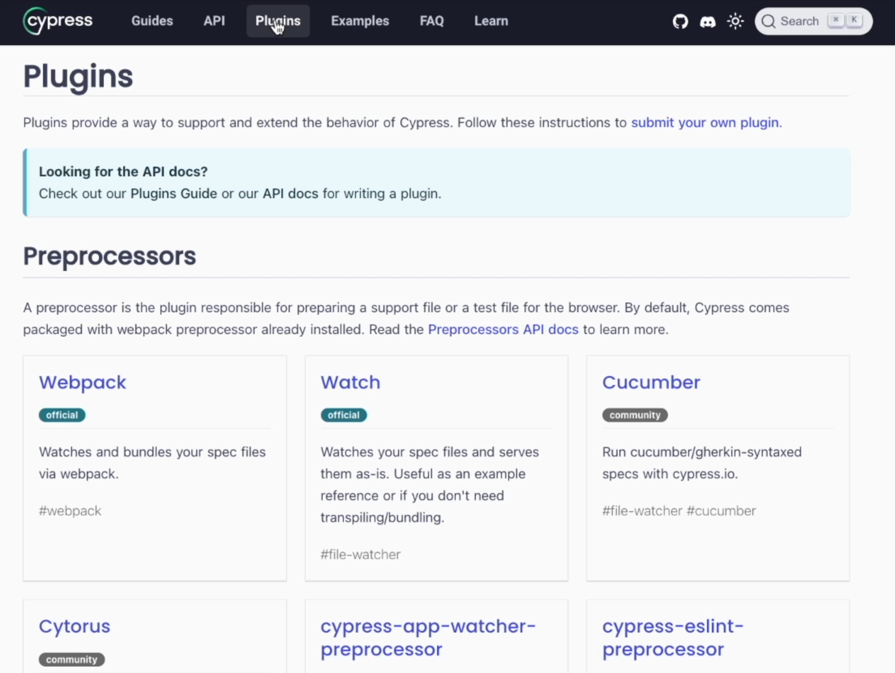
### Resources
[Cypress ESLint Plugin](https://github.com/cypress-io/eslint-plugin-cypress)
[Cypress-grep plugin for grepping, tagging and filtering tests](https://github.com/cypress-io/cypress-grep)
[Code coverage plugin for getting code coverage data from your test run](https://github.com/cypress-io/code-coverage)
[Plugin for making accessibility checks during your tests](https://github.com/component-driven/cypress-axe)
[Drag and drop plugin](https://github.com/4teamwork/cypress-drag-drop)
[Cypress-recurse will enable you to recursively run a set of commands](https://github.com/bahmutov/cypress-recurse)
[Plugin for testing api that will show your API in browser](https://github.com/filiphric/cypress-plugin-api)
[Plugin for adding missing iframe support](https://gitlab.com/kgroat/cypress-iframe)
[Add events like hover, swipe etc using Chrome devtools protocol](https://github.com/dmtrKovalenko/cypress-real-events)
[Visual testing by Applitools](https://applitools.com/tutorials/cypress.html)
[Testing emails using mailosaur](https://github.com/mailosaur/cypress-mailosaur)
[Restoring a browser session and omitting login](https://github.com/bahmutov/cypress-data-session)

## Chapter 10 - Run mode

So far, we have been interacting with the graphic user interface mode, but we can actually run our tests headlessly using npx cypress run mode.

``` shell
npx cypress run
```

When I use that, Cypress is going to take a look into the spec folder and run every test it can find.
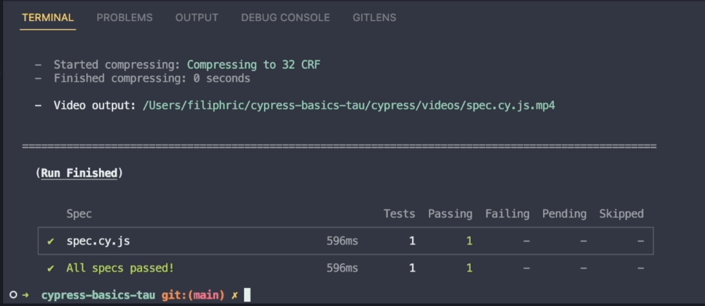

Cypress will automatically record video for all of our spec files.

Moreover, if we have a failing test and run our test, we will automatically get a screenshot from that failure.

You can see this in the screenshots folder.
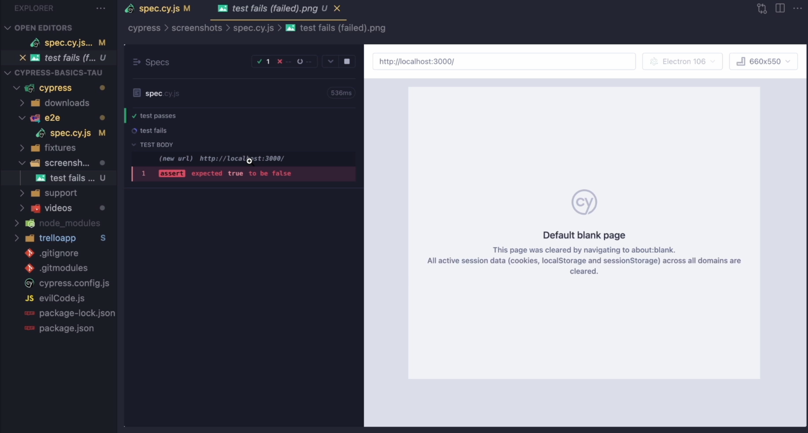
Compared to the open mode, Cypress will not automatically watch for changes in our files, so every time we want to run our test, we need to type npx cypress run again.

By default, this mode will take a look into the cypress.config.js and take information on baseUrl, viewportHeight, viewportWidth and other features from here, but we can also specify.

There are a bunch of options we can use.

For example, we can choose a different browser like Firefox.
``` shell
npx cypress run --browser firefox
```

If we do that, Cypress is going to run in Firefox instead.

Again, if we take a look at the screenshots, we can actually see the screenshot being taken from Firefox.

We can also see our tests in action by using a `headed` flag.
``` shell
npx cypress run --browser firefox -- headed
```

This, instead of running fully in the Terminal, will open the browser and we can actually observe our tests being run.

After the tests are finished, the browser will close and will print a report into our Terminal.
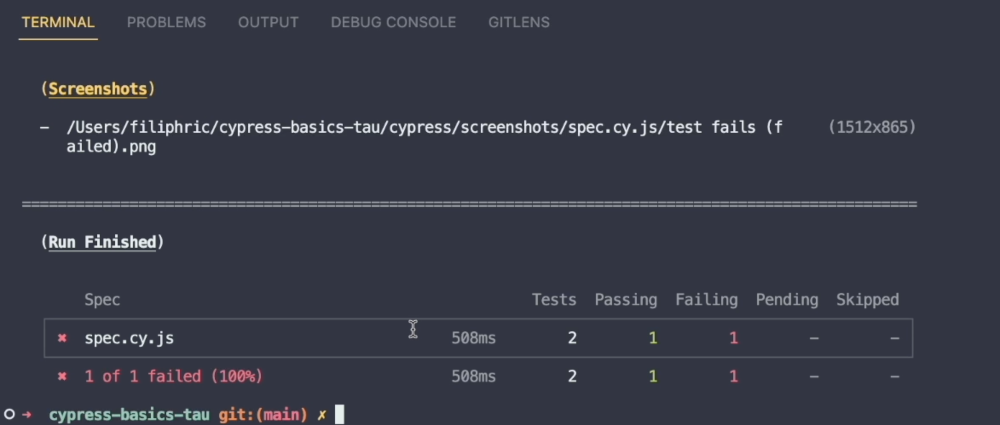


### Quiz
1. **a**
2. **b**
3. **c**
4. **d**
### Resources
[]()

## Outro