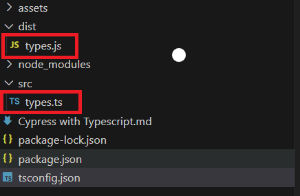
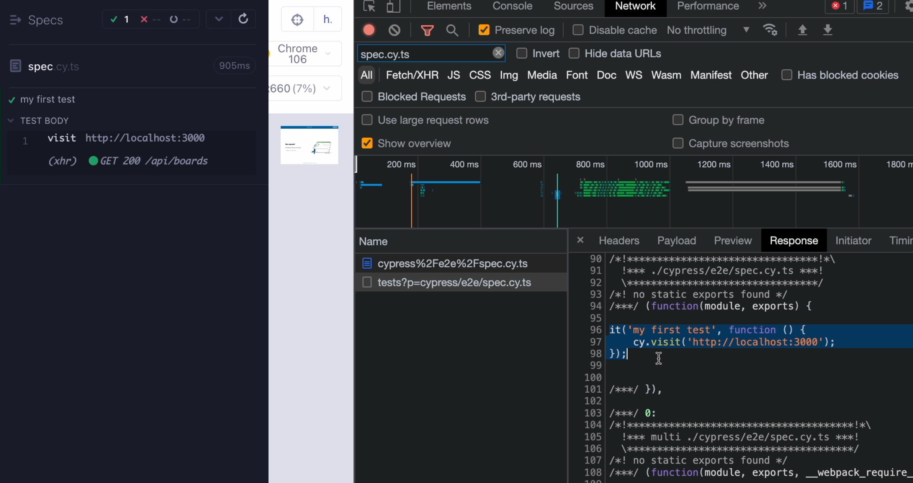
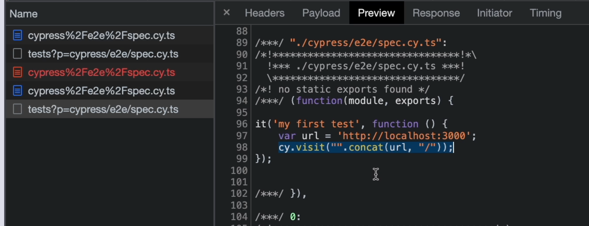

TypeScript  is slowly becoming the number one language for web development.
## Chapter 1 - Exploring types

**types.ts**
``` typescript
let counter = 11;
let greeting = "Hi";
let car = { 
    colour: "green", 
    electric: false 
};

console.log(typeof counter); // number
console.log(typeof greeting); // string
console.log(typeof car); // object
console.log(typeof car.colour); // string
console.log(typeof car.electric); // boolean

console.log(car)
car.colour = "blue"
console.log(car)

const add = (a: number, b: number) => {
    return a + b;
}

console.log(add(1,2)) // 3

type EvenNumber = 2 | 4 | 6 | 8

const addEvenNumbers= (a: EvenNumber, b: EvenNumber) => {
    return a + b;
}

console.log(addEvenNumbers(1,2)) // compile time error as 1 is not part of the new EvenNumbers type
/**
TSError: ⨯ Unable to compile TypeScript:
src/types.ts:30:28 - error TS2345: Argument of type '1' is not assignable to parameter of type 'EvenNumbers'.
 */

console.log(addEvenNumbers(6,2)) // 8
```
### Quiz
1. **Types are only available in TypeScript**
		false
2. **What is the type of `obj` in following example: `const obj = { color: 'green' }`**
		object
3. **What will be the result of '1' + '1'?**
		`11`
4. **Which example of defining a new type is correct?**
		`type myNumbers = 1 | 2 | 3 | 4`
5. **TypeScript can help us check number of parameters**
		true

## Chapter 2 - Understanding the TypeScript compiler

### Install TypeScript globally
``` shell
npm install typescript -g
```

### TypeScript compiler


For example, if we call tsc and then the name of our file, for example types.ts, then TypeScript is going to compile our file into JavaScript.
``` shell
tsc src/types.ts --outDir dist
```

This is what TypeScript does - It will always convert your ``ts`` file to ``js``.

As you can see, I have a ``js`` file generated over here, and it will do this conversion so that your browser can read it.


**There is no browser that can read TypeScript files**, so the compilation from TypeScript to JavaScript is something that needs to be done anytime we want to run our TypeScript code inside the browser.


### Feature Support
The interesting thing about TypeScript is that it also adds support for new features of JavaScript and it makes them compatible with older versions of JavaScript.

You can think of TypeScript as JavaScript with the newest features.

A nice example of this might be template strings - These require the use of backticks rather than plain single quotes!!
``` typescript
let greet = "Hi";
console.log(`${greet} TypeScript`)
```

Created a new project using `tsc --init`
**tsconfig.json**
``` json
{
  "compilerOptions": {
    "target": "ES2020",
    "module": "commonjs",
    "rootDir": "./src",
    "outDir": "./dist",
    "strict": true,
    "esModuleInterop": true,
    "forceConsistentCasingInFileNames": true,
    "skipLibCheck": true,
    "sourceMap": true,
    "declaration": true,
    "types": ["node"]
  },
  "include": ["src/**/*.ts"]
}
```

For example, this module option will specify what kind of JavaScript we will get as an output.

Right now, it is set to ``commonjs``, which is the default option.
### Quiz
1. **Browsers can read TypeScript**
		false
2. **Which command will compile TypeScript into JavaScript?**
		`tsc`
3. **How do we compile a file called `hello.ts` ?**
		`tsc hello.ts`
4. **Where can we define options for TypeScript compiler?**
		`tsconfig.json`
5. **TypeScript requires installation**
		true

## Chapter 3 - Installing & using TypeScript in a Cypress project

I have created a new project called `cypressTestProject` with the following commands
``` shell
npm init -- to create the project
npm install cypress -- install the cypress package
npx cypress open -- to setup and configure the project via the UI wizard
```

I then created a sample test via the UI - `cypressTestProject\cypress\e2e\spec.cy.js`
``` javascript
describe('template spec', () => {
  it('my first test', () => {
    cy.visit('https://localhost:3000')
  })
})
```

Whenever I want to write a new command in my Cypress test, I need to type cy.. and then the name of my command.
To get auto-completion you can add `/// <reference types="cypress" />` to the top of the file, this will tell the VSCode editor to actually read the TypeScript definition from Cypress.
### Installing & Using TypeScript
To convert to typescript we need to run the following
``` shell
npm install typescript -D
```
`-D` means I'm going to save it as a dev dependency.

Now, TypeScript is installed into my project and the next thing I want to do is to create a `tsconfig.json` file.
``` json
{
  "compilerOptions": {
    "target": "es5",
    "lib": ["es5", "dom"],
    "types": ["cypress", "node"]
  },
  "include": ["**/*.ts"]
}
```

Change the file extensions to `.ts` i.e from `spec.cy.js` into `spec.cy.ts`.

We can then run the TypeScript test files!

The reason why we can open the TypeScript file in our browser is that Cypress is actually running a compiler in the background.

What Cypress will do is read our spec.cy.ts file, convert this from TypeScript to JavaScript, inject this into the browser, and run our test.

We can see that even in our browser.

When I open the network panel and refresh my test and search for spec.cy.ts, we can actually see the compiled test file, which contains a couple of handler functions and then we can clearly see our test.

This is what's actually being read by our browser.

All of the additional code that we see here has actually been added during the runtime.

As you can see, there are many references to the webpack compiler, which is the default one used for the compilation of our tests.

If we did something like in the previous example, where we would add our url to the constants and then maybe did something like this template string - ${url} - and saved it, then inside the test, we can actually see that the compiler has changed that template string to an ES5 compatible syntax.



To sum this up, basically this means that we don't have to run that `tsc` command, but Cypress will do that for us on the fly.


### Quiz

1. **Cypress has built-in TypeScript support**
		true
2. **With TypeScript enabled in Cypress project, we get...**
		autocompletion of Cypress commands
3. **Cypress will do the following with TypeScript files**
		Compile them into JavaScript and run them in browser
4. **To get autocompletion of Cypress commands in .js files we need to**
		Use `/// <reference types="cypress" />` <reference types=cypress /> comment at the top of our `.js` file

## Chapter 4 - Writing Cypress tests with TypeScript

### Quiz

### Resources 

## Chapter 5 - Creating a Cypress command with TypeScript & JSDoc

### Quiz

### Resources 

## Chapter 6 - Reusing types from the source app in Cypress tests

### Quiz

### Resources 

## Chapter 7 - Chapter 7 - Using utility types in custom commands

### Quiz

### Resources 

## Chapter 8 - Chapter 8 - Using the CLI to check types

### Quiz

### Resources 

## Chapter 9 - Leveraging TypeScript for visual testing

### Quiz

### Resources 