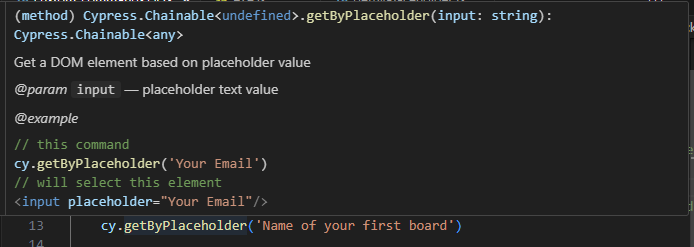

# Cypress with TypeScript
TypeScript  is slowly becoming the number one language for web development.
## Chapter 1 - Exploring types

**types.ts**
``` typescript
let counter = 11;
let greeting = "Hi";
let car = { 
    colour: "green", 
    electric: false 
};

console.log(typeof counter); // number
console.log(typeof greeting); // string
console.log(typeof car); // object
console.log(typeof car.colour); // string
console.log(typeof car.electric); // boolean

console.log(car)
car.colour = "blue"
console.log(car)

const add = (a: number, b: number) => {
    return a + b;
}

console.log(add(1,2)) // 3

type EvenNumber = 2 | 4 | 6 | 8

const addEvenNumbers = (a: EvenNumber, b: EvenNumber) => {
    return a + b;
}

console.log(addEvenNumbers(1,2)) // compile time error as 1 is not part of the new EvenNumbers type
/**
TSError: ⨯ Unable to compile TypeScript:
src/types.ts:30:28 - error TS2345: Argument of type '1' is not assignable to parameter of type 'EvenNumbers'.
 */

console.log(addEvenNumbers(6,2)) // 8
```
### Quiz
1. **Types are only available in TypeScript**
		false
2. **What is the type of `obj` in following example: `const obj = { color: 'green' }`**
		object
3. **What will be the result of '1' + '1'?**
		`11`
4. **Which example of defining a new type is correct?**
		`type myNumbers = 1 | 2 | 3 | 4`
5. **TypeScript can help us check number of parameters**
		true

## Chapter 2 - Understanding the TypeScript compiler

### Install TypeScript globally
``` shell
npm install typescript -g
```

### TypeScript compiler


For example, if we call tsc and then the name of our file, for example types.ts, then TypeScript is going to compile our file into JavaScript.
``` shell
tsc src/types.ts --outDir dist
```

This is what TypeScript does - It will always convert your ``ts`` file to ``js``.

As you can see, I have a ``js`` file generated over here, and it will do this conversion so that your browser can read it.


**There is no browser that can read TypeScript files**, so the compilation from TypeScript to JavaScript is something that needs to be done anytime we want to run our TypeScript code inside the browser.


### Feature Support
The interesting thing about TypeScript is that it also adds support for new features of JavaScript and it makes them compatible with older versions of JavaScript.

You can think of TypeScript as JavaScript with the newest features.

A nice example of this might be template strings - These require the use of backticks rather than plain single quotes!!
``` typescript
let greet = "Hi";
console.log(`${greet} TypeScript`)
```

Created a new project using `tsc --init`
**tsconfig.json**
``` json
{
  "compilerOptions": {
    "target": "ES2020",
    "module": "commonjs",
    "rootDir": "./src",
    "outDir": "./dist",
    "strict": true,
    "esModuleInterop": true,
    "forceConsistentCasingInFileNames": true,
    "skipLibCheck": true,
    "sourceMap": true,
    "declaration": true,
    "types": ["node"]
  },
  "include": ["src/**/*.ts"]
}
```

For example, this module option will specify what kind of JavaScript we will get as an output.

Right now, it is set to ``commonjs``, which is the default option.
### Quiz
1. **Browsers can read TypeScript**
		false
2. **Which command will compile TypeScript into JavaScript?**
		`tsc`
3. **How do we compile a file called `hello.ts` ?**
		`tsc hello.ts`
4. **Where can we define options for TypeScript compiler?**
		`tsconfig.json`
5. **TypeScript requires installation**
		true

## Chapter 3 - Installing & using TypeScript in a Cypress project

I have created a new project called `cypressTestProject` with the following commands
``` shell
npm init -- to create the project
npm install cypress -- install the cypress package
npx cypress open -- to setup and configure the project via the UI wizard
```

I then created a sample test via the UI - `cypressTestProject\cypress\e2e\spec.cy.js`
``` javascript
describe('template spec', () => {
  it('my first test', () => {
    cy.visit('https://localhost:3000')
  })
})
```

Whenever I want to write a new command in my Cypress test, I need to type cy.. and then the name of my command.
To get auto-completion you can add `/// <reference types="cypress" />` to the top of the file, this will tell the VSCode editor to actually read the TypeScript definition from Cypress.
### Installing & Using TypeScript
To convert to typescript we need to run the following
``` shell
npm install typescript -D
```
`-D` means I'm going to save it as a dev dependency.

Now, TypeScript is installed into my project and the next thing I want to do is to create a `tsconfig.json` file.
``` json
{
  "compilerOptions": {
    "target": "es5",
    "lib": ["es5", "dom"],
    "types": ["cypress", "node"]
  },
  "include": ["**/*.ts"]
}
```

Change the file extensions to `.ts` i.e from `spec.cy.js` into `spec.cy.ts`.

We can then run the TypeScript test files!

The reason why we can open the TypeScript file in our browser is that Cypress is actually running a compiler in the background.

What Cypress will do is read our spec.cy.ts file, convert this from TypeScript to JavaScript, inject this into the browser, and run our test.

We can see that even in our browser.

When I open the network panel and refresh my test and search for spec.cy.ts, we can actually see the compiled test file, which contains a couple of handler functions and then we can clearly see our test.

This is what's actually being read by our browser.

All of the additional code that we see here has actually been added during the runtime.

As you can see, there are many references to the webpack compiler, which is the default one used for the compilation of our tests.

If we did something like in the previous example, where we would add our url to the constants and then maybe did something like this template string - ${url} - and saved it, then inside the test, we can actually see that the compiler has changed that template string to an ES5 compatible syntax.


To sum this up, basically this means that we don't have to run that `tsc` command, but Cypress will do that for us on the fly.


### Quiz

1. **Cypress has built-in TypeScript support**
		true
2. **With TypeScript enabled in Cypress project, we get...**
		autocompletion of Cypress commands
3. **Cypress will do the following with TypeScript files**
		Compile them into JavaScript and run them in browser
4. **To get autocompletion of Cypress commands in .js files we need to**
		Use `/// <reference types="cypress" />` <reference types=cypress /> comment at the top of our `.js` file

## Chapter 4 - Writing Cypress tests with TypeScript

### Trello App
This is the app we are testing against.
Download linked repo containing sample Trello app [here](https://github.com/filiphric/trelloapp-vue-vite-ts/tree/8bdade320057e6edce60877ac8ca17bb730dacf8)

It is part of the silver-barnacle repository and located at: `courses\tau-cypress-path\TrelloTestApplication`
You can create boards, lists and cards. You can drag and drop cards between lists or even upload a picture to the card detail. There’s also a very simple signup and login which will allow you to create private boards

#### Installation
Super simple

1. `npm install`
2. `npm start`
3. Open your browser on `http://localhost:3000`


### Some commands using jQuery
**spec.cy.ts** file
``` javascript
describe('testing dashboard', () => {
  it.only('adding a new board', () => {
    cy.visit('/')

    cy.contains('Get started!').should('be.visible')
    cy.get('.mb-8').invoke('text')
    cy.get('.mb-8').invoke('hide') // hides the element on the page using jQuery function
    cy.contains('Get started!').should('not.be.visible')

    cy.get('.mb-8').invoke('show') // shows the element on the page using jQuery function
    cy.contains('Get started!').should('be.visible')

    cy.get('[data-cy="first-board"]')
      .type('Project #1{enter}')

    cy.get('[data-cy="board-title"]').should('have.value', 'Project #1') // needs to use 'have.value' as it's an input element
  })
})

after(() => {
  cy.request('POST', '/api/reset'); // reset everything
  cy.visit('/');
  cy.get('[data-cy="first-board"]')
})
```

### cypress-real-events plugin

1. Install the plugin for the project
	`npm install cypress-real-events`
2. Update `tsconfig.json` so documentation & types autocomplete in test files
	`"types": ["cypress", "node", "cypress-real-events"]`
	


### Using JSON data
``` typescript
import * as lists from '../fixtures/lists.json'

it('my first test', () => {
    
    // setup an interceptor for the create new list API endpoint
    cy.intercept('POST', '/api/lists')
    .as('listCreate')
    
    cy.visit('/')

    // check that the new board exists (it was created in the before function)
    cy.get('[data-cy="board-item"]')
        .realHover() // cypress-real-events function
    cy.get('h2').first().should('have.text', 'Project #1') // the heading of the first visible board should be 'Project #1'
    cy.get('[data-cy="board-item"]').first().click() // enter the board

    // create new lists from the lists.json file and verify the API call content
    lists.forEach(list =>{
        // create the list
        cy.get('[data-cy="add-list-input"]').type(`${list.name}{enter}`) // notice to use variables backticks are needed rather than regular quotes 

        // check the API call
        cy.wait('@listCreate')
            .its('response.body.order')
            .should('equal', list.order)
    })

})

// setup a new board
before(() => {
    cy.visit('/')

    cy.contains('Get started!').should('be.visible')
    cy.get('.mb-8').invoke('text')
    cy.get('.mb-8').invoke('hide') // hides the element on the page using jQuery function
    cy.contains('Get started!').should('not.be.visible')

    cy.get('.mb-8').invoke('show') // shows the element on the page using jQuery function
    cy.contains('Get started!').should('be.visible')

    cy.get('[data-cy="first-board"]')
        .type('Project #1{enter}')

    cy.get('[data-cy="board-title"]').should('have.value', 'Project #1') // needs to use 'have.value' as it's an input element
})

// reset everything
after(() => {
    cy.request('POST', '/api/reset');
    cy.visit('/');
    cy.get('[data-cy="first-board"]')
})
```

**lists.json**
``` json
[
    {
        "name": "list 1",
        "order": 0

    },
    {
        "name": "list 2",
        "order": 1
    },
    {
        "name": "list 3",
        "order": 2
    }
]
```
### Setup Fixtures path

**tsconfig.json**
The following needs to be defined in the `tsconfig.json` file
``` json
"baseUrl": "./",
    "paths": {
      "@fixtures/*": ["cypress/fixtures/*"]
    }
```
**cypress.config.json**
The `cypress.config.json` file also needs to define this alias
``` json
const { defineConfig } = require("cypress");
const path = require('path');

module.exports = defineConfig({
  e2e: {
    setupNodeEvents(on, config) {
      // This makes @fixtures work
      config.env = {
        ...config.env,
        alias: {
          '@fixtures': path.resolve(__dirname, 'cypress/fixtures'),
        },
      };
      return config;
    },
    baseUrl: 'http://localhost:3000',

  },
});

```

**Importing fixtures with relative path declaration**
``` typescript
import * as lists from '@fixtures/lists.json'
```

### Quiz
1. **passing a number to `.type()` command will**
		Throw an error from TypeScript compiler
2. **Autocompletion works for...**
		Both commands and arguments
3. **If a plugin uses TypeScript, we can enable autocomplete**
		By including it’s types in `tsconfig.json`
4. **When using a json file for data-driven testing, TypeScript will:**
		Automatically infer keys from the file

### Resources 

## Chapter 5 - Creating a Cypress command with TypeScript & JSDoc

### Adding a Command

1. Add new file with custom command i.e. `support/commands/getByPlaceholder.ts`
``` typescript
Cypress.Commands.add('getByPlaceholder', 
    (input: string) => {

        Cypress.log({
            displayName: 'getByPlaceholder',
            message: input,
            consoleProps() {
                return{
                    selector: input
                }
            }
        })
        return cy.get(`[placeholder="${input}"]`,
            {log:false}) // log:false just cleans up the console log

})
```

2. Add to `support/e2e.ts`
``` typescript
import './commands/getByPlaceholder'
```

3. You can now use it in a test file like...#
	``` typescript
	// using custom command defined in cypressTestProject\cypress\support\commands\getByPlaceholder.ts
    cy.getByPlaceholder('Name of your first board')
	```

4. **Output**


5. To Fix errors in editor and enable the new function to be available in the autocomplete suggestions we need to expand the interface for get commands and export it in the `support/commands/getByPlaceholder.ts` file. 
	``` typescript
export {}
declare global {
    namespace Cypress{
        interface Chainable {
            /**
             * Get a DOM element based on placeholder value
             * @param input placeholder text value
             * @example
             * // this command
             * cy.getByPlaceholder('Your Email')
             * // will select this element
             * <input placeholder="Your Email"/>
             */
            getByPlaceholder(input: string): 
            Chainable<any>
        }
    }
}

Cypress.Commands.add('getByPlaceholder', 
    (input: string) => {

        Cypress.log({
            displayName: 'getByPlaceholder',
            message: input,
            consoleProps() {
                return{
                    selector: input
                }
            }
        })
        return cy.get(`[placeholder="${input}"]`,
            {log:false}) // log:false just cleans up the console log

})
	```

Here we can also add a JSDoc that will display when we hover over the new method name.



### Marking a Command as Deprecated
``` typescript
export {}
declare global {
    namespace Cypress{
        interface Chainable {
            /**
             * Get a DOM element based on placeholder value
             * @param input placeholder text value
             * @example
             * // this command
             * cy.getByPlaceholder('Your Email')
             * // will select this element
             * <input placeholder="Your Email"/>
             * @deprecated
             */
            getByPlaceholder(input: string): 
            Chainable<any>
        }
    }
}

Cypress.Commands.add('getByPlaceholder', 
    (input: string) => {

        Cypress.log({
            displayName: 'getByPlaceholder',
            message: input,
            consoleProps() {
                return{
                    selector: input
                }
            }
        })
        return cy.get(`[placeholder="${input}"]`,
            {log:false}) // log:false just cleans up the console log

})
```

It will then appear with a strikethrough


### Configuring Autocomplete to Define Valid Values

1. Create a new file support `typings/placeholders.d.ts`
	``` typescript
	export type Placeholders = 
    | 'Name of your first board'
    | 'Add board title'
	```
2. Configure custom command to use it by doing the following
	1. Import it
	2. Update type in JSDoc 
	3. Update type in method
``` typescript
import { Placeholders } from "../typings/placeholders" // 1
declare global {
    namespace Cypress{
        interface Chainable {
            /**
             * Get a DOM element based on placeholder value
             * @param input placeholder text value
             * @example
             * // this command
             * cy.getByPlaceholder('Your Email')
             * // will select this element
             * <input placeholder="Your Email"/>
             */
            getByPlaceholder(input: Placeholders): // 2
            Chainable<any>
        }
    }
}

Cypress.Commands.add('getByPlaceholder', 
    (input: Placeholders) => { // 3

        Cypress.log({
            displayName: 'getByPlaceholder',
            message: input,
            consoleProps() {
                return{
                    selector: input
                }
            }
        })
        return cy.get(`[placeholder="${input}"]`,
            {log:false}) // log:false just cleans up the console log

})
```

Now we can see the acceptable values in the autocomplete suggestions

### Quiz
1. **What Cypress API is used for creating a custom command?**
		`Cypress.Commands.add()`
2. **Creating a custom command will make the autocompletion work automatically**
		false
3. **How can we add descriptions to our custom commands?**
		By using special JSDoc comment block
4. **Which JSDoc mark command as deprecated?**
		`@deprecated`
### Resources 
[JSDoc](https://jsdoc.app/)
## Chapter 6 - Reusing types from the source app in Cypress tests
### Custom API Command
1. Create API custom command: `addNewBoard.ts`
``` typescript
export { }
declare global {
    namespace Cypress{
        interface Chainable {
            /**
             * Add a new board via API
             * @param name name of the board
             * @example
             * cy.addBoard('new board')
             */
            addBoard(name: string):
            Chainable<any>
        }
    }
}

Cypress.Commands.add('addBoard', 
    (name: string) => {

        Cypress.log({
            displayName: 'addBoard',
            message: name,
            consoleProps() {
                return{
                    name
                }
            }
        })
        return cy.request('POST', '/api/boards', {
            name
        }).its('body');
})
```

2. Import it in `e2e.ts`
``` typescript
import './commands/addNewBoard'
```

3. Use it in a test and verify response object: `types-from-source.cy.ts`
``` typescript
describe('testing types from source', () => {
    it('adding a new board', () => {
        cy.addBoard('API Board')
            .then((body) => {
                expect(body.id).to.exist
                expect(body.id).to.equal(1)
                expect(body.name).to.equal('API Board')
                expect(body.user).to.equal(0)
                expect(body.starred).to.equal(false)
                expect(body.user).to.equal(0)
                expect(body.created).to.equal(new Date().toISOString().split('T')[0]) // toISOString() returns something like "2025-09-11T14:30:00.000Z". split('T')[0] extracts just the date part.
            })
        /* yielded object example
            {
                "name": "API Board",
                "user": 0,
                "starred": false,
                "created": "2025-09-11",
                "id": 1
            }
        */

    })
})

after(() => {
    cy.request('POST', '/api/reset'); // reset everything
    cy.visit('/');
    cy.get('[data-cy="first-board"]')
})
```

### Using Types from source application

**The paths are as follows**
```
tau-cypress-path/
├─ TrelloTestApplication/                     # Main application
│  └─ src/
│     └─ typings/                             # TypeScript type definitions
│        └─ board.d.ts                        # Board interface/type
│
└─ 2_CypressWithTypescript/                   # Cypress project
   └─ cypressTestProject/
      ├─ cypress/
      │  ├─ fixtures/                         # Cypress test data
      │  │  └─ lists.json
      │  │
      │  └─ support/
      │     └─ commands/
      │        └─ addNewBoard.ts              # Custom Cypress command
      │
      ├─ cypress.config.js                    # Cypress runtime config
      └─ tsconfig.json                        # TypeScript compiler config

```

### Steps to import types
1. Add to `tsconfig.json`
	``` json
	{
  "compilerOptions": {
    "target": "es5",
    "lib": ["es5", "dom"],
    "types": ["cypress", "node", "cypress-real-events"],
    "baseUrl": "./",
    "paths": {
      "@fixtures/*": ["cypress/fixtures/*"],
      "@typings/*": ["../../TrelloTestApplication/src/typings/*"]
    }
  },
  "include": ["**/*.ts", "cypress/support/e2e.ts"]
}
	```
2. Add to `cypress.config.json`
``` json
const { defineConfig } = require("cypress");
const path = require('path');

module.exports = defineConfig({
  e2e: {
    setupNodeEvents(on, config) {
      // This makes @fixtures workac
      config.env = {
        ...config.env,
        alias: {
          '@fixtures': path.resolve(__dirname, 'cypress/fixtures'),
          '@typings': path.resolve(__dirname, '../../TrelloTestApplication/src/typings'),
        },
      };
      return config;
    },
    baseUrl: 'http://localhost:3000',

  },
});

```
3. Import it with 
	``` typescript
	import Board from '@typings/board';
	```
4. Can use properties in test file
	
### Quiz
1. **We need to run our tests in order to check types**
	false
2. **Reusing types from our source code**
	Will create a better interconnection of our tests and source code
3. **`addBoard(name: string): Chainable<Board>` means that**
	The command will likely return data with types in the same format as they are defined in Board interface
4. **If we change a type that our custom command uses**
	That change will reflect in all of the files that type is used in


## Chapter 7 - Chapter 7 - Using utility types in custom commands

### Basic Custom Command
Similar to the way in which we created 'addNewBoard' in the last chapter. We can improve on this in the following sections

The API actually does not allow us to use everything.
For example, We cannot change the user or we cannot change the created date when that board was created.
This means that I cannot use my interface as it is currently defined.

What can we do? There are multiple options that I can choose.

The bare minimum I can do is to use something that's called **utility types.**

### Utility type: Record
This enables us to define what kind of keys we want to type, and what kind of parameters those keys should have.
If I type something like `<string, any>`, this will mean that inside `editBoard`, I can just pass any object.


Anything that will have a parameter and a value will be good enough.

I can even pass an empty object, and my `editBoard` function would still not complain.

Now, this is less than ideal.

We need to be more specific, but there are some cases where we don't really care what kind of object we pass, as long as it's an object.

### Utility Type: Pick
This enables us to pick any attributes that we want from an existing interface.

I'm going to use `<Board, 'id'>`.


I paste it into my custom command, and when I now save my file and go to my spec file, you can see that my TypeScript compiler is complaining.


I simply cannot pass an empty object.

What I need to do is pass an `id`.

If I do that, the errors disappear.

Now, if I take a look into my custom command and what it actually does, I can see that it will call a PATCH request to /`api/boards/` with a certain id, and then we are going to be passing the `body` that will contain all of the changes that we want to make.

``` typescript
export { }
import Board from '@typings/board';
declare global {
    namespace Cypress{
        interface Chainable {
            /**
             * Changes a board via API
             * @param body - changes you want to make to the board
             * @example
             * cy.editBoard(1)
             */
            editBoard(body: Pick<Board, 'id' | 'name' | 'starred'>): Chainable<Board>
        }
    }
}

Cypress.Commands.add('editBoard', (body: Pick<Board, 'id' | 'name' | 'starred'>) => {

        Cypress.log({
            displayName: 'edit board',
            consoleProps() {
                return{
                    id: body.id
                }
            }
        })
        return cy.request('PATCH', `/api/boards/${body.id}`, body).its('body');
})
```

For example, if we take a look into this interface, we might want to change the name of our board, or maybe even the starred attribute.

``` typescript
interface Board {
  id: number;
  starred: boolean;
  name: string;
  created: string;
  user: number;
}
export default Board;
```


### Utility Type: Omit
This Pick utility type is quite useful, but I can choose an opposite approach, and just pick all of the keys from my board interface, but leave out some of them.

To do this, I can use the utility type called Omit, and this is going to do the exact opposite.

Instead of requiring ``id``, ``name``, and ``starred``, it's going to require all of the others - so that would be user and created.

If we want to keep our function working, we need to add those into our ``Omit`` utility type - so that's going to be ``created | user``

``` typescript
export { }
import Board from '@typings/board';
declare global {
    namespace Cypress{
        interface Chainable {
            /**
             * Changes a board via API
             * @param body - changes you want to make to the board
             * @example
             * cy.editBoard(1)
             */
            editBoard(body: Omit<Board, 'created' | 'user'>): Chainable<Board>
        }
    }
}

Cypress.Commands.add('editBoard', (body: Omit<Board, 'created' | 'user'>) => {

        Cypress.log({
            displayName: 'edit board',
            consoleProps() {
                return{
                    id: body.id
                }
            }
        })
        return cy.request('PATCH', `/api/boards/${body.id}`, body).its('body');
})
```

The only problem might be that whenever we call ``editBoard``, we are required to call both ``name`` and the ``starred`` attribute, which is something we might not always want to do.

What if we just want to change the name or just want to change the starred attribute?

In that case, we can go ahead and define our attributes explicitly.

What I'm going to do is I'm going to define an object, and I'm going to say that there will be a key of ``id`` that's going to be a type of ``Board['id]``.

Then, I'm going to say that there's also an attribute of ``name`` with the type of ``Board['name']`` and an attribute ``starred``, which will be a type of Board['starred'].

We can make these options by adding `?`
``` typescript
export { }
import Board from '@typings/board';
declare global {
    namespace Cypress {
        interface Chainable {
            /**
             * Changes a board via API
             * @param body - changes you want to make to the board
             * @example
             * cy.editBoard(1)
             */
            editBoard(body: {
                id: Board['id'],
                name?: Board['name'],
                starred?: Board['starred']
            }): Chainable<Board>
        }
    }
}

Cypress.Commands.add('editBoard', (body: {
                id: Board['id'],
                name?: Board['name'],
                starred?: Board['starred']
            }) => {

    Cypress.log({
        displayName: 'edit board',
        consoleProps() {
            return {
                id: body.id
            }
        }
    })
    return cy.request('PATCH', `/api/boards/${body.id}`, body).its('body');
})
```

### Utility Type: Partial
With this one, We can say that the argument of this `editBoard` function can be a `Partial<Board>` interface.

``` typescript
export { }
import Board from '@typings/board';
declare global {
    namespace Cypress {
        interface Chainable {
            /**
             * Changes a board via API
             * @param body - changes you want to make to the board
             * @example
             * cy.editBoard(1)
             */
            editBoard(body: Partial<Board>): Chainable<Board>
        }
    }
}

Cypress.Commands.add('editBoard', (body: Partial<Board>) => {

    Cypress.log({
        displayName: 'edit board',
        consoleProps() {
            return {
                id: body.id
            }
        }
    })
    return cy.request('PATCH', `/api/boards/${body.id}`, body).its('body');
})
```
This means that if I start typing, I get these suggestions for different attributes, but none of them are required.

If I take a look into what ``editBoard`` actually does, it seems that it is always going to require ``body.id``.

We basically always need to pass it if we want our API call to work.

### Combining Utility Types

What I can do is that I can actually combine these utility types.

I'm going to keep the `Partial<Board>`, but then I'm going to add to this type another type that's called `Required<>`.

In this one, I need to define which types are required, but I'm actually going to pass a ``Pick`` utility type, and from my ``Board``, I'm going to pick the ``'id'``.


Now in `editBoard`, I am required to use the id, which will be a number.

But I also have the optional keys, so if I want to pass the name, I can pass it, or I can pass the starred say it's, for example, false.

### Cleanup duplication
Usually, I need to type everything twice to include that both in my custom command, and also in the type definition.

There is a different way of how we can do this.

Basically - copy the whole function and define it as a function of its own.

I'm going to call it `editBoard`, and paste the function in here.
Now, the thing that we do here is that I'll use this function as an argument into the `Cypress.Commands.add` function.

Now that we have defined my custom command as a standard JavaScript function, what we can do here is say that this `editBoard()` function will actually be a `typeof` our `editBoard`.

``` typescript
export { }
import Board from '@typings/board';
declare global {
    namespace Cypress {
        interface Chainable {
            /**
             * Changes a board via API
             * @param body - changes you want to make to the board
             * @example
             * cy.editBoard(1)
             */
            editBoard: typeof editBoard
        }
    }
}

const editBoard = (body: Partial<Board> & Required<Pick<Board, 'id'>>) => {

    Cypress.log({
        displayName: 'edit board',
        consoleProps() {
            return {
                id: body.id
            }
        }
    })
    return cy.request('PATCH', `/api/boards/${body.id}`, body).its('body');
}

Cypress.Commands.add('editBoard', editBoard)
```
### Quiz
1. **"Pick" utility type will**
	Create a type from given interface that contains just the set of properties we define
2. **"Omit" utility type will**
	Create a type that contains types from given interface, but without properties we define
3. **writing a type like this: ``"starred? :string"`` will make the "starred" property**
	optional
4. **We can create a combination of different utility types**
	true


## Chapter 8 - Using the CLI to check types
A really powerful feature of TypeScript is the ability to check all the errors in the project.

We can do that using our `tsc` command.
In this case, we are going to pass a flag `--noEmit`, which is just going to run our compiler and find all the errors in our project.

if we were to add an error - for example, change this `id` to `ids`, which is something that our body interface does not contain - then save my test and run my command, then immediately it is going to complain.

