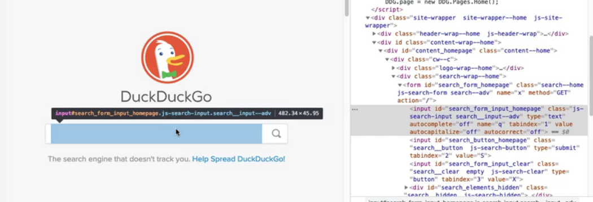

# Chapter 1 - What's in a Web Page?
A "Web page" is a document on the World Wide Web that can be displayed in a browser on a computer or device.
Popular websites like Google, Facebook, and Wikipedia all have multiple pages with different content.
Users can find web pages using URL addresses or search engines.

For example, let’s look at [this](https://en.wikipedia.org/wiki/Giant_panda) Wikipedia article on giant pandas.
There’s quite a bit of content on this page:
* A title for the article
* Paragraphs of text
* Pictures of pandas
* A search bar
* Links to other articles

There are three main components:
1. HTML
2. CSS
3. JavaScript

## HTML
HTML stands for "Hypertext Markup Language." HTML is like the skeleton of the page: it provides the structure for all the content.
HTML itself is not a programming language but rather a markup language: it simply declares what should appear.
HTML pages have standard sections, and each "thing" on the page is written as an element.

Elements are written like this:
````html
<tagName attribute="value">content</tagName>
````
Each element type has a unique tag name. The element declaration begins and ends with the tag name surrounded by angle brackets `<>`,
but the ending tag name is prefixed with a forward slash `/` to indicate the ending.
The starting tag may also include attributes to customize the element. Content may be placed between the tags, such as raw text or other "nested" elements.

Below are some example elements in HTML:
* A paragraph of text: `<p>Hello, world!</p>`
* A link to another page: `<a href="[https://www.google.com/](https://www.google.com/)">Go to Google</a>`
* A header for large text: `<h1>BIG NEWS!</h1>`
* A button: `<button type="button">Click Me!</button>`
* A text input area: `<textarea rows="4" cols="50">Enter info here.</textarea>`
* An image: ``

A basic HTML document could look like this:
```html
<!DOCTYPE html>
<html>
    <head>
   	 <title>Hello, World!</title>
    </head>
    <body>
       <div class="main-content">
   	    <h1>BIG NEWS!</h1>
    	    <p>HTML is awesome.</p>
       <div>
    </body>
</html>
```

## CSS
CSS stands for "Cascading Style Sheets." If HTML is the skeleton of the page, then CSS is the skin.
It controls style and formatting for the appearance of the page. CSS can control things like:
* Colors
* Size
* Font
* Position
* Layout

Although CSS can be added directly to any HTML element using the style attribute, it is a best practice to put CSS into separate .css files for reusability. It is also common to create CSS "classes" to apply the same styles to specific elements.

Here’s an example of a CSS document:
```css
body {
  background-color: lightblue;
}
.main-content {
  Font-family: Helvetica;
}
```

The `body` styling will apply to all body elements.
The `.main-content` styling will apply to all elements that use the `main-content` class, like the `div` element in the example HTML document above.

## JavaScript
HTML and CSS work together nicely, but they are static: They don’t make changes happen on the Web page.
Dynamic content must come from JavaScript, a programming language that acts like the muscles of the page.
Developers can use JavaScript to change elements and styling, handle user input, make service calls to backend systems, and more.
Practically all modern Web applications use JavaScript to deliver a dynamic user experience on the front-end because all major browsers support it.
There are countless JavaScript frameworks available, too, like Angular, React, and Bootstrap. JavaScript code can be written directly in HTML files or, as a better practice, in separate .js files.

Let’s add a JavaScript file that triggers an alert:
````javascript
alert("Here's some JavaScript!");

````
If we add the following to the `head` element of our HTML:
```html
<script src="example.js"></script>
```
Then, the alert will pop up whenever we load the page!

The Web browser is what brings these three pieces together. The browser is an application that loads and renders content from the World Wide Web.
When a user requests a page through a browser, the website will return the HTML, CSS, and JavaScript files for the browser to execute and display.
The browser brings the page to life! As a side comment, note that despite language standards, each browser handles things slightly differently, so watch out for peculiarities.

## Quiz

1. **What does HTML do in a web page?**

   HTML is a markup language that provides the structure of the page and its elements.

2. **HTML elements can have child elements nested within their content.**

   True

3. **Which of the following is something that CSS can do?**

   Set text size for the whole page to be small.
   Change the background color for a page.
   Position sections on a page relative to each other.
   **All the above.**

4. **How can CSS be added to an HTML element without using a separate .css file?**

   Set the element’s “style” attribute to the desired CSS properties.

5. **What analogies could be made for the three major components of a web page?**

   HTML is the skeleton, CSS is the skin, JavaScript is the muscle

6. **Why do nearly all modern Web applications use JavaScript for their front-end?**

   All major browsers support JavaScript for client-side execution.

# Chapter 2 - Programming with the DOM

HTML, CSS, and JavaScript are all coded documents that a Web browser renders together into a visual Web page.
When the browser renders the page and then does a subsequent execution, it needs an interface for handling the Web page. Enter the “DOM.”

The [Document Object Model](https://developer.mozilla.org/en-US/docs/Web/API/Document_Object_Model/Introduction), or “DOM” for short, is a programming interface for HTML and XML documents. Programming with the DOM is a big deal. It enables programmers to manipulate the page in various ways, such as:

* Searching for elements
* Changing element content
* Changing the HTML structure of the page
* Changing the CSS styling of the page

The DOM is called an “object model” because it presents the page as an object. That “document object” contains an object representing each element. Element objects are nested from a root element to mirror the HTML structure of the page.

It is not dependent upon any one programming language. It is most commonly used by JavaScript to manipulate Web pages in a browser, but it could be used by any other language, too. A good example of this would be using a scripting language like Python to scrape Web page contents. Another good example would be using test automation to poke and prod pages. The DOM also works for XML.

The first step with DOM programming is getting the elements themselves. Programming with the DOM makes one thing very clear: there is a difference between an element, a locator, and a selector.

* An element is an object representing a live, rendered HTML element on the page.
* A locator is an object that points to an element on a page.
* A selector is a query string that denotes how to locate the element in the DOM.

To sum them up in one line: A locator uses a selector to find an element on a web page.

Why is this distinction important? Two main reasons:
1. Direct paths from root-to-child would be very long and complicated. It’s not uncommon for child elements to be nested under dozens of layers. Imagine programming the object references from parent to child for the whole chain - that would be crazy long! It makes more sense to write smaller, more meaningful locator queries to find desired elements.
2. There is no guarantee that specific elements will actually appear on the page. Dynamic content means ever-changing content, and elements can be added, removed, or changed on a whim. Developers could also change the HTML structure, too, so it makes more sense to try to “discover” desired elements. Errors in the HTML, CSS, or JavaScript may also cause web elements to not appear on the page at all.

For these reasons, we must separate the concerns of the element objects themselves and the locators used to find them.
There are many types of locators, such as:
* IDs
* Class names
* CSS selectors
* XPaths

Locators are the standard way for finding elements in a Web page, and that every element can have a unique locator. Also, know that a locator can return multiple elements, not just one - it will return all elements found that match its query.

Locators are also crucial for black-box testing outside of the browser. For example, Selenium WebDriver relies upon locators to find elements and interact with them. The main difference for WebDriver calls is that they cannot change the state of elements - they can only access the state and send interactions. Furthermore, WebDriver calls don’t call JavaScript directly - they operate using the WebDriver protocol.

Another browser automation tool that uses locators is Playwright. Unlike Selenium WebDriver, Playwright manipulates the browser using debug protocols. However, just like Selenium and Cypress, Playwright uses locators to find elements.

## Resources
[Intro to the DOM](https://developer.mozilla.org/en-US/docs/Web/API/Document_Object_Model/Introduction)
[Examples of web and XML development using the DOM](https://developer.mozilla.org/en-US/docs/Web/API/Document_Object_Model/Examples)
[JavaScript HTML DOM](https://www.w3schools.com/js/js_htmldom.asp)
[Web Element Locators for Test Automation](https://automationpanda.com/2019/01/15/web-element-locators-for-test-automation/)

## Quiz
1. What does DOM stand for?

   Document Object Model

2. What types of documents can be modeled by the DOM interface?

   HTML & XML

3. What is a Web element locator?

   A query that finds and returns Web element objects from the DOM.

4. Why are Web elements and locators separate concerns?

    * Page structure could change at any time due to dynamic content.
    * Referencing every element directly from root-to-child becomes unwieldy for large pages.
    * Elements might disappear from a page due to code changes or even bugs.

5. Every element on a page can have a unique locator.

   True

6. What is one thing JavaScript calls to the DOM can do that Selenium WebDriver calls cannot?

   Set an attribute value for an element.

# Chapter 3 - Finding Live Web Elements
To open DevTools, simply right click anywhere on the page and select "inspect".


To visually pinpoint an element, click the "select" tool in the upper left corner of the DevTools pane.
It should look like a square with a cursor on it. When you click it the icon should turn blue.

The corresponding HTML source code in the elements tab will also be highlighted.


Writing good locators can be challenging. Remember, a locator will return all elements that match its query.

If a locator is too broad, then it could return false positives.
However, if a locator is too specific, then it could break whenever the DOM changes and it could also be difficult for others to read.

### ID
IDs are the best types of locators.
By HTML standards, the `id` attribute must have a unique value on a given page. Thus, a locator that uses an idwill uniquely identify a single target element.
Whenever I need to write a locator, the first thing I look for is an id attribute. If the element has one, then my locator is super simple. Just make sure that the id is, in fact, used uniquely on the page. A simple DevTools source search can validate that.

JavaScript example
````javascript
document.getElementById("search_form_input_homepage");
````
Java example
````java
driver.FindElement(By.id("search_form_input_homepage"));
````
### Name
Another good locator is the `name` attributes.

JavaScript example
````javascript
document.getElementByName("q");
````
Java example
````java
 driver.FindElement(By.name("q"));
````

### Class
A third basic locator is CSS class name.
Class names attach CSS styling to HTML elements. However, they can also double as defacto identifiers. An element may have one class name, many class names, or none at all.
Furthermore, class names do not need to be unique per element. One class name could be shared by multiple elements. This is useful when locating a set of elements, such as a list of search results.

JavaScript example
````javascript
document.getElementByClassName("result");
````
Java example
````java
 driver.FindElement(By.className("result"));
````

## Resources
[Chrome DevTools](https://developers.google.com/web/tools/chrome-devtools/)
[Web Element Locators for Test Automation](https://automationpanda.com/2019/01/15/web-element-locators-for-test-automation/)
[HTML name Attribute](https://www.w3schools.com/tags/att_name.asp)

## Quiz
HTML Document for Quiz Questions 6-9
````html
<html>
<body>
<div class="article opinion" id="main-article">
    <div class="section">
        <h2 class="topic-header">Main Argument</h2>
        <p>...</p>
    </div>
    <div class="section">
        <h2 class="topic-header">Rebuttal</h2>
        <p>...</p>
    </div>
    <div class="section">
        <button class="response-button" name="agree">Agree with Argument</button>
        <button class="response-button" name="disagree">Agree with Rebuttal</button>
    </div>
</div>
</body>
</html>

````

1. **How can you look at the source code, network activity, and other information for a live web page in Google Chrome?**

   Right-click anywhere on the page and select "Inspect".
   Navigate from the three-dot menu to "More Tools" > "Developer Tools".

2. **"Name" locators only work for `<input>` tag elements.**

   False

3. **"Class name" locators can return multiple elements.**

   True

4. **You need to write a locator for an element, and you discover that it has an ID. What should you do?**

   Verify that the ID truly is unique on the page, and then use it for the "by ID" locator.

5. **Which would be the best locator for locating this element uniquely (assuming unique attribute values)?**
   `<input id="first-name-input" name="first-name" class="important-field big-field">`

   `By.id("first-name-input")`

6. **Review the HTML document above. What locator would uniquely target the parent `<div>` element for the article?**

   `By.id("main-article")`
   `By.className("article")`
   `By.className("opinion")`

7. **Review the HTML document above. What locator would uniquely target the "Agree with Argument" button?**

   `By.name("agree")`

8. **Review the HTML document above. What locator would return all section header `<h2>` elements?**

   `By.className("topic-header")`

9. **Review the HTML document above. What locator would return the `<p>` paragraph element in the rebuttal section?**

   `By.className("section")`
   `By.name("p")`
   `By.name("section[2] p")`
   **None of the above.**


# Chapter 4 - CSS Selectors
CSS selectors are expressions that use pattern matching to find elements on a web page.
CSS documents use these selectors to apply style to elements.

Example:
~~~css
body {
  background-color: lightblue;
}

.main-content {
  font-family: Helvetica;
}
~~~
Both body and `.main-content` are simple CSS selectors. body matches any body HTML element, and `.main-content` matches any element that has the main-content class.

## Writing CSS Selectors
### tag
The most basic type of CSS Selector is simply a tag name. I could type “body” or “div”, or any other type of tag name in, and that would be a valid CSS Selector

### tag & class name
It slightly more useful is to attach a class name (example, `div.result`),
this will select all elements that have both this tag name of div and that contain a class called `result`.
It's **not** a class equals but rather a class contains. An element can multiple classes, one of which could be `result`

### class name
To search by class name alone, do a dot, and then the class name: `.result`

### ID
To write a CSS Selector that use the id you start with a hash character: `#search_form_input`

### Chaining
##### ancestor-descendant relationships
CSS selectors can chain together ancestor-descendant relationships or parent-child relationships of elements.

Example
`div.cw div.result`
That will guarantee that I will only select all the `div.result` elements if they are descendants of the `div.cw` element or elements.

##### parent-child relationships
If you use the arrow bracket (>), that forces a direct parent-child relationship (ex. `div.cw > div.result`).

To get items with the `zcm__item` class. I could select them with `li.zcm__item`, and there are four.

But let's say you want to get a link within the list item.
`li.zcm__item > a`

### Combining CSS selectors
Let's say you want to get all lists on the page, whether they are ordered lists or unordered list `("ol, ul")`

Anytime you use a comma for a CSS Selector, it acts like a logical OR, meaning I want to get all elements that match this selector or that match this selector.

An example of selecting list items that appear in either ordered lists or unordered lists
``

### Attributes
Locate by attribute existence
`[style]`

You can limit this further to say I want to get only the div elements with a style attribute like this:
`div[style]`

Locate by tag with attribute value
`a[data-zci-link = 'images']`

Locate by tag with attributes contains —
`div[class* = 'result']`

Give me all the div results that contain the `results` class but do not contain the `result—more` class
`div.result:not(.result--more)`

3rd element in the list of results
`div.result:nth-child(3)`

Locate the link itself
`div.footer_cards a[data-id='traffic']`

Locate the title
`div.footer_cards a[data-id='traffic'] .footer__card__title`

Locate the icon
`div.footer_cards a[data-id='traffic'] .footer__card__icon`

Locate by the text
`div.footer_cards a[data-id='traffic'] .footer__text`

### Basic CSS Selector Examples
Tag name: `div`
Class name: `.result`
Tag and class name: `div.result`
ID: `#search_form_input`
Descendants: `div.cw div.result`
Direct children: `li.zcm__item > a`
Multiple selectors: `ol, ul`
Attribute existence: `[style]`
Tag with attribute: `div[style]`
Tag with attribute equality: `a[data-zci-link='images']`
Tag with attribute contains: `div[class*='results']`
Logical not pseudoclass: `div.result:not(.result--more)`
Nth child pseudoclass: `div.result:nth-child(5)`

## Conclusion
CSS selectors are great web element locators. They can be much more specific than IDs and class names for the elements they select. They also use CSS syntax, so most web developers already know how to use them. However, they can also become complex - and sometimes unnecessarily complex.
Always make sure to test your CSS selectors when writing them.
Furthermore, CSS selectors are not all-powerful: they cannot uniquely identify any given element on the page. CSS selectors can never select elements by text content, and they cannot always select elements by index. We will need XPath for those locators.

## Quiz
HTML Document for Quiz Questions 5 and 6

````html
<html>
<body>
	<div class=”article opinion” id=”main-article”>
		<div class=”section”>
			<h2 class=”topic-header”>Main Argument</h2>
			<p>...</p>
		</div>
		<div class=”section”>
			<h2 class=”topic-header”>Rebuttal</h2>
			<p>...</p>
		</div>
		<div class=”section”>
			<button class=”response-button” name=”agree”>Agree with Argument</button>
			<button class=”response-button” name=”disagree”>Agree with Rebuttal</button>
		</div>
	</div>
</body>
</html>
````

1. **What are CSS selectors?**

   A type of Web element selector.
   Part of the CSS syntax.
   Pattern-matching expressions.

2. **CSS selectors can uniquely identify any given element on a Web page.**

   False

3. **Which of the following CSS selectors would select only “div” elements with the class name “parent”?**

   `div.parent`

4. **Which of the following CSS selectors would select only <div> elements that do not have the class name "parent"?**

   `div:not(.parent)`

5. **Review the HTML document above. Which of the following CSS selectors would uniquely identify the main article div?**

   `#main-article`

6. **Review the HTML document above. Which of the following CSS selectors would NOT uniquely identify the "Agree with Argument" button?**

   `div.article div.section button[1]`

# Chapter 5 - XPaths
XPaths are the strongest locator type. XPath syntax can uniquely identify any element on a page.
It can be used for both HTML and XML documents. However, XPath is also the most complicated locator type.

## Writing XPaths

#### Locate by Path from Root
`/html/body`

#### Locate by Tag Anywhere
`//input`

#### Locate by Direct Children
We can also mix the single slash and the double slash for direct children.

Let's say I wanted to find links that are in a list.
I can start with a double slash and find any unordered list on the page, and then I can use single slashes to denote direct children “ul/li”.
I could use another single slash to indicate direct children of links on that page.
`//ul/li/a`

#### Locate by Any Element
`//*`

#### Locate by Any Descendants
`//div//`

#### Locate by Attribute Value Equality
Can use any attribute with the `@` notation
`//li[@class="zcm__item"]`
or
`//input[@id="search_button"]`


### XPaths can also have logical AND and OR operations for those conditional phrases.
#### Locate by Attribute Condition AND
For example, let's say that I want to find all of these small icon images on the page that are small in size.
I can write an XPath like this, give me the image where the width is less than 20 and the height also is less than 20.
`//img[@width<20 and @height<20]`

#### Locate by Attribute Condition OR
Select that element based on either or of these identifiers — input where the `name` equals `q` or the `id` equals `search_form_input`.
`//input[@name="q" or @id="search_form_input"]`

### Functions
#### Contains
If I were to look at all divs that contain the word `result` in their `class`
` //div[contains(@class, "result")]`

If I were to look at all divs that contain the word `result` in their `class`
` //div[contains(@class, "result")]`

#### Starts-with
divs that start with a class or have a class called `result`
`//div[starts-with(@class, "result")]`

#### NOT
Locate by Logical not function
All links that do not contain the class "header"
`//a[not(contains(@class, "header"))]`

All links that do not start with the class "header"
`//a[not(starts-with(@class, "header"))]`

## Basic XPath Rules and Examples
#### Path from root
`/html/body`

#### Tag anywhere
`//input`

#### Direct Children
`//ul/li/a`
or
`//div/a`

#### Descendants
`//div//a`

#### Any Element
`//*`

#### Any Descendants
`//div//*`

#### Attribute Value Equality
`//li[@class="zcm__item"]`

#### Attribute Condition AND
`//img[@width<20][@height<20]`
or
`//img[@width<20 and @height<20]`

#### Attribute Condition OR
`//input[@name="q" or @id="search_form_input"]`

#### Contains Function
`//div[contains(@class, "result")]`
or
`//div[contains(@class, "result__snippet")]`

#### Starts with function
`//div[starts-with(@class, "result")]`
or
`//div[starts-with(@data-testid,"search")]`

#### Logical not function
`//a[not(contains(@class, "header"))]`

## Conclusion
XPaths are more complex than CSS selectors.
Sometimes, you need an XPath to pinpoint an element when the structure of a page leaves you no alternatives.

## Resources
[XPath Syntax](https://www.w3schools.com/xml/xpath_syntax.asp)
[XPath Tutorial](https://www.w3schools.com/xml/xpath_intro.asp)
[XPath Functions](https://developer.mozilla.org/en-US/docs/Web/XPath/Functions)
[XPath Axes](https://www.w3schools.com/xml/xpath_axes.asp)
[CSS Vs. XPath](http://elementalselenium.com/tips/32-xpath-vs-css)
[XML & XPath](https://www.w3schools.com/xml/xml_xpath.asp)

## Quiz
1. **Any element on a Web page can be uniquely located using XPath.**

   True

2. **Which of the following XPaths would locate all image  elements that are within hyperlink ``<a>`` elements?**

   `//div[contains(@class, "classname")]`
3. **What is the best way to get a <div> element by class name using an XPath (assuming you have made sure there are no false positives)?**

   `//div[contains(@class, "classname")]`

4. **Which of the following XPaths would locate all paragraphs that do not contain the class “main-content”?**

   `//p[not(contains(@class, "main-content"))]`

# Chapter 6 - Advanced XPaths

### Selecting elements by text

Search results on DuckDuckGo are, as of today anyway, contained in a `<article/>` tag
where there is an attribute called `data-testid` that contains the value `result`.

If we want to search each of these to find the result that contain the phrase "GeeksForGeeks" we would do something like:

`//article[contains(@data-testid, "result")][contains(., "GeeksForGeeks")]`
This little dot right here (the one before the comma and "GeeksForGeeks") will get the text displayed for the element.

There's also a text function like this: `contains(text(), "GeeksForGeeks")]`

Can easily use my not function along with this also if we want to search for results that don't contain the phrase "GeeksForGeeks"

`//article[contains(@data-testid, "result")][not(contains(., "GeeksForGeeks"))]`

### Selecting elements by index

XPath can put indexes on any element.
For example if we want the 3rd article from the results list we would do
`(//article[contains(@data-testid, "result")])[3]`

### Selecting elements relative to other elements using advanced relationships

This is helpful when the desired element doesn't have a decent anchor of its own, or when trying to select a range of elements in a list.
Let's say we want to get all links on the page that have an image inside of them.

`//a[.//img]`

### Axes for relationships to the current node

An axis represents a relationship to the context (current) node, and is used to locate nodes relative to that node on the tree.

The two most useful axes I found are the “preceding” and “following” axes.

#### Preceding

Let's say that we want to get the links underneath the search bar. If I find them in source of the page,
I can see that they all have this class “zcm__link”. I can write an XPath like this:
`//a[contains(@class, "zcm__link")]`

If I want to get only the links after the web link,
if I look at the web link, I can see that it has a unique “data-zci-link” named “web”. I could update my XPath like this:
`//a[contains(@class, "zcm__link")][preceding::a[@data-zci-link="web"]]`
Be careful. The “preceding” axes doesn't select links that come before the web link. It selects the links that have the web link come before it.

#### Following

If I want to get only the links before the videos link, I could use the following axes instead:
`//a[contains(@class, "zcm__link")][following::a[@data-zci-link="videos"]]`

## Quiz

````html
<html>
<body>
	<div class=”article opinion” id=”main-article”>
		<div class=”section”>
			<h2 class=”topic-header”>Main Argument</h2>
			<p>...</p>
		</div>
		<div class=”section”>
			<h2 class=”topic-header”>Rebuttal</h2>
			<p>...</p>
		</div>
		<div class=”section”>
			<button class=”response-button” name=”agree”>Agree with Argument</button>
			<button class=”response-button” name=”disagree”>Agree with Rebuttal</button>
		</div>
	</div>
</body>
</html>
````

1. **XPaths are always slower than CSS selectors.**

   False
2. **Which of the following XPaths would locate a <p> paragraph that contains the word “elephant”?**

   `//p[contains(., "elephant")]`
3. **What are abilities XPath has that CSS selectors do not have?**

   Locating elements by text contents
   Locating any element by index
   Locating elements using conditional positions and axes
4. **Which of the following selectors would uniquely identify the “Rebuttal” header element in the above HTML?**

   `//h2[.="Rebuttal"]`
   `//div[@class="section"]/h2[starts-with(text(), "R")]`
   `(//h2[contains(@class, "topic-header")])[2]`

## Resources

[XPath Syntax](https://www.w3schools.com/xml/xpath_syntax.asp)
[XPath Tutorial](https://www.w3schools.com/xml/xpath_intro.asp)
[XPath Functions](https://developer.mozilla.org/en-US/docs/Web/XPath/Functions)
[XPath Axes](https://www.w3schools.com/xml/xpath_axes.asp)
[CSS Vs. XPath](http://elementalselenium.com/tips/32-xpath-vs-css)
[XML & XPath](https://www.w3schools.com/xml/xml_xpath.asp)


# Chapter 7 - Picking the Right Locator
## Choosing the best locator

Here’s my order of preference
1. Test ID using a data- attribute
2. ID (if the ID is unique on the page)
3. Input name (if the name is unique on the page)
4. Class name
5. Text value
6. CSS selector
7. XPath without text or indexing
8. Link text or partial link text
9. XPath with text and/or indexing

For example, we shouldn’t jump to using XPaths wherever IDs and class names will suffice. Test automation should always be as intuitive as possible.

## Resources
https://automationpanda.com/2019/01/15/web-element-locators-for-test-automation/
https://playwright.dev/python/docs/locators
https://playwright.dev/python/docs/codegen
https://applitools.com/docs/features/visual-locators.html
https://selectorshub.com/


# Chapter 8 - Using Locators for Testing

## Coded versus Codeless Tools
When it comes to automating Web UI tests, there are two main categories of tools: codeless and coded.

"Codeless" tools enable testers to write test procedures using some sort of form, builder, or recorder without the use of a programming language.

"Coded" automation tools are test automation frameworks and programming packages.

The “big three” these days are:

Selenium WebDriver
Cypress
Playwright
There are other great tools as well, such as WebdriverIO, Robot Framework, Puppeteer, TestCafe, and Nightwatch

## Automating Tests with Selenium WebDriver (Java)
Java using JUnit and Selenium WebDriver
Example code:

[sourcecode](https://github.com/AndyLPK247/tau-locators-java-webdriver)

Very basic test
```java
package tests;

import org.junit.jupiter.api.AfterEach;
import org.junit.jupiter.api.BeforeEach;
import org.junit.jupiter.api.Test;
import org.openqa.selenium.By;
import org.openqa.selenium.WebDriver;
import org.openqa.selenium.WebElement;
import org.openqa.selenium.chrome.ChromeDriver;
import org.openqa.selenium.support.ui.ExpectedConditions;
import org.openqa.selenium.support.ui.WebDriverWait;

import static org.junit.jupiter.api.Assertions.assertTrue;

import java.util.List;

public class SimpleWebTest {

    private WebDriver driver;
    private WebDriverWait wait;

    @BeforeEach
    public void initWebDriver() {
        driver = new ChromeDriver();
        wait = new WebDriverWait(driver, 30);
    }

    @Test
    public void searchDuckDuckGo() {
        // Load the page
        driver.get("https://www.duckduckgo.com");

        // Enter search phrase
        wait.until(ExpectedConditions.visibilityOfElementLocated(By.id("search_form_input_homepage")));
        WebElement searchInput = driver.findElement(By.id("search_form_input_homepage"));
        searchInput.sendKeys("giant panda");

        // Click search button
        WebElement searchButton = driver.findElement(By.id("search_button_homepage"));
        searchButton.click();

        // Wait for results to appear
        wait.until(ExpectedConditions.titleContains("giant panda"));
        wait.until(ExpectedConditions.visibilityOfElementLocated(By.cssSelector("div.results_links_deep a.result__a")));

        // Make sure each result contains the word "panda"
        List<WebElement> resultLinks = driver.findElements(By.cssSelector("div.results_links_deep a.result__a"));
        for (WebElement link : resultLinks) {
            assertTrue(link.getText().matches("(?i).*panda.*"));
        }
    }

    @AfterEach
    public void quitWebDriver() {
        driver.quit();
    }
}
```


Arguably, the most popular design pattern for modeling Web UI interactions for test automation is called the page object model.
This just provides some basic attributes to be shared by all pages.

```java
package pageobjects;
import org.openqa.selenium.By;
import org.openqa.selenium.WebDriver;
import org.openqa.selenium.support.ui.ExpectedConditions;

public class DuckDuckGoSearchPage extends AbstractPage {

    public final static By searchInput = By.name("q");
    public final static By searchButton = By.id("search_button_homepage");

    public DuckDuckGoSearchPage(WebDriver driver) {
        super(driver);
    }

    public void loadPage() {
        getDriver().get("https://www.duckduckgo.com");
    }

    public void search(String phrase) {
        getWait().until(ExpectedConditions.visibilityOfElementLocated(searchInput));
        getDriver().findElement(searchInput).sendKeys(phrase);
        getDriver().findElement(searchButton).click();
    }
}
```

Also, it's fairly common practice to have a base page like our abstract page here.
```java
package pageobjects;

import org.openqa.selenium.WebDriver;
import org.openqa.selenium.support.ui.WebDriverWait;

public abstract class AbstractPage {

    private final static int TIMEOUT = 30;

    private WebDriver driver;
    private WebDriverWait wait;

    public AbstractPage(WebDriver driver) {
        this.driver = driver;
        this.wait = new WebDriverWait(driver, TIMEOUT);
    }

    public WebDriver getDriver() {
        return driver;
    }

    public WebDriverWait getWait() {
        return wait;
    }
}
```

Test re-written with page objects
```java
package tests;

import org.junit.jupiter.api.AfterEach;
import org.junit.jupiter.api.BeforeEach;
import org.junit.jupiter.api.Test;
import org.openqa.selenium.WebDriver;
import org.openqa.selenium.chrome.ChromeDriver;
import pageobjects.DuckDuckGoResultsPage;
import pageobjects.DuckDuckGoSearchPage;

import java.util.List;

import static org.junit.jupiter.api.Assertions.assertTrue;

public class PageObjectWebTest {

    private WebDriver driver;

    @BeforeEach
    public void initWebDriver() {
        driver = new ChromeDriver();
    }

    @Test
    public void searchDuckDuckGo() {
        DuckDuckGoSearchPage searchPage = new DuckDuckGoSearchPage(driver);
        searchPage.loadPage();
        searchPage.search("giant panda");

        DuckDuckGoResultsPage resultsPage = new DuckDuckGoResultsPage(driver);
        List<String> linkTexts = resultsPage.getResultsLinkText("panda");

        for (String text : linkTexts) {
            assertTrue(text.matches("(?i).*panda.*"));
        }
    }

    @AfterEach
    public void quitWebDriver() {
        driver.quit();
    }
}
```

## Better Interactions with the Screenplay Pattern
Page objects are okay for small-scale test automation projects, but for larger projects,
I strongly recommend the Screenplay Pattern. Screenplay is like a SOLID refactoring of page objects.
The Screenplay Pattern separates concerns by splitting locators and interactions into separate classes for even greater reusability and composability.

There are a few major Screenplay implementations available:
* In Java, use Serenity BDD
* In JavaScript, use Serenity/JS
* In C#, use Boa Constrictor

## Resources
* [automationpanda](https://automationpanda.com/2019/01/15/web-element-locators-for-test-automation/)
* [selenium hq](https://www.seleniumhq.org/)
* [page object](https://martinfowler.com/bliki/PageObject.html)
* [Beyond-Page-Objects-Test-Automation-Serenity-Screenplay](https://www.infoq.com/articles/Beyond-Page-Objects-Test-Automation-Serenity-Screenplay)
* [SOLID](https://en.wikipedia.org/wiki/SOLID)
* Screenplay Pattern implementations:
    * In Java: [Serenity BDD](https://serenity-bdd.info/)
    * In JavaScript: [Serenity/JS](https://serenity-js.org/)
    * In C#: [Boa Constrictor](https://q2ebanking.github.io/boa-constrictor/)