# 1 - Introduction to Web Accessibility

## What is Accessibility?

Accessibility is often abbreviated to **A11y**, or Ally.

**Accessibility** is the practice of making a product that is usable by everyone, with or without disabilities.

A product that's designed, developed, and tested with accessibility in mind will have more users than a product that is not accessible.

Business organisations have a responsibility to all their users that the features they provide can be accessed by everyone.

## Web Content Accessibility Guidelines 2.0
_Published on December 2008_

The W3C or World Wide Web Consortium has come up with the Web Content Accessibility Guidelines, which provides a list of guidelines and recommendations on how to make your website more accessible.
It contains a set of rules which were grouped under four categories - perceivable, operable, understandable, and robust (POUR for short)

* **P**erceivable - The information should be presented to your users in ways they can perceive.
    * Some of your users might have some difficulties with one of their senses, which means that they have to be reliant on using an assistive technology, such as screen readers to access your website.
* **O**perable - The principle that your users must be able to operate your website by using different means.
    * For example, some of your users might have motor difficulties and will find it hard to use a mouse. This means that your website should also be accessible if users will only use a keyboard.
* **U**nderstandable - That your users can understand the information presented to them when using your website.
    * This means that clear instruction should be presented and there should be error messages to let them know and understand when they make mistakes.
* **R**obust - Making sure that your website must be used by your users when they use third-party assistive technologies, even if the technology advances.
    * This is done by adhering to standards, such as correct HTML structure, for example.

## Web Content Accessibility Guidelines 2.1
_Published in 2018, Version 2.1 was published to cover mobile accessibility, people with low vision and cognitive and learning abilities_

Version 2.1 was introduced due to the rise of mobile devices and tablets, and to also cover a wider array of disabilities, such as people with low vision or cognitive and learning disabilities.

* You need to make sure that your website is accessible in both portrait or landscape mode.
* If you have animations on your website, you need to make sure that you have the option to turn it off.
* The ability to zoom text easily, so people with low vision can read it without issues.

## WCAG 2.1 Conformance Levels
Within the Web Content Accessibility Guidelines, each of the guidelines under 2.0 and 2.1 have a success criteria.

This is defined through the three conformance levels that businesses or companies should conform to.
1. **Level A** - Most basic conformance, you must achieve 25 criteria from the accessibility guidelines.
2. **Level AA** - Apart from achieving 25 criteria from level A, you also need to achieve 13 new criteria on this level.
3. **Level AAA** - You need to achieve the previous two levels, as well as another 23 criteria on top.

### Example - Captions or Subtitles.
1. In order for you to reach **Level A** rating, you should be able to provide captions on a prerecorded video as a minimum.
2. To reach **Level AA**, you should be able to provide captions on a real or live video.

### Example - Keyboard Access
1. **Level A** - All users should be able to navigate through your website with just a keyboard.
2. **Level AA** - The ability to zoom into the text content.

## Summary
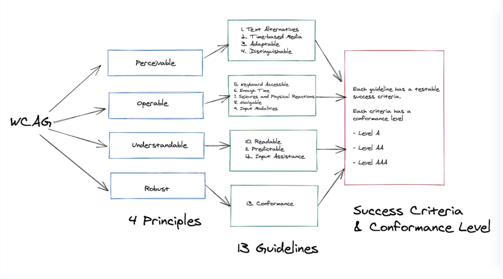

## Meeting Guidelines
In order to meet this guideline there is one success criteria, which also shows the conformance level rating that you will achieve if your application meets this criteria.

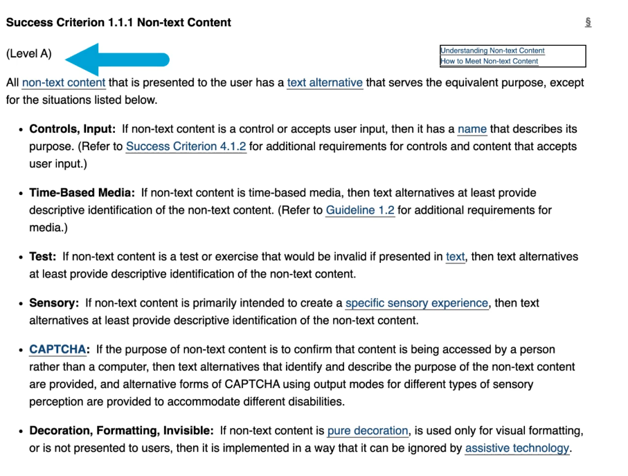

## Resources
[WCAG 2.1](https://www.w3.org/TR/WCAG21/)
[WCAG 2.1 Conformance Levels](https://www.w3.org/WAI/WCAG21/Understanding/conformance)

# 2 - Why Accessibility Testing is Important
**First of all, doing accessibility testing is just the right thing to do.**

We need to be empathetic to our users with disabilities and put ourselves in their shoes.
As more and more information can now be accessed online, we need to start thinking about how all of our users will use our products.
It’s important to include everyone and this not only benefits individuals, but the society as a whole.

**Better accessibility means better user experience.**

For example, If you are testing a website that has great design, animations and all these exciting features but poor accessibility, this leads to bad user experience.

**Better accessibility also means that you widen your reach to other audiences.**

## How Can Automated Accessibility Tests Help Us?
1. **Catch basic accessibility issues earlier**
   By automating some of the accessibility tests, we can **catch basic accessibility issues earlier** on and allows us to collaborate more with our design and development team.

This can also serve as **living documentation** for your team.

For example, if your team is actively trying to reduce the number of accessibility issues your website has, having a dashboard which displays a report of the test run will serve as documentation and will make everyone aware of what issues are still outstanding.

2. **Prevent any regression issues related to accessibility**
   It will prevent any regression issues related to accessibility from being deployed to production.
   By having the automated tests in place, you have this safety net that issues your team have fixed in the past will not be deployed to production again since it’s now covered by an automated test.

It also frees up your time to do more complex testing activities, such as testing with screen readers or using the keyboard only to navigate a site.

3. **Provides a fast feedback loop to your design and development team**
   Having automated accessibility tests provides a fast feedback loop to your design and development team, especially if the tests are running as part of your continuous integration pipeline. Your development team will know in an instant if the feature that they are working on has broken any accessibility rules. Likewise, if there are any color contrast errors that got detected, the design team can be informed if they need to amend any of the color tokens they’ve chosen.

## The Importance of doing Accessibility Testing with Actual Users
Nothing beats actual accessibility testing with real users.

There’s still a lot of benefit to gain if you invite real users with disabilities to test your website as they probably use different third party assistive technologies and this way, you have that first-hand understanding on how they use your product on a day-to-day basis.

They can provide valuable inputs on how to make your feature accessible.

W3C has provides an evaluation report generator that you can use for your evaluation.

## Resources
[W3C Accessibility Evaluation Report](https://www.w3.org/WAI/test-evaluate/conformance/)

# 3 - Web Accessibility Testing Checks
World Wide Web Consortium or W3C has created the web accessibility initiative which contains resources to help you make the product that you're testing more accessible. Each of these checks has guidelines on how to do it, what to look out for and general tips.

## Checks That Can Be Automated
* **Page Title**
    * An automated tool can detect if your page doesn't have a page title.
    * Page title is important because this is the first thing that the screen reader says when a user visits your page.
    * Without a page title, your users will be confused as to what page they are on, especially if they have multiple tabs open.
* **Image text alternatives**
    * An automated accessibility testing tool can check if images have the alt text attribute.
    * If you have blind users, they rely heavily on these alt texts to help them understand the images that they can't see.
* **Headings**
    * An automated tool can also check if it has the correct heading structure and if there are any missing heading elements.
    * For example, it's recommended for your page to have at least one heading.
    * Having a good heading structure helps out on how your page will be accessed using keyboard only.
* **Colour Contrast**
    * An accessibility testing tool can help you detect any elements on your page that doesn't have sufficient color contrast and can report basic preliminary issues.
    * This is helpful because some users will find it hard to read the text if it doesn't have a sufficient contrast between the text and the background.
* **HTML Structure**
    * You can also use an automated tool to detect errors in your HTML structure.
    * For example, it can report if there are any required elements or attributes missing in any of your HTML elements.
* **ARIA Labels**
    * The aria-label attribute is used as a label to elements where the label is not visible on the screen.
    * This is particularly helpful for using screen readers.

## Checks That Need Manual Testing
**The automated tools are there to help you detect if attributes are present.**

* **Page Title**
    * For example, it will report if a title element is there, but you still need to check if the page title makes sense
    *
* **Image text alternatives**
    * You can have this attribute added in, but you still need to verify if the value of this attribute makes sense, especially when it's being used by a screen reader.
* **Headings**
    * We still need to verify the heading structure makes sense by using your keyboard to access the page.
* **Colour Contrast**
    * With color contrast, you can't just rely on what the tool is telling you. You still need to assess this yourself manually. The tool is just here to guide us.
* **HTML Structure**
    * With the HTML structure, you still need to use your keyboard to test that the structure makes sense when accessing it with your keyboard only.
* **ARIA Labels**
    * You still have to use a screen reader to determine if the label name provided makes sense and gives more meaning to the element that you are focusing on.

**So as you can see, human intervention is still very much needed if you're doing accessibility testing.**
**Automation can help us identify issues earlier on, but it cannot be relied on 100%.**

## Other Considerations
* **Feedback on form submissions**
    * If you have forms on your website, you need to make sure that there is feedback provided whenever your users submit the form or make mistakes.
    * The messages should be clear and easy to understand.
* **Clarity of Subtitles**
    * If you have any videos embedded, you need to test that the subtitles are clear and represent the video well.
* **Can Animations be switched off?**
    * Make sure that there is an option to turn this off as users might find these attracting. Give them the option to control it.
* **Is the content accessible via keyboard only?**
    * Uou still need to use your keyboard to verify some of the automated accessibility checks, so this is really important when doing accessibility testing.
* **Are elements focusable?**
    * When you focus on an element, is it clear? Do the users know that they are on that element?
* **Does it have clear fonts?**
    * Does your website have clear fonts? Make sure as well that the content is easy to read and understand.
* **Can audio levels be modified?**
    * If you have audio or videos, make sure that the audio levels can be modified and your users can control these.
* **Is the layout responsive?**
    * Is the layout responsive? If they are on mobile, are you showing the mobile version?
    * Are buttons or links big enough? So when they're using devices with smaller view ports, they can access this easily.

## Tips on doing accessibility testing
1. **First, decide within your team what Web Content Accessibility Guideline level you want to achieve.**
2. **Get involved with your UX team and collaborate with them.**
3. **Start testing on a basic page and just play around with it.**
4. **Use your keyboard more and try not to use your mouse.**
5. **Play around with screen readers.**
6. **Turn off your speakers and test if there is a way to turn subtitles or captions on.**
7. **Use an accessibility testing checklist so you have an idea on what to track and what to suggest to your teams to fix.**
8. **Do exploratory testing and timebox your sessions. Set the goal that you want to achieve.**
9. **Decide on what other tools can help you.**

## Resources
[Web Accessibility Initiative](https://www.w3.org/WAI/)
[Web Accessibility Easy Checks](https://www.w3.org/WAI/test-evaluate/preliminary/)
[Automated Accessibility Rules from Deque](https://dequeuniversity.com/rules/axe/4.0)

# 4 - Web Accessibility Tools
## Tools Requiring Human Assistance
### Keyboard
#### Common Shortcuts
* **CTRL (CMD) + L** - Will put the focus on your browser's address bar
* **TAB** - Used to go to specific elements, such as links or buttons
* **SHIFT + TAB** - Will simply reverse the direction, so you can go back to previous links or buttons
* **Arrow Keys** - To scroll to a specific viewport
* **Spacebar** - To tick or untick checkboxes or radio buttons
* **Enter** - Used to activate buttons or links that are currently focused on

#### Screen Readers
**A screen reader allows people with disabilities - specifically those who have visual impairments - to use a computer.**
It translates everything a user normally sees on their screen to speech.

Some popular ones
* VoiceOver (Mac & iPhone)
* NVDA (Windows)
* JAWS (Windows)
* TalkBack (Android)

#### Zoom
If your users have low vision, they would also use a zoom feature to magnify the content, so they can read it better.
When they zoom the content of your website, you need to make sure that the elements are stacking up nicely, and not on top of one another, and that everything is flowing in nicely.
In some cases, when you zoom in too much, if a website has been poorly designed, it can become unreadable, and therefore not very accessible.


## Semi Automated Accessibility Testing Tools
### Axe
The axe browser extension is one tool that is based on the axe-core library, which is currently backed up by Deque Systems.
It enables you to detect any accessibility issues quickly just by running the extension, whether you are using Chrome, Firefox, or Edge.
Once installed, just right-click, click Inspect, and then click on the "axe" tab.
Then, click on the Analyze button, and afterwards you are shown this accessibility report.

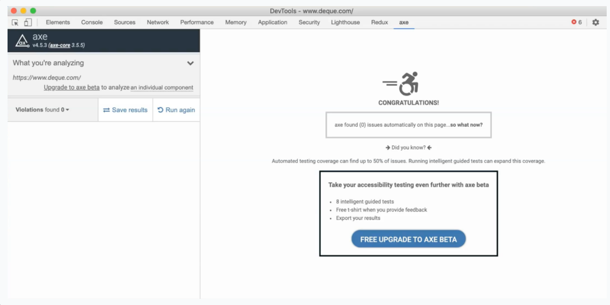

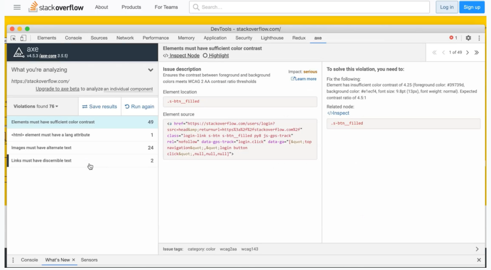

As you can see, the violations are grouped, and then it also shows the number of occurrences for each of the violations that have occurred.
It gives you this nice report showing which element is affected and what the accessibility issue is, as well as how you can fix this issue.
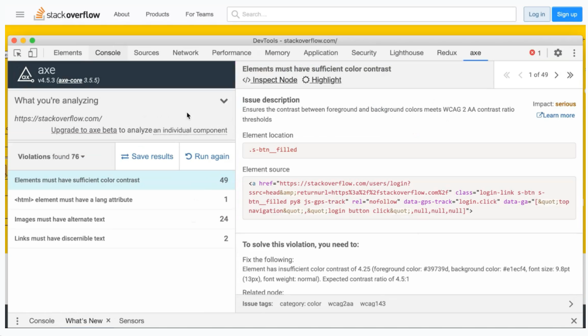

### WAVE
Similar with Axe, you can also use WAVE, which is another free tool that you can use that lets you run accessibility checks with their Chrome and browser extensions.
When installed, right-click and then select WAVE.
A report will be generated, which shows a breakdown of accessibility errors, if there are any, its accessibility features, structural elements, and also includes how many ARIA labels the page has.
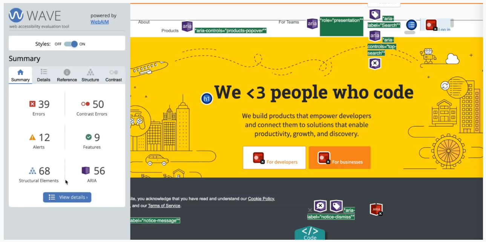

Then on the actual page itself, it will be annotated with different icons highlighting where the issues and accessibility features are.
Just click the View Details button, and then if you click on any of the icons, it will highlight which element has the error.
By clicking a reference, this will show the details as to what the error is and why it's important to address the issue.
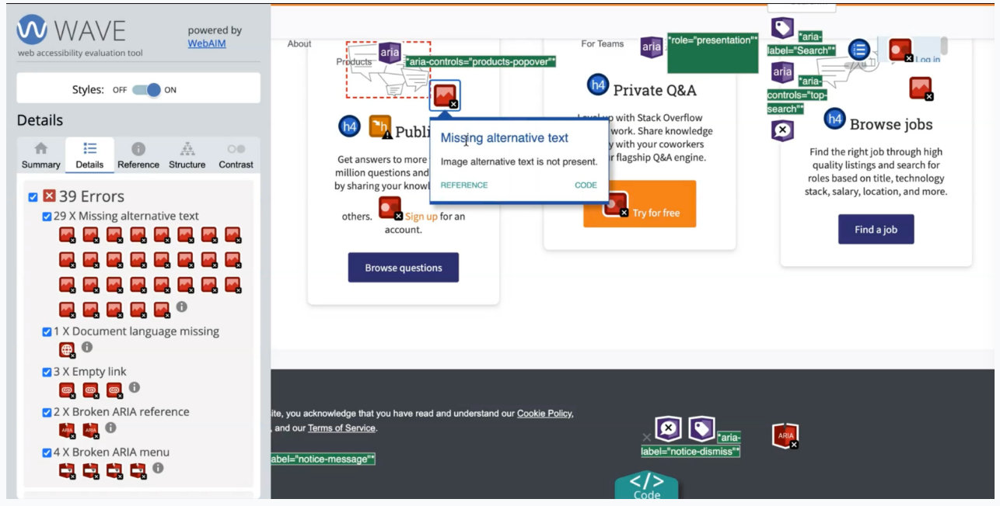

There's also an option to select the code - you just click on the code and this will highlight the code itself, so you know where to add the alternative text for this example.


You can also inspect color contrast issues within WAVE.
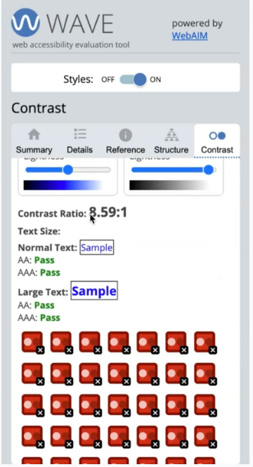
If you click on one of the icons here, this will show you why it failed.
For a color contrast rule to pass, normal text should have a ratio of at least 4.5:1 foreground to background ratio, and at least 3:1 for large text.

### Google Lighthouse
Google Lighthouse, which is already built in if your Chrome version is up-to-date, also includes accessibility checks.

Their accessibility feature is actually using axe-core as its engine, but what's great is you can also measure other metrics such as performance, best practices, and SEO.

To run Lighthouse, just open up your developer tools and then find the Lighthouse tab.
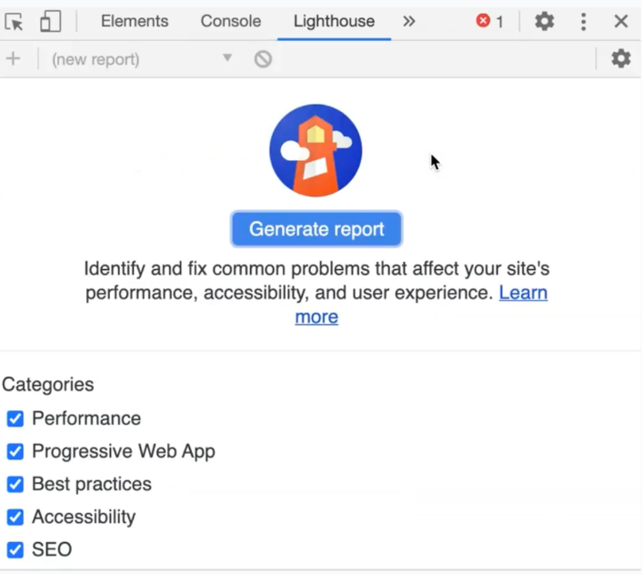

Once you're here, you can choose to run it on the desktop or mobile version.
Once that's finished, it gives you these different scores and clicking on accessibility will redirect you to the accessibility section.
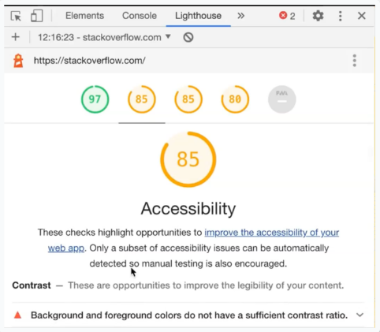

When you expand on one of the violations, it will show you what the failing elements are.
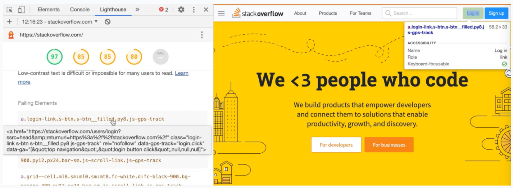

### Resources
[Axe Extension](https://chrome.google.com/webstore/detail/axe-web-accessibility-tes/lhdoppojpmngadmnindnejefpokejbdd)
[WAVE](https://wave.webaim.org/extension/)

## Automated Accessibility Testing Tools
Some automated accessibility tools that you can integrate in your code base and in your CI pipeline.

### Axe-Core
If you want to programmatically catch accessibility issues, then you can use different libraries that are based on Axe-Core.
**Axe-Core's philosophy is to empower developers, and also software testers, to think about accessibility by integrating automated tests as early on as possible.**

There are so many projects out there that are built on top using Axe-Core; such as Axe CLI, which allows you to run accessibility tests straight on your command line, which we'll look into closely, in the next chapter.

Axe-Core can also integrate into your testing tools of choice, such as **Jest** for unit testing, **Cypress**, **Selenium**, with Java, C#, and Python, **WebdriverIO**, and even **TestCafe**.


### Resources
[Axe-Core](https://github.com/dequelabs/axe-core)
[Project using Axe-Core](https://github.com/dequelabs/axe-core/blob/develop/doc/projects.md)

# 5 - Exploring Axe CLI
### Why use Axe-CLI?
1. First, you can **easily integrate** it into your continuous integration pipeline.
2. It's fast
3. it's also easy to set up and configure.

### Prerequisite Installations
* Node
* NPM

### Install Axe-CLI
To install Axe-CLI, all we need is this one line command
```
npm install -g axe-cli
```

### Running Axe-CLI Demo
type axe again, followed by any URL that you want.
````shell
axe testingwithmarie.com
````
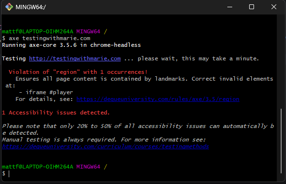

By default, this will run your tests on headless Chrome.

It's worth noting that just because Axe didn't detect any issues doesn't mean that my site is fully accessible.

#### Running on specific browser
In this case Chrome
````shell
axe testingwithmarie.com --browser chrome
````

#### Running against a specific page
````shell
axe testingwithmarie.com, testingwithmarie.com/about --browser chrome
````

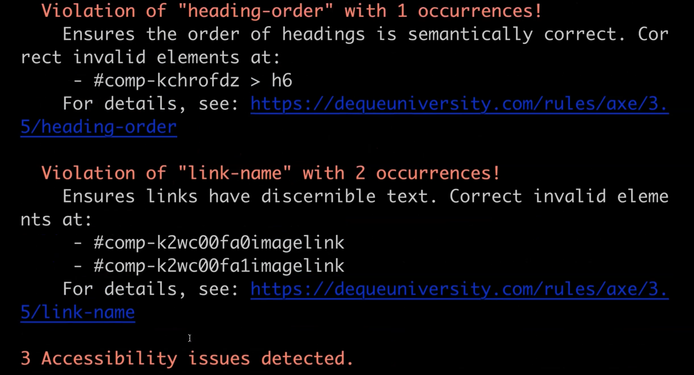

you can also disable some of the accessibility rules also
````shell
axe testingwithmarie.com, testingwithmarie.com/about --browser chrome --disable link-name
````

#### Saving Output Report
````shell
axe testingwithmarie.com, testingwithmarie.com/about --browser chrome --save test-results.json
````

## Resources
[axe-cli](https://github.com/dequelabs/axe-cli


# 6 - Setting up Cypress

## Prerequisites
* NPM
* Node
* VS Code

## Installation & Setup
To create a new test project you can run the following commands

To create the folder:
````shell
mkdir cypress-axe-project
````

Initialise a new project
````shell
npm init -y
````

Install Cypress
````shell
npm i -D cypress@4.8.0 cypress-axe@0.8.1
````
_i_ is a shortcut for install, _-D_ because we want to save this in our dev-dependencies on this specific project.


Cypress comes built in with a predefined folder structure to get you started right away.
````shell
npx cypress open
````
NPX is basically a shortcut notation to execute a specific command.
First, it will open the Cypress official test runner, and then as you can see, it will load the example.
Secondly, it will create the default folder structure for us since it's not created yet.

## Resources
[Git repo](https://github.com/mdcruz/tau-automated-accessibility-course)
[Source code for support/index.js](https://github.com/mdcruz/tau-automated-accessibility-course/blob/master/cypress/support/index.js)

[Cypress Course](https://testautomationu.applitools.com/cypress-tutorial/)
[Cypress-axe Github](https://github.com/avanslaars/cypress-axe)
[Cypress Docs](https://docs.cypress.io/guides/overview/why-cypress.html#In-a-nutshell)

# 7 - Cypress Axe
## 7.1 Writing Accessibility Tests
1. How you can test a full page with Cypress-Axe.
2. Analyze the logs and error messages that we get so we can understand the different accessibility failures
3. Test specific elements on the page
4. How you can disable some Axe rules - I normally recommend not disabling any accessibility rules, so you can validate more rules as much as possible, but in some cases it might be needed.

### First Test TodoMVC
[TodoMVC](https://todomvc.com/)

#### Describe
_describe_ blocks in Mocha allow you to group your tests in a much more structured way.

#### It
An _it_ block in Mocha is a way to describe what our test is.
It accepts two parameters - the first one is just the title for our test, and the next parameter is the function containing the different Cypress commands that we need to execute.

````javascript
/// <reference types="cypress"/>

describe('Todo application', () => {
  it('should log any accessibility failures', () => {
    cy.visit('https://todomvc.com/examples/react/dist/'); // method in Cypress, to visit our application.
    cy.injectAxe(); // Cypress-Axe library, inject the axe-core runtime in our test application, it has to be added after you visit your test page.
    cy.checkA11y(); //This command right here will actually scan your page for any accessibility failures. Alternatively cy.checkAccessibility.
  });
});
````

### Resources
[Git repo for source code](https://github.com/mdcruz/tau-automated-accessibility-course)
[Branch for this chapter](https://github.com/mdcruz/tau-automated-accessibility-course/tree/first-accessibility-test)
[Todo MVC app](https://todomvc.com/examples/react/dist/)

## 7.2 Understanding Accessibility Failures
With Cypress, you have access to developer tools, and you can do that by right clicking on any part of the Test Runner and click "Inspect".

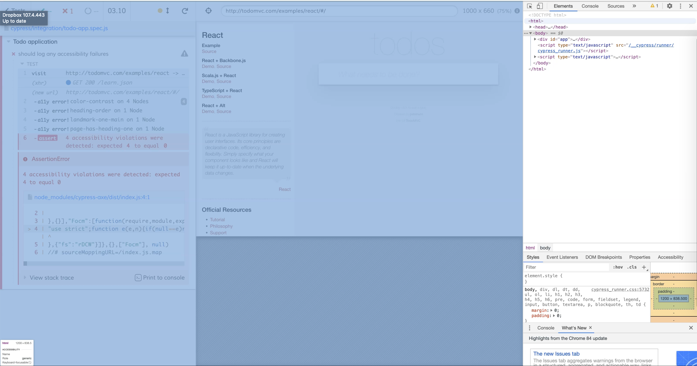

After clicking the violation, additional logs in the console are printed out.
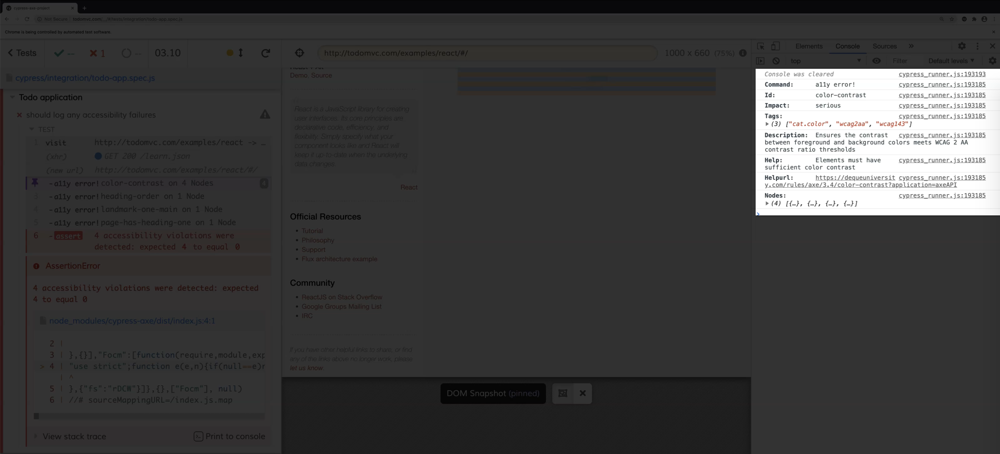

You get a description as to what the accessibility rule is.
In this case, it's about ensuring that there is sufficient contrast between the foreground and background colors.
Axe also provides a help URL, which you can directly click on, and this should redirect you to their help page, which contains relevant information, such as how to fix the issue.
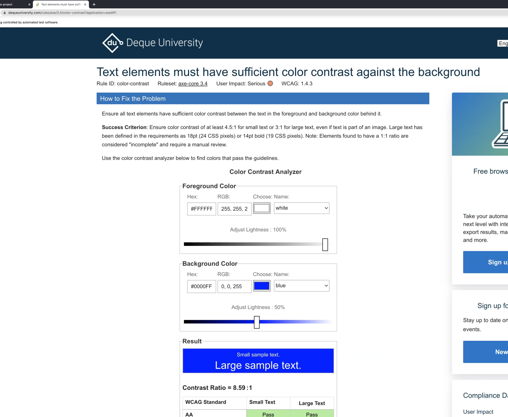
You can see here what the success criterion is, and they even have a color contrast analyzer that you can use to help you decide if your colors are accessible.

You can also find other information, such as why this rule matters for people with low vision.

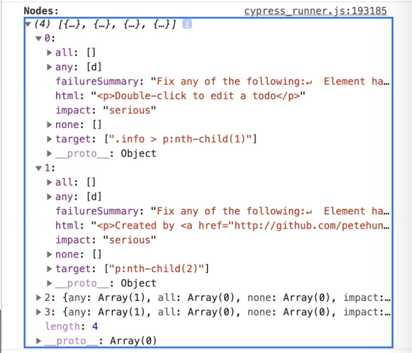
This array contains the specific elements which violated the color contrast rule.
If you expand it one by one, you can find out which specific selector needs to be changed.
If we look at the next accessibility violation rule, it's about the heading order.
Order of the headings matter and must be organized, because assistive technologies use this to provide the navigation.
The next accessibility rule is about having one main landmark in your page.
Having a main landmark ensures that people with disabilities can access the primary content of your page easily.
The last accessibility rule violation is about making sure that your page has heading one.
Generally, it's best practice for your page to have a heading one, since this will allow users to jump directly to the main content of your page.
From here, you can also see the impact of each of the accessibility rules.

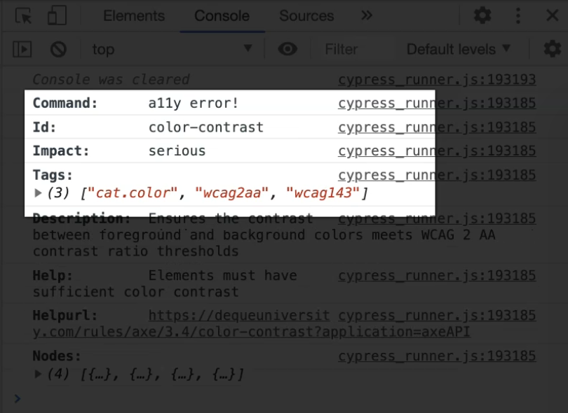

You can see that the color contrast has a more serious impact as opposed to the other three violations.
This should help you advise the team which rule you need to address first and prioritize.

## 7.3 Testing Specific Elements with Cypress Axe
By default, Cypress-Axe will scan the DOM structure of your full page.

Most of the time, this is what your use case is going to be, since you want Axe to detect accessibility errors on your entire page.
However, there are some cases where some elements on your page are still being actively worked on, and need input from your design and development team on how to make it accessible.
In this scenario, in order to not block your testing pipeline, you can choose to ignore these elements and Axe will not scan these elements against any of the accessibility rules.

There are two ways to test specific elements in Cypress-Axe:
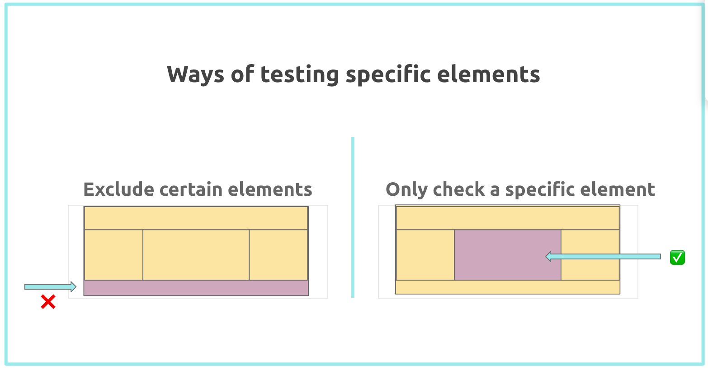
1. **Exclude certain elements on the page**
   `cy.checkA11y`, can take the property name exclude as a parameter.
   Exclude, here, is of type array, and will accept a list of strings that you want Cypress-Axe to exclude.
````javascript
describe('Todo application', () => {
 it('should exclude specific elements on the page', () => {
   cy.visit('https://todomvc.com/examples/react/dist/');
   cy.injectAxe();
   cy.checkA11y({ exclude: ['.learn'] });
 });
});
````

2. **Check a specific element on the page**
````javascript
describe('Todo application', () => {
 it('should exclude specific elements on the page', () => {
   cy.visit('https://todomvc.com/examples/react/dist/');
   cy.injectAxe();
    cy.checkA11y('.learn');
 });
});
````

Bundled all together with a beforeEach for repetitive steps the tests now look like this
````javascript
describe('Todo application', () => {
 beforeEach(() => {
   cy.visit('https://todomvc.com/examples/react/dist/');
   cy.injectAxe();
 });
 
 it('should log any accessibility failures', () => {
   cy.checkA11y();
 });
 
 it('should exclude specific elements on the page', () => {
   cy.checkA11y({ exclude: ['.learn'] });
 });
 
 it('should only test specific element on the page', () => {
   cy.checkA11y('.learn');
 });
});
````

## 7.4 Disabling Axe Rules with Cypress Axe
There might be some pieces where some elements on your page are still being actively worked on and need input from your design and development team.
In this case, it might be an idea to disable some of the accessibility rules and add a todo comment or link it to a JIRA ticket.

**Example 1: Test that only report violations which have a serious or critical impact**

````javascript
it('should only include rules with serious and critical impacts', () => {

   cy.checkA11y(null, { includedImpacts: ['critical', 'serious'] });

 });
````
**Example 2: How to exclude the specific rules regardless of its impact**
````javascript
 it('should exclude specific accessibility rules', () => {
    cy.checkA11y(null, {
        rules: {
            'color-contrast': { enabled: false },
        },
    });
});
````