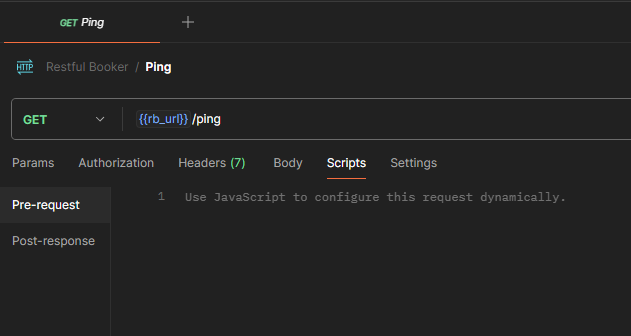
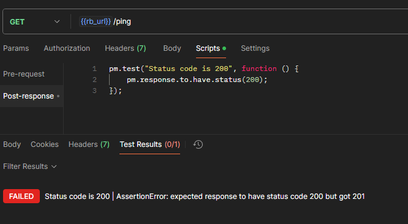
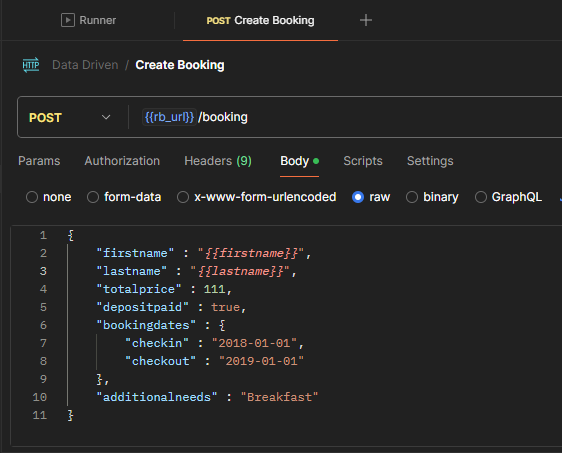
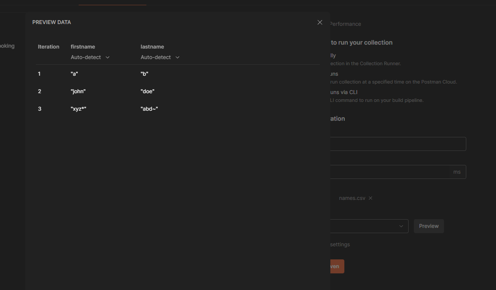
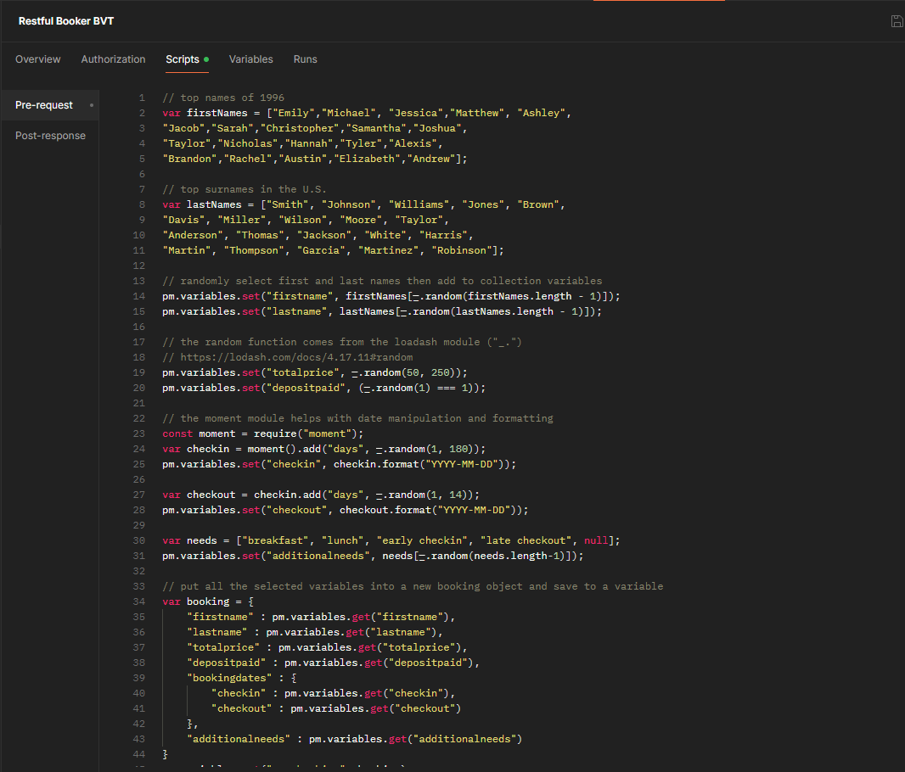
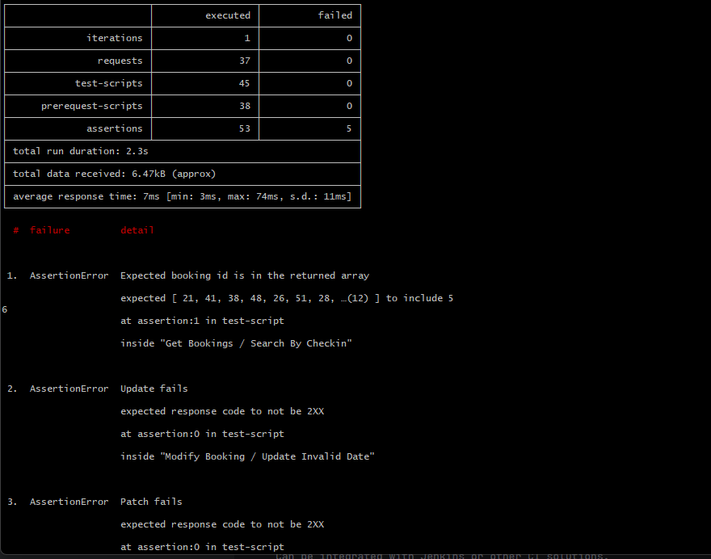

# Chapter 4 - Test Automation with Postman

## 4.1 Your first test

Tests tab is now done in scripts tab with `pre-request` and `post-respone`



BDD style assertion using chai framework

Example

```
pm.test("Status code is 200", function () {
    pm.response.to.have.status(200);
});
```



## 4.2 Data Driven Tests

Can parameterise body attribute with variable name i.e.



CSV file used for input data that is setup with collection runner.



[Collection](https://postman-api-fundamentals-student-expert-team-1813.postman.co/workspace/Postman-API-Fundamentals-Studen~5a01a9a7-1d98-4345-b7e0-ca86f17d9ec3/collection/8404157-22db1740-609d-47cd-a9c0-904dbc8bc211?action=share&creator=8404157&active-environment=8404157-68a9363e-289d-4a30-8c1e-25ed66f1c697)

## 4.3 Advanced Tests

Postman script API reference [here](https://learning.postman.com/docs/tests-and-scripts/write-scripts/postman-sandbox-api-reference/)

Uses a subset of JavaScript

[Collection](https://postman-api-fundamentals-student-expert-team-1813.postman.co/workspace/Postman-API-Fundamentals-Studen~5a01a9a7-1d98-4345-b7e0-ca86f17d9ec3/collection/8404157-907af8c4-4a85-425c-84dd-3c3eb359006c?action=share&creator=8404157&active-environment=8404157-68a9363e-289d-4a30-8c1e-25ed66f1c697)



## 4.4 Newman

CLI companion for postman.

Can be integrated with Jenkins or other CI solutions.

`npm install -g newman`

You then need to export the collection and the target environment from postman

`newman run Restful\ Booker\ BVT.postman_collection.json -e Local.postman_environment.json`

Sample output




Jenkins requires NodeJS plugin to be installed to use newman

```bash
newman run RestfulBookerBVT.postman_collection.json -e Local.postman_environment.json --reporters cli,junit --reporter-junit-export result.xml
```
