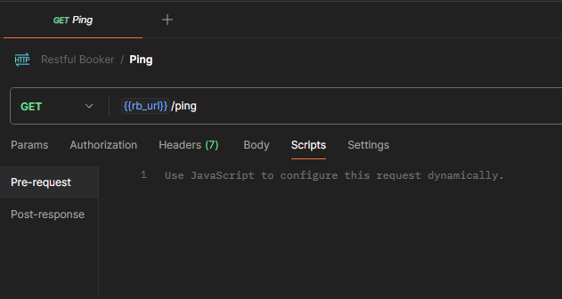
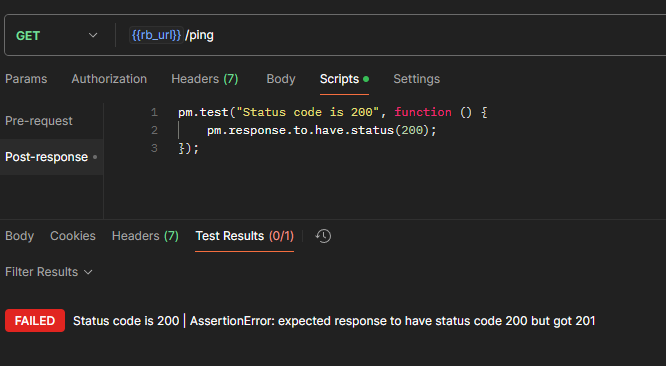
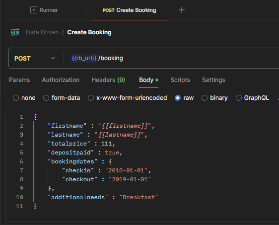
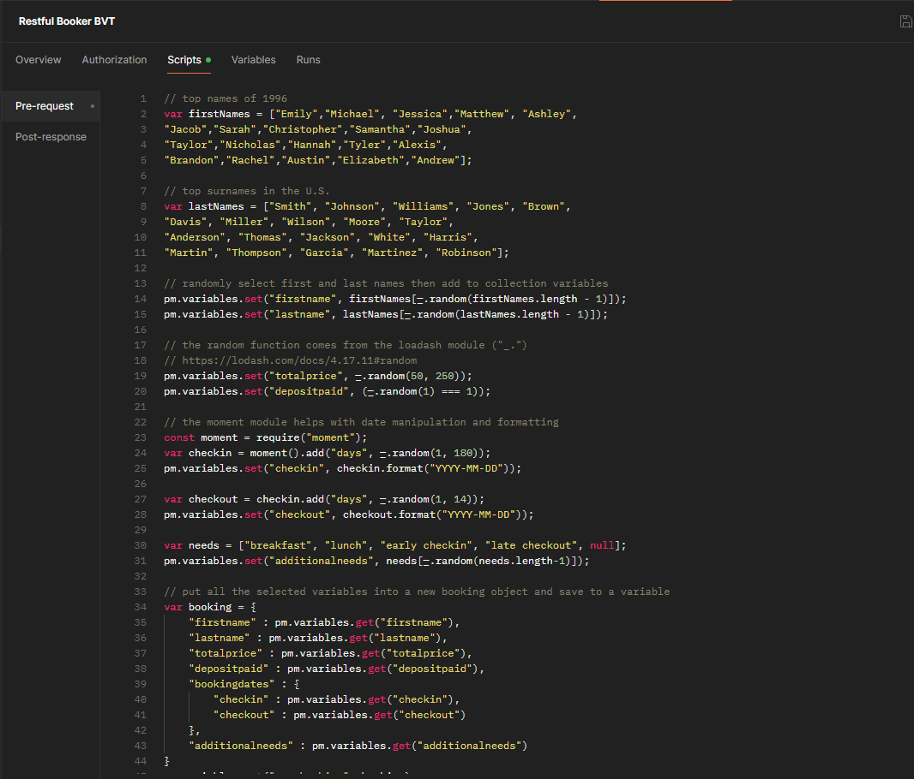

# Chapter 1 - Intro to API Testing

[Course Resources](https://testautomationu.applitools.com/exploring-service-apis-through-test-automation/resources.html)

API stands for Application Programming Interface, which basically just means that it's one piece of code talking to another piece of code.

**Examples**

* Website talking to a database back end.
* Mobile application talking to an authentication service.

## The API Contract

The way that an API works is through a contract.

APIs are contracts that enabled communication.

* Request

    * Endpoint
    * Headers
    * Body
* Response

    * Status Code
    * Headers
    * Body

## **APIs are for developers**

Things that are important:

* Correctness - contract is honoured in the way is specified
* Provide value - doing something the application needs
* Intuitive - easy to work with

**APIs are public! Do not assume they'll only be accessed through the expected UI, they can potentially be accessed from anywhere**

Good example of API documentation - [Spotify API](https://developer.spotify.com/documentation/web-api)

## View APIs in your browser

* Chrome
    * View > Developer > Developer Tools
* Firefox
    * Tools > Web Developer > Toggle Tools

Chrome:

Select network tab > Filter XHR for HTTP requests

## View APIs from your mobile device with a proxy tool

* Fiddler
    * Optimised for Windows
    * Free
* Charles
    * Windows/Mac
    * Required a licence

# Chapter 2 - Exploring APIs with Postman

[Postman Collection](https://postman-api-fundamentals-student-expert-team-1813.postman.co/workspace/Postman-API-Fundamentals-Studen~5a01a9a7-1d98-4345-b7e0-ca86f17d9ec3/collection/8404157-a95b3752-e24c-4a89-b668-f709e63836c3?action=share&creator=8404157)

GET - get results

POST - new object

PUT - needs whole object passed in

PATCH - partial info only, just input things we want to change

DELETE - delete object

## Restful Booker API

Resource with in-built good for practicing API testing techniques

[API](https://restful-booker.herokuapp.com)

[Collection](https://postman-api-fundamentals-student-expert-team-1813.postman.co/workspace/Postman-API-Fundamentals-Studen~5a01a9a7-1d98-4345-b7e0-ca86f17d9ec3/collection/8404157-e2d834b5-e333-4d84-9438-25be41248875?action=share&creator=8404157)

# Chapter 3 - POISED API Testing Strategy

POISED Heuristic

1. Parameters
2. Output
3. Interop
4. Security
5. Errors
6. Data

[Collection](https://postman-api-fundamentals-student-expert-team-1813.postman.co/workspace/Postman-API-Fundamentals-Studen~5a01a9a7-1d98-4345-b7e0-ca86f17d9ec3/collection/8404157-e2d834b5-e333-4d84-9438-25be41248875?action=share&creator=8404157)

## Running Restful Booker API Locally

[https://github.com/mwinteringham/restful-booker](https://github.com/mwinteringham/restful-booker)

Node application

```
npm install -- retrieve packages the app requires
npm start
```

App is available on http://localhost:3001

Add 2 new environments in postman, one for production URL and one for localhost

## 3.1 Parameters (Input)

Boundary value testing. Test different values for all params, nulls, empty, remove attributes etc.

POST for creating a booking throws returns status code 500 if `firstName` parameter is empty, invalid date etc.

Find out how API reacts under different conditions.

## 3.2 Output

Most common response is `200 OK`

Delete request returns `201 created` which is strange, did we create something? This is an output error.

Add header to change output to XML - Name: `Accept`, Value: `application/xml` - Tested with _Get Booking By ID_

Now to test *Get All Bookings* which continues to return JSON - this means that endpoint is not processing the header correctly.

Logging - 500 Internal Server Error can be improved. More descriptive error messages should be included.

## 3.3 Interop(erability)

An API is nothing by itself.

It needs to communicate in a way that is useful to other services.

Considerations

* Parameter formatting (date formats for example, i.e. dd-mm-yyyy, mm-dd-yyyy)
* How you're returning your information. Example get booking by name only returns an ID so another call is required to get useful info, could it just be returned in 1 call? It would depend on the usecase for the endpoint.

## 3.4 Security

Examples require Authorization or Cookie header.

Having security at UI level is not enough to secure an API.

Cross-site scripting attack - script executed in browser

Example:

```
{
    "firstname" : "<script>alert(\"gotcha!\"</script>,
    "lastname" : "Brown",
    "totalprice" : 111,
    "depositpaid" : true,
    "bookingdates" : {
        "checkin" : "2018-01-01",
        "checkout" : "2019-01-01"
    },
    "additionalneeds" : "Breakfast"
}
```

Convert to HTML on codebeautify.org, and we can see an alert being display when it's converted

Very important to check at UI level and server level. Possible solution is to not allow `<` character

## 3.5 Errors

There are a lot of ways bad information can make its way into a request, A service needs to be able to handle this gracefully without crashing.

One important aspect is proper communication of the erroneous result.

The other important part of error handling is passing back actionable information to the application developer.

Ideally never have a `500 Internal Server Error`.

Errors should have an exception or debug log.

## 3.6 Data

Don't trust response is doing what it says, double check underlying data store via API or database.

Units are meaningless without specification of unit i.e. `"price" : 100` Euros? Dollars? Additional attribute for currency needed here.

**The last data aspect I want to talk about is scalability, so that's asking the API if I have a thousand bookings in this database, will I be able to perform all my functions quickly enough?**

Can use collection runner to run collection multiple times.

[Collection](https://postman-api-fundamentals-student-expert-team-1813.postman.co/workspace/Postman-API-Fundamentals-Studen~5a01a9a7-1d98-4345-b7e0-ca86f17d9ec3/collection/8404157-72a3fbde-4077-45e0-ac8a-64dee04ec139?action=share&creator=8404157&active-environment=8404157-68a9363e-289d-4a30-8c1e-25ed66f1c697)


# Chapter 4 - Test Automation with Postman

## 4.1 Your first test

Tests tab is now done in scripts tab with `pre-request` and `post-respone`



BDD style assertion using chai framework

Example

```
pm.test("Status code is 200", function () {
    pm.response.to.have.status(200);
});
```



## 4.2 Data Driven Tests

Can parameterise body attribute with variable name i.e.



CSV file used for input data that is setup with collection runner.


[Collection](https://postman-api-fundamentals-student-expert-team-1813.postman.co/workspace/Postman-API-Fundamentals-Studen~5a01a9a7-1d98-4345-b7e0-ca86f17d9ec3/collection/8404157-22db1740-609d-47cd-a9c0-904dbc8bc211?action=share&creator=8404157&active-environment=8404157-68a9363e-289d-4a30-8c1e-25ed66f1c697)

## 4.3 Advanced Tests

Postman script API reference [here](https://learning.postman.com/docs/tests-and-scripts/write-scripts/postman-sandbox-api-reference/)

Uses a subset of JavaScript

[Collection](https://postman-api-fundamentals-student-expert-team-1813.postman.co/workspace/Postman-API-Fundamentals-Studen~5a01a9a7-1d98-4345-b7e0-ca86f17d9ec3/collection/8404157-907af8c4-4a85-425c-84dd-3c3eb359006c?action=share&creator=8404157&active-environment=8404157-68a9363e-289d-4a30-8c1e-25ed66f1c697)



## 4.4 Newman

CLI companion for postman.

Can be integrated with Jenkins or other CI solutions.

`npm install -g newman`

You then need to export the collection and the target environment from postman

`newman run Restful\ Booker\ BVT.postman_collection.json -e Local.postman_environment.json`

Sample output


Jenkins requires NodeJS plugin to be installed to use newman

```bash
newman run RestfulBookerBVT.postman_collection.json -e Local.postman_environment.json --reporters cli,junit --reporter-junit-export result.xml
```
