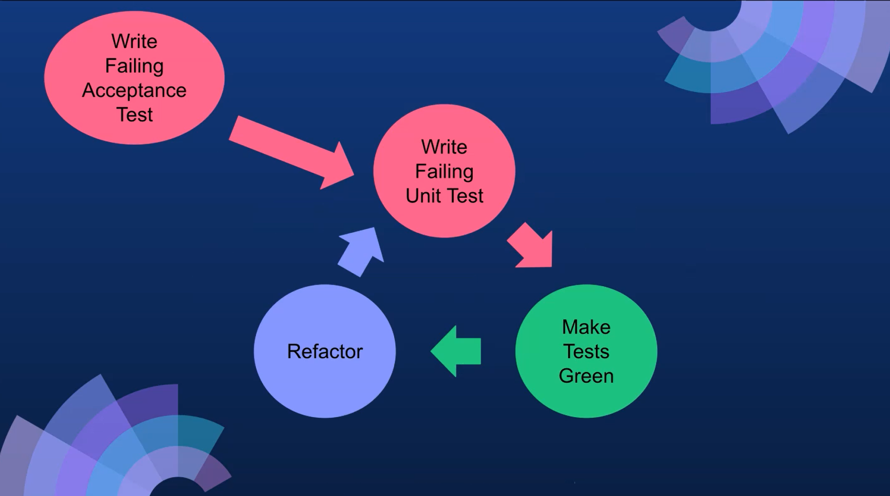

[Next](2%20-%20Setting%20Up%20The%20Project.md)

# The Theory Behind ATDD

> "First, you should write new business code only when an automated test has failed. 
> Second, you should eliminate any duplication that you find"
> TDD - Kent Beck

It's easy when you're writing code to get lost and start refactoring as you're going along, build out big chunky features or build in logic which you didn't necessarily need.
This is the cleanest way to effectively achieve the goal.

The TDD cycle is this loop where you write the failing test, you make the test green, and then you go back in, and you refactor any code.

**Then what is acceptance test-driven development?**
> "Write a single acceptance test and then just enough production functionality/code to fulfill that test"
> ATDD - Gojko Adzic

So here, you're writing a single acceptance test and then just enough production code to fulfill that test.
You also need that TDD cycle.

You now write the failing acceptance test first.
Then you go into the TDD cycle, you make that green.

And then you run your acceptance tests again, and you make that green.
So, all of the cycles are green at this point.
And then, you can go in and refactor any part of the acceptance test, which may have changed with your knowledge of how you have implemented the feature. You may want to add in some scenarios, for example.
And at that point, again, you go through the loop. You may want to change some of the business logic at that point as well.

**That's the ATD cycle — we have that loop around the TDD cycle.**

## Resources
[Intro to Test Driven Development (TDD/ATDD)](http://agiledata.org/essays/tdd.html)

## Quiz
1. Using TDD you can refactor when tests are green?
    **True**
2. Using ATDD you can refactor when tests are red?
    **False**
3. How many acceptance tests should you write before starting the TDD cycle?
    **1**