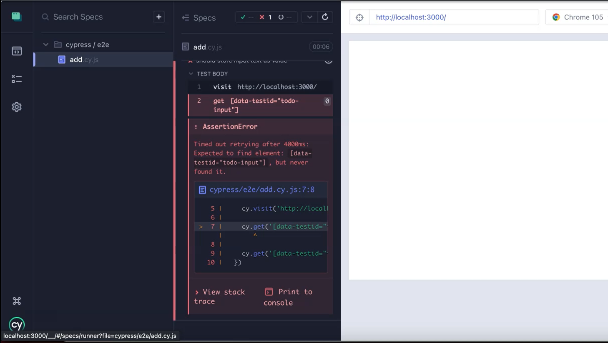

[Previous](2%20-%20Setting%20Up%20The%20Project.md) | [Next](4%20-%20Writing%20unit%20tests%20in%20Jest%20using%20React%20Testing%20Library.md)

# Writing Acceptance Test in Cypress
In this chapter, we're going to be talking about HTML and selectors for our tests, acceptance tests with Cypress, and running our first failing test.

## What do we mean by HTML Semantics? Use the appropriate HTML tags.
When you are writing your HTML elements and your components, you should think about how you structure it so that it's accessible to the user, and this allows us to use native elements when we select them.

When we think about the hierarchy of the selectors, we want to have an easy-to-find selector, and one that conforms with accessibility standards.

This will allow us to select the element without having to worry about any duplication of elements, making sure that each element is unique based on the functionality that is on the page, and also it's how the user interacts with the application. That's what we want to consider when we're writing our code.

### What's an example of this?
The example we are going to be using within this course is “Todo” with forms.

```html
<form>
    <label>
        Todo:
        <input value={data.todo} name="todo" 
               onchange={onChange} data-testid="todo-input"/>
    </label>
        <button type="submit">Add Todo</button>
</form>
```

### Test ID’s — data-testid=simples
Data test id’s (data-testid) are a simple way for us to be able to have static element selectors, which we can then use within our tests.
So, if we know they're going to be there, we can chuck them straight into our test, and we can know that the code will also follow this standard.

### Our First Test
````javascript
describe('Todo list', () => {
  // New Feature for Todo app
  // Input todo description to be submitted as part of a form
  it('should store input text as value', () => {
    cy.visit('')
  })
})
````
The input for the app needs to take a description, which will be plain text to be submitted as part of a form.
So, the test that we're going to write now should store the input text as a value within the component.
This test we're going to rename, as this is to do with adding a todo, so we're going to change the name to `add.cy.js`
And we're going to add in our local host URL, which was Localhost 3000 — cy.visit('http://localhost:3000/').
We're going to be using the `data-testid` to the specific element that we're going to choose.

We can then do this within our test, we can say using jQuery, we can say that we want to ``get`` the ``data-testid`` of the ``todo-input``.

> **NOTE**
> If you're doing this within your organization, you need to come up with some standards of what a good ``data-testid`` looks like. But if you're doing proper acceptance test driven development, then you'll be writing the test first and collaborating, maybe pairing with the developer, so at that point they can see your code, and they can implement it from their side.

We've got our action. We want to do our assertion on the same element.

We then set the value of the element input with ``.type("first todo item")``
Then we've got our action. We want to do our assertion on the same element.

The input field should now have a new value, so we can do an assertion within Cypress to check the value which is a native assertion that we have access to.

So, we add in the text from our ``type`` element.

````javascript
describe('Todo list', () => {
  // New Feature for Todo app
  // Input todo description to be submitted as part of a form
  it('should store input text as value', () => {
    cy.visit('http://localhost:3000/')

    cy.get('[data-testid="todo-input"]').type("first todo item")

    cy.get('[data-testid="todo-input"]').should('have.value', "first todo item")
  })
})
```` 
**So now, we've got a test that should input into the field, and then it should have the value.**

Make sure to open up a new window, run ``npm start``, so we've got our application running in the background.
We can now launch Cypress — ``npm run cy:open`` — and run our spec file.

Then this test will fail because it can't find the input.




## Quiz
1. What is an example of a test-id?
   ``data-testid=findme``
2. Cypress best practices recommends to "Always" use "data-*" attributes?
    **true**
3. Querying elements in Cypress is the same as JQuery?
    **true**
4. Which Cypress CLI command launches the Cypress Launchpad?
     ``$ cypress open``

## Resources
[Git Repo for Course Code](https://github.com/lewisP707/acceptance-test-driven-development-for-front-end)
[Git Repo: add.cy.js](https://github.com/lewisP707/acceptance-test-driven-development-for-front-end/blob/chapter-4/cypress/e2e/add.cy.js)
[Github: Starting point Chapter 3 Course Code](https://github.com/lewisP707/acceptance-test-driven-development-for-front-end/releases/tag/chapter-3)
[Github: Completed Code Chapter 3 Code](https://github.com/lewisP707/acceptance-test-driven-development-for-front-end/releases/tag/chapter-4)
[Cypress Selecting Elements](https://docs.cypress.io/app/core-concepts/best-practices#Selecting-Elements)
[HTML Semantics](https://www.w3schools.com/html/html5_semantic_elements.asp)