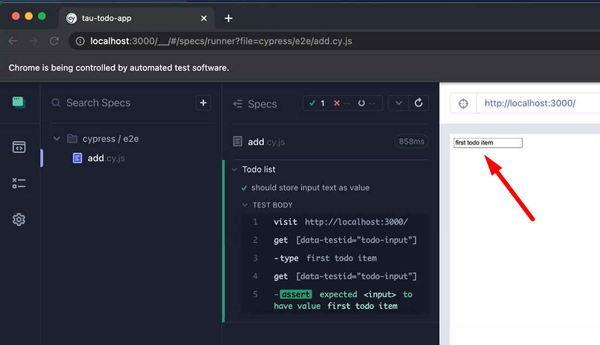

# Making the tests pass

We've written our unit tests. We've written our acceptance tests. Now we're at the bottom of the cycle, so we can start writing the code to make our tests pass.

## Feature — Add Item to “To Do” List
The feature that we're going to add; we've got the input, right? So, we're going to add that to the value so that when someone adds an item to the list, the text will be added to the “To Do” list.
Let's go back to our blank ``Add`` component.
The first thing we want to do is we want to ``return``, which we are going to use ``input`` with a value.
First, we want to do is add our ``data-testid``, as this is used in all of our tests.
Then we're going to add a ``value`` which will take the data from our ``input``.
We need to make sure that we check for any changes for someone entering in the input, and we need to have a name to sync everything together. This will be "add_todo".
The ``onChange`` takes a function.
So, we need to add an ``onChange`` function.
This takes an event (``evt``). The ``evt`` returns us a ``key``, which is the ``evt.target.name``.
Then returns us a ``value``, which is ``evt.target.value``.

**And we're going to then set that to the state of the component.**
So, we need to add an import here to ``import { useState } from 'react'``;
We need to add in our state elements, which are going to be ``data`` and you have a ``setData`` state.
And the ``useState`` is going to have key, which is the “add_todo” which maps with our name, and it is going to be a String.
So, we've got that there. Now we need to set our data (``setData``).
We're going to take all of the data that already exists within the input already (``oldData``).
We're going to append the new data to it by adding in the ``key`` and the ``value``. Make sure you wrap this as well.
So, we've now set our data.

**Now, We can’t run because we need to add the Add component to the App itself that's rendered.**


We need to ``import`` the ``Add`` component from the “Add” file and add it to our App.

````javascript
import { useState } from 'react';

import Add from './Add';

function App() {
  const [items, setItems] = useState([]);

  const handleAdd = (newItem) => {
    setItems(oldItems => oldItems.concat([newItem]));
  };

  return (
    <>
    <Add />
    </>
  );
}

export default App;
````


So now we've got both of our tests to pass.
**So, we're at the point where we can start doing some refactoring.**

We've got this function onChange which we can put in one line within the input.
We don't need to have it as an external function as it's just been used as part of this onChange method. We can put it within the input tag itself.

``Add.js``

````javascript
import { useState } from 'react';

export default function Add() {
    const [data, setData] = useState({
        add_todo: ''
    })
    return (
    <input
        data-testid="todo-input"
        value={data.add_todo}
        onChange={(evt) => setData(oldData => ({ ...oldData, [evt.target.name]: evt.target.value }))}
        name="add_todo" />
    );
}
````

## Quiz
1. Jest & Cypress watch file changes for code and reruns tests automatically?
    **True**
2.  Input elements included ALL of the following attributes?
    **name, id, data-testid**
3. The user input updates which attribute within the <input> html tag?
    **value**
4. Which react function is used to store the user input?
    **useState**

## Resources
[Git Repo: Lesson Code - Add.js](https://github.com/lewisPrescott707/acceptance-test-driven-development-for-front-end/blob/chapter-6/src/Add.js)
[Git Repo: Lesson Code - App.js](https://github.com/lewisPrescott707/acceptance-test-driven-development-for-front-end/blob/chapter-6/src/App.js)
[Github Chapter 5 Starting Point](https://github.com/lewisPrescott707/acceptance-test-driven-development-for-front-end/releases/tag/chapter-5)
[Github Chapter 5 Completed Code](https://github.com/lewisPrescott707/acceptance-test-driven-development-for-front-end/releases/tag/chapter-6)
[React Hooks](https://reactjs.org/docs/hooks-intro.html)


