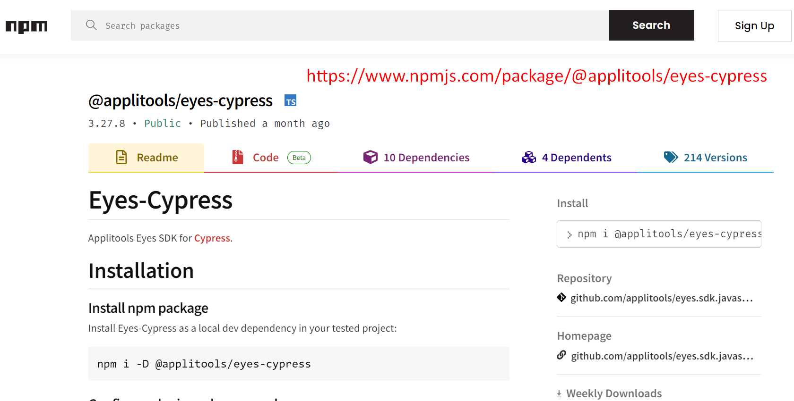
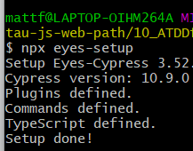

# Writing Visual Tests with Applitools

We've done our functional tests, but things change in terms of layout, CSS, all that kind of thing, so we're going to add some visual tests using Applitools.
Also, we've got our components, so we can take a snapshot of those components within Applitools.
Finally, we will configure the Applitools to run against multiple layouts, so we can see that our design is responsive.

## Components — Building Applications by Components
Before when we built our input value, this is where we're going to include all of their To Do App components and are adding an item to the To Do app.
Whereas, when we display our list of to-dos, they would be a separate component.
When we're building up applications, we can then isolate those components. Then we can take a snapshot of each of those without having to rely on multiple things on the page and how things interact with each other.
We can pinpoint specific issues without having to do a whole page interaction.

## Responsive Design — Design for Mobile, Tablet & Desktops
You have different device sizes, mobile, tablet, desktops, for example, and you want your website to be responsive across all of the different devices without having to deploy separate websites to have a specific mobile version.

You can have break points in your CSS and that's why using Applitools is a great way to be able to quickly identify whether any changes you've made have affected the responsive design across your top devices.

## Eyes-Cypress
We're going to be using Eyes-Cypress npm package.
https://www.npmjs.com/package/@applitools/eyes-cypress

### Installation
``npm i -D @applitools/eyes-cypress``

Once we've installed the package, we can run the setup command using ``npx eyes-setup``, which will add all of the packages that we need and update our Cypress implementation.
