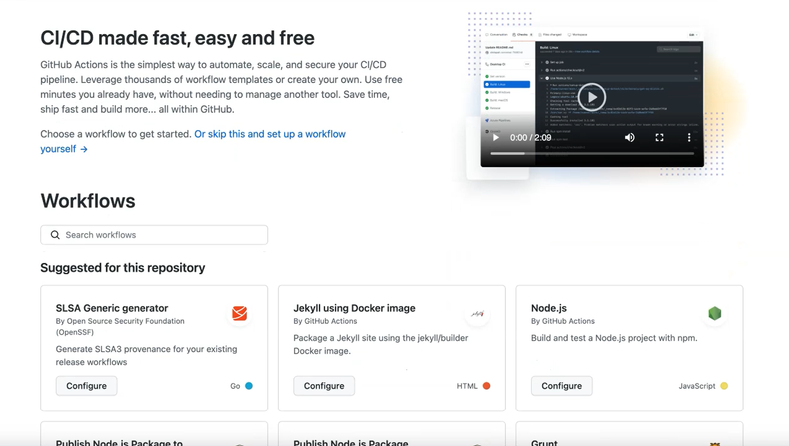
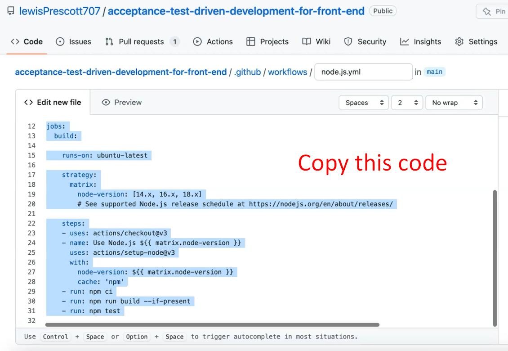
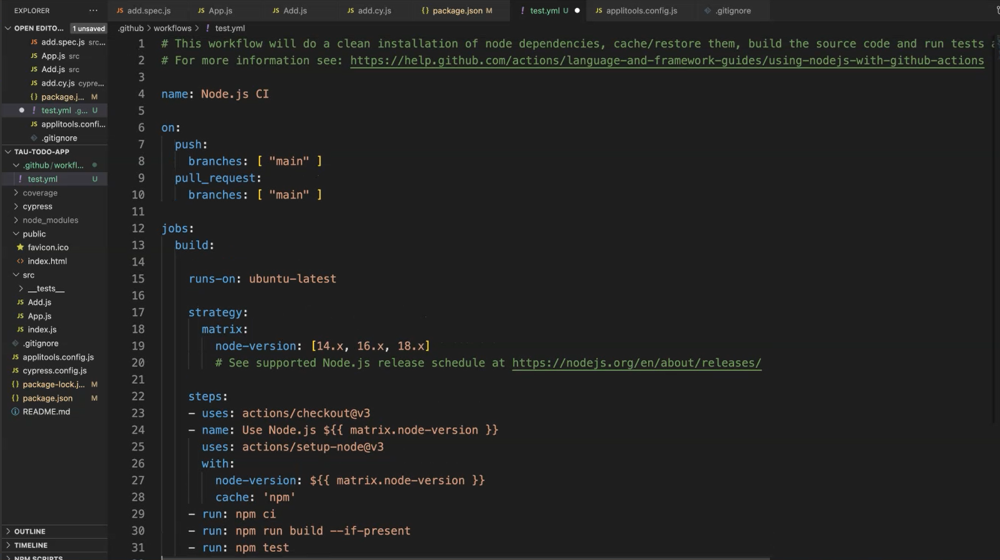
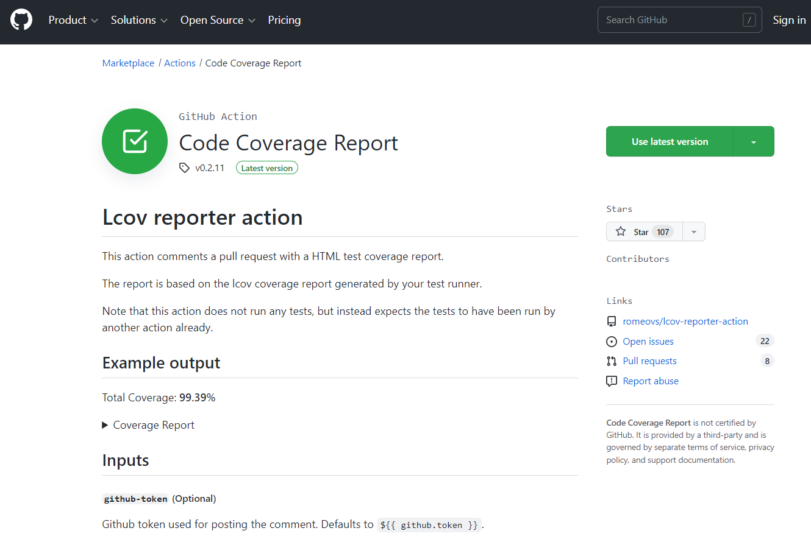
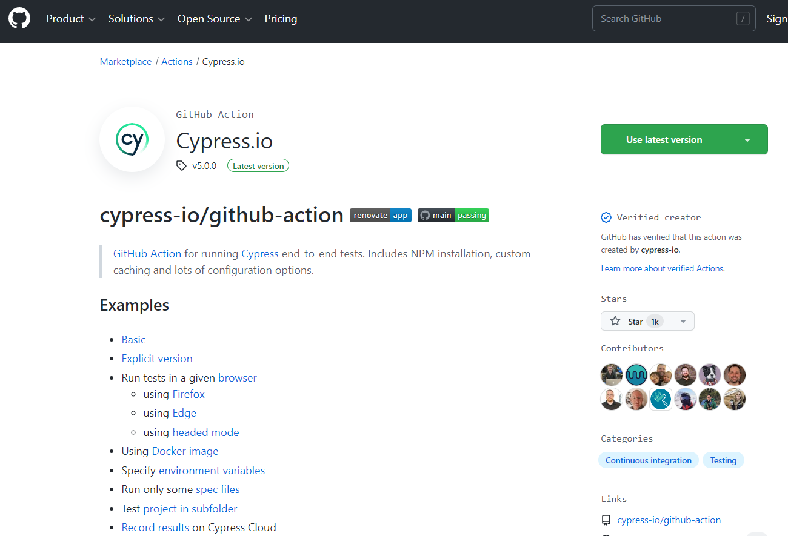
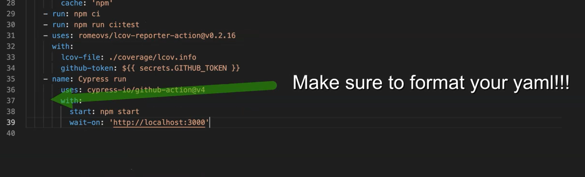
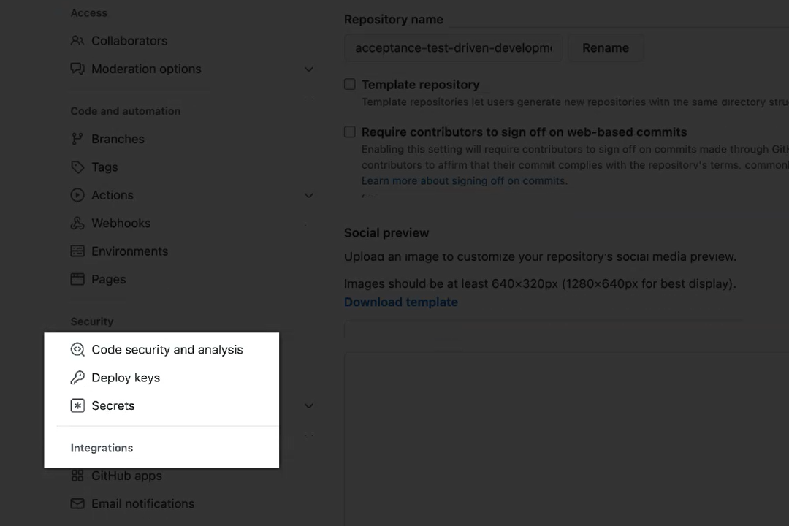
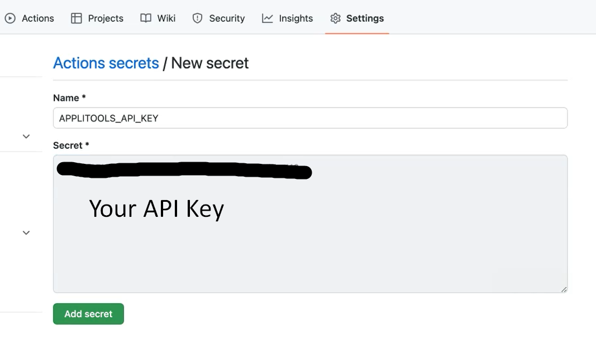
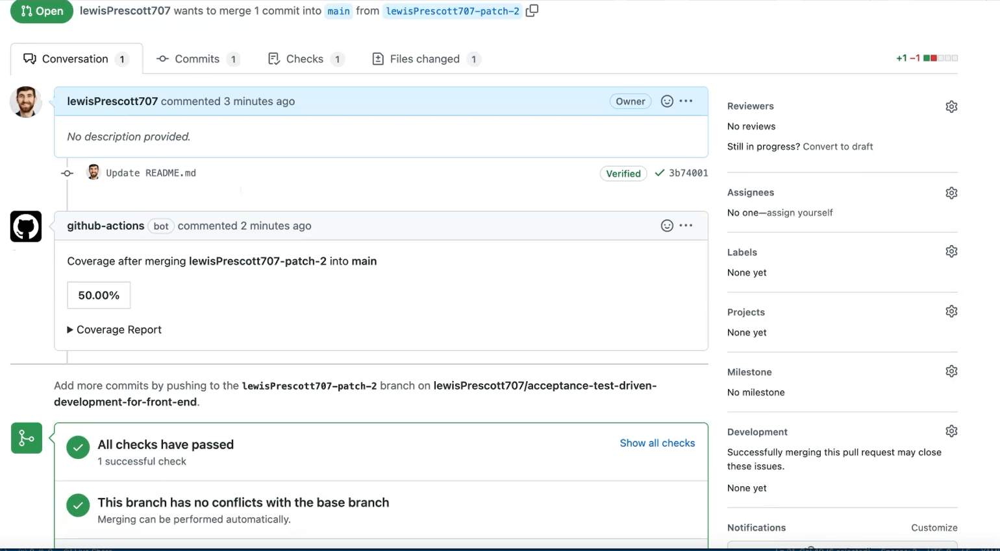
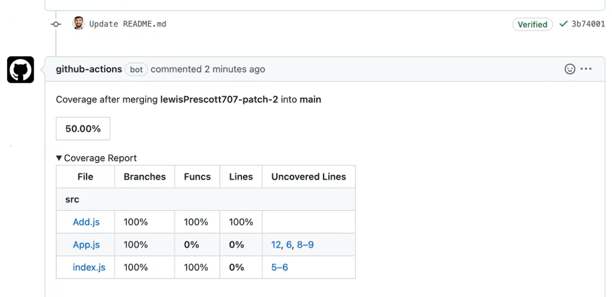

# Github Actions & Coverage

## Continuous Integration - Release Small & Often
The idea of continuous integration within ATDD cycle is that we can add all of our tests within the pull request.

They can run as part of the pull request, and we get to know the test coverage.

We get to know whether our tests pass the acceptance of the criteria alongside the pull request. So, we can release small and often and not worry about having to add additional coverage later on.

## Test Coverage — Ensure Quality with TDD
The test coverage comes out of the box with this approach.

Because you are writing the test first, you're automatically getting the coverage, and you're ensuring the quality of those tests.

Obviously, you'll need to add additional test cases, because test coverage just covers the line coverage and doesn’t cover the flow through the application.

You'll also want to look at those edge cases, some data requirements, and other scenarios not touched upon.


## Github Actions
When you come to the Actions screen for the first time, you'll see the screen where it offers you some templates that you can use to set up your pipeline.



We're going to use the Node.js config

Code for setup in below image:


If we create a folder called “.github” and another folder called “workflows”, then create ourselves a “test.yml” within that — “.github/workflows/test.yml”.
Within that and we can copy across the template that we copied from GitHub.



There's a few things that we need to add.

We've got our npm test step. We can change this to point to our ci:test, which will generate our coverage.
```json
    - run: npm ci
    - run: npm run ci:test
```
This ``npm ci`` command will do a clean install for us every time, so we don't need to worry about any hanging node modules or anything or misconfigurations there.

**Configuration for triggers based on when the pipeline will run or the workflow will run.**
```json
on:
  push:
    branches: [ "main" ]
  pull_request:
    branches: [ "main" ] 
```

When we push to the main branch or when we create a pull request against the main branch.
When we update our workflow here, we'll be able to see it running in the pipeline.
We're going to add another step to update and upload our test coverage.
We're going to be using this [Code Coverage Report GitHub Action](https://github.com/marketplace/actions/code-coverage-report), which can be found in the marketplace.



This allows us to generate a report alongside our pull requests, which will allow us to share our coverage, extract that from the output and put that into our pull request itself.

Code that needs to be added to the `test.yaml` file
```json
uses: romeovs/lcov-reporter-action@v0.2.16
with:
  lcov-file: ./coverage/lcov.info
```

This is the default location, and when we ran our coverage earlier, it's pointing to this file here — “./coverage/lcov.info”.
So that will exist within the pipeline.

**We also need to add in the secret to give it permissions to add it to the pull request.**
This is a default token which is available within the secrets. Don't forget to add the uses.

```json
- uses: romeovs/lcov-reporter-action@v0.2.19
with:
lcov-file: ./coverage/lcov.info
github-token: ${{ secrets.GITHUB_TOKEN }}
```
We've got our coverage and now we want to run our Cypress tests.
We're going to be using the [Cypress GitHub Action](https://github.com/marketplace/actions/cypress-io).



It allows us to run the Cypress command and also allows us to start our server at the same time.
```json
- name: Cypress run
  uses: cypress-io/github-action@v4
      with:
        start: npm start
        wait-on: 'http://localhost:3000'
```
The ``npm start`` matches with our package JSON as well. We've got the npm start command.
It also provides us this wait-on command. This allows us to put in the URL of our app and that starts up on port 3000.



We need to add an environment variable to our Cypress run, which takes the Applitools API key.
````json
      env:
        APPLITOOLS_API_KEY: ${{ secrets.APPLITOOLS_API_KEY }}
````
We are going to grab that from the ``secrets`` within GitHub, the same name.
We add that to our ``Cypress run``, we need to add that into GitHub as well.
If you go to _Settings_ on the GitHub repo, and then you go down to _Secrets_ in the Security section.


For Actions, we're going to set up a new repository secret, it's the “APPLITOOLS_API_KEY”.
**Grab that from config, but you shouldn't be committing that to Git.**


Now, we've got the repository ``secret`` here, then the workflow will have access to that secret when it runs the workflow.
I'm just going to make a small change to our README file, so it picks up the change to trigger a pull request.
Create a new branch, update README, create a pull request.
You check in the _Checks_, it will start building and running our pull request.
Wait for that to complete. Then we check back to our conversation tab, so someone coming to review this pull request can quickly see the code coverage.



They open up this PR, they can see, "Okay, this file has a hundred percent coverage, and this one doesn't have any coverage."

