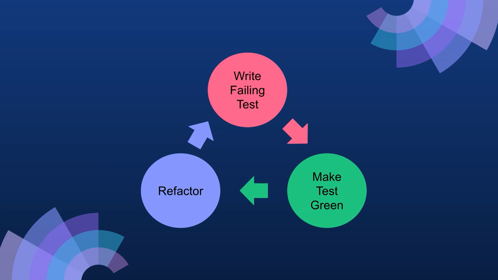
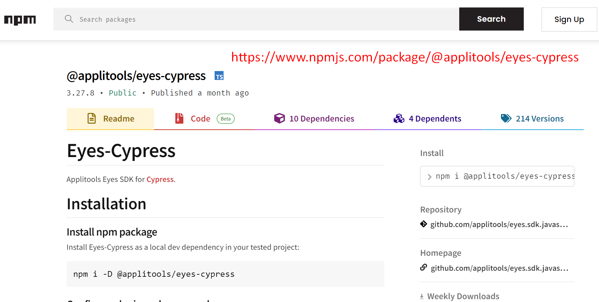
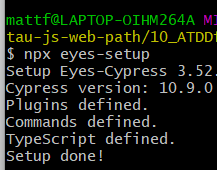
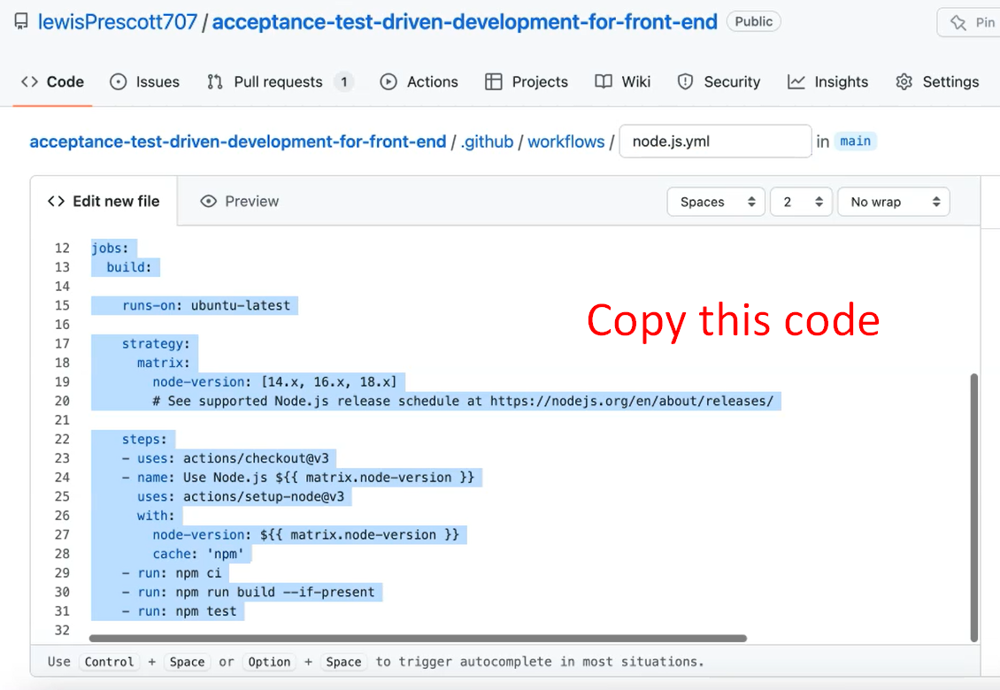
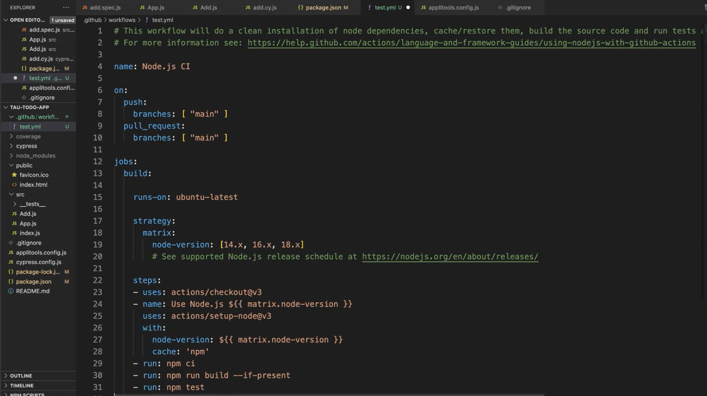
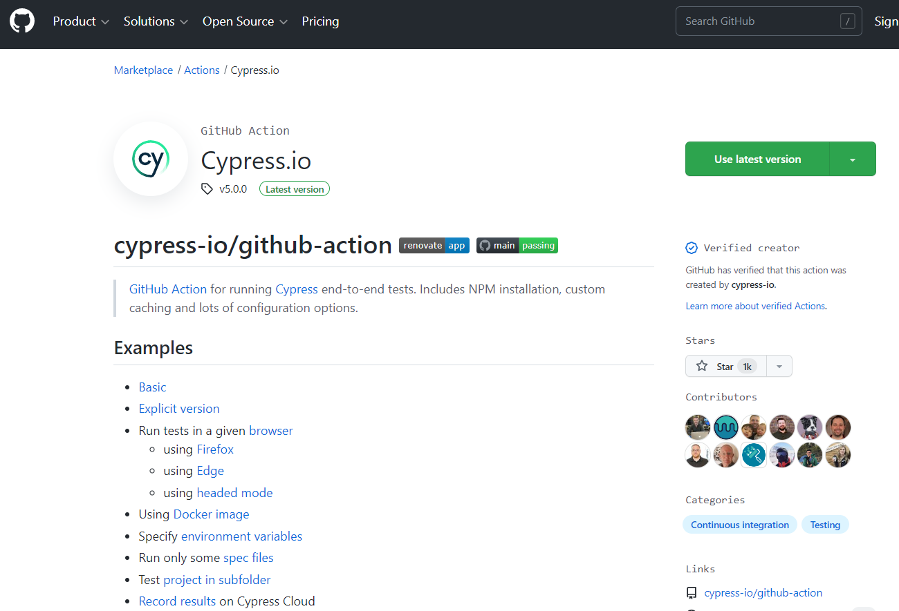
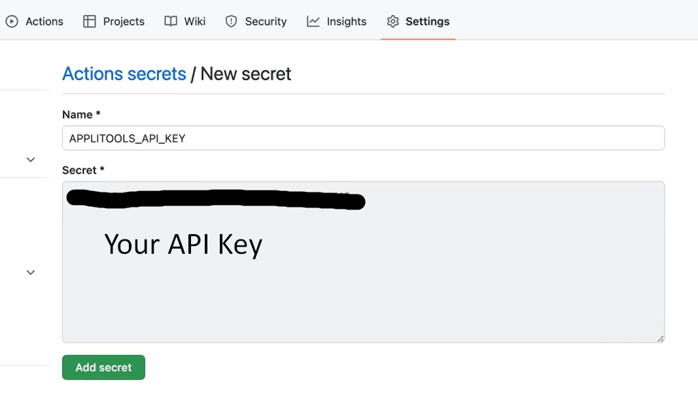
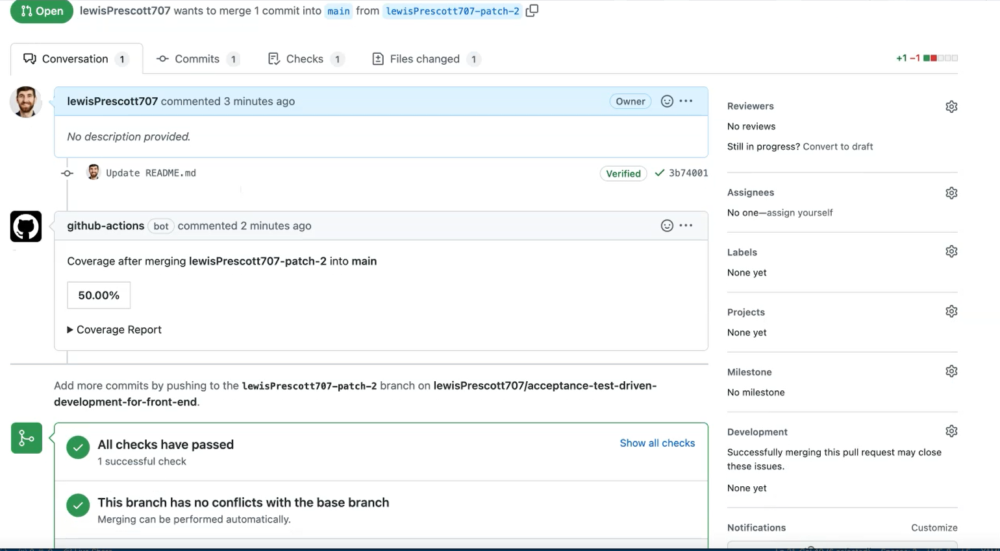

# 1 - The Theory Behind ATDD

> "First, you should write new business code only when an automated test has failed.
> Second, you should eliminate any duplication that you find"
> TDD - Kent Beck

It's easy when you're writing code to get lost and start refactoring as you're going along, build out big chunky features or build in logic which you didn't necessarily need.
This is the cleanest way to effectively achieve the goal.

The TDD cycle is this loop where you write the failing test, you make the test green, and then you go back in, and you refactor any code.


**Then what is acceptance test-driven development?**
> "Write a single acceptance test and then just enough production functionality/code to fulfill that test"
> ATDD - Gojko Adzic

So here, you're writing a single acceptance test and then just enough production code to fulfill that test.
You also need that TDD cycle.


You now write the failing acceptance test first.
Then you go into the TDD cycle, you make that green.


And then you run your acceptance tests again, and you make that green.
So, all of the cycles are green at this point.
And then, you can go in and refactor any part of the acceptance test, which may have changed with your knowledge of how you have implemented the feature. You may want to add in some scenarios, for example.
And at that point, again, you go through the loop. You may want to change some of the business logic at that point as well.

**That's the ATD cycle — we have that loop around the TDD cycle.**

## Resources
[Intro to Test Driven Development (TDD/ATDD)](http://agiledata.org/essays/tdd.html)

## Quiz
1. Using TDD you can refactor when tests are green?
   **True**
2. Using ATDD you can refactor when tests are red?
   **False**
3. How many acceptance tests should you write before starting the TDD cycle?
   **1**

# 2 - Setting Up The Project

## Create Reach App
````shell
npx create-react-app tau-todo-app --template cra-template-tau-todo 
````
or if there issues with version deprecation you can use
````shell
npx create-react-app@latest tau-todo-app --template cra-template-tau-todo --use-npm
````

Commands
````shell

  npm start
    Starts the development server.

  npm run build
    Bundles the app into static files for production.

  npm test
    Starts the test runner.

  npm run eject
    Removes this tool and copies build dependencies, configuration files
    and scripts into the app directory. If you do this, you can’t go back!

````

## Start the app
`npm start`
It'll be empty as we've not implemented anything.
But as you can see, it's got a body ready for us to implement some code.


## Dependencies
````json
  "dependencies": {
    "react": "^18.3.1",
    "react-dom": "^18.3.1",
    "react-scripts": "^5.0.1"
  },
````
We've got our `react`, we've got our `react-dom` and we've got our `react-scripts`.
This allows us to run our React App, and Jest is hidden in the background.
React Scripts has the Jest command, so we just run `react-scripts test`.

We need to install some additional packages in order to have React Testing Library, Cypress, and some additional packages, as well to configure everything nicely with Jest.
We're going to save them as `devDependencies` as these won't make it into the app.
We've got @`testing-library/jest-dom, @testing-library/react, @testing-library/user-event`, and we've got `cypress`.

Installation command:
`npm install --save-dev @testing-library/jest-dom@5.16.5 @testing-library/react@13.4.0 @testing-library/user-event@14.4.3 cypress@10.9.0`

### What are these packages doing?
`testing-library/react` - This allows us to render our application within our tests and render our components so we can test those components easily.
`user-event` - Allows us to have certain commands which make it much easier for us to interact with the application as if we were the user.
`jest-dom` - Adds that additional functionality so that we can interact with the Jest library.
`cypresss` - Which is going to do our acceptance testing and test from the browser interactions.

### We need to add our scripts for Cypress, so that we can run those within our tests.
cy:open which will launch the Cypress window and cy:run which will run our Cypress tests headlessly for running in CI, for example.

````json
  "scripts": {
    "start": "react-scripts start",
    "build": "react-scripts build",
    "test": "react-scripts test",
    "ci:test": "cross-env CI=true react-scripts test --coverage",
    "eject": "react-scripts eject",
    "cy:open": "cypress open",
    "cy:run": "cypress run"
  },
````
Once Cypress is installed you need to run it to create the Cypress folder
`npm run cy:open`

We're going to be using the end-to-end testing solution (E2E Testing).


Create a new empty spec, you can just call it “todo” for now.


And now we've got our Cypress folder, which has our test scaffolded for us and all our support files.


## Resources
[Git Repo for Course Code](https://github.com/lewisP707/acceptance-test-driven-development-for-front-end)
[Create React App website](https://create-react-app.dev/)
[Create React App-template](https://www.npmjs.com/package/cra-template-tau-todo)
[Create React App Docs](https://reactjs.org/docs/create-a-new-react-app.html#create-react-app)
[Cypress Docs](https://docs.cypress.io/guides/overview/why-cypress)
[Testing Library Docs](https://testing-library.com/docs/react-testing-library/intro)
[Jest Docs](https://jestjs.io/docs/getting-started)
[TAU Course: Jest JavaScript Testing Framework](https://testautomationu.applitools.com/jest-testing-tutorial/)
[TAU Course: Introduction to Cypress](https://testautomationu.applitools.com/cypress-tutorial/)

# 3 - Writing Acceptance Test in Cypress
In this chapter, we're going to be talking about HTML and selectors for our tests, acceptance tests with Cypress, and running our first failing test.

## What do we mean by HTML Semantics? Use the appropriate HTML tags.
When you are writing your HTML elements and your components, you should think about how you structure it so that it's accessible to the user, and this allows us to use native elements when we select them.

When we think about the hierarchy of the selectors, we want to have an easy-to-find selector, and one that conforms with accessibility standards.

This will allow us to select the element without having to worry about any duplication of elements, making sure that each element is unique based on the functionality that is on the page, and also it's how the user interacts with the application. That's what we want to consider when we're writing our code.

### What's an example of this?
The example we are going to be using within this course is “Todo” with forms.

```html
<form>
    <label>
        Todo:
        <input value={data.todo} name="todo" 
               onchange={onChange} data-testid="todo-input"/>
    </label>
        <button type="submit">Add Todo</button>
</form>
```

### Test ID’s — data-testid=simples
Data test id’s (data-testid) are a simple way for us to be able to have static element selectors, which we can then use within our tests.
So, if we know they're going to be there, we can chuck them straight into our test, and we can know that the code will also follow this standard.

### Our First Test
````javascript
describe('Todo list', () => {
  // New Feature for Todo app
  // Input todo description to be submitted as part of a form
  it('should store input text as value', () => {
    cy.visit('')
  })
})
````
The input for the app needs to take a description, which will be plain text to be submitted as part of a form.
So, the test that we're going to write now should store the input text as a value within the component.
This test we're going to rename, as this is to do with adding a todo, so we're going to change the name to `add.cy.js`
And we're going to add in our local host URL, which was Localhost 3000 — cy.visit('http://localhost:3000/').
We're going to be using the `data-testid` to the specific element that we're going to choose.

We can then do this within our test, we can say using jQuery, we can say that we want to ``get`` the ``data-testid`` of the ``todo-input``.

> **NOTE**
> If you're doing this within your organization, you need to come up with some standards of what a good ``data-testid`` looks like. But if you're doing proper acceptance test driven development, then you'll be writing the test first and collaborating, maybe pairing with the developer, so at that point they can see your code, and they can implement it from their side.

We've got our action. We want to do our assertion on the same element.

We then set the value of the element input with ``.type("first todo item")``
Then we've got our action. We want to do our assertion on the same element.

The input field should now have a new value, so we can do an assertion within Cypress to check the value which is a native assertion that we have access to.

So, we add in the text from our ``type`` element.

````javascript
describe('Todo list', () => {
  // New Feature for Todo app
  // Input todo description to be submitted as part of a form
  it('should store input text as value', () => {
    cy.visit('http://localhost:3000/')

    cy.get('[data-testid="todo-input"]').type("first todo item")

    cy.get('[data-testid="todo-input"]').should('have.value', "first todo item")
  })
})
```` 
**So now, we've got a test that should input into the field, and then it should have the value.**

Make sure to open up a new window, run ``npm start``, so we've got our application running in the background.
We can now launch Cypress — ``npm run cy:open`` — and run our spec file.

Then this test will fail because it can't find the input.


## Quiz
1. What is an example of a test-id?
   ``data-testid=findme``
2. Cypress best practices recommends to "Always" use "data-*" attributes?
   **true**
3. Querying elements in Cypress is the same as JQuery?
   **true**
4. Which Cypress CLI command launches the Cypress Launchpad?
   ``$ cypress open``

## Resources
[Git Repo for Course Code](https://github.com/lewisP707/acceptance-test-driven-development-for-front-end)
[Git Repo: add.cy.js](https://github.com/lewisP707/acceptance-test-driven-development-for-front-end/blob/chapter-4/cypress/e2e/add.cy.js)
[Github: Starting point Chapter 3 Course Code](https://github.com/lewisP707/acceptance-test-driven-development-for-front-end/releases/tag/chapter-3)
[Github: Completed Code Chapter 3 Code](https://github.com/lewisP707/acceptance-test-driven-development-for-front-end/releases/tag/chapter-4)
[Cypress Selecting Elements](https://docs.cypress.io/app/core-concepts/best-practices#Selecting-Elements)
[HTML Semantics](https://www.w3schools.com/html/html5_semantic_elements.asp


# 4 - Writing unit tests in Jest using React Testing Library

The first Jest unit test we will write will be exactly the same as we did for our Cypress test. We’re going to be using the same element selectors using test IDs. And again, our test will fail as the application code doesn't exist yet.

## Test Command for Jest
``npm test``

package.json shorthand added so this is actually running
``    
"test": "react-scripts test",
``

## Testing Library Key Functions
[React Testing Lib](https://testing-library.com/docs/react-testing-library/api/)

As part of our Jest test, we're going to put them in a “tests ” folder. ``src/tests``
Either ``spec`` or test will be picked up by the Jest default configuration.

## Creating a Test
We need to import React to allow us to render the component.
The ``testing-library/react`` comes with the ability to render and use the screen directly so we can navigate to the screen and access the information that we need.
The ``userEvent`` is, as I mentioned, this is how we can interact with the application as the user would.
And the ``jest-dom`` import allows us to use the Jest configuration within Testing Library.
We're going to add our ``describe`` block, and this is for our “todo add” functionality.
We're going to create our callback function and add our ``test``. This is “storing input value”.
Now we need to render our component. We can use the React Testing Library ``render``.
And we pass the component that we want it to render, which will be our ``Add`` component.
We can also use the shorthand and auto-close it.
**We don't have the Add component yet, so we need to import it.**

At this point, if we pull up the Jest, it cannot find the module, so that's your first failing test.


Let's go ahead and add the component ``src/Add.js`` so it doesn't fail just for the file not existing. We can just add an empty function for Add.
````javascript
export default function Add() {}
````

Back in our test, make sure to reference it with the folder location — ``import Add from '../Add';``
Currently it passes because we're not providing any actions.

Now we're going to create our action using the ``userEvent``.
This has all the native commands that a user could do to interact with the page.

We're going to ``type`` some text into our input.
**How do we get our elements that we're going to type into?**


We're going to ``getByTestId``, as we know this is going to be on the page.
And this is the “todo” input, which we used within our Cypress test.
We're going to use exactly the same attribute to grab our element. And we're going to ``getByTestId``,
So, what are we going to type? We're going to type a "second todo item" as this is the second time we are doing it.

**We've got our action. Now we need to assert what the value is on the input value.**

We can ``expect``. We're going to grab the ``screen`` again after the action.
And we're going to ``getByDisplayValue`` on the screen.
And we can use a regular expression here to look for our “todo item” that we just added or input.
And we're going to expect that ``toBeInTheDocument``, with the document being the page or the component that we've just rendered.

````javascript
import React from 'react';
import { render, screen } from '@testing-library/react';
import userEvent from '@testing-library/user-event';
import '@testing-library/jest-dom';

import Add from '../Add';

describe('todo add', () => {
    test('storing input value', async () => {
        render(<Add />);

        await userEvent.type(screen.getByTestId("todo-input"), "second todo item");

        expect(screen.getByDisplayValue(/second todo item/)).toBeInTheDocument();
    })
})
````

## Quiz
1. Which keyword do we use for test scenarios in jest?
   **test**
2. Which command is used to run jest
   **react-scripts test**
3. Which API function can we use in Testing Library to get test ids?
   **ByTestId**
4. Which package have we **not** installed related to Testing Library?
   **dom**

## Resources
[add.spec.js](https://github.com/lewisP707/acceptance-test-driven-development-for-front-end/blob/chapter-5/src/__tests__/add.spec.js)
[Github: Chapter 4 Starting Point Code](https://github.com/lewisP707/acceptance-test-driven-development-for-front-end/releases/tag/chapter-4)
[Github: Chapter 4 Complete Code](https://github.com/lewisP707/acceptance-test-driven-development-for-front-end/releases/tag/chapter-5)
[Jest async](https://jestjs.io/docs/asynchronous#asyncawait)
[React Testing Lib](https://testing-library.com/docs/react-testing-library/api/)
[Testing Library User Event](https://testing-library.com/docs/user-event/intro/#writing-tests-with-userevent)

# 5 - Making the tests pass

We've written our unit tests. We've written our acceptance tests. Now we're at the bottom of the cycle, so we can start writing the code to make our tests pass.

## Feature — Add Item to “To Do” List
The feature that we're going to add; we've got the input, right? So, we're going to add that to the value so that when someone adds an item to the list, the text will be added to the “To Do” list.
Let's go back to our blank ``Add`` component.
The first thing we want to do is we want to ``return``, which we are going to use ``input`` with a value.
First, we want to do is add our ``data-testid``, as this is used in all of our tests.
Then we're going to add a ``value`` which will take the data from our ``input``.
We need to make sure that we check for any changes for someone entering in the input, and we need to have a name to sync everything together. This will be "add_todo".
The ``onChange`` takes a function.
So, we need to add an ``onChange`` function.
This takes an event (``evt``). The ``evt`` returns us a ``key``, which is the ``evt.target.name``.
Then returns us a ``value``, which is ``evt.target.value``.

**And we're going to then set that to the state of the component.**
So, we need to add an import here to ``import { useState } from 'react'``;
We need to add in our state elements, which are going to be ``data`` and you have a ``setData`` state.
And the ``useState`` is going to have key, which is the “add_todo” which maps with our name, and it is going to be a String.
So, we've got that there. Now we need to set our data (``setData``).
We're going to take all of the data that already exists within the input already (``oldData``).
We're going to append the new data to it by adding in the ``key`` and the ``value``. Make sure you wrap this as well.
So, we've now set our data.

**Now, We can’t run because we need to add the Add component to the App itself that's rendered.**


We need to ``import`` the ``Add`` component from the “Add” file and add it to our App.

````javascript
import { useState } from 'react';

import Add from './Add';

function App() {
  const [items, setItems] = useState([]);

  const handleAdd = (newItem) => {
    setItems(oldItems => oldItems.concat([newItem]));
  };

  return (
    <>
    <Add />
    </>
  );
}

export default App;
````


So now we've got both of our tests to pass.
**So, we're at the point where we can start doing some refactoring.**

We've got this function onChange which we can put in one line within the input.
We don't need to have it as an external function as it's just been used as part of this onChange method. We can put it within the input tag itself.

``Add.js``

````javascript
import { useState } from 'react';

export default function Add() {
    const [data, setData] = useState({
        add_todo: ''
    })
    return (
    <input
        data-testid="todo-input"
        value={data.add_todo}
        onChange={(evt) => setData(oldData => ({ ...oldData, [evt.target.name]: evt.target.value }))}
        name="add_todo" />
    );
}
````

## Quiz
1. Jest & Cypress watch file changes for code and reruns tests automatically?
   **True**
2.  Input elements included ALL of the following attributes?
    **name, id, data-testid**
3. The user input updates which attribute within the <input> html tag?
   **value**
4. Which react function is used to store the user input?
   **useState**

## Resources
[Git Repo: Lesson Code - Add.js](https://github.com/lewisPrescott707/acceptance-test-driven-development-for-front-end/blob/chapter-6/src/Add.js)
[Git Repo: Lesson Code - App.js](https://github.com/lewisPrescott707/acceptance-test-driven-development-for-front-end/blob/chapter-6/src/App.js)
[Github Chapter 5 Starting Point](https://github.com/lewisPrescott707/acceptance-test-driven-development-for-front-end/releases/tag/chapter-5)
[Github Chapter 5 Completed Code](https://github.com/lewisPrescott707/acceptance-test-driven-development-for-front-end/releases/tag/chapter-6)
[React Hooks](https://reactjs.org/docs/hooks-intro.html)

# 6 - Writing Visual Tests with Applitools

We've done our functional tests, but things change in terms of layout, CSS, all that kind of thing, so we're going to add some visual tests using Applitools.
Also, we've got our components, so we can take a snapshot of those components within Applitools.
Finally, we will configure the Applitools to run against multiple layouts, so we can see that our design is responsive.

## Components — Building Applications by Components
Before when we built our input value, this is where we're going to include all of their To Do App components and are adding an item to the To Do app.
Whereas, when we display our list of to-dos, they would be a separate component.
When we're building up applications, we can then isolate those components. Then we can take a snapshot of each of those without having to rely on multiple things on the page and how things interact with each other.
We can pinpoint specific issues without having to do a whole page interaction.

## Responsive Design — Design for Mobile, Tablet & Desktops
You have different device sizes, mobile, tablet, desktops, for example, and you want your website to be responsive across all of the different devices without having to deploy separate websites to have a specific mobile version.

You can have break points in your CSS and that's why using Applitools is a great way to be able to quickly identify whether any changes you've made have affected the responsive design across your top devices.

## Eyes-Cypress
We're going to be using Eyes-Cypress npm package.
https://www.npmjs.com/package/@applitools/eyes-cypress



### Installation
``npm i -D @applitools/eyes-cypress``

Once we've installed the package, we can run the setup command using ``npx eyes-setup``, which will add all of the packages that we need and update our Cypress implementation.


# 7 - Github Actions & Coverage

## Continuous Integration - Release Small & Often
The idea of continuous integration within ATDD cycle is that we can add all of our tests within the pull request.

They can run as part of the pull request, and we get to know the test coverage.

We get to know whether our tests pass the acceptance of the criteria alongside the pull request. So, we can release small and often and not worry about having to add additional coverage later on.

## Test Coverage — Ensure Quality with TDD
The test coverage comes out of the box with this approach.

Because you are writing the test first, you're automatically getting the coverage, and you're ensuring the quality of those tests.

Obviously, you'll need to add additional test cases, because test coverage just covers the line coverage and doesn’t cover the flow through the application.

You'll also want to look at those edge cases, some data requirements, and other scenarios not touched upon.


## Github Actions
When you come to the Actions screen for the first time, you'll see the screen where it offers you some templates that you can use to set up your pipeline.


We're going to use the Node.js config

Code for setup in below image:


If we create a folder called “.github” and another folder called “workflows”, then create ourselves a “test.yml” within that — “.github/workflows/test.yml”.
Within that and we can copy across the template that we copied from GitHub.



There's a few things that we need to add.

We've got our npm test step. We can change this to point to our ci:test, which will generate our coverage.
```json
    - run: npm ci
    - run: npm run ci:test
```
This ``npm ci`` command will do a clean install for us every time, so we don't need to worry about any hanging node modules or anything or misconfigurations there.

**Configuration for triggers based on when the pipeline will run or the workflow will run.**
```json
on:
  push:
    branches: [ "main" ]
  pull_request:
    branches: [ "main" ] 
```

When we push to the main branch or when we create a pull request against the main branch.
When we update our workflow here, we'll be able to see it running in the pipeline.
We're going to add another step to update and upload our test coverage.
We're going to be using this [Code Coverage Report GitHub Action](https://github.com/marketplace/actions/code-coverage-report), which can be found in the marketplace.


This allows us to generate a report alongside our pull requests, which will allow us to share our coverage, extract that from the output and put that into our pull request itself.

Code that needs to be added to the `test.yaml` file
```json
uses: romeovs/lcov-reporter-action@v0.2.16
with:
  lcov-file: ./coverage/lcov.info
```

This is the default location, and when we ran our coverage earlier, it's pointing to this file here — “./coverage/lcov.info”.
So that will exist within the pipeline.

**We also need to add in the secret to give it permissions to add it to the pull request.**
This is a default token which is available within the secrets. Don't forget to add the uses.

```json
- uses: romeovs/lcov-reporter-action@v0.2.19
with:
lcov-file: ./coverage/lcov.info
github-token: ${{ secrets.GITHUB_TOKEN }}
```
We've got our coverage and now we want to run our Cypress tests.
We're going to be using the [Cypress GitHub Action](https://github.com/marketplace/actions/cypress-io).



It allows us to run the Cypress command and also allows us to start our server at the same time.
```json
- name: Cypress run
  uses: cypress-io/github-action@v4
      with:
        start: npm start
        wait-on: 'http://localhost:3000'
```
The ``npm start`` matches with our package JSON as well. We've got the npm start command.
It also provides us this wait-on command. This allows us to put in the URL of our app and that starts up on port 3000.


We need to add an environment variable to our Cypress run, which takes the Applitools API key.
````json
      env:
        APPLITOOLS_API_KEY: ${{ secrets.APPLITOOLS_API_KEY }}
````
We are going to grab that from the ``secrets`` within GitHub, the same name.
We add that to our ``Cypress run``, we need to add that into GitHub as well.
If you go to _Settings_ on the GitHub repo, and then you go down to _Secrets_ in the Security section.


For Actions, we're going to set up a new repository secret, it's the “APPLITOOLS_API_KEY”.
**Grab that from config, but you shouldn't be committing that to Git.**


Now, we've got the repository ``secret`` here, then the workflow will have access to that secret when it runs the workflow.
I'm just going to make a small change to our README file, so it picks up the change to trigger a pull request.
Create a new branch, update README, create a pull request.
You check in the _Checks_, it will start building and running our pull request.
Wait for that to complete. Then we check back to our conversation tab, so someone coming to review this pull request can quickly see the code coverage.



They open up this PR, they can see, "Okay, this file has a hundred percent coverage, and this one doesn't have any coverage."

