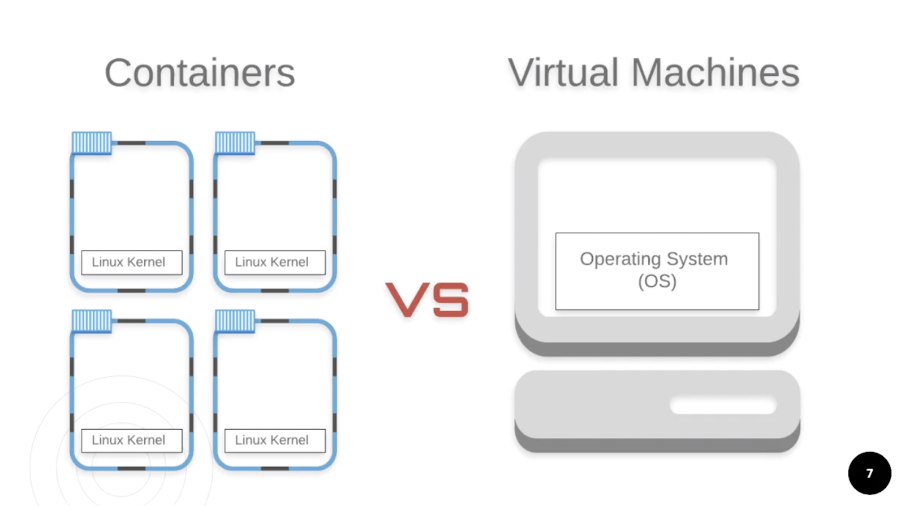
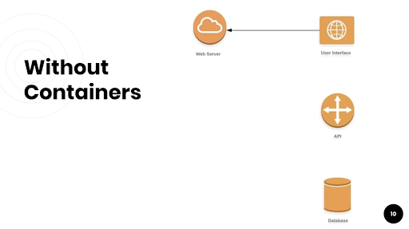
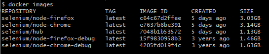
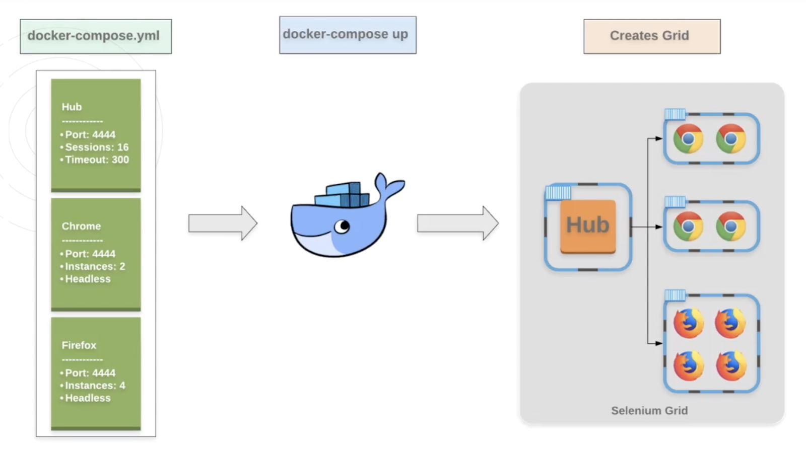

# 1 - Introduction to Docker

## What is Docker?
> Docker is designed to build, ship, and run business critical applications in production at scale.

You can build and share containers and automate the development pipeline from a single environment. Each of these containers represents a piece of the app or system.



**Containers** are the building blocks of the containerisation world and allow you to package only the things you need for your application or service without creating a whole operating system, like Virtual Machines. This means they are faster and more lightweight. Containers also give you control over your environment because you can specify exactly what you want each container to look like by using blueprints called Images.


**Images** are the specs or details used to create containers. Just like how images for VMs let you spin up a Windows instance of Vista or XP, or Linux images let you pick between Ubuntu, Debian, or other versions, images for Docker let you specify which services, libraries, or dependencies you need for a container.

## Without Docker

If we look at the structure of this very simple web application, there are four pieces that make up our entire app: The database that stores our information, the API layer to communicate between the UI and the database, the front-end code that is the UI, and the web server to host the UI and APIs.

Without containers, organizations would have to manage each piece of these very manually! This is a super simple example for just one environment, but already we have to track:
* Which version of the front-end code are we on
* Which dependencies are required and what are their versions
* Networking the services so they are connected correctly
* Managing services as each one changes
* etc...

This is why many companies struggle when trying to implement their own CI/CD


Potential issues that arise without Docker containers/images:
* Developers tripping over each other because they are sharing the same Dev or QA environment
* Developers are put into a "queue" because they must wait for Developer A to be done with that test environment or instance of a service
* The bugs you find are caused by "the wrong version" of a service or feature flag
* The bugs you find are "expected" because of your test environment

We do a poor job of controlling our environments, services, and data because of how manual everything is. Docker and containers do a great job of solving this.

## With Docker


Let's take a look at our simple web app example, but using containers instead. We want our web app's image to have the exact configuration we want. Our code is in React + Typescript, but it is managing its own dependencies. Really, all we need is to specify the exact version of our front-end that we want to use.

We'll label it "DEV" so other DEV services can see and use it. We want the latest version from the Dev Branch and we'll automatically link it to the Web Server so the networking is done for us. We even put our Web Server into a container so we can spin both up at the same time and have them automatically connected!

If we defined each of our services as an image, we could containerize all of them and spin up our entire application with one command and have it all connected for us!

## Why Docker with Grid?


**How does this apply to running Selenium tests and why use Docker when some of you already have a Selenium Grid setup?**
1. For starters, setting up Selenium Grid is also a manual and tedious task. You need to download and run the Selenium Server, configure your hub and nodes for each machine, and run multiple commands in the command line that can be verbose.
2. Other problems include not being able to easily manage versions of the grid or browsers, it's hard to manage your hub and nodes because they get into bad states, and a lot of it has to be done, again, manually!

In the context of this course, we will be using headless and non-headless Chrome and Firefox images and a Selenium Grid image to spin up as many containers as we need! With a few simple commands, we'll spin up, restart, and tear down an entire grid in seconds.

## Quiz
1. **Which is NOT true about containers?**
   They create an entire operating system

2. **Images are**
   The "blue prints" to create containers

3. **Which are problems that containers can solve?**
   * Managing versions of services is manual and complex
   * Static environments because it's difficult to create environments
   * One small change requires the entire app to be tested

4. **Docker is designed**
   To build, ship, and run business critical applications at scale by using containers

## Resources
[.NET Core 2.1 Installation](https://dotnet.microsoft.com/download/dotnet-core/2.1)
[VS Code](https://visualstudio.microsoft.com/downloads/)
[Docker Compose Documentation](https://docs.docker.com/compose/overview/)

# 2 - Installing Docker

Because Docker Containers use Linux kernels, using Docker with Mac or Linux is easiest and the best experience, but it works for Windows as well.

## Installation for Windows
**Prerequisites:**
* Windows 10, 64 bit
* Virtualization is enabled in BIOS. Typically, virtualization is enabled by default. This is different from having Hyper-V enabled
  * [Microsoft Support Article](https://support.microsoft.com/en-us/windows/enable-virtualization-on-windows-c5578302-6e43-4b4b-a449-8ced115f58e1)
* At least 4GB of RAM

**Steps:**
1. Go to www.docker.com
2. Click Get Started
3. Click Download for Windows
4. Create a Docker account and login
5. Click Get Docker
6. Install Docker and start the Docker app
7. Open Command Prompt or Powershell
8. Run ``docker version`` to check that it worked!

`````shell
mattf@LAPTOP-OIHM264A MINGW64 /
$ docker version
Client:
 Version:           28.1.1
 API version:       1.49
 Go version:        go1.23.8
 Git commit:        4eba377
 Built:             Fri Apr 18 09:53:24 2025
 OS/Arch:           windows/amd64
 Context:           desktop-linux

Server: Docker Desktop 4.41.2 (191736)
 Engine:
  Version:          28.1.1
  API version:      1.49 (minimum version 1.24)
  Go version:       go1.23.8
  Git commit:       01f442b
  Built:            Fri Apr 18 09:52:57 2025
  OS/Arch:          linux/amd64
  Experimental:     false
 containerd:
  Version:          1.7.27
  GitCommit:        05044ec0a9a75232cad458027ca83437aae3f4da
 runc:
  Version:          1.2.5
  GitCommit:        v1.2.5-0-g59923ef
 docker-init:
  Version:          0.19.0
  GitCommit:        de40ad0
`````
## Resources
[Docker Installation Docs](https://docs.docker.com/install/)
[Enable Virtualization in BIOS](https://www.tutorialspoint.com/windows10/windows10_virtualization.htm)

# 3 - Setting up Docker
There are three main pieces to the setup of our grid:

1. The Docker machine with the Docker Engine
2. The "Hub" container
3. And the "Node" containers with the browsers that are connected to the Hub


Our tests are run against the Hub which balances them across the Nodes.

You can run docker commands and tests through your laptop, so think of it as the Docker Engine that the hub is connected to which ultimately connects the browser nodes.

**Docker Hub has the Images**
Hub and Nodes are containers. Containers need to be started by using images.

We get these images from a place called **Docker Hub **which is a repository for holding our images. You can either save your images to the hub, or you can download them from the hub!

1. Go to www.hub.docker.com and sign in 
2. Enter 'Selenium' in the search field
3. Look for the official images from Selenium. These are the images that start with 'selenium' or are by selenium
4. Find 'seleniun/hub' and click on it
5. This opens the Image Details and provides some information about the image, like the commands to pull the image
6. Cope the command and paste it into your terminal, i.e. git bash, & hit enter
7. You now have the _selenium/hub_ image installed

You can see what images are installed by running ``docker images``

## Pull the Images
Now that the Hub container has been downloaded, we want to do the same thing for the headless and non-headless browsers by running the following commands:

``docker pull selenium/node-chrome``
``docker pull selenium/node-chrome-debug``
``docker pull selenium/node-firefox``
``docker pull selenium/node-firefox-debug``

> NOTE: The non-debug images are headless, and the debug images are not.

Now you should see 5 images when you run ``docker images``


We can start creating containers now that we have the images. You are able to run and start containers one at a time through the docker run command, but we don't want to create one container at a time. We'd rather create the containers and network them together in ONE command.


## Docker Compose & YML Overview


**docker-compose** is part of Docker but has its own commands and uses a yml file to know which images you want to use, how you want to create your containers, and link them together. You define a single yml file with the services you want and then use the following command to create all of it at once.

> NOTE: had to change some stuff from the course based on - [docker-selenium github Dev and Beta Channel Browser Images
](https://github.com/SeleniumHQ/docker-selenium/tree/trunk?tab=readme-ov-file#dev-and-beta-channel-browser-images)
> There was also some changes to propery names such as ``SE_EVENT_BUS_HOST`` - doc reference [docker-selenium github](https://github.com/SeleniumHQ/docker-selenium)
> New lines marked with ``# NEW``
> Removed lines marked with ``# REMOVED``

````yaml
name: "Selenium Grid Docker Demo"

# Containers
services:
   # 1st Container called selenium-hub
   selenium-hub:
      image: selenium/hub
      ports:
         - "4442:4442"
         - "4443:4443" # NEW
         - "4444:4444" # NEW
      environment:
         # 16 browsers at a time on this grid
         GRID_MAX_SESSION: 16
         # Grid timeouts are recommended to be 300 seconds
         GRID_BROWSER_TIMEOUT: 300
         GRID_TIMEOUT: 300

   # 2nd Container called chrome
   chrome:
      image: selenium/node-chrome

      # has to wait selenium-hub to be up & running before this can be successfully marked as created
      depends_on:
         - selenium-hub

      environment:
         # link to selenium hub container
         SE_EVENT_BUS_HOST: selenium-hub # NEW
         #HUB_PORT_4444_TCP_ADDR: selenium-hub # REMOVED
         #HUB_PORT_4444_TCP_PORT: 4444 # REMOVED


         # 2 Chrome browsers per container
         SE_NODE_MAX_SESSIONS: 2
         # NODE_MAX_SESSION: 2 # REMOVED
         # NODE_MAX_INSTANCES: 2 # REMOVED
      # volumes:
      #   - /dev/shm:/dev/shm

   # 3rd Container called firefox
   firefox:
      image: selenium/node-firefox

      # has to wait selenium-hub to be up & running before this can be successfully marked as created
      depends_on:
         - selenium-hub
      environment:

         # link to selenium hub container
         SE_EVENT_BUS_HOST: selenium-hub # NEW
         #HUB_PORT_4444_TCP_ADDR: selenium-hub # REMOVED
         #HUB_PORT_4444_TCP_PORT: 4444 # REMOVED

         # 4 Firefox browsers per container
         SE_NODE_MAX_SESSIONS: 4 # NEW
         # NODE_MAX_SESSION: 4 # REMOVED
         # NODE_MAX_INSTANCES: 4 # REMOVED
````
## Spin up our Grid using Docker Compose
Save the file as docker-compose.yml. Open your terminal in the directory where you just saved your yaml file and run:
``docker-compose up -d``

After the process is completed, run:
``docker ps -a``
This will list all of your containers. Observe that you have 3 containers running: hub, chrome, and firefox.


Because this also spun up your grid and linked your chrome and firefox nodes, we can visually take a look at our grid in a browser!
Just go to http://localhost:4444/grid/console and you'll see a firefox container with 4 browser and a chrome container with 2 browsers!

## Teardown or Restart Grid
**Restart**
``docker-compose restart``
> Note: I noticed that if you change a value in the ``docker-compose.yml`` changes aren't always reflected, maybe containers are cached for a period?
> It seems doing ``docker-compose down`` then ``docker-compose up`` is a better way.

**Teardown**
``docker-compose down``

**Logs**
``docker logs <container-id>``

**Pipe Logs to File**
``docker logs <container-id> > filename.log``

## Resources
[Docker Compose Documentation](https://docs.docker.com/compose/overview/)

## Quiz
1. **What are the main pieces of the setup of our Grid?**
   * Docker Engine
   * Hub
   * Browser Nodes

2. **Where do we get images from?**
   Docker Hub at hub.docker.com

3. **What is the Docker command to download images?**
   ``docker pull``

4. **What is the Docker command to list your images?**
   ``docker images``

5. **Which file is used for docker-compose up?**
   ``docker-compose.yml``

6. **What is the docker-compose command to restart your Grid?**
   ``docker-compose restart``

7. **What is the docker-compose command to completely tear down the Grid?**
   ``docker-compose down``

# 4 - Scaling Tests
## Test Requirements and Tips
1. Tests are 100% independent. This means that Test B does not require Test A to run first.
2. The Driver should not be shared. Each test needs to have its own instance of a Driver. This means anything dependent on the Driver, like page classes in the Page Object Model, must also follow this rule.
3. The test results and data will be saved to the machine running the Docker Engine or that is the main Manager node.
4. It may be helpful to label logs, files or directories with a unique hash, GUID, or timestamp since your tests will be run concurrently multiple times.

## What are we Testing?
The website is [lolesports.com](lolesports.com)

## Dive into Code
The most important pieces are the RemoteWebDriver class and the URL we pass into its constructor to connect that driver to the Grid.

### RemoteWebDriver
**code/Esports/Framework/Selenium/DriverFactory.cs**

DriverFactory.Build() requires a type of browser, either local to run on your laptop or remote to run on my Grid, and the browser you want to use, either Chrome or Firefox. If type equals "remote", the code will reach this else/if block and call BuildRemoteWebdriver().

This method uses the RemoteWebDriver class and requires that we pass in the URI to the Docker Grid, which is http://localhost:4444/wd/hub, and any other options like ``--start-maximized`` that we'd like to use as well. Then we return our newly created driver.

```cs
using System;
using OpenQA.Selenium;
using OpenQA.Selenium.Chrome;
using OpenQA.Selenium.Firefox;
using OpenQA.Selenium.Remote;

namespace Framework.Selenium {
    public static class DriverFactory {
        public static IWebDriver Build(string type, string browser) {
            if (type == "local"){
                switch (browser){
                    case "chrome":
                        return BuildChromeDriver();
                    case "firefox":
                        return BuildFirefoxDriver();
                    default:
                        throw new ArgumentException($"{browser} is not supported locally.");
                }
            }

            else if (type == "remote") {
                return BuildRemoteDriver(browser);
            }
            else{
                throw new ArgumentException($"{type} is invalid. Choose 'local' or 'remote'.");
            }
        }


        private static RemoteWebDriver BuildRemoteDriver(string browser) {
            var DOCKER_GRID_HUB_URI = new Uri("http://localhost:4444/wd/hub");
            RemoteWebDriver driver;

            switch (browser) {
                case "chrome":
                    var chromeOptions = new ChromeOptions{
                        BrowserVersion = "",
                        PlatformName = "LINUX",
                    };
                    chromeOptions.AddArgument("--start-maximized");
                    driver = new RemoteWebDriver(DOCKER_GRID_HUB_URI, chromeOptions.ToCapabilities());
                    break;

                case "firefox":
                    var firefoxOptions = new FirefoxOptions{
                        BrowserVersion = "",
                        PlatformName = "LINUX",
                    };
                    driver = new RemoteWebDriver(DOCKER_GRID_HUB_URI, firefoxOptions.ToCapabilities());
                    break;
                default: throw new ArgumentException($"{browser} is not supported remotely.");
            }
            return driver;
        }

        private static ChromeDriver BuildChromeDriver() {
            var options = new ChromeOptions();
            options.AddArgument("--start-maximized");
            return new ChromeDriver(FW.WORKSPACE_DIRECTORY + PlatformDriver, options);
        }

        private static FirefoxDriver BuildFirefoxDriver() {
            return new FirefoxDriver(FW.WORKSPACE_DIRECTORY + PlatformDriver);
        }

        private static string PlatformDriver {
            get{
                return Environment.OSVersion.Platform.ToString().Contains("Win")
                    ? "_drivers/windows"
                    : "_drivers/mac";
            }
        }
    }
}
```

### TestBase and Configuration
**code/Esports/Tests/Base/TestBase.cs**
We're calling our ``DriverFactory.Build()`` method whenever we initialize a new ``Driver``, and that's done in our ``TestBase`` class. This class has a ``Setup`` method, which is run before every test, and a ``Cleanup`` method, which is run after every test. Notice how we pass in a type and browser into our ``Driver.Init()`` method? Those are the values that determine the driver configuration and are located in an JSON settings file called ``config.json`` that NUnit uses in its ``TestContext`` class.

Be default, we are using a remote chrome driver, but we can easily change these values and have them affect all of our test suites.
````cs
using Framework;
using Framework.Selenium;
using League.Com;
using NUnit.Framework;

namespace Tests.Base {
    public abstract class TestBase {
        protected TestBase() {
            FW.Init();
        }

        [SetUp]
        public virtual void Setup() {
            Driver.Init(
                type: FW.Config.Driver.Type,
                browser: FW.Config.Driver.Browser,
                setWait: FW.Config.Driver.Wait
            );
            Esports.Init();
        }

        [TearDown]
        public virtual void Cleanup() {
            Driver.Quit();
        }
    }
}

````

### Test Suite Structure
**code/Esports/Tests/Standings.cs**

Each test is decorated with the ``Parallelizable`` attribute to they can run in parallel, and each test will have its own instance of a ``Driver`` and Page Objects. We then have them categorized for easy filtering.

## Running The Tests
I had to install .NET from [here](https://dotnet.microsoft.com/en-us/download/dotnet/thank-you/sdk-8.0.409-windows-x64-installer)

Command to run the tests:
``dotnet test --filter testcategory=demo``

To run tests on the Grid:
1. Change the ``config.json`` file to ``"type": "remote",``
2. Spin up the Docker containers with ``docker-compose up -d``
3. Run the test command ``dotnet test --filter testcategory=demo``

## Scale Containers to Run More Tests
Docker handles this easily by using the docker-compose.yml we already created! In the terminal, run the following:
``docker-compose up -d --scale chrome=10``


## Quiz
1. **Tests should NOT share a WebDriver**
   True

2. **Tests should be dependent on each other**
   False

3. **Which WebDriver class do we use for the Grid?**
   RemoteWebDriver

4. **What was the URI we passed to the WebDriver to connect to the Grid?**
   http://localhost:4444/wd/hub

5. **If I wanted to scale my chrome containers to 10, which command would I use?**
   docker-compose up -d --scale chrome=10

## Resources
[LoL Esports Website](https://lolesports.com/)
[Esports Automation Repo](https://github.com/elsnoman/esports-automation)
[dotnet test Command Documenation](https://docs.microsoft.com/en-us/dotnet/core/tools/dotnet-test?tabs=netcore21)
[Docker Compose Scale Documentation](https://docs.docker.com/compose/reference/scale/)
[Desired Capabilities Documentation](https://github.com/SeleniumHQ/selenium/wiki/DesiredCapabilities)
[Local Selenium Grid Console](localhost:4444/grid/console)
[Selenium Grid Documentation (non-Docker)](https://seleniumhq.github.io/docs/grid.html)

# 5 - Scaling Containers
## One Machine isn't Enough
One machine can only scale so far before running out of resources. In other words, you can only create so many containers and browsers on one machine.

## Introducing Swarm
We solve this by connecting multiple machines together that each have a Docker Engine. A collection of Docker Engines joined into a cluster is called a **Swarm**.


Here we have six Linux VMs. These could be physical machines, or virtual machines created with something like VirtualBox, or even cloud instances like ec2's from AWS. Either way, you need to know their IPs and configure some ports so they can communicate with each other. Then you just join each machine into the swarm. Each machine in the swarm is called a Node.

Swarms consist of Manager Nodes and Worker Nodes. Worker Nodes listen for tasks sent by the Manager Nodes and then execute them. Manager Nodes can execute tasks just like Workers, but they are also in charge of sending tasks to Workers and maintaining the **Desired State** of the Swarm.

## Desired vs Actual State


Desired State is just what we want our swarm to look like.

If our Desired State was to have 6 nodes with 3 managers and 3 workers where the lead would have the Hub and the rest of the nodes would have one or more containers of Firefox browsers, then Docker Swarm would make sure that its Actual State always matched the Desired State.
So if our Hub and one of our worker nodes went down or got stale or anything else for whatever reason, then Docker would detect this and spin up an entirely new Lead Manager with a hub and a Worker with new Firefox containers for us

## Docker Stack
A stack is a group of interrelated services that share dependencies, and can be orchestrated and scaled together.


When we needed to scale containers on our one machine, we used:
> ``docker-compose up``

Docker Stack does the same thing but allow us to deploy our services across an entire swarm in one command! The best part is that you can even use the same ``docker-compose.yml`` file you were using before.

### How to start?
Steps to get started with Docker Swarm:
1. You need more than one machine and Docker must be installed on each.
2. You need to know their IPs and network them successfully. You may need to remove some firewalls for example.
3. Run this command on the first machine to start the swarm and have a Lead Manager Node:
   ``docker swarm init``
   This will also provide you with the commands and tokens needed to join other machines as workers or managers.
4. Run this command in the terminal of the other machines to join them to the swarm:
   ``docker swarm join``
   You will have two tokens to choose from - one that joins the machine as a manager and another that joins the machine as a worker.
5. Once you have all the nodes you want in the swarm connected, then deploy your stack against your swarm. Remember that this uses the docker-compose.yml file to easily spin up your Selenium Grid.
6. Now you can start running your tests at any scale! Just remember to change the URL that you pass into your ``RemoteWebDriver`` so the tests target the Grid correctly.

## Quiz
1. **A collection of Docker Engines joined into a cluster is called a**
   Docker Swarm

2. **You can only use Virtual Machines in a Docker Swarm**
   False

3. **Manager Nodes can execute tasks like Worker Nodes**
   True

4. **Which is true about Docker Swarm?**
   Swarm will maintain the Desired State for you automatically

5. **Which Docker command is used to initialize a Swarm?**
   ``docker swarm init``

6. **The token to add a Worker or Manager Node is the same**
   False

7. **Docker must be installed on each machine you want to join to the swarm**
   True

8. **Which is NOT true about Docker Stack?**
   Stack will initialize the Swarm for you
   
## Resources
[SeleniumHQ Official "Getting Started with Docker Compose"](https://github.com/SeleniumHQ/docker-selenium/wiki/Getting-Started-with-Docker-Compose)
[Docker Swarm Documenation](https://docs.docker.com/get-started/part4/)
[Docker Stack Documentation](https://docs.docker.com/get-started/part5/)
[Getting started with Kubernetes and Selenium](https://itnext.io/scaling-selenium-test-execution-with-kubernetes-c79bc53979f5)
[Jenkins with Docker Documentation](https://github.com/jenkinsci/docker)