# 1 - Basic Concepts
When we think of load and performance issues, we often think of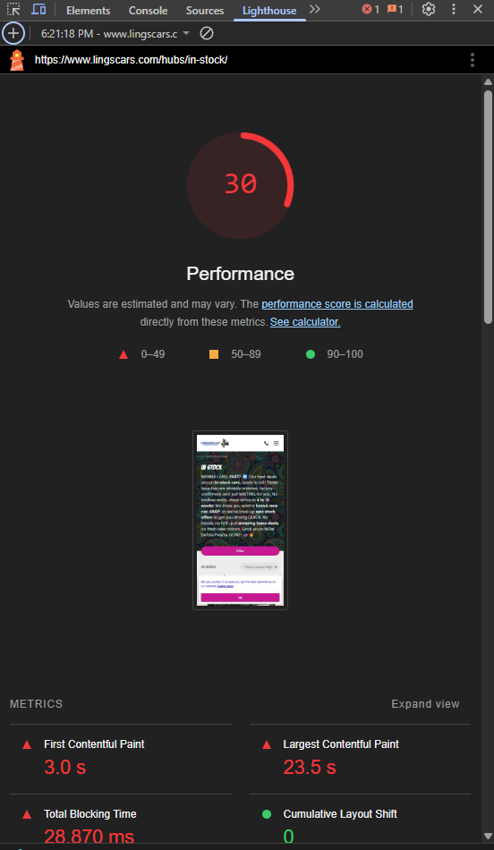 outages where websites are going down at the least opportune times and that is certainly an issue.
**But it's more than just websites going down.**
The speed and responsiveness of your website or application has a direct impact on how long customers will stay at your site and how likely they are to actually spend money.

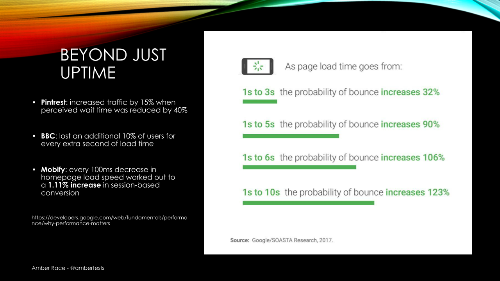

## Performance vs Load Testing
Performance and load testing are often grouped together, but they're actually quite different.

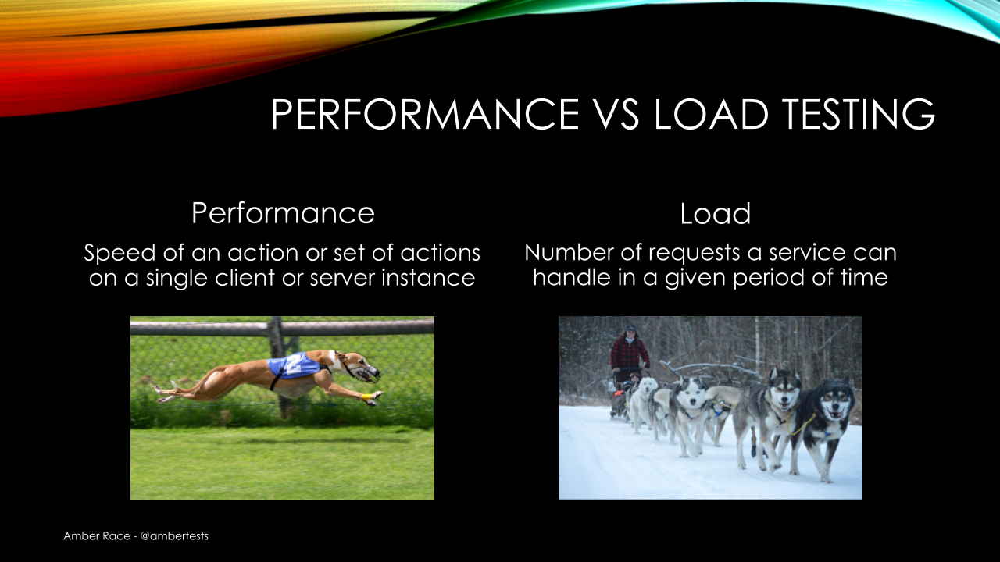

When testing for performance we're testing the speed of an action or a set of actions on a single client or server instance. The most obvious example of this is page load time. That would be a performance test, but it's not a load test because it's only happening on the one single client.

For load testing, we're looking at the number of requests a service can handle in a given period of time.

## What are the factors that we need to consider when looking at client performance?
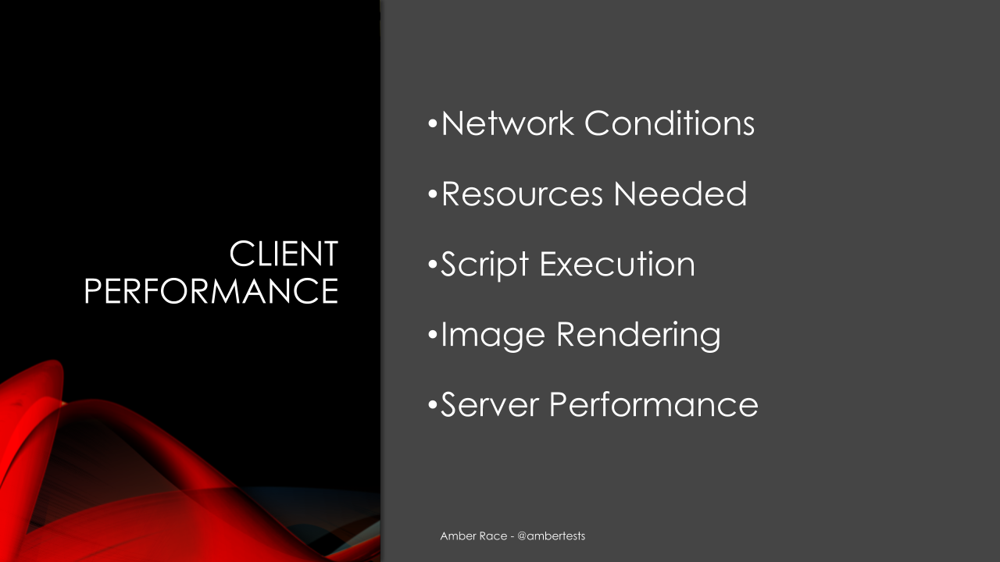
 * **Network Conditions** - The way your website or application handles various network conditions is going to have the greatest impact on how people experience your application
 * **Resources Needed** - The _number of resources needed_ to load your webpage or to run your application is also a major factor, not just the quantity of resources but also the size
 * **Script Execution** - Whether there's a lot of scripts or if there's bugs in the scripts that are making them run slowly. Scripting can have a major effect on how responsive your application appears
 * **Image Rendering** - Image rendering on the browser of a mobile device is actually the most visible aspect of client performance and is definitely something that needs to be considered. If you have a lot of images or a complex set of images, it's going to take longer than something that's simple
 * **Server Performance** -  If your application is making an API call and that API call takes a long time, that of course it's going to affect the perceived speed of your application

## What do we need to look at with server performance?
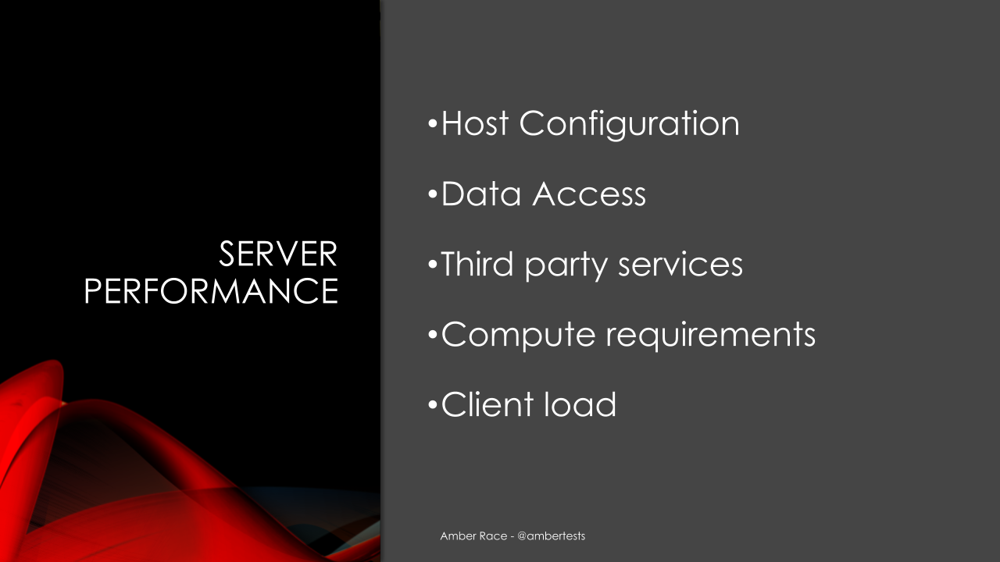
 * **Host Configuration** - This means how many boxes is the service running on? How much CPU do they have? How much memory do they have? Are they in the cloud? Are they co-located with the database? There's a lot of different aspects here to do with the configuration of the service and they can all have a major impact on the server performance
 * **Data Access** - Almost all services are working with data in some respect. If that data is in a database, does the service need to retrieve it every time or is it cached for faster access?
 * **Third party services** - If your service is working with a lot of third-party services or in a microservice environment, that can also have a big effect on the performance of your server
 * **Compute Requirements** - Of course, the core functionality of the service, what it's actually doing — the compute requirements. If you're doing a lot of complex algorithms or data management, that's going to take longer than just retrieving information and giving it back to the client.
 * **Client Load** - Your server might work great with one client attached to it, but when it has a million clients attached to it, it's going to be a lot more difficult for it to work in a speedy fashion.

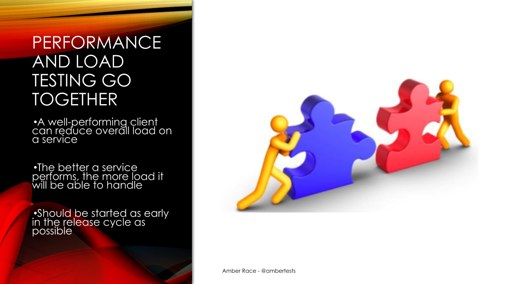

A well-performing client that's caching its resources and not depending on the back-end service for everything can reduce overall load and make the service itself faster.

And of course, the better a service performs, the more load it will be able to handle.

So, given the complexity of server performance and client performance and client load and how everything works together, it's really important to start thinking about your performance and load testing strategy as soon as possible in the test cycle. You don't want to be two weeks out from a major release and then realizing you don't even know if you're going to be able to handle the traffic that you're trying to get.

# 2 - Testing Web Clients
We'll start by looking at some tools that you can use in your browser to test both regular and mobile websites.
When we're using these tools, we want to look for:

**1. When the page is visible?**
When will the user know that something is actually happening on the web page?

**2. When is the page itself usable?**
When can somebody start entering things into a form? Things like that.

**3. How are resources being handled?**
Is there a large quantity of images? Or, are there very large images, or scripts that need to be downloaded?

**4. How much scripting is there?**
Are there a lot of different scripts going on? Are they blocking the main thread, so that the page is not usable while the scripts are running? Are there bugs in the scripts that are perhaps making them slower than they should be? These are all things to look at.

**5. Is the network usage being optimized?**
Is the site using a content delivery network so that the images are being sourced from a location that's closest to the client? And, if resources aren't immediately available, is the webpage able to handle that situation? Or, is it blocked? Another aspect of network usage is how many background requests are being made. This can include getting resources, API requests, any of that sort of thing.

## Chrome Developer Tools
When you're working with the Chrome Developer Tools, you want to start with an incognito window. This is so any ad blockers, or any other extensions you have on your regular browser don't interfere with the default workings of the website under test.

In order to get to the developer tools:
1. You can use the three-dot menu here (in the top right corner), and go to More Tools > Developer Tools;
2. Right Click > Inspect
3. CTRL + Shift + I

### Performance Tab
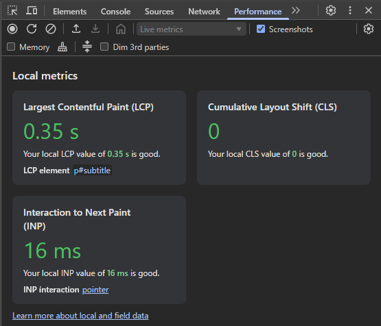

To start with we're going to look at a website that actually is quite speedy, which is [etsy.com](https://etsy.com)

We can run an actual monitoring test by hitting the reload button here:
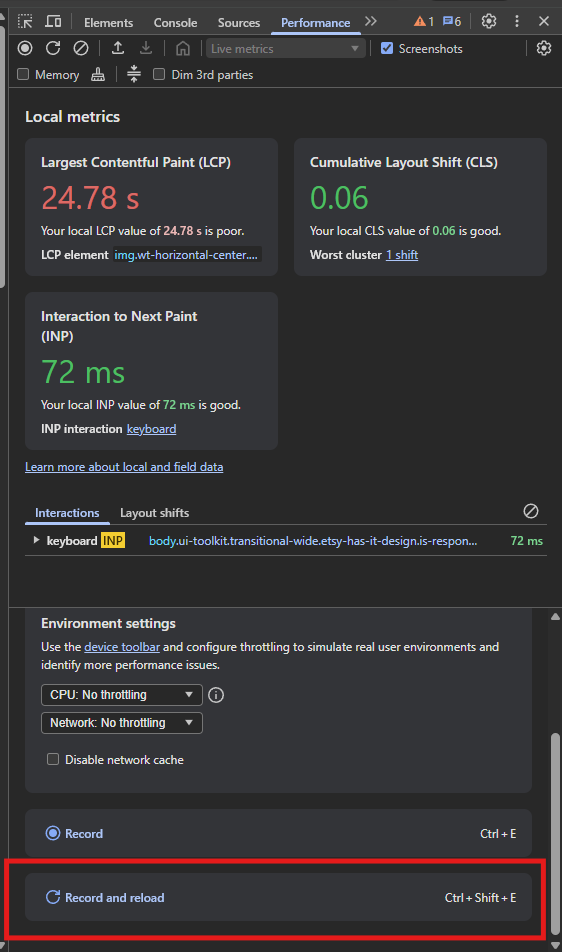

Now, it's done and, we have a wealth of data to look at
#### Network
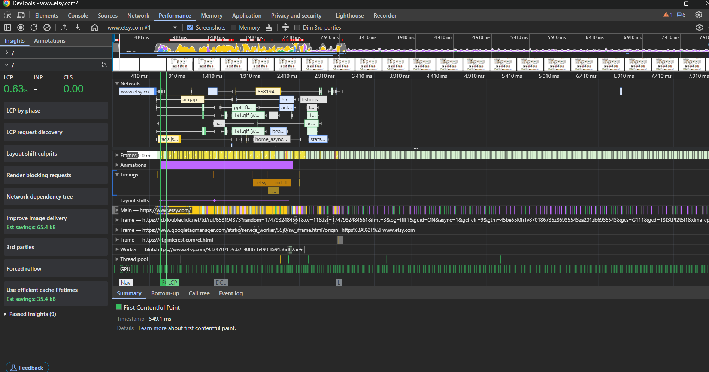
This is where it's loading the main etsy.com page, and there are lines here that show you the interesting events

This is where it's loading the main etsy.com page, and there are lines here that show you the interesting events, and if you go to Timings, this timings thing we see things like FCP, LCP, DCL and L. These are the terms that Google is using to decide it's benchmarking.

* First Contentful Paint (FCP) - when the page first looks like something happens
* Largest Contentful Paint (LCP) - when the largest item it loaded in the browser
* Domain Content Loaded (DCL) - that's when the entire document model has been loaded into the browser
* L - Loaded

#### Timings
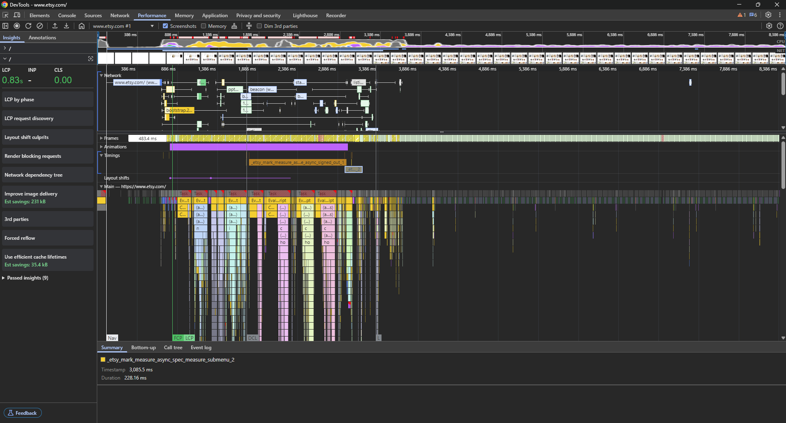

#### Summary
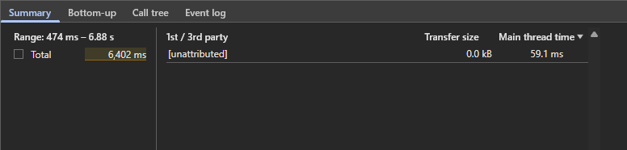

#### Investigating 1 Element - Picture Load
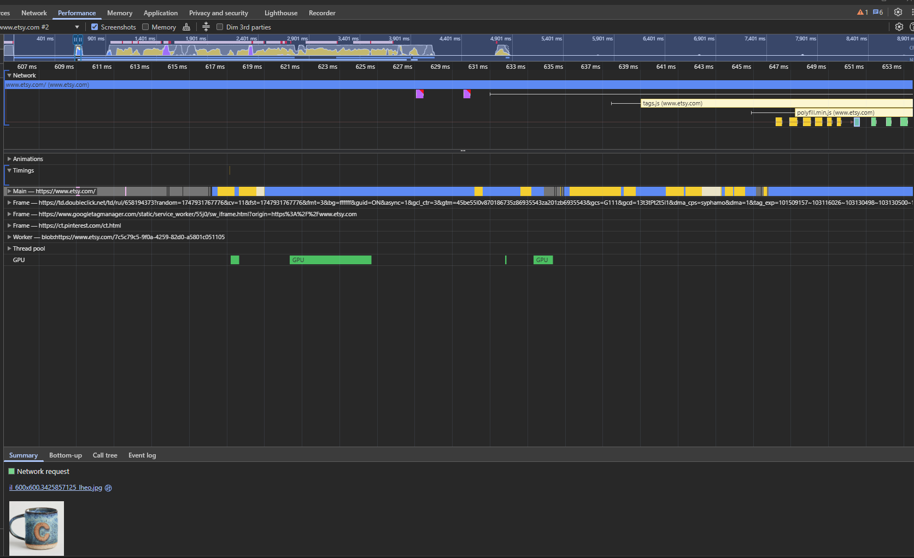

### Lighthouse Tab
Options to run a report:
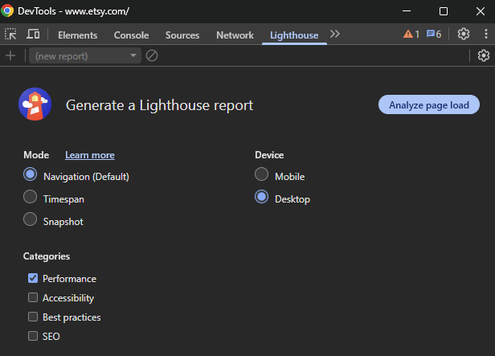

Report running: 
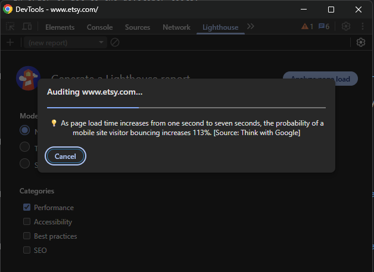

Report results:
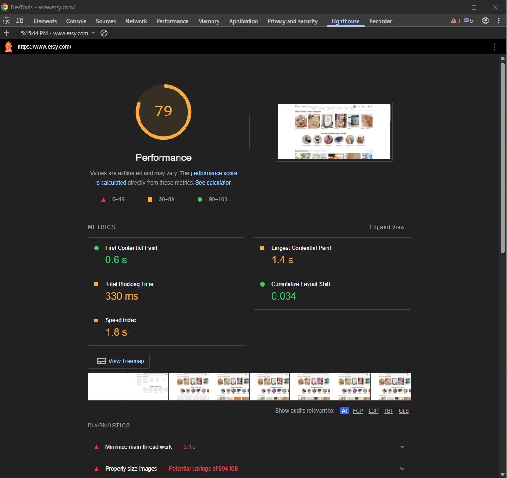

Diagnostics:
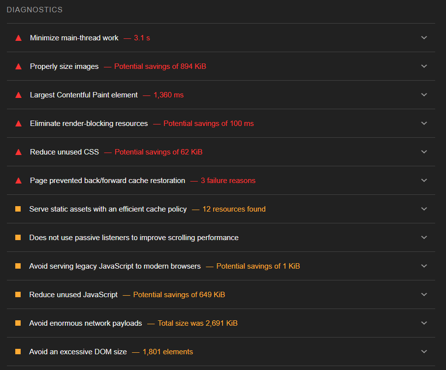
Potential improvement ideas listed

## Page Speed Insights
The auditor that was in the tab is also available on its own web page called Page Speed Insights and this is actually running out of Google's Labs, and it will run the test on its own machines. It's a more consistent test than something that's subject to the vagaries of your own wireless network.

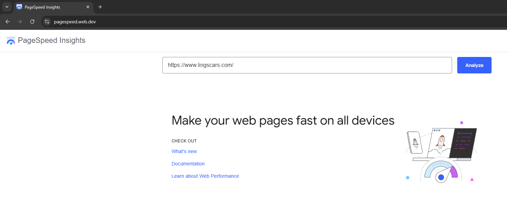

**Report Output**
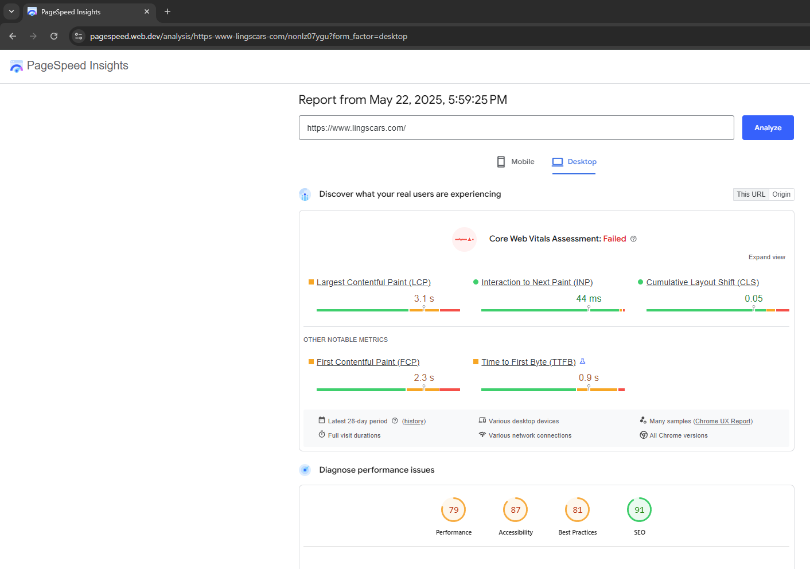
This is a great way to look at a website, sort of a more neutral viewpoint than just maybe your own machine to get an idea of what's going on with it.

## WebPage Test 
WebPageTest - [webpagetest.org](https://webpagetest.org)

This is an open source site, and there's quite a lot you can do with this. We put in lingscars, and we can select our location. Instead of North America, we could actually select a location in Europe.
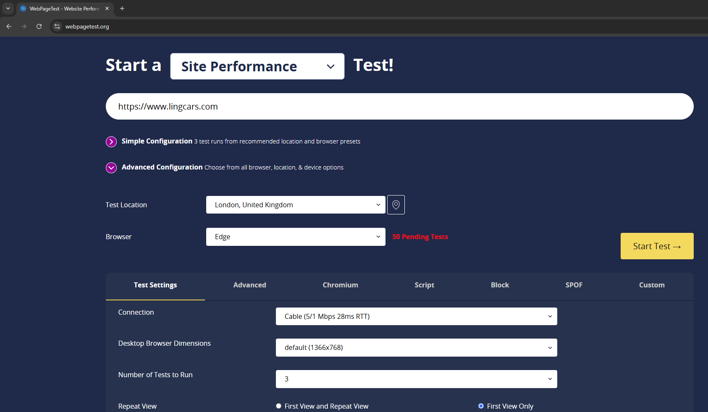

Sometimes there a queue
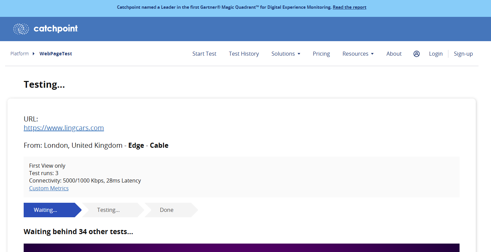

When the test is run we get a report
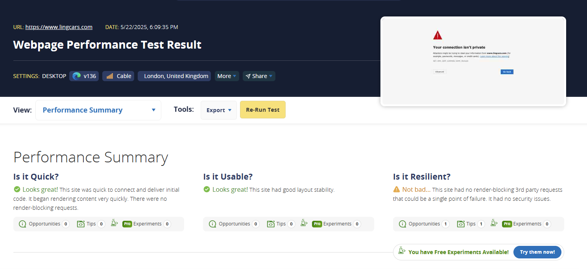

## Quiz
**1. What does “First Contentful Paint” mean?**
    The first time a new page is visible to the user

**2. What is one way a CDN (Content Delivery Network) can help with performance?**
    By hosting content in various locations to better serve people in different places

**3. Which performance property can you profile with Chrome Developer Tools?**
* Frames per second
* Request response time
* Time spent running scripts

**4. How can scripts affect the performance of a web page?**
* By blocking further content loading
* By making additional network requests

**5. Tests on WebPageTest can be run on...**
    Real devices in various locations

## Resources
[Chrome Dev Tools](https://developers.google.com/web/tools/chrome-devtools/)
[Page Speed Insights](https://developers.google.com/speed/pagespeed/insights/)
[WebPageTest: Test a websites performance](https://www.webpagetest.org/)

# 3 - Mobile Testing
There are extra considerations on a mobile device
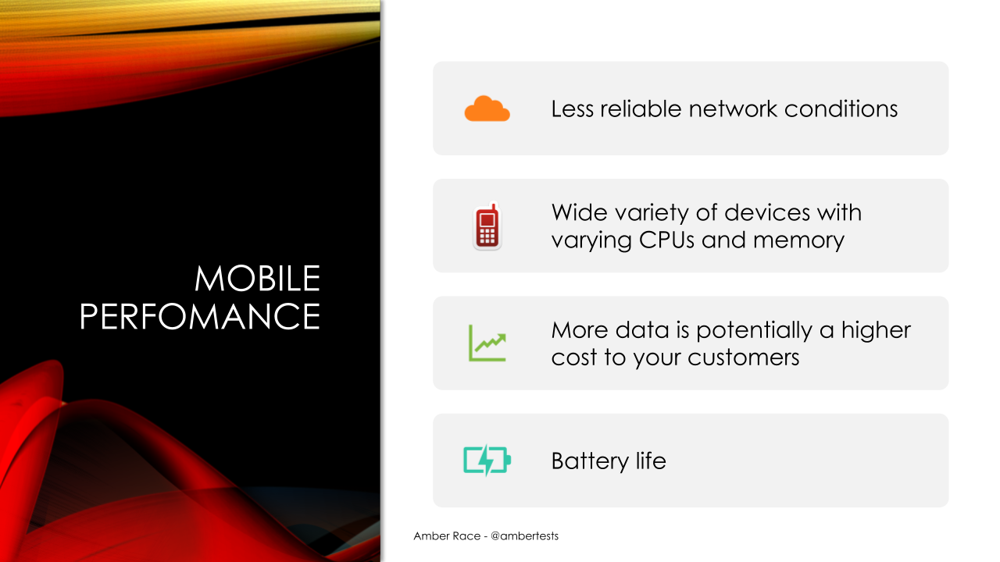

First of all, the network conditions are even less reliable than with regular Wi-Fi and you have a variety of CPUs and memory and whether it's Android or iOS. There's a lot of different performance variables within the devices themselves.

Also, the more data you're downloading, your customers might actually be paying for that data. So, you have to be more cognizant of the quantity of images and scripts, etc, that you're downloading to each customer's device.

Finally, the battery life is very important. If you have very complicated images that are rendering, that costs a lot of battery for the devices.

## Chrome Developer Tools - Mobile
There's a button to toggle the website into mobile.
You can also select a mobile device to emulate - Let's say iPhone 12 Pro and we can choose if it's mid-tier etc to simulate mobile netwro.
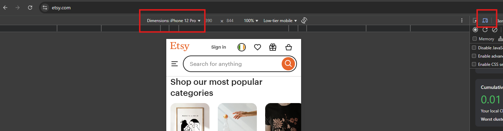

Now that we're in mobile mode, we can do another audit with Lighthouse, this time selecting mobile.
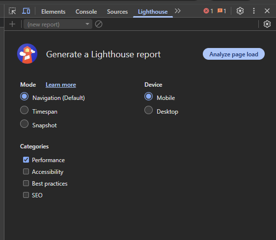

Resulting report:

