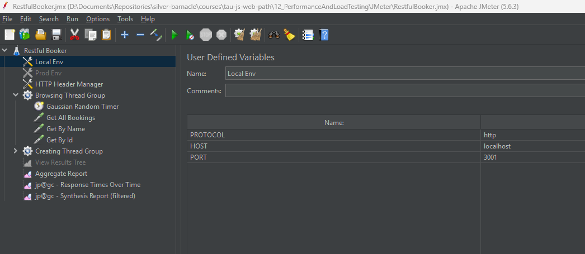
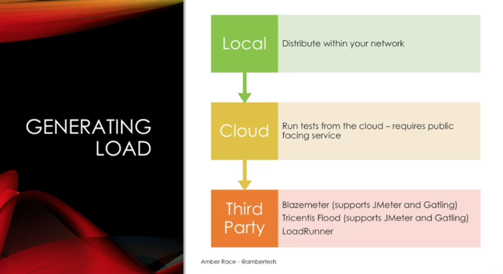

# 1 - Basic Concepts
When we think of load and performance issues, we often think of outages where websites are going down at the least opportune times and that is certainly an issue.
**But it's more than just websites going down.**
The speed and responsiveness of your website or application has a direct impact on how long customers will stay at your site and how likely they are to actually spend money.


## Performance vs Load Testing
Performance and load testing are often grouped together, but they're actually quite different.


When testing for performance we're testing the speed of an action or a set of actions on a single client or server instance. The most obvious example of this is page load time. That would be a performance test, but it's not a load test because it's only happening on the one single client.

For load testing, we're looking at the number of requests a service can handle in a given period of time.

## What are the factors that we need to consider when looking at client performance?

 * **Network Conditions** - The way your website or application handles various network conditions is going to have the greatest impact on how people experience your application
 * **Resources Needed** - The _number of resources needed_ to load your webpage or to run your application is also a major factor, not just the quantity of resources but also the size
 * **Script Execution** - Whether there's a lot of scripts or if there's bugs in the scripts that are making them run slowly. Scripting can have a major effect on how responsive your application appears
 * **Image Rendering** - Image rendering on the browser of a mobile device is actually the most visible aspect of client performance and is definitely something that needs to be considered. If you have a lot of images or a complex set of images, it's going to take longer than something that's simple
 * **Server Performance** -  If your application is making an API call and that API call takes a long time, that of course it's going to affect the perceived speed of your application

## What do we need to look at with server performance?

 * **Host Configuration** - This means how many boxes is the service running on? How much CPU do they have? How much memory do they have? Are they in the cloud? Are they co-located with the database? There's a lot of different aspects here to do with the configuration of the service and they can all have a major impact on the server performance
 * **Data Access** - Almost all services are working with data in some respect. If that data is in a database, does the service need to retrieve it every time or is it cached for faster access?
 * **Third party services** - If your service is working with a lot of third-party services or in a microservice environment, that can also have a big effect on the performance of your server
 * **Compute Requirements** - Of course, the core functionality of the service, what it's actually doing — the compute requirements. If you're doing a lot of complex algorithms or data management, that's going to take longer than just retrieving information and giving it back to the client.
 * **Client Load** - Your server might work great with one client attached to it, but when it has a million clients attached to it, it's going to be a lot more difficult for it to work in a speedy fashion.


A well-performing client that's caching its resources and not depending on the back-end service for everything can reduce overall load and make the service itself faster.

And of course, the better a service performs, the more load it will be able to handle.

So, given the complexity of server performance and client performance and client load and how everything works together, it's really important to start thinking about your performance and load testing strategy as soon as possible in the test cycle. You don't want to be two weeks out from a major release and then realizing you don't even know if you're going to be able to handle the traffic that you're trying to get.

# 2 - Testing Web Clients
We'll start by looking at some tools that you can use in your browser to test both regular and mobile websites.
When we're using these tools, we want to look for:

**1. When the page is visible?**
When will the user know that something is actually happening on the web page?

**2. When is the page itself usable?**
When can somebody start entering things into a form? Things like that.

**3. How are resources being handled?**
Is there a large quantity of images? Or, are there very large images, or scripts that need to be downloaded?

**4. How much scripting is there?**
Are there a lot of different scripts going on? Are they blocking the main thread, so that the page is not usable while the scripts are running? Are there bugs in the scripts that are perhaps making them slower than they should be? These are all things to look at.

**5. Is the network usage being optimized?**
Is the site using a content delivery network so that the images are being sourced from a location that's closest to the client? And, if resources aren't immediately available, is the webpage able to handle that situation? Or, is it blocked? Another aspect of network usage is how many background requests are being made. This can include getting resources, API requests, any of that sort of thing.

## Chrome Developer Tools
When you're working with the Chrome Developer Tools, you want to start with an incognito window. This is so any ad blockers, or any other extensions you have on your regular browser don't interfere with the default workings of the website under test.

In order to get to the developer tools:
1. You can use the three-dot menu here (in the top right corner), and go to More Tools > Developer Tools;
2. Right Click > Inspect
3. CTRL + Shift + I

### Performance Tab


To start with we're going to look at a website that actually is quite speedy, which is [etsy.com](https://etsy.com)

We can run an actual monitoring test by hitting the reload button here:


Now, it's done and, we have a wealth of data to look at
#### Network

This is where it's loading the main etsy.com page, and there are lines here that show you the interesting events

This is where it's loading the main etsy.com page, and there are lines here that show you the interesting events, and if you go to Timings, this timings thing we see things like FCP, LCP, DCL and L. These are the terms that Google is using to decide it's benchmarking.

* First Contentful Paint (FCP) - when the page first looks like something happens
* Largest Contentful Paint (LCP) - when the largest item it loaded in the browser
* Domain Content Loaded (DCL) - that's when the entire document model has been loaded into the browser
* L - Loaded

#### Timings


#### Summary


#### Investigating 1 Element - Picture Load


### Lighthouse Tab
Options to run a report:


Report running: 


Report results:


Diagnostics:

Potential improvement ideas listed

## Page Speed Insights
The auditor that was in the tab is also available on its own web page called Page Speed Insights and this is actually running out of Google's Labs, and it will run the test on its own machines. It's a more consistent test than something that's subject to the vagaries of your own wireless network.


**Report Output**

This is a great way to look at a website, sort of a more neutral viewpoint than just maybe your own machine to get an idea of what's going on with it.

## WebPage Test 
WebPageTest - [webpagetest.org](https://webpagetest.org)

This is an open source site, and there's quite a lot you can do with this. We put in lingscars, and we can select our location. Instead of North America, we could actually select a location in Europe.


Sometimes there a queue


When the test is run we get a report


## Quiz
**1. What does “First Contentful Paint” mean?**
    The first time a new page is visible to the user

**2. What is one way a CDN (Content Delivery Network) can help with performance?**
    By hosting content in various locations to better serve people in different places

**3. Which performance property can you profile with Chrome Developer Tools?**
* Frames per second
* Request response time
* Time spent running scripts

**4. How can scripts affect the performance of a web page?**
* By blocking further content loading
* By making additional network requests

**5. Tests on WebPageTest can be run on...**
    Real devices in various locations

## Resources
[Chrome Dev Tools](https://developers.google.com/web/tools/chrome-devtools/)
[Page Speed Insights](https://developers.google.com/speed/pagespeed/insights/)
[WebPageTest: Test a websites performance](https://www.webpagetest.org/)

# 3 - Mobile Testing
There are extra considerations on a mobile device


First of all, the network conditions are even less reliable than with regular Wi-Fi and you have a variety of CPUs and memory and whether it's Android or iOS. There's a lot of different performance variables within the devices themselves.

Also, the more data you're downloading, your customers might actually be paying for that data. So, you have to be more cognizant of the quantity of images and scripts, etc, that you're downloading to each customer's device.

Finally, the battery life is very important. If you have very complicated images that are rendering, that costs a lot of battery for the devices.

## Chrome Developer Tools - Mobile
There's a button to toggle the website into mobile.
You can also select a mobile device to emulate - Let's say iPhone 12 Pro and we can choose if it's mid-tier etc to simulate mobile netwro.


Now that we're in mobile mode, we can do another audit with Lighthouse, this time selecting mobile.


Resulting report:


## Page Speed Insights - Mobile


## WebPageTest - Mobile
Can configure mobile device with 3G network


Test Running


Test Report


## Android Studio Profiler


Select option to _Profile or debug APK_


Select an APK to test


The first thing that Android Profiler is going to do is look at the size of the files on your APK.
This is very important for download times and Google actually has rules about how big APKs can be and also how much space you're taking up on the phone itself.


Now that everything is here, You just push the Profiler button and select your connected device. Now, it's going to install the APK on your device.
You can see that we have CPU, memory, network, and energy.
Every time something happens, you can see the dot highlighted below.
You can watch this for certain spikes when things happen, if it's using too much CPU, too much energy, all that sort of thing, all available here.


## Xcode Instruments

Apple provides similar tooling for iOS devices, except it's a little more complicated, of course, because it's iOS.


You need to have an account that is a developer account with Apple and then you have to have a test application that's built using the development certificate.
You can use Xcode Devices window to load the test application and Xcode Instruments to begin profiling and it'll be very similar to the Android profiler.

## Device Statistics
Finally, you can actually just check your device while you're using application to monitor the resources that it's using.


The battery usage, memory, mobile data usage, all of these things are available on either an Android or an iOS phone and they can be very useful for determining how an application is behaving.

## Quiz
1. **Chrome Dev Tools can emulate a 3G network on your laptop**
    True

2. **How do redirects cause issues for web page performance?**
   By increasing the total number of network calls


3. **WebPageTest can run tests on which device?**
   * Samsung Galaxy S7
   * iPhone SE
   * iPad Mini 2

4. **What has to be enabled on your Android device before profiling with Android Studio?**
   USB Debugging

5. **What profiling information is generally NOT available on a mobile device?**
    Request response speed


## Resources
[Android Studio](https://developer.android.com/studio)
[Instruments Help Topics](https://developer.apple.com/library/archive/documentation/AnalysisTools/Conceptual/instruments_help-collection/Chapter/Chapter.html)

# 4 - Load Testing Tools

## What are the things you want to think about when you're choosing a tool? 
**Open source versus commercial**
If your company already has a license for LoadRunner for example, that is probably the tool that you'll want to use. Whereas if you're just getting started, you might want to pick up an open source tool to begin with. And there's a lot of tools that you can start out open source and then move into an enterprise version of that same tool.

**Local versus cloud**
Are you expecting to run all of your test within your local network or are you outsourcing it to some kind of cloud provider that's going to do the running of the test and give you a report?

**UI vs Script**
Are you more comfortable with tool that has a UI or are you okay with writing a script for your tool in pure code? Something like JMeter which has a graphical interface might be better for somebody who's not as familiar with coding. But developers and other people who are comfortable with code might prefer Gatling or another tool where you can just write scripts directly.

**Integration with other development tools**
If you're in a Visual Studio environment, then it makes sense to use the Visual Studio load testing tool that's available.
Also, if there's already expertise in your company on a certain tool, then by all means leverage that expertise. So, I'm not going to recommend that you use one specific tool and that's the only tool to use. The important thing is to understand what's out there and understand what fits best into your situation.

## Demo using Restful Booker
Using a local instance of Restful Booker API: [Restful Booker API](https://restful-booker.herokuapp.com/)
Test Scenario: Frequent booking lookups and less frequent addition of new reservations

### JMeter
[JMeter Download Page](https://jmeter.apache.org/download_jmeter.cgi)

* GUI based tool written in Java
* First released in 1998
* Rich plugin ecosystem
* You can use JMeter for HTTP calls, FTP calls, web sockets, database, Redis. There's even a web driver plugin for Selenium. Basically, any way that a client and a server can communicate with each other, it's probably covered by a JMeter plugin. And if it's not, you can write your own plugin pretty easily if you're familiar with Java.
* Supports the Groovy scripting engine (scripty Java)
* Supports record & playback
* Supports distributed testing

#### Running JMeter
* Run `bin/JMeter.bat`

#### Setup JMeter for Demo
* Downloaded JMX file for course from [here](https://jmeter.apache.org/download_jmeter.cgi)
* Had to install [JMeter plugin manager](https://jmeter-plugins.org/get/) and put it in the ``lib/ext`` directory
* Got the `.jmx` file with the sample tests from [here](https://github.com/ambertests/tau_perf/blob/master/RestfulBooker.jmx) & saved it at `JMeter/RestfulBooker.jmx`

##### Plugins
Options > Plugins Manager


#### Testing with JMeter
The way that works is you have a test plan & then you can create sort of local variables for your test plan & then you create these thread groups

Each thread essentially represents a user and this particular thread group has a hundred users and it runs for 90 seconds. 


And within this thread group I have these HTTP requests, which is going to the host and looking at the booking, getting it by name, id. So, any HTTP requests you can put together in one of these samplers or you could add more.


This is how you add things and there are lots of options.


Running the tests, output: 

_Response times over time_


_Aggregate report_


Running from the CLI
`` .\apache-jmeter-5.6.3\bin\jmeter.bat -t RestfulBooker.jmx -n -l rb_testresults.csv``


Now that the test is completer we can review the results saved in the ``rb_testresults.csv`` file


### Gatling
* Scala-based tool
  * Scala is a scripting language that runs in the JVM
* First released in 2012
* Pure scripting interface
* Support record & playback
* More modern architecture can support a higher load than JMeter
* Enterprise version is available
* More info @ [https://gatling.io](https://gatling.io)

#### Setup
* Installed Scala plugin in IntelliJ
* Setup Scala SDK by downloading the one recommended in the plugin interface

#### Running Tests

Sample code located [here](https://github.com/ambertests/tau_perf/blob/master/RestfulBookerSimulation.scala)

Each of the objects is essentially the equivilant of a thread group in JMeter
````scala
/**
 * Copyright 2011-2017 GatlingCorp (http://gatling.io)
 *
 * Licensed under the Apache License, Version 2.0 (the "License");
 * you may not use this file except in compliance with the License.
 * You may obtain a copy of the License at
 *
 *  http://www.apache.org/licenses/LICENSE-2.0
 *
 * Unless required by applicable law or agreed to in writing, software
 * distributed under the License is distributed on an "AS IS" BASIS,
 * WITHOUT WARRANTIES OR CONDITIONS OF ANY KIND, either express or implied.
 * See the License for the specific language governing permissions and
 * limitations under the License.
 */
package restfulbooker

import io.gatling.core.Predef._
import io.gatling.http.Predef._
import scala.concurrent.duration._

class RestfulBookerSimulation extends Simulation {

  object Browse {
    val browse = repeat(100) {
      exec(http("get_all_bookings")
      .get("/booking"))
      .pause(300 milliseconds)
      .exec(http("get_by_name")
      .get("/booking?lastname=Smith"))
      .pause(250 milliseconds)
    .exec(http("get_by_id")
      .get("/booking/3"))
      .pause(425 milliseconds)
    }
  }

  object Book {
    val feeder = csv("rb_names.csv").random

    val book = repeat(20){
      feed(feeder)
      .exec(
        http("create_booking") // Here's an example of a POST request
        .post("/booking")
			  .body(StringBody(
          """{
              "firstname" : "${firstName}",
              "lastname" : "${lastName}",
              "totalprice" : 111,
              "depositpaid" : true,
              "additionalneeds" : "Breakfast",
              "bookingdates" : {
                "checkin" : "2013-02-23",
                "checkout" : "2014-10-23"
              }
            }""")).asJSON
      )
      .pause(5)
    }
  }

  val httpConf = http
    .baseURL("http://localhost:3001") // Here is the root for all relative URLs
    .acceptHeader("*/*") // Here are the common headers
    .contentTypeHeader("application/json")

  // val scn = scenario("Create and Find Bookings") // A scenario is a chain of requests and pauses
  //   .exec(http("get_all_bookings")
  //     .get("/booking"))
  //   .exec(http("get_by_name")
  //     .get("/booking?lastname=Smith"))
  //   .exec(http("get_by_id")
  //     .get("/booking/3"))
  //   .exec(http("create_booking") // Here's an example of a POST request
  //     .post("/booking")
	// 		.body(RawFileBody("RestfulBooker_create_request.txt")))

  val lookers = scenario("Lookers").exec(Browse.browse)
  val bookers = scenario("Bookers").exec(Book.book)

  setUp(
    lookers.inject(rampUsers(100) over (30 seconds)),
    bookers.inject(rampUsers(30) over (10 seconds))
  ).protocols(httpConf)

  // setUp(scn.inject(atOnceUsers(1)).protocols(httpConf))
}
````

**Output report**


## Generating Load
Once you have your script figured out, of course the idea is to run a lot of instances of your scripts so you can generate hundreds, thousands, maybe even millions of users for your application.
And the ways to do that you can either do it locally within your network. If you have an internal cloud available, or if you have a lot of virtual machines, this could be useful for a smaller service. It might be even able to generate enough load for an initial test on your own laptop.
The next step is going to the cloud. So, you could use a cloud provider, a company that works in the cloud such as Blazemeter or whatever. Or You could just put your own JMeter or Gatling instances out in EC2 or Azure or whatever you're using and run your test that way. So, the cloud makes it a lot easier to generate a high volume of requests.

And finally, third party vendors really come in handy for very high load. If you need to generate millions of requests a minute, you probably want to look at a commercial vendor such as Flood or BlazeMeter or use something like LoadRunner to do that.



## Quiz
1. **What is NOT a major factor to consider in choosing a load testing tool?**
    Download size

2. **What kinds of connections are supported by JMeter?**
    * HTTP
    * WebSockets
    * MongoDB

3. **What scripting language is supported by JMeter?**
    Groovy

4. **What programming language is the basis of the Gatling tool?**
    Scala

5. **Load testing can only be done in the cloud**
    False


## Resources
[Restful Booker API](https://restful-booker.herokuapp.com/)
[Exploring Service APIs through Test Automation](https://testautomationu.applitools.com/exploring-service-apis-through-test-automation/)
[JMeter](https://jmeter.apache.org/)
[Gatling](https://gatling.io/)
[JMeter and Gatling Scripts](https://github.com/ambertests/tau_perf)

# 5 - Load Testing Strategy
## Understand the System
The first and most important thing is to understand the system under test.


* Is it one monolithic service where everything is put together in one place?
* Or is it a bunch of microservices talking to each other?
* Are there third-party dependencies maybe to an authentication service or a store or lots of other things that could potentially cause slowdowns in your own service?
* Are there databases that you need to worry about and having the right number of connections to the database and caching the data?
* As far as caching solutions, are you using Redis, Kafka? Lots of options there that you need to know about.
* Are you hosting the service in-house or is it out in the cloud or maybe it's even serverless?

All of these are going to affect how you load test your system.

## What to Look For
Once you understand the system, you need to figure out where to pinpoint your tests.
* What APIs are used the most?
* What are the APIs that take up the most energy or memory or time in your system and what APIs are the most critical?
* Which are the ones that you really can't afford to have go down?


* So, when you're looking at APIs, you want to look for APIs that are slow, like more than 250 milliseconds.
* You want to make sure there's no duplicated calls. These are very easy wins as far as performance and load testing go. If you are making redundant calls, you take them out. Everything is better.
* Call frequency is important, and also if the calls are in the correct order.
* So, these are the things you can look at right away to maybe get some quick wins on both client performance and server load.
* If your service is already running in production, and if you have monitoring set up either yourself or maybe the ops team, observing what's happening in production is the best way to determine how your applications and services are really being used, and that will allow you to construct the most realistic tests.

## What kinds of tests are there?


* You can have a **session-based test**, which tries to replicate the actions of an actual user. For example, the user logs in. The user clicks this page and calls that API, etc.
* You could do a **stress test** where you're trying to push the very limit of a service. This might just be on a single API endpoint, so maybe the authentication service. You see how much you can possibly push it until it no longer is working properly.
* There are **soak tests** where you just run the test for a long time. This is especially important for data-centric APIs where perhaps you're saving data or retrieving data because the more data you have, the more likely it is that performance issues will show up in your load tests.
* And finally, a **benchmark test**. This would just be a quick run that you could put in a continuous integration pipeline.

The important thing to keep in mind with all of these tests is that load issues in a service show as performance failures.
So, this is again the intertwining of performance and load testing. When you're doing a load test, what you're really looking for is a performance failure on the server.

## Calculating Load
Once you've decided what you're going to test, you need to decide **how much** load you need to make your test work the way you want it to. What is the load that's going to give you confidence that when you release to production, your server will be ready to go?


If you have a normal distribution curve right here, the peak hour will have 20% of the daily traffic roughly.
So, using that 20% and knowing the average session length, you can calculate how many sessions are going to be happening at the same time. When you know how many sessions are happening at the same time and the kind of requests that are in its session, then you can get that down to how many requests per second.


If my daily goal is a million active users, and each user has an average session length of about 10 minutes, that means at the peak, I'll have 32,900 concurrent users.
When I break down the kinds of sessions they're doing, how many calls are in the session and what that turns out to be per second, basically it comes out to 1,207 requests per second. So, then you always want to round up. So, if I can get 1,300 requests a second, 1,400 requests a second, then I can be confident that if we have a million daily active users, we will be able to handle that load.

## Cloud Considerations

If you're running your service in the cloud, there's extra things that you want to keep in mind for your testing.

* **Location** - For example, is your cloud instance happening on the East Coast of the United States, the West Coast of the United States, Europe, all of those places? How close is it to where your users actually are? Because that's going to make a big in how your users are experiencing the server performance.
* **VM type** - Can you reach the load you want using micros, or do you need to have a larger machine?
* **Scaling** - People like to use the cloud because they think it's auto-scaling, but you want to make sure it's really auto-scaling.

## Serverless Considerations
If you're using serverless, there's yet more things to keep in mind. The most important thing is that serverless really is servers. It's just somebody else's server, and you're paying for the amount of time you're using that server.


* So, because people are paying for the amount of time they're using a function, sometimes those functions will be throttled so that during development, you don't end up spending too much money. But if those throttles remain in place when you go to production, that can be a problem.
* Another thing is cold start issues. Serverless functions are meant to be run on a continuous basis. If there's a long gap between when a function is called, the VM will shut down, and it will need to be restarted again. So that's another thing to analyze.
* And of course, the more memory you're using, the more money you have to spend. The more compute time, the more money you have to spend.

## Running Tests in Production
If what you're testing is a service that's already running in production, if you're adding functionality to something that already exists, I highly, highly recommend that you run load tests in production because then you're using the actual production hardware.
The actual production base load of all the activity that's already happening is there. If you have monitoring in place, you can monitor and make sure that you can shut down the test if things are starting to get wonky. Just be sure to tell your ops team once you're doing.

**Don't be afraid to run a load test in production as long as it's short term and everybody is informed.**

## Interpreting Results
Once you run your test, you're going to get a lot of results, and being able to interpret those results and communicate the issues to your team or to management is really key to having a successful load testing strategy.

You want to have **multiple metrics** so you get a clear idea of the behavior. Then when you're using the metrics, when you're looking at a chart, you need to be aware of **coordinated omission problems**, which basically means when you are using an aggregate value, it flattens out the actual values. So, if you have an aggregate, you could be missing outliers that are above the mean or average.

**Finally, you need to be clear about whether you're most concerned about peak performance or higher load.**

You could have a service where everything — the database, the cache, and the service — are all co-located on the very same machine, and that's going to be extremely speedy when you have a small load. But if you have a higher load, it's going to fall over more quickly. So, this is where you need to balance the speed versus being able to handle a higher load.

### JMeter Report – Coordinated Omission Example
So, to demonstrate what I mean by the coordinated omission, I have our JMeter test backup here, and this is the responses, times over time. I have sampled every 10 seconds out of the results. So this chart is showing every 10 seconds, and it is getting worse, but it looks pretty smooth here.
But what happens if I change this? What if instead of every 10 seconds, I decide I'm going to do every second? So, let's clear that and reload it.
Now, we have a more interesting picture. All of these peaks were missing in the previous. But now that we're looking at every second, we see even more of them.

If we change this to 100 milliseconds, it's even more obvious that there's a lot going on.


All of this is happening. We couldn't even see it when we had the 10-second intervals. So, this is what coordinated omission is. When you're looking at a graph, make sure that you are getting all the important information and not just having it smoothed over by having your aggregates be too large.

## Wrapping it up
A few simple things to remember:
* First of all, for both the client and server, it's really important to test performance early and often. Get on top of any problems before it's too late to fix them. 
* On the client's side, making sure that your client is adaptable to varying network and server conditions is going to go a long way towards ensuring that your customers and the people on your website have a smooth experience. 
* On your services, the key is to find the performance limits and either expand them or make sure you can work within them. 

**Once you do that, you can be confident that your application will be ready for the masses.**

## Quiz
1. **What is the first step in creating a load testing strategy?**
    Understanding the system under test
    
2. **If possible, what is the best way to learn how your system is actually being used for the purpose of load testing?**
   Monitoring your service in production
    
3. **Which of these factors applies to testing applications deployed in the cloud?**
    * The type of VM used
    * The physical location of the cloud
    * Auto-scaling parameters

4. **What is a special consideration for performance testing serverless applications?**
    Cold boot time if the compute function isn’t used frequently

5. **What is coordinated omission?**
   When outlier results are hidden in a larger aggregate result