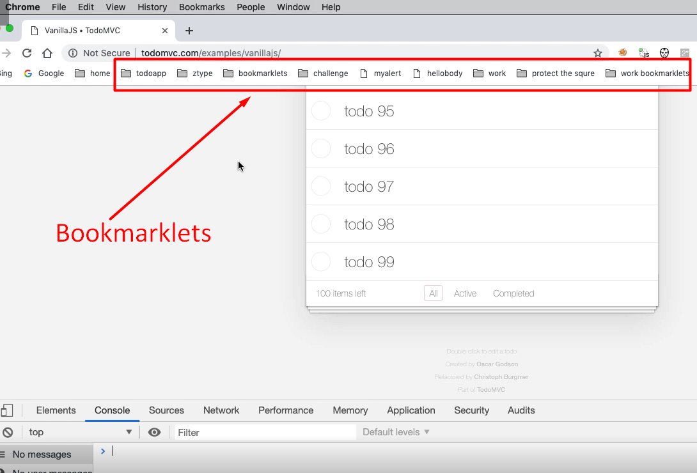
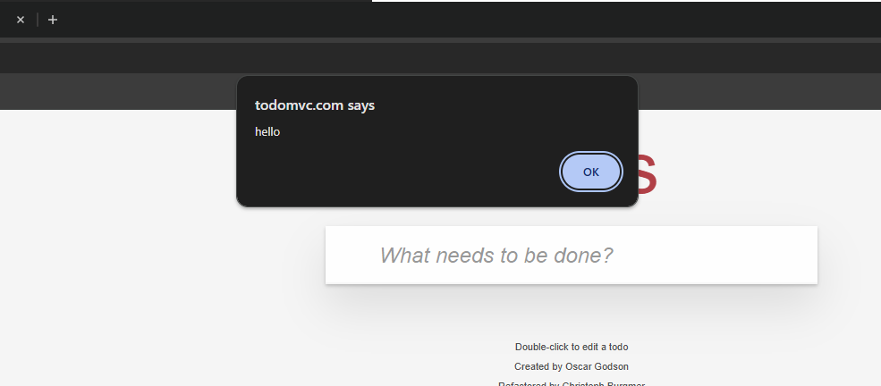
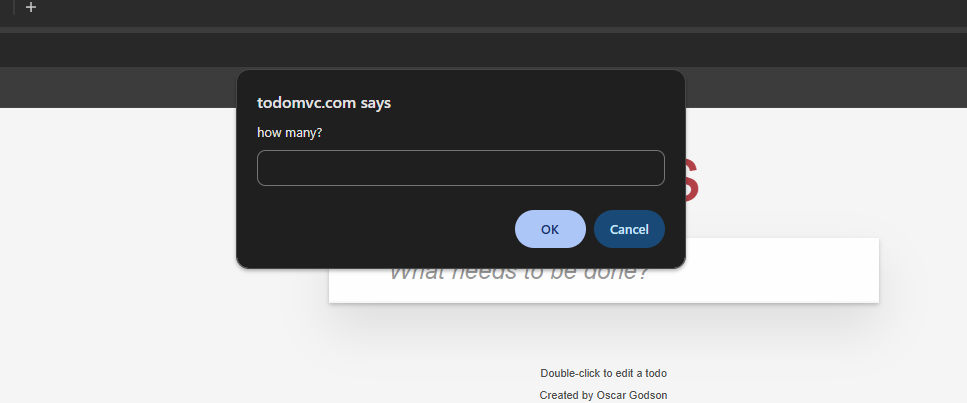

# Chapter 11 - Bookmarklets



* We write some working code.
* We create an anonymous function that runs immediately.
* We put our code in there (this will still run as code here.)
* Then, in order to make a bookmarklet, we need to prefix it with javascript:
* That then allows me to run it in the URL bar or as a bookmarklet.

````javascript
javascript: (function() {alert(“hello”);})()
````




````javascript
javascript: (function() {
    for(x=1;x<=100;x++){
        setTimeout(
            function (name){
                document.querySelector("input.new-todo").value=name;
                document.querySelector("input.new-todo").dispatchEvent(new Event('change', { 'bubbles': true }))
            }
        , x*100, "todo " + x)
    }
})()
````


Added functionality to prompt user for how many todo items to create

````javascript
javascript: (function() {

    max = prompt("how many? ")
    if (max) {
        for (x = 1; x <= max; x++) {
            setTimeout(function(name) {
                document.querySelector("input.new-todo").value = name;
                document.querySelector("input.new-todo").dispatchEvent(new Event('change',{
                    'bubbles': true
                }))
            }, x * 100, "todo " + x)
        }
    }
}
)()
````




## Quiz

**1. What is a bookmarklet?**
   JavaScript code that runs from a bookmark

**2. Which of the following is the pattern for a bookmarklet?**
   javascript:(function(){alert("hello")})()
 
**3. Which of the following is true for bookmarklets?**
   We can run code that amends the DOM
   
**4. The JavaScript function for capturing input from the user is?**
   prompt