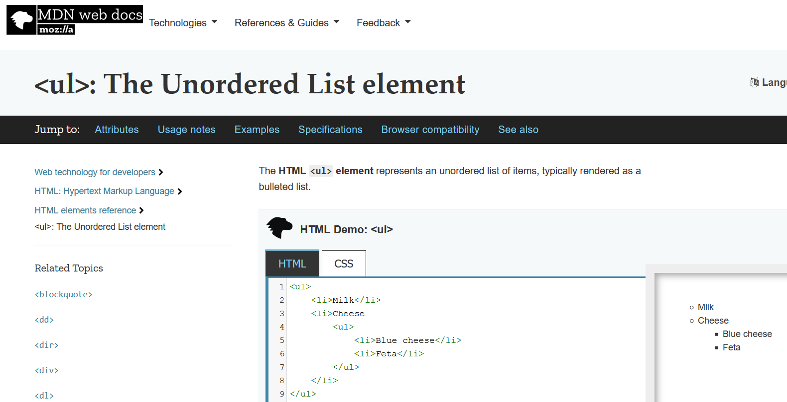
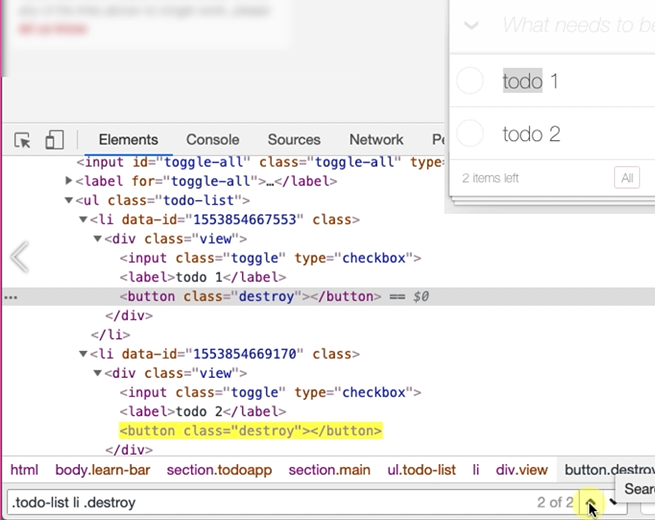
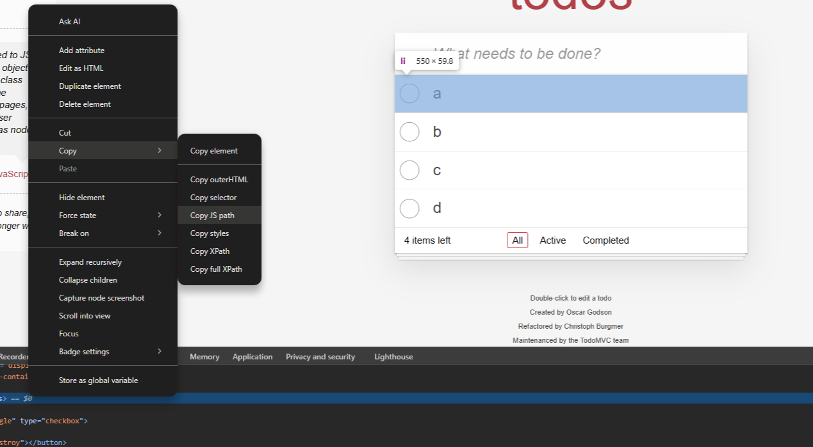

# Chapter 3 - Finding Elements

## 3.1 Finding Elements - DOM Selection

The DOM is in the *Inspect*, in the *Elements* tab.

This is the DOM view, the document object model. The thing that makes up the page. And JavaScript can manipulate this.


So, this whole “todo” item, you can see it highlighted there is represented by this list item in HTML [`<ul class=”todo-list”>`].

`<ul>` HTML tag documentation



It's just an unordered list of things, each of those things in that list is a list item`[li]`

CSS is cascading style sheets. It's the information that the browser uses in order to style the application.

You can copy CSS from the sources tab and search for it via CTRL + F in the elements tab.


### Inspect > Copy Selector

Provides a CSS selector

`body > section > main > ul > li:nth-child(1)`

Find the body class, then section, then main, then an unordered list, find the 1st child of the list

Can be improved as below since the ul tag has a class specified as 'todo-list'
`ul.todo-list > li:nth-child(2)`

More info on CSS selectors [here](https://developer.mozilla.org/en-US/docs/Web/CSS/CSS_selectors)

## 3.2 Finding Elements - JavaScript

### querySelector commands


this will return something like

```javascript
document.querySelector("body > section > main > ul > li:nth-child(1)")
```

`document.querySelector` returns one element.

You then need to run this in the console to highlight the element.


**Some other methods to use:**

A simplified version returns the entire list.

`querySelectorAll` returns all that match.


Can also be more specific by using the class name


The relevant html element looks like this:

```html
<ul class="todo-list">
   <li data-id="1" class="">
      <div class="view"><input class="toggle" type="checkbox"><label>a</label><button class="destroy"></button></div>
   </li>
   <li data-id="2" class="">
      <div class="view"><input class="toggle" type="checkbox"><label>b</label><button class="destroy"></button></div>
   </li>
   <li data-id="3" class="">
      <div class="view"><input class="toggle" type="checkbox"><label>c</label><button class="destroy"></button></div>
   </li>
   <li data-id="4" class="">
      <div class="view"><input class="toggle" type="checkbox"><label>d</label><button class="destroy"></button></div>
   </li>
</ul>
```

### getElement commands

#### getElementById
This is where an element has an `id=` attribute
Example:
`document.getElementById("toggle-all");
`
#### getElementsByClassName
This is where an element has an `class=` attribute
Example:
`document.getElementsByClassName("toggle-all");
`
#### getElementsByName
This is where an element has an `name=` attribute
Example:
`document.getElementsByName("description");
`
#### getElementsByTagName
i.e. HTML tag
Example:
`document.getElementsByTagName("li");
`

## 3.3 Finding Elements - CSS Selectors
These can be searched in the elements tab of dev tools
All can be used with
document.querySelector("")

### ID selector
`#toggle-all`

### Class selector
Example input HTML tags with the class toggle-all
`input.toggle-all`

### Tag selector
li tags in unordered list with the class name todo-list
`ul.todo-list li`

Example to find a button with class destroy anywhere under the unordered list 
`ul.todo-list button.destroy`

An example of getting the same button with hierarchy specified 
`ul.todo-list > li > div > button.destroy`

Getting a specified child within a list
Index starts at 1, example below gets the 3rd child
`ul.todo-list li:nth-child(3)`

## Quiz

1. What does DOM stand for?
   Document Object Model

2. To view the DOM for a Web Element on the page we have to use which command from the context menu?
   Inspect

3. What does MDN stand for?
   Mozilla Developer Network
  
4. What is a good way to start learning CSS locators?
   use view sources to read the application CSS files

5. In the DOM view, which of these can we use to 'find' elements?
   String
   Selector
   XPath

6. The CSS Selector that the browser can generate using "Copy selector" is:
   usable for finding web elements but inefficient
 
7. The JavaScript that the browser can generate using "Copy JS Path" is:
   usable for returning web elements but inefficient

8. Which of the following functions returns a single web element?
   querySelector

9. The dev tools console allows us to run code in which programming language?
   JavaScript

10. getElementById returns a web element based on which attribute?
    id

11. Which of the following is true about the Elements view in the browser:
    we can view the HTML source code of the rendered page
    we can amend the HTML source code of the rendered page
    we can add new attributes to Web Element in the DOM

12. CSS Selectors allow us to select:
    by name
    by id
    by class name

13. The CSS selector ".toggle-all" finds items which:
    have a class attribute of "toggle-all"

14. When we use Elements view and search using a CSS select but there is no match, what happens?
    nothing is highlighted in yellow on the screen

15. The CSS selector "#todo-items" finds items which:
    have an id attribute "todo-items"

16. We can use ":nth-child" when:
    a query selector matches multiple items and we want one at a specific position
