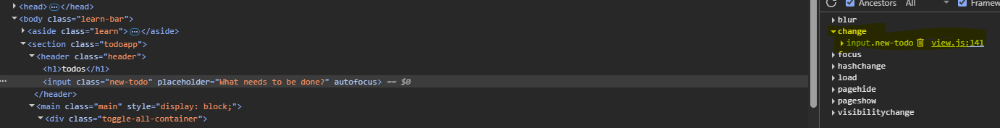
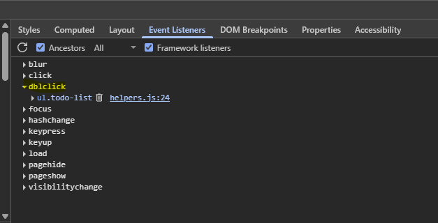
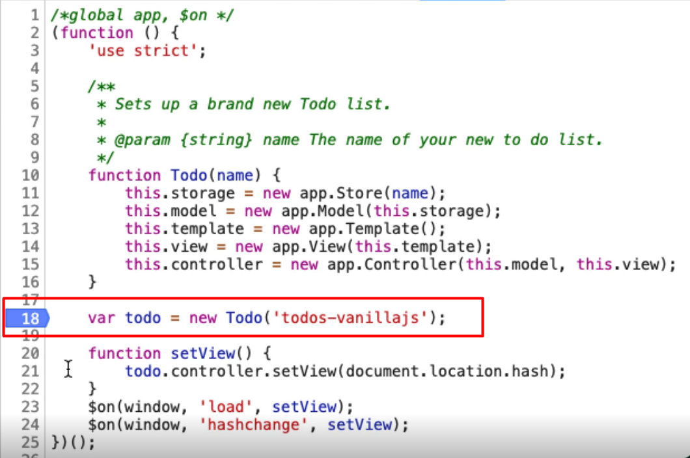

# Chapter 1 - Introduction

* We're going to learn how to automate from the console.
* We're going to learn how to use bookmarklets so that we have code in the bookmark, and we can just click it and set up test data.
* We're going to learn how to use the built-in JavaScript IDE for the snippets in Chrome itself.

## Resources
[Mozilla Developer Network](https://developer.mozilla.org/en-US/docs/Web)
[W3 Schools](https://www.w3schools.com/)
[Document Object Model](https://developer.mozilla.org/en-US/docs/Web/API/Document_Object_Model/Introduction)

# Chapter 2 - What Will We Automate
The application that we are going to be testing and automating throughout this course is TodoMVC.
You can find it online at [todomvc.com](http://todomvc.com)

To clear local storage of a web app we can do so by right clicking highlighted area and clicking clear!
[image.png](assets/image.png)

### Single Page Application

An application that does not need to reload the page from the server

### Sources tab in dev tools

The source code of the application including HTML, JavaScript and CSS


### "View Source" in the browser

The code provided by the server when the application loads


# Chapter 3 - Finding Elements

## 3.1 Finding Elements - DOM Selection

The DOM is in the *Inspect*, in the *Elements* tab.

This is the DOM view, the document object model. The thing that makes up the page. And JavaScript can manipulate this.


So, this whole “todo” item, you can see it highlighted there is represented by this list item in HTML [`<ul class=”todo-list”>`].

`<ul>` HTML tag documentation


It's just an unordered list of things, each of those things in that list is a list item`[li]`

CSS is cascading style sheets. It's the information that the browser uses in order to style the application.

You can copy CSS from the sources tab and search for it via CTRL + F in the elements tab.


### Inspect > Copy Selector

Provides a CSS selector

`body > section > main > ul > li:nth-child(1)`

Find the body class, then section, then main, then an unordered list, find the 1st child of the list

Can be improved as below since the ul tag has a class specified as 'todo-list'
`ul.todo-list > li:nth-child(2)`

More info on CSS selectors [here](https://developer.mozilla.org/en-US/docs/Web/CSS/CSS_selectors)

## 3.2 Finding Elements - JavaScript

### querySelector commands


this will return something like

```javascript
document.querySelector("body > section > main > ul > li:nth-child(1)")
```

`document.querySelector` returns one element.

You then need to run this in the console to highlight the element.


**Some other methods to use:**

A simplified version returns the entire list.

`querySelectorAll` returns all that match.


Can also be more specific by using the class name


The relevant html element looks like this:

```html
<ul class="todo-list">
   <li data-id="1" class="">
      <div class="view"><input class="toggle" type="checkbox"><label>a</label><button class="destroy"></button></div>
   </li>
   <li data-id="2" class="">
      <div class="view"><input class="toggle" type="checkbox"><label>b</label><button class="destroy"></button></div>
   </li>
   <li data-id="3" class="">
      <div class="view"><input class="toggle" type="checkbox"><label>c</label><button class="destroy"></button></div>
   </li>
   <li data-id="4" class="">
      <div class="view"><input class="toggle" type="checkbox"><label>d</label><button class="destroy"></button></div>
   </li>
</ul>
```

### getElement commands

#### getElementById
This is where an element has an `id=` attribute
Example:
`document.getElementById("toggle-all");
`
#### getElementsByClassName
This is where an element has an `class=` attribute
Example:
`document.getElementsByClassName("toggle-all");
`
#### getElementsByName
This is where an element has an `name=` attribute
Example:
`document.getElementsByName("description");
`
#### getElementsByTagName
i.e. HTML tag
Example:
`document.getElementsByTagName("li");
`

## 3.3 Finding Elements - CSS Selectors
These can be searched in the elements tab of dev tools
All can be used with
document.querySelector("")

### ID selector
`#toggle-all`

### Class selector
Example input HTML tags with the class toggle-all
`input.toggle-all`

### Tag selector
li tags in unordered list with the class name todo-list
`ul.todo-list li`

Example to find a button with class destroy anywhere under the unordered list
`ul.todo-list button.destroy`

An example of getting the same button with hierarchy specified
`ul.todo-list > li > div > button.destroy`

Getting a specified child within a list
Index starts at 1, example below gets the 3rd child
`ul.todo-list li:nth-child(3)`

## Quiz

1. What does DOM stand for?
   Document Object Model

2. To view the DOM for a Web Element on the page we have to use which command from the context menu?
   Inspect

3. What does MDN stand for?
   Mozilla Developer Network

4. What is a good way to start learning CSS locators?
   use view sources to read the application CSS files

5. In the DOM view, which of these can we use to 'find' elements?
   String
   Selector
   XPath

6. The CSS Selector that the browser can generate using "Copy selector" is:
   usable for finding web elements but inefficient

7. The JavaScript that the browser can generate using "Copy JS Path" is:
   usable for returning web elements but inefficient

8. Which of the following functions returns a single web element?
   querySelector

9. The dev tools console allows us to run code in which programming language?
   JavaScript

10. getElementById returns a web element based on which attribute?
    id

11. Which of the following is true about the Elements view in the browser:
    we can view the HTML source code of the rendered page
    we can amend the HTML source code of the rendered page
    we can add new attributes to Web Element in the DOM

12. CSS Selectors allow us to select:
    by name
    by id
    by class name

13. The CSS selector ".toggle-all" finds items which:
    have a class attribute of "toggle-all"

14. When we use Elements view and search using a CSS select but there is no match, what happens?
    nothing is highlighted in yellow on the screen

15. The CSS selector "#todo-items" finds items which:
    have an id attribute "todo-items"

16. We can use ":nth-child" when:
    a query selector matches multiple items and we want one at a specific position

# Chapter 4 - Interacting with App from Console
## 4.1 - Simple Event Sequences

### Click events
All tested on todomvc.com

````javascript
// TOGGLE ALL TO DOs
document.querySelector("#toggle-all").click()
// OR
document.getElementById("toggle-all").click()

// TOGGLE TO DO
// Clicking 3rd checkbox in the list
document.querySelector("ul.todo-list li:nth-child(3) input").click()
//OR
document.querySelector("ul.todo-list > li:nth-child(3) input.toggle").click()

// DELETE TO DO
// delete button for a list element
document.querySelector("ul.todo-list > li:nth-child(3) button.destroy").click()

// CLEAR COMPLETED
document.querySelector("button.clear-completed").click()

// FILTERS
// all
document.querySelector("body > section > footer > ul > li:nth-child(2) > a")
// OR
document.querySelector("ul.filters > li:nth-child(1) > a")

// active
document.querySelector("ul.filters > li:nth-child(2) > a")

// completed
document.querySelector("ul.filters > li:nth-child(3) > a")

````

### hashchange event

The hashchange event is fired when the fragment identifier to the URL. has changed.

Can be checked in the console with `location.hash`


These can be triggered in the console to change the URL

````javascript
location.hash = "/"

location.hash = "/completed"

location.hash = "/active"
````

## 4.2 - Complex Event Sequences

### Inputs

Getting the element
```javascript
document.querySelector("body > section > header > input");
//OR
document.querySelector("input.new-todo");
```

Typing some text
```javascript
document.querySelector("input.new-todo").value="Test1";
```

Then we need to trigger the event


```javascript
document.querySelector("input.new-todo").dispatchEvent(new Event('change', {'bubbles': true}));
```
`'bubbles':true` means the event gets sent to the element and anything up the hierarchy - which is what would happen if the user hits the return key

combination
```javascript
document.querySelector("input.new-todo").value="Test1";
document.querySelector("input.new-todo").dispatchEvent(new Event('change', {'bubbles': true}));
```

A loop to do it multiple times for some test data
```javascript
for(let i = 1; i <= 20; i++){
    document.querySelector("input.new-todo").value="Test - "+i;
    document.querySelector("input.new-todo").dispatchEvent(new Event('change', {'bubbles': true}));
}
```

Changing an element value
```javascript
// get the value of the label
let stringValue = document.querySelector("ul.todo-list > li:nth-child(1) label").textContent;

//Double-click on the label of the first element in the list
document.querySelector("ul.todo-list > li:nth-child(1) label").dispatchEvent(new Event('dblclick', {'bubbles': true}));

// set the new value to be the old value + "amended"
document.querySelector("ul.todo-list > li:nth-child(1) .edit").value = stringValue + " - amended";

// display the 'blur' event
document.querySelector("ul.todo-list > li:nth-child(1) .edit").dispatchEvent(new Event('blur', {'bubbles': true}));
```


Testing my knowledge - I want to update each element to have " - amended" at the end.
````javascript
const elements = document.querySelectorAll('ul.todo-list li');
const count = elements.length;
console.log("Count:" + count);

for(let i = 1; i <= count; i++){
    let stringValue = document.querySelector("ul.todo-list > li:nth-child("+i+") label").textContent;
    
    //Double-click on the label of the first element in the list
    document.querySelector("ul.todo-list > li:nth-child("+i+") label").dispatchEvent(new Event('dblclick', {'bubbles': true}));

    // set the new value to be the old value + "amended"
    document.querySelector("ul.todo-list > li:nth-child("+i+") .edit").value = stringValue + " - amended";

    // display the 'blur' event
    document.querySelector("ul.todo-list > li:nth-child("+i+") .edit").dispatchEvent(new Event('blur', {'bubbles': true}));
}
````


## Quiz
**1. Which of the following statements is true?**
We can simulate events using JavaScript to make things happen in the browser

**2. To trigger a click event in the browser we:**
Call the 'click' function directly on the Web Element

**3. The Event Listeners tab in the developer tools show us:**
The events that have code associated with them for a specific Web Element

**4. Which of the following are true about triggering a 'change' event?**
we cannot call 'change' as a function
we have to use dispatchEvent to trigger a change event
a change event should be set to 'bubble' to trigger all associated events on the page

**5. When investigating complex event sequences we have to:**
investigate the sequence of actions in the Elements view and simulate the effects in code

**6. How do we learn the correct code to trigger specific events?**
search the web and research code samples

**7. To make CSS selector queries shorter and more efficient:**
manually amend them in the console, checking the results to make sure they work

# Chapter 5 - For Loops

````javascript
const toggles = document.querySelectorAll('.toggle');

for(togglepos=0; togglepos<toggles.length; togglepos++){
    toggles[togglepos].click();
}
````


A loop to do it multiple times for some test data
```javascript
for(let i = 1; i <= 20; i++){
    document.querySelector("input.new-todo").value="Chapter5 - "+i;
    document.querySelector("input.new-todo").dispatchEvent(new Event('change', {'bubbles': true}));
}
```

A nicer loop to edit each of them
````javascript
const labels = document.querySelectorAll('ul.todo-list li label');
let editText = null;

for(elempos = 0; elempos < labels.length; elempos++){

    let stringValue = labels[elempos].textContent
    labels[elempos].dispatchEvent(new Event('dblclick', {'bubbles': true}));

    editText = document.querySelector(".edit")

    // set the new value to be the old value + "amended"
    editText.value= stringValue + " - amended";

    // display the 'blur' event
    editText.dispatchEvent(new Event('blur', {'bubbles': true}));
}
````
# Chapter 6 - If Statements

````javascript
var toggles = document.querySelectorAll('.toggle');
for(togglepos=0;togglepos<toggles.length;togglepos++){
	if(togglepos%2==0){
		toggles[togglepos].click();
	}
}
````
# Chapter 7 - Snippets View


Doesn't have as much code completion as the console.

Breakpoints can also be added here


This can also be used to debug websites, nothing is private once loaded in the browser!!!


**NB you have to run the snippet to its accessible from the console**

# Chapter 8.1 JavaScript Functions - Helpers

Define a function in a snippet


Use it from the console


Example functions from transcript that need to be tested against current version

```javascript

function clickItem(item) {
    item.click();
}

function toggleAll() {
    document.querySelector('#toggle-all').click();
}
```

# Chapter 8.2 JavaScript Functions - autoTodoObject

Define some functions in a snippet - this is useful as if the website has functions with the same name defining functions that aren't in an object can overwrite them.

```javascript
var autoTodo = new function() {

    this.clickItem = function(item) {
        item.click();
    }

    this.toggleAll = function() {
        document.querySelector('#toggle-all').click();
    }

    this.selectItemX = function(x) {
        document.querySelector("ul.todo-list > li:nth-child(" + x + ") input.toggle").click()
    }

    this.deleteItemX = function(x) {
        document.querySelector('ul.todo-list > li:nth-child(' + x + ') button.destroy').click()
    }

    this.clearCompleted = function() {
        document.querySelector('button.clear-completed').click();
    }

    this.filterCompleted = function() {
        location.hash = "/completed";
    }

    this.filterAll = function() {
        location.hash = "/";
    }

    this.filterActive = function() {
        location.hash = "/active";
    }
    
    this.createTodo = function(name) {
        document.querySelector('input.new-todo').value = name;
        document.querySelector('input.new-todo').dispatchEvent(new Event('change',{
            'bubbles': true
        }));
    }

    this.amendTodo = function(x, amendedValue) {
        document.querySelector('ul.todo-list > li:nth-child(' + x + ') > div > label').dispatchEvent(new Event('dblclick',{
            'bubbles': true
        }));
        document.querySelector('ul.todo-list > li:nth-child(' + x + ') .edit').value = amendedValue;
        document.querySelector('ul.todo-list > li:nth-child(' + x + ') .edit').dispatchEvent(new Event('blur'));
    }

}
```

Can then be run from the console with commands like:
`autoTodo.clickItem(document.querySelector('.toggle-all-label'));`

# Chapter 9 - SetTimeout

There is a risk that doing this is too quick.
No user is ever going to create 100 items in milliseconds

```javascript
for(let i = 1; i <= 100; i++){
    autoTodo.createTodo("todo " + i);
}
```

Issue here is synchronisation

### SetTimeout

Example below - In 1000ms after call it'll run `console.log("hello")`

```javascript
setTimeout(function(){
    console.log("hello")
}, 1000)
```

This means a 5-second wait before calling the function autoTodo.createTodo with the args "hello again"

````javascript
setTimeout(autoTodo.createTodo, 5000, "hello again")
````

If we were to do the below it would just wait 5 seconds before returning the return value of autoTodo.createTodo (there isn't any)

````javascript
setTimeout(autoTodo.createTodo("hello again"), 5000)
````

Putting it all together (we don't need to wait 5 seconds)

```javascript
for(let i = 1; i <= 100; i++){
    setTimeout(autoTodo.createTodo, i*100, "todo "+ i)
}
```
OR
````javascript
for(x=1;x<=100;x++){
    setTimeout(
        function (name){
            document.querySelector("input.new-todo").value=name;
            document.querySelector("input.new-todo").dispatchEvent(new Event('change', { 'bubbles': true }))
        }
    , x*100,"todo "+x)
}
````
## Quiz
**1. In order to clear the localstorage from the console we use the command:**
localStorage.clear()

**2. Using a for loop to create test data is:**
possible for some applications but not the todoMVC application

**3. The `setTimeout` function:**
runs a function after X milliseconds has passed

**4. The following command waits 1000 milliseconds before running the `createTodo` code: setTimeout(autoTodo.createTodo("make jello"),1000)**
False

**5. The following command waits 1000 milliseconds before running the `createTodo` code: setTimeout(autoTodo.createTodo, 1000, "make jello")**
True

# Chapter 10 - SetInterval

setInterval runs a block of code, or a function, every “x” milliseconds.

* `setTimeout` says, "I will run this block of code in this number of time, and I'll do it once."
* `setInterval` keeps going. Every 500 milliseconds, if that's what we set it to, it keeps running the same block of code.

````javascript
var sayHello = setInterval(function(){console.log("hello")},1000);
````
So, every second it will write to the console, "hello."

Now, if I went to stop it, I could refresh the page, or I can use the clearInterval command and I just say, clearInterval(sayHello).

````javascript
let botTodoCount = 0;
let creatorBot = setInterval(function(){
        document.querySelector('input.new-todo').value="todoSetInterval " +botTodoCount;
        document.querySelector('input.new-todo').dispatchEvent(new Event('change',{'bubbles':true}));

        botTodoCount++;

        if(botTodoCount>=100){
            clearInterval(creatorBot);
        }
    }, 500);
````

Parameterised version that creates number of todos as a parameter
````javascript
function startTodoCreator(maxCount) {
    let botTodoCount = 0;
    let creatorBot = setInterval(function() {
        document.querySelector('input.new-todo').value = "todoSetIntervalParam " + botTodoCount;
        document.querySelector('input.new-todo').dispatchEvent(new Event('change', { 'bubbles': true }));

        botTodoCount++;

        if (botTodoCount >= maxCount) {
            clearInterval(creatorBot);
        }
    }, 500);
}

// Call the function with a desired max count
startTodoCreator(50);
````

## Quiz
**1. If we create a `setInterval` and do not assign it to a variable we can stop it by:**
refreshing the browser page

**2. If we create a setInterval and assign it to a variable we can stop it using the command: var sayHello = setInterval(function(){console.log("hello")},1000);**
clearInterval(sayHello)

**3. When we use `setInterval` we need to wrap it in a for loop:**
false because setInterval runs every X milliseconds

**4. A `setInterval` will run:**
forever, until page is refreshed or it is cleared

# Chapter 11 - Bookmarklets


* We write some working code.
* We create an anonymous function that runs immediately.
* We put our code in there (this will still run as code here.)
* Then, in order to make a bookmarklet, we need to prefix it with javascript:
* That then allows me to run it in the URL bar or as a bookmarklet.

````javascript
javascript: (function() {alert(“hello”);})()
````


````javascript
javascript: (function() {
    for(x=1;x<=100;x++){
        setTimeout(
            function (name){
                document.querySelector("input.new-todo").value=name;
                document.querySelector("input.new-todo").dispatchEvent(new Event('change', { 'bubbles': true }))
            }
        , x*100, "todo " + x)
    }
})()
````


Added functionality to prompt user for how many todo items to create

````javascript
javascript: (function() {

    max = prompt("how many? ")
    if (max) {
        for (x = 1; x <= max; x++) {
            setTimeout(function(name) {
                document.querySelector("input.new-todo").value = name;
                document.querySelector("input.new-todo").dispatchEvent(new Event('change',{
                    'bubbles': true
                }))
            }, x * 100, "todo " + x)
        }
    }
}
)()
````


## Quiz
**1. What is a bookmarklet?**
JavaScript code that runs from a bookmark

**2. Which of the following is the pattern for a bookmarklet?**
javascript:(function(){alert("hello")})()

**3. Which of the following is true for bookmarklets?**
We can run code that amends the DOM

**4. The JavaScript function for capturing input from the user is?**
prompt

# Chapter 12 - Advanced
## 12.1 - The Innards



I'm going to create a variable, myTodo and just assign todo to it, and let's have a quick look, myTodo.


We've essentially hijacked the object in mid-loading which can make things a little bit easier,
because all of these objects within the todo object have functionality.


**You just have to understand that there's a risk because we're no longer triggering the GUI events, we're now working at the application itself.**

So, it may be useful for setting up lots of data, but it might not be the same as the user interacting with it. But this is a technique that I use a lot when I'm hacking JavaScript games and writing bots to execute those.

And it also demonstrates that nothing in the front end is safe or immune to manipulation by a user.

People very often use this pattern because they think, "Well, no one has access to it," but clearly, we can get access to it if we are determined.

## 12.2 & 12.3 Bots

What we're going to do is we're going to learn how to write code using setInterval, so it's going to keep going, that actually interacts with the application.

`Math.floor(Math.random()*10)`
This will now give me a number between 0 and 10, not including 10.

````javascript
var autoTodo = new function() {

    this.clickItem = function(item) {
        item.click();
    }

    this.toggleAll = function() {
        document.querySelector('#toggle-all').click();
    }

    this.selectItemX = function(x) {
        document.querySelector("ul.todo-list > li:nth-child(" + x + ") input.toggle").click()
    }

    this.deleteItemX = function(x) {
        document.querySelector('ul.todo-list > li:nth-child(' + x + ') button.destroy').click()
    }

    this.clearCompleted = function() {
        document.querySelector('button.clear-completed').click();
    }

    this.filterCompleted = function() {
        location.hash = "/completed";
    }

    this.filterAll = function() {
        location.hash = "/";
    }

    this.filterActive = function() {
        location.hash = "/active";
    }

    this.createTodo = function(name) {
        document.querySelector('input.new-todo').value = name;
        document.querySelector('input.new-todo').dispatchEvent(new Event('change',{
            'bubbles': true
        }));
    }

    this.amendTodo = function(x, amendedValue) {
        document.querySelector('ul.todo-list > li:nth-child(' + x + ') > div > label').dispatchEvent(new Event('dblclick',{
            'bubbles': true
        }));
        document.querySelector('ul.todo-list > li:nth-child(' + x + ') .edit').value = amendedValue;
        document.querySelector('ul.todo-list > li:nth-child(' + x + ') .edit').dispatchEvent(new Event('blur'));
    }

}
````

Setup `autoTodo` object by running the above snippet so it'll then be available in the console.

To find out what functions `autoTodo` has we can run the code below.
```javascript 
for(var prop in autoTodo){
    if(typeof autoTodo[prop] == 'function'){console.log(prop)}
}
```
Result:


A bot to randomly execute functions on an interval
````javascript
var randomBot = setInterval(function(){

var theFunctions = [];

// push to functions array
for (var prop in rando) {
    if (typeof rando[prop] == 'function') {
        theFunctions.push(prop);
    }
}

// get a random index
randomFnIdx = Math.floor(Math.random() * theFunctions.length);

// call the function in rando with the index/key of the function name
rando[theFunctions[randomFnIdx]]();
}, 100);

//clearInterval(randomBot); to be run in the console to cancel execution
````
## Quiz
**1. With JavaScript applications which of the following is true?**

if an application makes objects public then we can use those to automate the application

**2. When a JavaScript application makes its objects private:**

we can use debug mode to gain access to the internal objects

**3. Making JavaScript application objects guarantees security on the client side:**

false nothing on client side is secure

**4. Which of the following is true about JavaScript applications in the browser?**

All JavaScript code is loaded into the browser so the user can read it

**5. Which of the following is true?**

we can use `setInterval` to have code that runs in the background and automates the application
we can randomly choose functions to execute
we can have multiple `setInterval` bots running at the same time
all of the above

**6. The `Math.floor` function:**
returns the largest integer less than or equal to a given number

**7. The `Math.random` function:**

returns a number between 0 and 1

**8. To add an item to an array in JavaScript we use which function?**
push

**9. The `Date.now()` function returns:**

current date and time represented in milliseconds

**10. Which of the following creates an empty array in JavaScript?**

    var theFunctions = [];

**11. The `randoBot` in the video is an example of:**
Model Based Automation

**12. Which of the following is true for the randoBot?**
it will run until clearInterval is used or the page is refreshed

# Resources

[JavaScript Browser Automating – Extra Resources and Videos](https://www.eviltester.com/page/onlinetraining/testautomationujs/)

[Alan's Blog](https://blog.eviltester.com/)

[Mozilla Developer Network - JavaScript](https://developer.mozilla.org/en-US/docs/Web/JavaScript)

[Mozilla Developer Network - Web Technologies](https://developer.mozilla.org/en-US/docs/Web)

[W3 Schools](https://www.w3schools.com/)

[Stack Overflow](https://stackoverflow.com/)