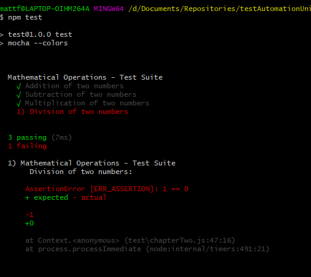

# Chapter 1 - What is Mocha?

[MochaJS](https://mochajs.org/)
[NPM Mocha Package](https://www.npmjs.com/package/mocha)
[Course Code](https://github.com/grajk88/tau-mocha-course/blob/master/test/chapterTwo.js)
[Mocha Documentation - Getting Started](https://mochajs.org/#getting-started)

Mocha is a JavaScript-based testing framework running on NodeJS and browser.

## What is Mocha?
1. A testing framework for JavaScript running on NodeJS and Browser
    * _Similar to TestNG in Java and NUnit in C#_
2. Organises and executes test cases
3. Makes Asynchronous testing simple

## Pre-requisites for Mocha
1. NodeJS
2. Node Packag Manager (NPM)

## Installation
`npm install -g mocha` -g is for global install

Check version that's installed
`mocha -version`

# Chapter 2 - Function Calls
Mocha comes pre-bundled with two function calls

`describe()` - A simple way to group our tests in Mocha.

It provides us a feature to create a series of tests. In general, the `describe()` function takes 2 arguments. The first is the name or description of the test group and the second one is the callback `function`, which is a function that needs to be executed after another function has finished executing.

`it()` - A way to describe the individual test cases.

These tests should be nested within the `describe()` block. `it()` function should be described in a way that it makes sense for the given test case.

In this example, you will be able to see the basic syntax of `describe()` and `it()` functions.

To add output colours in git bash you can add the `--colors` argument in the `package.json` file.

````json
"scripts": {
    "test": "mocha --colors"
  }
````
In order to execute the tests we run
``npm test``


The tests need to be located in a folder called `test`

# Chapter 3 - Mocha Hooks

### before() hook.

The before() hook will execute before any tests execute.

### after() hook.

The after() hook will execute after all the tests are executed.

### beforeEach() hook.

This beforeEach() hook will run before every test execution.

### afterEach() hook.

The afterEach() hook will run after every text execution.

# Chapter 4 - Test Features

### Exclusive Tests
[Exclusive Tests](https://mochajs.org/#exclusive-tests)

Allows us to execute only the specified test suite or a test case.
This can be achieved by adding .only() function, and it can be added to both describe() and it() functions.

````javascript
var assert = require('assert');

describe('Mathematical Operations - Test Suite', function(){
    var a = 10;
    var b = 10;

  it.only('Addition of two numbers', function(done){
    var c = a+b;
    assert.equal(c,20);
});
````

### Inclusive Tests
[Inclusive Tests](https://mochajs.org/#inclusive-tests)

Inverse of the .only() function.
This can be achieved by adding .skip().
This will tell Mocha to simply ignore these tests suites or test cases.
This is applicable for both pre-bundled functions, describe() and it().

````javascript
var assert = require('assert');

describe('Mathematical Operations - Test Suite', function(){
    var a = 10;
    var b = 10;

  it.skip('Addition of two numbers', function(done){
    var c = a+b;
    assert.equal(c,20);
});
````

### Pending Tests
[Pending Tests](https://mochajs.org/#pending-tests)

Pending tests are the ones that someone should write eventually.
Pending tests will be included in the test results and marked as pending. A pending test is not considered as failed a test.
A pending test will not be having a callback function.
````javascript
// Pending Test
    it('This is a test for Pending Test Feature');
````

# Chapter 5 Retries & Timeouts

### Retry

[Retry Tests](https://mochajs.org/#retry-tests)

You can choose to retry failed tests up to a certain number of times. This feature is designed to handle end-to-end tests (functional tests/Selenium…) where resources cannot be easily mocked/stubbed.
**It’s not recommended to use this feature for unit tests.**

This feature does re-run a failed test and its corresponding `beforeEach/afterEach` hooks, but not `before/after` hooks. `this.retries()` has no effect on failing hooks.

````js
describe('retries', function () {
    // Retry all tests in this suite up to 4 times
    this.retries(4);

    beforeEach(function () {
        browser.get('http://www.yahoo.com');
    });

    it('should succeed on the 3rd try', function () {
        // Specify this test to only retry up to 2 times
        this.retries(2);
        expect($('.foo').isDisplayed()).to.eventually.be.true;
    });
});
````


### Timeouts

[Timeouts](https://mochajs.org/#timeouts)

#### Suite-Level
Suite-level timeouts may be applied to entire test “suites”, or disabled via `this.timeout(0)`
This will be inherited by all nested suites and test-cases that do not override the value.

````javascript
describe('a suite of tests', function () {
  this.timeout(500);

  it('should take less than 500ms', function (done) {
    setTimeout(done, 300);
  });

  it('should take less than 500ms as well', function (done) {
    setTimeout(done, 250);
  });
});
````

#### Test-Level
Test-specific timeouts may also be applied, or the use of this.timeout(0) to disable timeouts all together:
````javascript
it('should take less than 500ms', function (done) {
  this.timeout(500);
  setTimeout(done, 300);
});
````

#### Hook-Level
Hook-level timeouts may also be applied:

````javascript
describe('a suite of tests', function () {
  beforeEach(function (done) {
    this.timeout(3000); // A very long environment setup.
    setTimeout(done, 2500);
  });
});
````
Again, use `this.timeout(0)` to disable the timeout for a hook.

# Chapter 6 - Reporters

[Reporters](https://mochajs.org/#reporters)

In general, Mocha reporters are mostly terminal based.

There are different types of reporters available as part of Mocha, of which, spec and dot matrix are the commonly used reporter types.

Spec is the default reporter.

The spec reporter outputs a hierarchical view according to the test cases.

The dot matrix reporter is a series of characters which represent the test cases.

Failures are highlighted in the red exclamation mark, the pending tests with the blue comma and the slow tests as a yellow color.

There are other types that are available like NYAN, TAP, Landing Strip, List, Progress, JSON, Json Stream.

### Using Mocha Reporters

Now let's see the first type of reporter, which is nothing but the spec.
In order to get a custom report, we need to execute this command

`mocha test/ --reporter spec`

`mocha test/ --reporter dot`

`mocha test/ --reporter nyan`

`mocha test/ --reporter json`