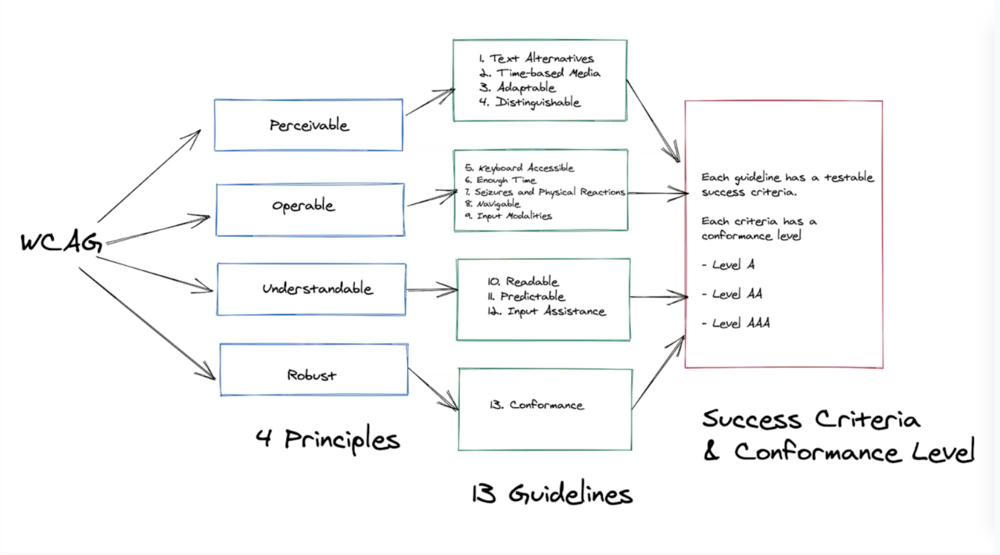
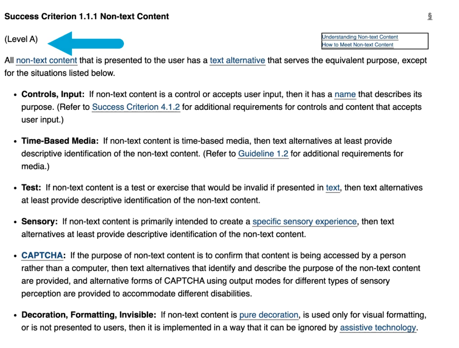

# Introduction to Web Accessibility

## What is Accessibility?

Accessibility is often abbreviated to **A11y**, or Ally.

**Accessibility** is the practice of making a product that is usable by everyone, with or without disabilities.

A product that's designed, developed, and tested with accessibility in mind will have more users than a product that is not accessible.

Business organisations have a responsibility to all their users that the features they provide can be accessed by everyone.

## Web Content Accessibility Guidelines 2.0
_Published on December 2008_

The W3C or World Wide Web Consortium has come up with the Web Content Accessibility Guidelines, which provides a list of guidelines and recommendations on how to make your website more accessible. 
It contains a set of rules which were grouped under four categories - perceivable, operable, understandable, and robust (POUR for short)

* **P**erceivable - The information should be presented to your users in ways they can perceive.
  * Some of your users might have some difficulties with one of their senses, which means that they have to be reliant on using an assistive technology, such as screen readers to access your website.
* **O**perable - The principle that your users must be able to operate your website by using different means.
  * For example, some of your users might have motor difficulties and will find it hard to use a mouse. This means that your website should also be accessible if users will only use a keyboard.
* **U**nderstandable - That your users can understand the information presented to them when using your website.
  * This means that clear instruction should be presented and there should be error messages to let them know and understand when they make mistakes.
* **R**obust - Making sure that your website must be used by your users when they use third-party assistive technologies, even if the technology advances.
  * This is done by adhering to standards, such as correct HTML structure, for example.

## Web Content Accessibility Guidelines 2.1
_Published in 2018, Version 2.1 was published to cover mobile accessibility, people with low vision and cognitive and learning abilities_

Version 2.1 was introduced due to the rise of mobile devices and tablets, and to also cover a wider array of disabilities, such as people with low vision or cognitive and learning disabilities.

* You need to make sure that your website is accessible in both portrait or landscape mode.
* If you have animations on your website, you need to make sure that you have the option to turn it off.
* The ability to zoom text easily, so people with low vision can read it without issues.

## WCAG 2.1 Conformance Levels
Within the Web Content Accessibility Guidelines, each of the guidelines under 2.0 and 2.1 have a success criteria.

This is defined through the three conformance levels that businesses or companies should conform to.
1. **Level A** - Most basic conformance, you must achieve 25 criteria from the accessibility guidelines.
2. **Level AA** - Apart from achieving 25 criteria from level A, you also need to achieve 13 new criteria on this level.
3. **Level AAA** - You need to achieve the previous two levels, as well as another 23 criteria on top.

### Example - Captions or Subtitles.
1. In order for you to reach **Level A** rating, you should be able to provide captions on a prerecorded video as a minimum.
2. To reach **Level AA**, you should be able to provide captions on a real or live video.

### Example - Keyboard Access
1. **Level A** - All users should be able to navigate through your website with just a keyboard.
2. **Level AA** - The ability to zoom into the text content.

## Summary

## Meeting Guidelines
In order to meet this guideline there is one success criteria, which also shows the conformance level rating that you will achieve if your application meets this criteria.

## Resources
[WCAG 2.1](https://www.w3.org/TR/WCAG21/)
[WCAG 2.1 Conformance Levels](https://www.w3.org/WAI/WCAG21/Understanding/conformance)