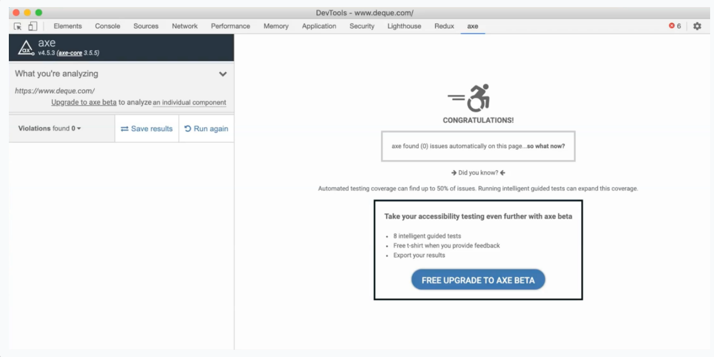
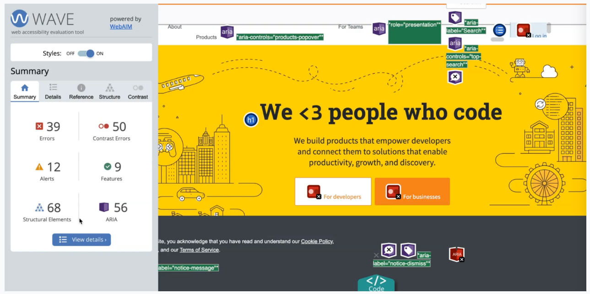
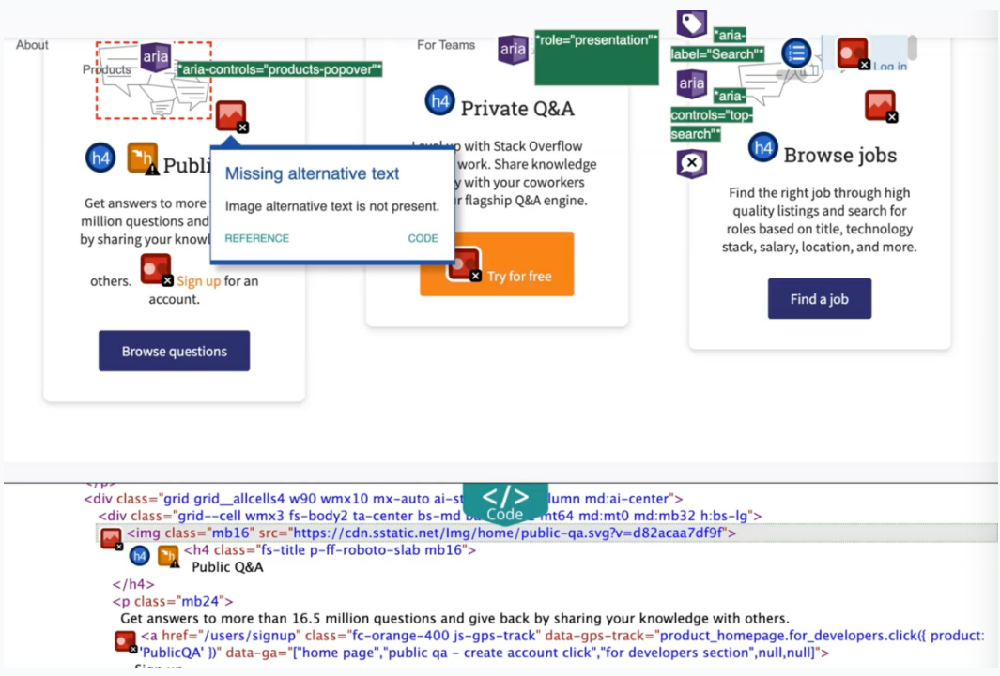
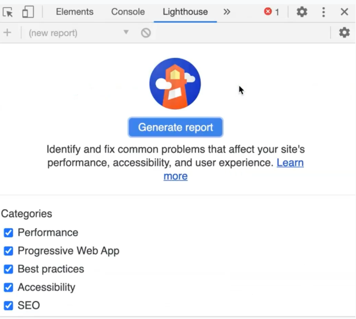
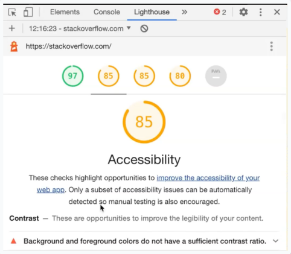

# Web Accessibility Tools
## Tools Requiring Human Assistance
### Keyboard
#### Common Shortcuts
* **CTRL (CMD) + L** - Will put the focus on your browser's address bar
* **TAB** - Used to go to specific elements, such as links or buttons
* **SHIFT + TAB** - Will simply reverse the direction, so you can go back to previous links or buttons
* **Arrow Keys** - To scroll to a specific viewport
* **Spacebar** - To tick or untick checkboxes or radio buttons
* **Enter** - Used to activate buttons or links that are currently focused on

#### Screen Readers
**A screen reader allows people with disabilities - specifically those who have visual impairments - to use a computer.**
It translates everything a user normally sees on their screen to speech.

Some popular ones
* VoiceOver (Mac & iPhone)
* NVDA (Windows)
* JAWS (Windows)
* TalkBack (Android)

#### Zoom
If your users have low vision, they would also use a zoom feature to magnify the content, so they can read it better.
When they zoom the content of your website, you need to make sure that the elements are stacking up nicely, and not on top of one another, and that everything is flowing in nicely.
In some cases, when you zoom in too much, if a website has been poorly designed, it can become unreadable, and therefore not very accessible.

## Semi Automated Accessibility Testing Tools
### Axe
The axe browser extension is one tool that is based on the axe-core library, which is currently backed up by Deque Systems.
It enables you to detect any accessibility issues quickly just by running the extension, whether you are using Chrome, Firefox, or Edge.
Once installed, just right-click, click Inspect, and then click on the "axe" tab.
Then, click on the Analyze button, and afterwards you are shown this accessibility report.

As you can see, the violations are grouped, and then it also shows the number of occurrences for each of the violations that have occurred.
It gives you this nice report showing which element is affected and what the accessibility issue is, as well as how you can fix this issue.

### WAVE
Similar with Axe, you can also use WAVE, which is another free tool that you can use that lets you run accessibility checks with their Chrome and browser extensions.
When installed, right-click and then select WAVE.
A report will be generated, which shows a breakdown of accessibility errors, if there are any, its accessibility features, structural elements, and also includes how many ARIA labels the page has.

Then on the actual page itself, it will be annotated with different icons highlighting where the issues and accessibility features are.
Just click the View Details button, and then if you click on any of the icons, it will highlight which element has the error.
By clicking a reference, this will show the details as to what the error is and why it's important to address the issue.

There's also an option to select the code - you just click on the code and this will highlight the code itself, so you know where to add the alternative text for this example.

You can also inspect color contrast issues within WAVE.

If you click on one of the icons here, this will show you why it failed.
For a color contrast rule to pass, normal text should have a ratio of at least 4.5:1 foreground to background ratio, and at least 3:1 for large text.

### Google Lighthouse
Google Lighthouse, which is already built in if your Chrome version is up-to-date, also includes accessibility checks.

Their accessibility feature is actually using axe-core as its engine, but what's great is you can also measure other metrics such as performance, best practices, and SEO.

To run Lighthouse, just open up your developer tools and then find the Lighthouse tab.

Once you're here, you can choose to run it on the desktop or mobile version.
Once that's finished, it gives you these different scores and clicking on accessibility will redirect you to the accessibility section.

When you expand on one of the violations, it will show you what the failing elements are.

### Resources
[Axe Extension](https://chrome.google.com/webstore/detail/axe-web-accessibility-tes/lhdoppojpmngadmnindnejefpokejbdd)
[WAVE](https://wave.webaim.org/extension/)

## Automated Accessibility Testing Tools
Some automated accessibility tools that you can integrate in your code base and in your CI pipeline.

### Axe-Core
If you want to programmatically catch accessibility issues, then you can use different libraries that are based on Axe-Core.
**Axe-Core's philosophy is to empower developers, and also software testers, to think about accessibility by integrating automated tests as early on as possible.**

There are so many projects out there that are built on top using Axe-Core; such as Axe CLI, which allows you to run accessibility tests straight on your command line, which we'll look into closely, in the next chapter.

Axe-Core can also integrate into your testing tools of choice, such as **Jest** for unit testing, **Cypress**, **Selenium**, with Java, C#, and Python, **WebdriverIO**, and even **TestCafe**.

### Resources
[Axe-Core](https://github.com/dequelabs/axe-core)
[Project using Axe-Core](https://github.com/dequelabs/axe-core/blob/develop/doc/projects.md)