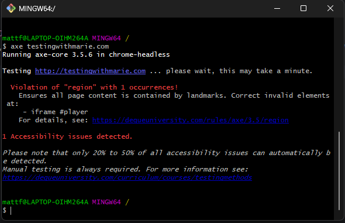
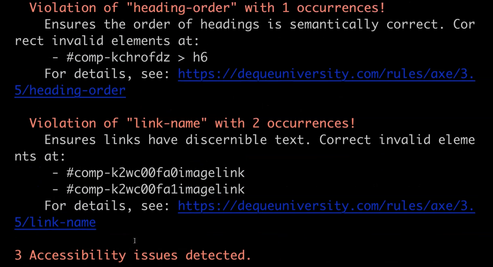

# Exploring Axe CLI
### Why use Axe-CLI?
1. First, you can **easily integrate** it into your continuous integration pipeline.
2. It's fast 
3. it's also easy to set up and configure.

### Prerequisite Installations
* Node
* NPM 

### Install Axe-CLI
To install Axe-CLI, all we need is this one line command 
```
npm install -g axe-cli
```

### Running Axe-CLI Demo
type axe again, followed by any URL that you want.
````shell
axe testingwithmarie.com
````


By default, this will run your tests on headless Chrome.

It's worth noting that just because Axe didn't detect any issues doesn't mean that my site is fully accessible.

#### Running on specific browser
In this case Chrome
````shell
axe testingwithmarie.com --browser chrome
````

#### Running against a specific page
````shell
axe testingwithmarie.com, testingwithmarie.com/about --browser chrome
````



you can also disable some of the accessibility rules also
````shell
axe testingwithmarie.com, testingwithmarie.com/about --browser chrome --disable link-name
````

#### Saving Output Report
````shell
axe testingwithmarie.com, testingwithmarie.com/about --browser chrome --save test-results.json
````

## Resources
[axe-cli](https://github.com/dequelabs/axe-cli)