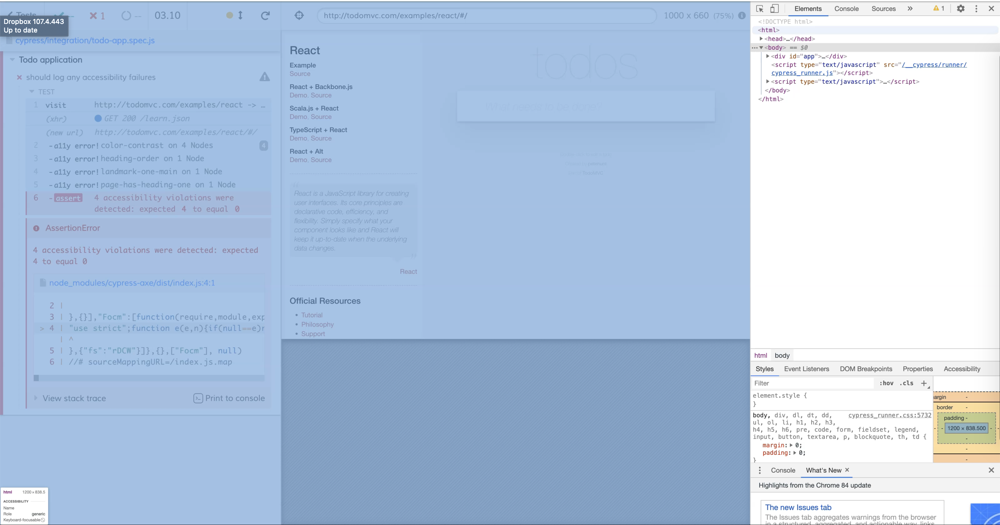
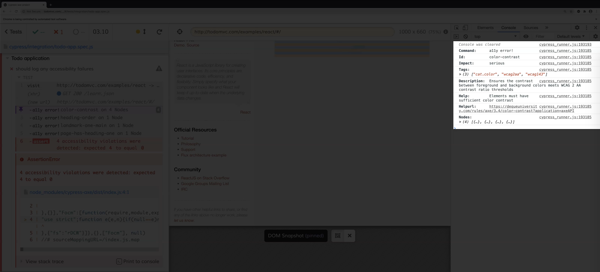
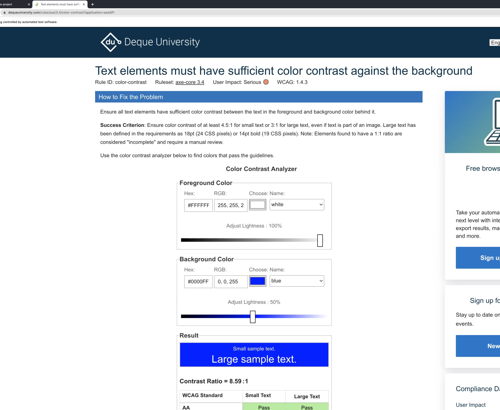
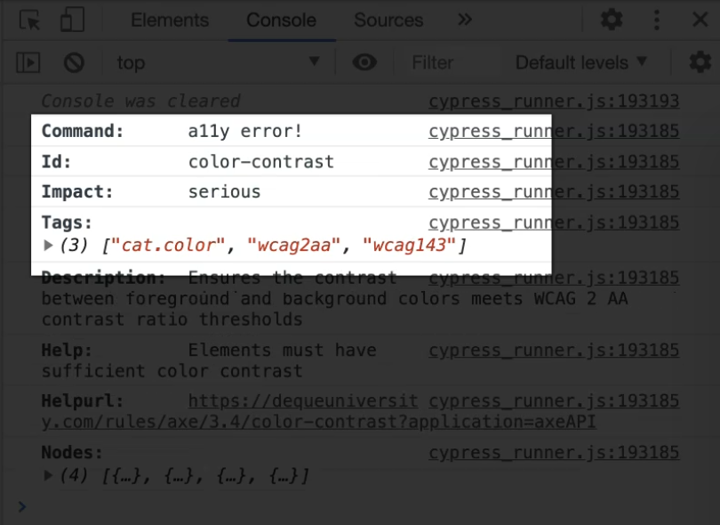
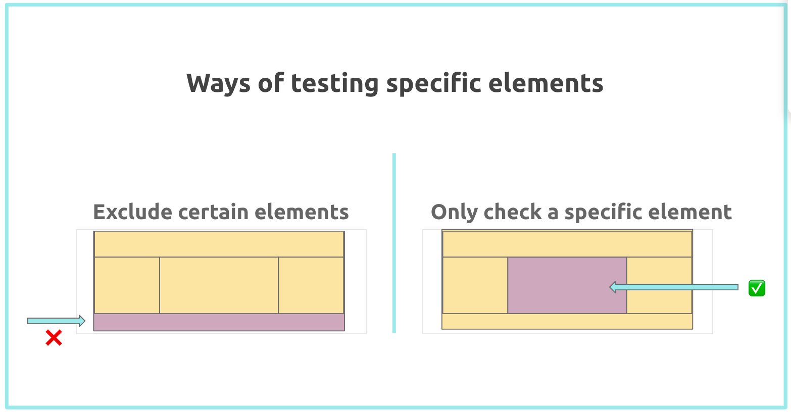

# Cypress Axe
## 7.1 Writing Accessibility Tests
1. How you can test a full page with Cypress-Axe.
2. Analyze the logs and error messages that we get so we can understand the different accessibility failures
3. Test specific elements on the page
4. How you can disable some Axe rules - I normally recommend not disabling any accessibility rules, so you can validate more rules as much as possible, but in some cases it might be needed.

### First Test TodoMVC
[TodoMVC](https://todomvc.com/)

#### Describe
_describe_ blocks in Mocha allow you to group your tests in a much more structured way.

#### It
An _it_ block in Mocha is a way to describe what our test is.
It accepts two parameters - the first one is just the title for our test, and the next parameter is the function containing the different Cypress commands that we need to execute.

````javascript
/// <reference types="cypress"/>

describe('Todo application', () => {
  it('should log any accessibility failures', () => {
    cy.visit('https://todomvc.com/examples/react/dist/'); // method in Cypress, to visit our application.
    cy.injectAxe(); // Cypress-Axe library, inject the axe-core runtime in our test application, it has to be added after you visit your test page.
    cy.checkA11y(); //This command right here will actually scan your page for any accessibility failures. Alternatively cy.checkAccessibility.
  });
});
````

### Resources
[Git repo for source code](https://github.com/mdcruz/tau-automated-accessibility-course)
[Branch for this chapter](https://github.com/mdcruz/tau-automated-accessibility-course/tree/first-accessibility-test)
[Todo MVC app](https://todomvc.com/examples/react/dist/)

## 7.2 Understanding Accessibility Failures
With Cypress, you have access to developer tools, and you can do that by right clicking on any part of the Test Runner and click "Inspect".



After clicking the violation, additional logs in the console are printed out.


You get a description as to what the accessibility rule is.
In this case, it's about ensuring that there is sufficient contrast between the foreground and background colors.
Axe also provides a help URL, which you can directly click on, and this should redirect you to their help page, which contains relevant information, such as how to fix the issue.

You can see here what the success criterion is, and they even have a color contrast analyzer that you can use to help you decide if your colors are accessible.

You can also find other information, such as why this rule matters for people with low vision.


This array contains the specific elements which violated the color contrast rule.
If you expand it one by one, you can find out which specific selector needs to be changed.
If we look at the next accessibility violation rule, it's about the heading order.
Order of the headings matter and must be organized, because assistive technologies use this to provide the navigation.
The next accessibility rule is about having one main landmark in your page.
Having a main landmark ensures that people with disabilities can access the primary content of your page easily.
The last accessibility rule violation is about making sure that your page has heading one.
Generally, it's best practice for your page to have a heading one, since this will allow users to jump directly to the main content of your page.
From here, you can also see the impact of each of the accessibility rules.



You can see that the color contrast has a more serious impact as opposed to the other three violations.
This should help you advise the team which rule you need to address first and prioritize.

## 7.3 Testing Specific Elements with Cypress Axe
By default, Cypress-Axe will scan the DOM structure of your full page.

Most of the time, this is what your use case is going to be, since you want Axe to detect accessibility errors on your entire page.
However, there are some cases where some elements on your page are still being actively worked on, and need input from your design and development team on how to make it accessible.
In this scenario, in order to not block your testing pipeline, you can choose to ignore these elements and Axe will not scan these elements against any of the accessibility rules.

There are two ways to test specific elements in Cypress-Axe:

1. **Exclude certain elements on the page**
`cy.checkA11y`, can take the property name exclude as a parameter.
Exclude, here, is of type array, and will accept a list of strings that you want Cypress-Axe to exclude.
````javascript
describe('Todo application', () => {
 it('should exclude specific elements on the page', () => {
   cy.visit('https://todomvc.com/examples/react/dist/');
   cy.injectAxe();
   cy.checkA11y({ exclude: ['.learn'] });
 });
});
````

2. **Check a specific element on the page**
````javascript
describe('Todo application', () => {
 it('should exclude specific elements on the page', () => {
   cy.visit('https://todomvc.com/examples/react/dist/');
   cy.injectAxe();
    cy.checkA11y('.learn');
 });
});
````

Bundled all together with a beforeEach for repetitive steps the tests now look like this
````javascript
describe('Todo application', () => {
 beforeEach(() => {
   cy.visit('https://todomvc.com/examples/react/dist/');
   cy.injectAxe();
 });
 
 it('should log any accessibility failures', () => {
   cy.checkA11y();
 });
 
 it('should exclude specific elements on the page', () => {
   cy.checkA11y({ exclude: ['.learn'] });
 });
 
 it('should only test specific element on the page', () => {
   cy.checkA11y('.learn');
 });
});
````

## 7.4 Disabling Axe Rules with Cypress Axe
There might be some pieces where some elements on your page are still being actively worked on and need input from your design and development team.
In this case, it might be an idea to disable some of the accessibility rules and add a todo comment or link it to a JIRA ticket.

**Example 1: Test that only report violations which have a serious or critical impact**

````javascript
it('should only include rules with serious and critical impacts', () => {

   cy.checkA11y(null, { includedImpacts: ['critical', 'serious'] });

 });
````
**Example 2: How to exclude the specific rules regardless of its impact**
````javascript
 it('should exclude specific accessibility rules', () => {
    cy.checkA11y(null, {
        rules: {
            'color-contrast': { enabled: false },
        },
    });
});
````