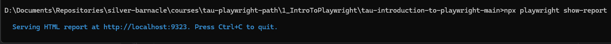
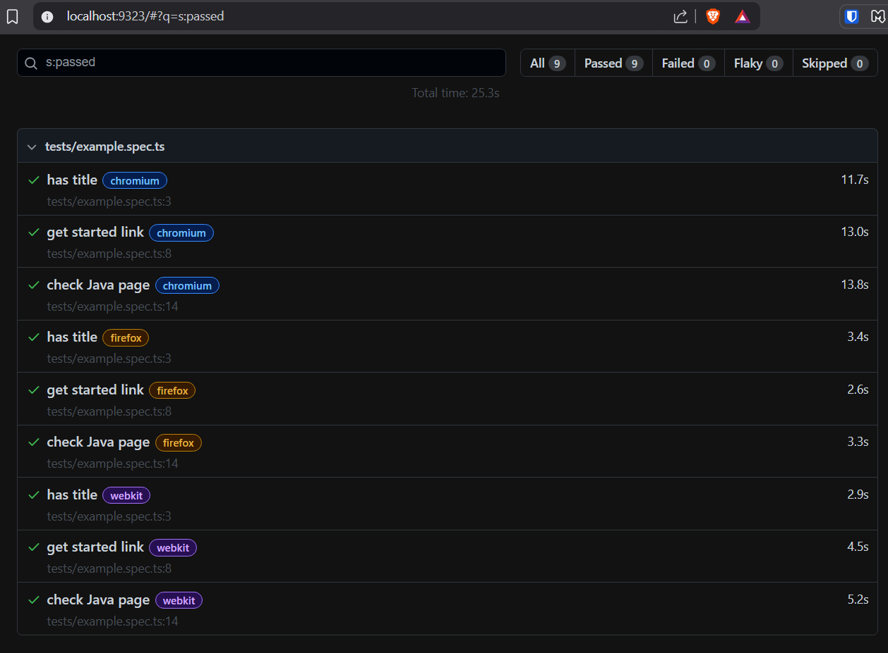
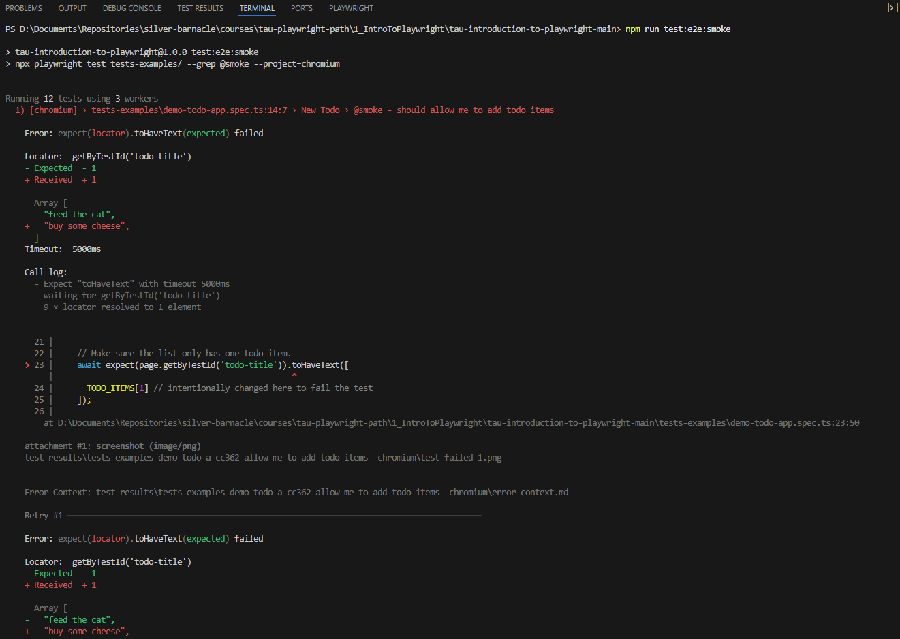

# Introduction to Playwright
[Course Link](https://testautomationu.applitools.com/playwright-intro/)
[Playwright Website](https://playwright.dev/)
[Playwright Github](https://github.com/microsoft/playwright)
[Renata Andrade - Instructor website](https://testingwithrenata.com/)

Playwright is a framework that enables reliable end-to-end testing for modern web applications.
It supports multiple languages (Node.js, Python, Java & .NET). We are going to focus on Typescript.

## Playwright Documentation
[Playwright Website](https://playwright.dev/)
[Playwright Docs](https://playwright.dev/docs/intro)

## Chapter 1 - Time to Explore Playwright

### Installation
`npm init playwright@latest` 

Download github repository located [here](https://github.com/raptatinha/tau-introduction-to-playwright)
Run `npm i` to install dependencies

### Browser Configuration
**Playwright comes with its own browser binaries**
When you install Playwright it downloads the necessary browser binaries for Chromium, Firefox, and WebKit. These are self-contained versions of the browsers used specifically for testing. They don’t rely on your system-installed Chrome, Safari, or Firefox.

Config snippet from `playwright.config.ts`
Configured to run on Chrome, Firefox and Webkit(Safari)
```json
projects: [
    {
      name: 'chromium',
      use: { 
        ...devices['Desktop Chrome'],
        // viewport: { width: 1280, height: 720 },
      },
    },

    {
      name: 'firefox',
      use: { ...devices['Desktop Firefox'] },
    },

    {
      name: 'webkit',
      use: { ...devices['Desktop Safari'] },
     }
```

### Running Tests

To run all tests in headless mode
`npx playwright test`

To run a single test file in ui mode
`npx playwright test --ui tests/example.spec.ts`

To run a single test file on a specific browser
`npx playwright test --ui --project=firefox tests/example.spec.ts`

To run a single test within a test file in headless mode on a specific browser
`npx playwright test tests/example.spec.ts -g "has title" --project=firefox`

Run a test report locally
`npx playwright show-report`





### Exercises
1. Take a look at the 2 test files that were created and get familiar with the terminology used there.
   1. [example.spec.ts](tau-introduction-to-playwright-main/tests/example.spec.ts) 
   2. [demo-todo-app.spec.ts](tau-introduction-to-playwright-main/tests-examples/demo-todo-app.spec.ts) 
     
   Use the search available on the [Website](https://playwright.dev/docs/intro) to learn more about the commands.

2. Run the tests using the UI Mode and also the command line.

3. Take a look at the other existing files (listed below) and try to identify their function in the project:
   - [.gitignore](/.gitignore)
   - [package-lock.json](tau-introduction-to-playwright-main/package-lock.json)
   - [playwright.config.ts](tau-introduction-to-playwright-main/playwright.config.ts)

### Extra Resources
1. [Setup your Node.js environment from scratch - for Playwright implementation](https://www.youtube.com/@testingwithrenata)
2. [Introduction to Javascript](https://testautomationu.applitools.com/javascript-tutorial/)
3. [Web Element Locator Strategies](https://testautomationu.applitools.com/web-element-locator-strategies/)

### Quiz
1. **What is the best way to connect to the Playwright community?**

   Discord Channel

2. **Where can we find information about the breaking changes of each release?**

   Playwright's GitHub Release Notes

3. **Why should we know the Playwright's best practices?**

   To optimize the test execution and increase the code maintainability

4. **What is the command to install Playwright?**

   `npm init playwright@latest`

5. **What is the command to run the tests via terminal?**

   `npx playwright test`


## Chapter 2 The Test Runner & Your First Test
### 2.1 - playwright.config.ts
This file has all the configurations for the tests that we are going to implement in our project.

Commented file to explain all the options
```javascript
//The first import comes from `@playwright/test`, and it has the `defineConfig`, which is the object with all the configurations and the `devices` that we run the tests on - the browsers or the mobile devices - if we need.
import {defineConfig,devices} from '@playwright/test'; 
import baseEnvUrl from './utils/environmentBaseUrl'; // import some variables from a file

/**
 * Read environment variables from file.
 * https://github.com/motdotla/dotenv
 */
require('dotenv').config();

/**
 * See https://playwright.dev/docs/test-configuration.
 */
export default defineConfig({
// Test directory
// testDir: './tests',

/* Run tests in files in parallel */
fullyParallel: true,

/* Fail the build on CI if you accidentally left test.only in the source code.
 test.only(...) is used during development to only run that specific test and skip all others.
 It’s handy for debugging, but very dangerous if left in by mistake, because it would cause your CI pipeline to only run one test instead of the full suite.
 */
forbidOnly: !!process.env.CI,

/* Retry on CI only */
// retries: process.env.CI ? 2 : 0,
retries: 2,

/* Opt out of parallel tests on CI. */
workers: process.env.CIL 1: 3,

/* Reporter to use. See https://playwright.dev/docs/test-reporters */
reporter: 'html',
// reporter: [['html', { open: 'always' }]], //always, never and on-failure (default).
// reporter: [['html', { outputFolder: 'my-report' }]], // report is written into the playwright-report folder in the current working directory. override it using the PLAYWRIGHT_HTML_REPORT
// reporter: 'dot',
// reporter: 'list',
/**
  reporter: [
    ['list'],
    ['json', {  outputFile: 'test-results.json' }]
  ],
*/
/**
 * custom reports: https://playwright.dev/docs/test-reporters#custom-reporters 
 */

/* Shared settings for all the projects below. See https://playwright.dev/docs/api/class-testoptions. */
use: {
/* Base URL to use in actions like `await page.goto('/')`. */
// baseURL: 'http://127.0.0.1:3000',

/* Collect trace when retrying the failed test. See https://playwright.dev/docs/trace-viewer */
trace: 'on-first-retry',
screenshot: 'only-on-failure',
headless: false,
// For example if your website doesn't have a valid cert on a dev or test environment
// ignoreHTTPSErrors: true,
// viewport: { width: 1280, height: 720 },
// video: 'on-first-retry',
},
// timeout: 30000, //https://playwright.dev/docs/test-timeouts
// expect: {
/**
 * Maximum time expect() should wait for the condition to be met.
 * For example in `await expect(locator).toHaveText();`
 */
// timeout: 10000,
// },

/* Folder for test artifacts such as screenshots, videos, traces, etc. */
// outputDir: 'test-results/',

/* Configure projects for major browsers */
projects: [{
   name: 'chromium',
   use: {
      ...devices['Desktop Chrome'],
      // viewport: { width: 1280, height: 720 },
   },
},

   {
      name: 'firefox',
      use: {
         ...devices['Desktop Firefox']
      },
   },

   {
      name: 'webkit',
      use: {
         ...devices['Desktop Safari']
      },
   }
   //,
   //
   //     {
   //       name: 'all-browsers-and-tests',
   //       use: {
   //         baseURL: 'https://playwright.dev/',
   //          ...devices['Desktop Chrome']
   //       },
   //     },
   //
   //     {
   //       name: 'all-browsers-and-tests',
   //       use: {
   //         baseURL: 'https://playwright.dev/',
   //          ...devices['Desktop Safari']
   //       },
   //     },
   //
   //     {
   //       name: 'all-browsers-and-tests',
   //       use: {
   //         baseURL: 'https://playwright.dev/',
   //          ...devices['Desktop Firefox']
   //       },
   //     },
   //
   //     // Example only
   //     {
   //       name: 'local',
   //       use: {
   //         baseURL: baseEnvUrl.local.home,
   //       },
   //     },
   //
   //     // Example only
   //     {
   //       name: 'ci',
   //       use: {
   //          baseURL: process.env.CI
   //           ? baseEnvUrl.ci.prefix + process.env.GITHUB_REF_NAME + baseEnvUrl.ci.suffix //https://dev-myapp-chapter-2.mydomain.com
   //           : baseEnvUrl.staging.home,
   //       },
   //       /**
   //        * GitHub variables: https://docs.github.com/en/actions/learn-github-actions/variables
   //        * GitLab variables: https://docs.gitlab.com/ee/ci/variables/predefined_variables.html#predefined-variables-reference
   //        */
   //     },
   //
   //     /* Test against mobile viewports. */
   // {
   //   name: 'Mobile Chrome',
   //   use: { ...devices['Pixel 5'] },
   // },
   // {
   //   name: 'Mobile Safari',
   //   use: { ...devices['iPhone 12'] },
   // },

   /* Test against branded browsers. */
   // {
   //   name: 'Microsoft Edge',
   //   use: { ...devices['Desktop Edge'], channel: 'msedge' },
   // },
   // {
   //   name: 'Google Chrome',
   //   use: { ..devices['Desktop Chrome'], channel: 'chrome' },
   // },
],

/* Run your local dev server before starting the tests */
// webServer: {
//   command: 'npm run start',
//   url: 'http://127.0.0.1:3000',
//   reuseExistingServer: !process.env.CI,
// },
});
```

### 2.2 - Test runner commands & package.json scripts
[Playwright - Running & Debugging Tests](https://playwright.dev/docs/running-tests)

The package.json file contains any dependencies needed for your project, scripts can also be defined here with environment variables defined

```json
{
  "name": "tau-introduction-to-playwright",
  "version": "1.0.0",
  "description": "",
  "main": "index.js",
  "scripts": {
    "test:e2e": "npx playwright test tests/",
    "test:e2e:all": "npx playwright test tests --project=all-browsers-and-tests",
    "test:e2e:ci": "CI=1 npx playwright test --project=ci --shard=$CI_NODE_INDEX/$CI_NODE_TOTAL",
    "test:e2e:dev": "npx playwright test tests-examples/ --project=chromium --headed --retries=0 --reporter=line",
    "test:e2e:smoke": "npx playwright test tests-examples/ --grep @smoke --project=chromium",
    "test:e2e:non-smoke": "npx playwright test tests-examples/ --grep-invert @smoke --project=firefox",
    "test:visual:acme": "npx playwright test example-applitools.spec.ts --project=chromium",
    "test:visual:playwright": "npx playwright test example3.spec.ts --project=all-browsers-and-tests"
  },
  "keywords": [],
  "author": "",
  "license": "ISC",
  "devDependencies": {
    "@applitools/eyes-playwright": "^1.17.0",
    "@playwright/test": "^1.55.0",
    "dotenv": "^16.0.3"
  }
}
```

#### Note: Adjust Permissions
In order to be able to run the scripts I can had to adjust the security policy by running the following in PS
`Set-ExecutionPolicy RemoteSigned -Scope CurrentUser`

#### Running scripts
`npm run test:e2e:smoke` - Runs tests that have the `@smoke` tag added

**i.e.**
````javascript
test('@smoke - should allow me to add todo items ', async ({ page }) => {
    ...
  });
````




#### CI setup
`test:e2e:ci": "CI=1 npx playwright test --project=ci --shard=$CI_NODE_INDEX/$CI_NODE_TOTAL,`

Here you can see that the `CI` environment variable is 1.

In the `playwright.config.ts`, remember that we had this information here.

`workers: process.env.CI ? 1 : undefined,`

So, in case we do want to run our test in the CI, this is one way of setting it up.

You could also have a `.env` file with something similar to this where you could define your CI as 1.

i.e. `.env.example` file
```
PASSWORD="happyTesting"
API_KEY="secret"
APPLITOOLS_API_KEY=<your-api-key>
CI=1
```

### 2.3 - Writing your first test
**Example: `example.spec.ts`**
```javascript something
import { test, expect } from '@playwright/test';

test('has title', async ({ page }) => {
  await page.goto('https://playwright.dev/');
  await expect(page).toHaveTitle(/Playwright/);
});

test('get started link', async ({ page }) => {
  await page.goto('https://playwright.dev/');
  await page.getByRole('link', { name: 'Get started' }).click();
  await expect(page).toHaveURL(/.*intro/);
});

test('check Java page', async ({ page }) => {
  await page.goto('https://playwright.dev/');
  await page.getByRole('link', { name: 'Get started' }).click();
  await page.getByRole('button', { name: 'Node.js' }).hover();
  await page.getByText('Java', { exact: true }).click();
  // await page.getByRole('navigation', { name: 'Main' }).getByText('Java').click(); // in case the locator above doesn't work, you can use this line. Remove the line above and use this one instead.
  await expect(page).toHaveURL('https://playwright.dev/java/docs/intro');
  await expect(page.getByText('Installing Playwright', { exact: true })).not.toBeVisible();
  const javaDescription = `Playwright is distributed as a set of Maven modules. The easiest way to use it is to add one dependency to your project's pom.xml as described below. If you're not familiar with Maven please refer to its documentation.`;
  await expect(page.getByText(javaDescription)).toBeVisible();
});
```

### Exercises
1. Change the number of workers on [playwright.config.ts](tau-introduction-to-playwright-main/playwright.config.ts) and see how it affects the tests run time. Use the command `npm run test:e2e:all` to run all the existing tests. Note that the number of workers will change too on the terminal. Suggestions: 1, 10, 100. What happens when you change it to 100?

2. Change the reporter to 2 different options of your preference (mouse hover "reporter" to see the valid options). Besides the HTML, which ones could be useful for a project and why?

3. Change the value of trace for each option available and identify the differences between them. Note how the size of the folder changes for each option.

4. Enable the video and check how it looks. Is it more useful than the trace in your opinion?

5. Create a new project on [playwright.config.ts](tau-introduction-to-playwright-main/playwright.config.ts), define a few unique settings and create a new script on [package.json](tau-introduction-to-playwright-main/package.json). Execute the new script. What useful params would make the test run even easier for you? Suggestion: Play with the different browsers and devices.

6. Create a new test file, describe a simple new test case and implement a new test. What other locators did you use besides `getByRole` and `getByText`. How about assertions, what other LocatorAssertions did you use besides `toBeVisible`, `toHaveURL` and `not.toBeVisible`?

7. Open the [demo-todo-app.spec.ts](tau-introduction-to-playwright-main/tests-examples/demo-todo-app.spec.ts) and add a .only to one of the describes, run the tests. Use the command `npm run test:e2e:all`. Did it work?

8. Still in the [demo-todo-app.spec.ts](tau-introduction-to-playwright-main/tests-examples/demo-todo-app.spec.ts) revert the .only and add a new tag to some of the tests/describes. Update the script `test:e2e:smoke` in [package.json](tau-introduction-to-playwright-main/package.json) to use the new tag. Did it work?

### Resources
**Test Configuration** `(playwright.config.ts)`
[test-configuration](https://playwright.dev/docs/test-configuration)
**Command Line**
[test-cli](https://playwright.dev/docs/test-cli)
**Environment Variables**
[passing-environment-variables](https://playwright.dev/docs/test-parameterize#passing-environment-variables)
**Locators**
[class-framelocator](https://playwright.dev/docs/api/class-framelocator)
[best-practices#use-locators](https://playwright.dev/docs/best-practices#use-locators)
**Assertions**
[best-practices#use-web-first-assertions](https://playwright.dev/docs/best-practices#use-web-first-assertions)
**Regular Expressions (RegExp)**
[RegExp](https://developer.mozilla.org/en-US/docs/Web/JavaScript/Reference/Global_Objects/RegExp)
**Auto-waiting**
[actionability](https://playwright.dev/docs/actionability)
**Async functions and Await**
[Why do we write await in Playwright](https://jadala-ajay16.medium.com/why-do-we-write-await-async-in-playwright-javascript-typescript-fa3c92f82841#:~:text=The%20await%20expression%20causes%20async,line%20of%20code%20executes%20completely)

### Quiz
1. **Why is important to use retries in a test project?**
   
   In case something happens with the environment, we wouldn't want to have a false negative. With retries, we prevent this and other situations to happen and we have less flaky tests. However, it's important to take a look at recurring situations of retries and see if there is something that could be done to improve it.

2. **What is the default value for the property "open" on the HTML report that we can omit on the playwright.config.ts?**
   
   `on-failure`

3. **What definition takes precedence when Playwright runs a test considering the cli options and the playwright.config.ts file?**
   
   The values defined on the cli options over the values defined on the playwright.config.ts

4. **What's the param to the Playwright test runner to run the tests that don't have a specific tag?**
   
   `--grep-invert`

5. **What are some valid methods to locate an element?**
   
   `getByRole`, `getByText`, `getByTestId`, `locator`

6. **What is a valid way to write an assertion in Playwright?**
   
   `await expect(page.getByText(text)).toBeVisible();`

7. **What happens if we don't use the `{ exact: true }` for `await page.getByText('Java', {exact: true}).click();`?**

   Playwright will get all the elements that contains the text "Java" anywhere and in case there is more than 1 an error will be thrown and fail the test.

## Chapter 3 Coding Like a Pro
WE ARE HERE

### Exercises
1. Delete the file `top-menu-page.ts` and try to recreate it. What did you learn?
2. Describe and implement a scenario for the search using page object models. Make sure you fill the search with a term and use the keyboard arrows to select one of the results.
3. Describe and implement a scenario where you need to use the beforeAll. What did you use it for?
4. Describe and implement a scenario where you need to use the afterAll. What did you use it for?
5. Describe and implement a scenario where you need to use the afterEach. What did you use it for?
6. Explore few of the methods of the testInfo. Which one did you find more interesting?

### Resources
**Arrange Act Assert (AAA)**
[Medium - AAA Pattern](https://medium.com/@pjbgf/title-testing-code-ocd-and-the-aaa-pattern-df453975ab80)

**Test Info**
[Playwright Docs - TestInfo Class](https://playwright.dev/docs/api/class-testinfo)

**Test Step**
[Playwright Docs - test.step](https://playwright.dev/docs/api/class-test#test-step)

**Page Object Model (POM)**
[Playwright Docs - POM](https://playwright.dev/docs/pom)

**Locators**
[Playwright Docs - Locators](https://playwright.dev/docs/locators)

**Actions**
[Playwright Docs - Input](https://playwright.dev/docs/input)

**BDD**
1. [Playwright, BDD, Cucumber and my opinion about it](https://testingwithrenata.com/blog/test-automation/playwright-bdd-cucumber-e-a-minha-opiniao-sobre-isso/)

**Most used commands**
1. `.click()`
2. `.fill()`
3. `.type()`
4. `.check()`
5. `.uncheck()`
6. `.keyboard.press(<key>)`

**Most used asserts**
1. `.toHaveText()`
2. `.toBeVisible()`
3. `.toEqual()`
4. `.toContainText()`
5. `.toBeEnabled()`
6. `.toBe()`
7. `.toBeGreaterThan()`
8. `.toHaveCount()`
9. `.not`


### Quiz
1. **Why would we have a `beforeEach` method in a test?**
   To simplify writing and avoid code duplication. The `beforeEach` will always be executed before each test and common usages of it are: open a URL, create a page object, log test information such as test title.

2. **What is correct about `test.describe`?**
   It's optional to have a `test.describe` and we can have more than 1 `test.describe` in a test file. We can also use `test.describe.skip` to skip all the test scenarios inside a describe or `test.describe.only` to run only this describe.

3. **What is NOT correct about methods?**
   If you have a `beforeEach`, you need to have a corresponding `afterEach`.

4. **What is NOT true about Page Object Models?**
   It's mandatory in your project if you want a clean code.

5. **What is the difference between `.toContainText()` and `.toHaveText()`?**
   `.toHaveText()` will consider the exact text if using a string, while `.toContainText()` will consider if the text is substring in the same situation.

6. **What is a right way to click and hold for 5 secs?**
   `.click({ delay: 5000 })`


## Chapter 4 Troubleshooting Test Issues
[Exercises](exercises/chapter5.md)
[Resources](extra-resources/chapter5.md)

1. **What you cannot find inside the trace?**
   
   Test Video
  
2. **What are things displayed by Playwright when a test fails?**

   Expected vs Received, Locator resolved to multiple elements and a few suggestions of how to fix it, Line of the code with the error.
   
3. **What are the configuration options necessary to setup a good report?**

   retries, reporter, trace
   
4. **What is necessary to stop the code at certain line when debugging?**

   a breakpoint
   