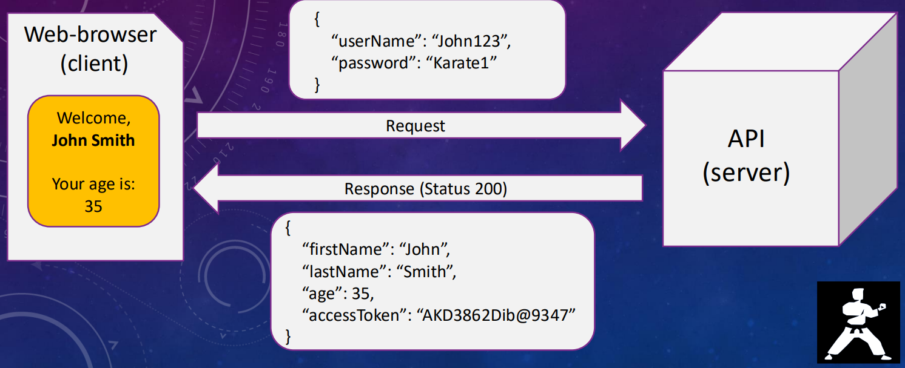
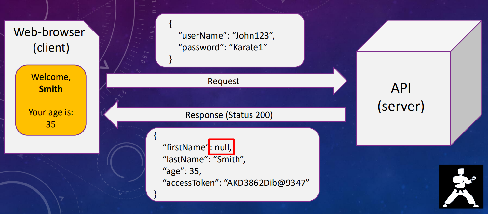

<title>Karate DSL: API Automation and Performance from Zero to Hero</title>

[Course URL](https://www.udemy.com/course/karate-dsl-api-automation-and-performance-from-zero-to-hero/)
[Karate Site](https://www.karatelabs.io/)
[Karate GitHub](https://github.com/karatelabs/karate)
# Section 1: Introduction
## Karate Pros & Cons

| Pros                                                        | Cons                                                       |
|-------------------------------------------------------------|------------------------------------------------------------|
| Easy to start with little coding knowledge (Gherkin syntax) | Own Karate scripting languages (Gherkin style)             |
| Native JSON support                                         | No intellisense support in IDE (may be plugin support now) |
| VERY powerful JSON validation                               | Difficult to find mistakes in code                         |
| Java & JavaScript support                                   |                                                            |
| Multi-thread parallel execution                             |                                                            |
| Detailed reporting & logs                                   |                                                            |
| Performance testing with Gatling                            |                                                            |

**Detailed comparison with RESTAssured**
[karate-vs-rest-assured.pdf](resources/karate-vs-rest-assured.pdf)

# Section 2: Basics
## What is JSON
**JSON** - JavaScript Object Notation
* Main type of payload for REST APIs
* **Types**
  1. **JSON Object: `{}`**
      * Key Value Pairs separated by `,`
      * Keys & values separated by `:`
      * Each key must be unique
      ``` json
        {
          "key1": "value1",
          "key2": "value2"
        }
      ```
  2. **JSON Array: `[]`**
     * Has indexes
     * Values/Objects separated by `,`
    ``` json
        [
            "value1",
            "value2"
        ]
    ```
  
### JSON Structure & Data Types
#### JSON Object: `{}`
1. **Simple Object**
   ``` json
        { "key": "value" }
   ```

2. **Nested Object**
   ``` json
        {
           "key": {
                "nestedKey": "nestedValue"
              }
        }
   ```
3. **Nested Array**
    ``` json
        {
           "key": [
                 "value1", "value2"
              ]
        }
   ```
   
#### JSON Array: `[]`
1. **Simple Array**
    ``` json
       ["value1", "value2"]
    ```
2. **Array of Objects**
    ```json
      [
         {"key": "value1"},
         {"key": "value2"}
      ]
    ```
   
#### Data Types
1. **String**
    ``` json
        {
          "name": "John",
          "age": "25"
        }
    ```
2. **Number**
    ``` json
        {
          "weight": 93,
          "age": 25
        }
    ```
3. **Boolean**
    ``` json
        {
          "isMarried": false
          "hasChildren": true
        }
    ```
4. **Null**
    ``` json
        {
          "spouseName": null
        }
    ```
### Manipulating data in JSON
**Original JSON data**

`def myObject`
```json
{
  "firstName": "John",
  "surname": "Doe",
  "age": 25,
  "cars": [
    "BMW",
    "Volvo"
  ],
  "income": {
    "q1": "€12000",
    "q2": "€15000"
  },
  "pets": [
    {
      "name": "Charlie",
      "type": "Dog"
    },
    {
      "name": "Jimmy",
      "type": "Rabbit"
    }
  ]
}
```

**Action: Get surname**
``` javascript
def lastName = myObject.lastName
```

**Action: Get 2nd car**
``` javascript
def secondCar = myObject.cars[1]
```

**Action: Get Q2 income**
``` javascript
def income25 = myObject.income.q2
```
**Action: Get the type of the first pet**
``` javascript
def firstPetType = myObject.pets[0].type
```
**Action: Update the age**
``` javascript
set myObject.age = 26
```
**Action: Update dogs name to be rabbits name**
``` javascript
set myObject.pets[0].name = myObject.pets[1].name
```
**Action: Add Q3 income**
As this record doesn't already exist Karate will create it inside the object
``` javascript
set myObject.income.q3 = "€13750"
```
**Action: Add a new car**
A new value will be appended to the array
``` javascript
set myObject.cars[] = "Toyota"
```

**Action: Replace a car**
Replaces an existing value in the array
``` javascript
set myObject.cars[0] = "Audi"
```
**Action: Delete Q2 income**
Replaces an existing value in the array
``` javascript
remove myObject.income.q2
```
>**Note:** 
> Keyword `remove` only works in Karate script
In JavaScript you'll need to use keyword `delete`

**Action: Delete Toyota car record**
``` javascript
remove myObject.cars[2]
```
>**Note:**
> Keyword `remove` only works in Karate script
In JavaScript you'll need to use keyword `delete`

**Resulting Object after all the changes**

```json
{
   "firstName": "John",
   "surname": "Doe",
   "age": 26,
   "cars": [
      "Audi",
      "Volvo",
      "Toyota"
   ],
   "income": {
      "q1": "€12000",
      "q3": "€13750"
   },
   "pets": [
      {
         "name": "Jimmy",
         "type": "Dog"
      },
      {
         "name": "Jimmy",
         "type": "Rabbit"
      }
   ]
}
```
### Summary
- JSON consist of objects{} and arrays[]
- Possible structures are:
  - simple objects and simple arrays
  - nested object and nested array
  - array of objects
- Data types: String, Number, Boolean, null
- Native JSON support to manipulate data

### Resources
[Working with JSON](resources/Working%2Bwith%2BJSON.pdf)

## What is an API
**API (Application Programming Interface)**

- An API is a set of rules and tools that allows different software applications to **communicate** with each other.
- It defines **how** one program can request services or data from another using **standardized requests and responses**.

**Purpose**
- Enables systems to interact without needing to understand each other’s internal workings.

**Common Use**
- Connecting a website or mobile app to a database or third-party service.

**Examples**
- A weather app uses an API to fetch weather data from a weather service.
- A payment app like Revolut or PayPal uses APIs to connect to banks.

**REST API**
- Stands for *Representational State Transfer API*.
- A type of API that enables communication between systems over the internet.
- Works by sending **requests** and receiving **responses**, typically in **JSON** format, between a **client** and a **server**.

**Example**


### Types of API requests
* **GET** – Retrieve specific data from an API
* **POST** – Send data to an API to **create** a new resource
* **PUT** – Send data to an API to **replace** an existing resource entirely
* **PATCH** – Send data to an API to **update** part of an existing resource i.e. certain fields
* **DELETE** – Send a request to an API to **delete** a resource

### Typical API request
* **API URL** - Https link to API. Usually called API End-point
* **Headers** - Usually it’s Content-Type or Authorization token
* **Method** - GET, POST, PUT, DELETE
* **Body** - JSON object with requested data

### HTTP Response Status Codes
* **2xx** (200, 201, 204, ...) - Success!
* **3xx** (300, 301, 302, ...) - Redirection (Client should probably follow the redirection)
* **4xx** (400, 401, 404, ...) - Client Error (Something was wrong with the request)
* **5xx** (500, 501, 502, ...) - Server Error (API accepted your request but was unable to process it)

### REST API Tips


### Client Server Example




### Why do we need to test APIs?
To verify that the API follows the defined contract & the logic of the API (server) is matching the expected result.

#### Contract
Contract is a kind of agreement between front end and back end or client and server on what kind of valid request server can get and what kind of valid response for this request server should provide.
**Example**
```
Valid request:
  username: String
  password: String
```
```
Valid response:
  firstName: String
  lastName: String
  age: Number
  accessToken: String
```

#### Breaking the Contract examples
**Null value**


**Wrong data type**


**Missing key value pair**


### Summary
- API – Application Programming Interface (black box)
- Method types: Get, Post, Put, Patch, Delete
- Typical request has: URL, Headers, Request type, Body
- Status codes: 2xx (Success), 3xx (Redirect), 4xx (Client error),
  5xx (Server error)
- The purpose of API automation is to verify that API follows the defined contract and the logic of the API (server) is matching the expected result
- API automated tests are **MUCH** faster than UI automation

### Resources
[What is API](resources/What%2Bis%2BAPI.pdf)

# Section 3: Setup
## Environment Setup

* Java 8 or higher [Java Downloads](https://www.oracle.com/java/technologies/downloads/)
  `java --version`
  `echo $JAVA_HOME`
* Maven [install-maven-on-windows-linux-mac](https://www.baeldung.com/install-maven-on-windows-linux-mac) or Gradle [gradle.org/install/](https://gradle.org/install/)
  `gradle -v`
* Git
  `git --version`
* Yarn (package manager) - [Yarn Installation Guide](https://yarnpkg.com/getting-started/install)
  `yarn -version`
* Postman
* VSCode
  * Cucumber (Gherkin) Full Support
    
  * Karate Runner
    
  * Java Extension Pack
    

**Might need to disable Test Runner for Java!!!!!!!!!!!**


## Test Project Overview
[Test Application URL](https://conduit.bondaracademy.com/)
[Test API URL](https://conduit-api.bondaracademy.com)

## Karate Framework Setup
[Karate GitHub Documention](https://github.com/karatelabs/karate)

Ran the following script in there to set up the project with some sample test files.
The docs have a multi-line command but I edited it to be what's below for use with git bash
```groovy
mvn archetype:generate -DarchetypeGroupId=io.karatelabs -DarchetypeArtifactId=karate-archetype -DarchetypeVersion=1.5.1 -DgroupId=com.mf -DartifactId=karate-test-project-maven -DinteractiveMode=false
```

You can then run the tests with 
```bash
mvn test
```

## Karate Framework Overview
### `pom.xml`
This is where you define dependencies, plugins, properties and build details

``` xml
<project xmlns="http://maven.apache.org/POM/4.0.0" xmlns:xsi="http://www.w3.org/2001/XMLSchema-instance"
         xsi:schemaLocation="http://maven.apache.org/POM/4.0.0 http://maven.apache.org/xsd/maven-4.0.0.xsd">
    <modelVersion>4.0.0</modelVersion>
 
    <groupId>com.mf</groupId>
    <artifactId>karate-test-project-maven</artifactId>
    <version>1.0-SNAPSHOT</version>
    <packaging>jar</packaging>
 
    <properties>
        <project.build.sourceEncoding>UTF-8</project.build.sourceEncoding>
        <java.version>21</java.version>
        <maven.compiler.version>3.11.0</maven.compiler.version>
        <maven.surefire.version>3.0.0</maven.surefire.version>
        <karate.version>1.5.0</karate.version>
    </properties>    

    <dependencies>         
        <dependency>
            <groupId>io.karatelabs</groupId>
            <artifactId>karate-junit5</artifactId>
            <version>${karate.version}</version>
            <scope>test</scope>
        </dependency>		
    </dependencies>

    <build>
        <testResources>
            <testResource>
                <directory>src/test/java</directory>
                <excludes>
                    <exclude>**/*.java</exclude>
                </excludes>
            </testResource>
        </testResources>
        <plugins>
            <plugin>
                <groupId>org.apache.maven.plugins</groupId>
                <artifactId>maven-compiler-plugin</artifactId>
                <version>${maven.compiler.version}</version>
                <configuration>
                    <encoding>UTF-8</encoding>
                    <source>${java.version}</source>
                    <target>${java.version}</target>
                </configuration>
            </plugin>
            <plugin>
                <groupId>org.apache.maven.plugins</groupId>
                <artifactId>maven-surefire-plugin</artifactId>
                <version>${maven.surefire.version}</version>
                <configuration>
                    <argLine>-Dfile.encoding=UTF-8</argLine>
                </configuration>
            </plugin>          
        </plugins>        
    </build>       
    
</project>
```

### ``target`` folder
Temporary generated data.
This is where test reports are logged & stored.


### ``src\test\java`` folder
Contains tests and important karate configuration files

**`logback-test.xml`**
Configures logging.
``` xml
<?xml version="1.0" encoding="UTF-8"?>
<configuration>
 
    <appender name="STDOUT" class="ch.qos.logback.core.ConsoleAppender">
        <encoder>
            <pattern>%d{HH:mm:ss.SSS} [%thread] %-5level %logger{36} - %msg%n</pattern>
        </encoder>
    </appender>
  
    <appender name="FILE" class="ch.qos.logback.core.FileAppender">
        <file>target/karate.log</file>
        <encoder>
            <pattern>%d{HH:mm:ss.SSS} [%thread] %-5level %logger{36} - %msg%n</pattern>
        </encoder>
    </appender>    
   
    <logger name="com.intuit" level="DEBUG"/>
   
    <root level="info">
        <appender-ref ref="STDOUT" />
        <appender-ref ref="FILE" />
    </root>
  
</configuration>
```

**karate-config.js**
Main file where execution starts.
* Configure environment variables.
* Useful to execute code before tests.

``` javascript
function fn() {
  var env = karate.env; // get system property 'karate.env'
  karate.log('karate.env system property was:', env);
  if (!env) {
    env = 'dev';
  }
  var config = {
    env: env,
    myVarName: 'someValue'
  }
  if (env == 'dev') {
    // customize
    // e.g. config.foo = 'bar';
  } else if (env == 'e2e') {
    // customize
  }
  return config;
}
```

#### `ExamplesTest.java`
This is the Karate JUnit5 runner class.
``` java
package examples;

import com.intuit.karate.junit5.Karate;

class ExamplesTest {

    // this will run all *.feature files that exist in subdirectories
    @Karate.Test
    Karate testAll(){
        return Karate.run().relativeTo(getClass());
    }
}
```

# Section 4: API Automation

# Section 5: Advanced Features

# Section 6: Performance Testing with Gatling

# Section 7: Conclusion