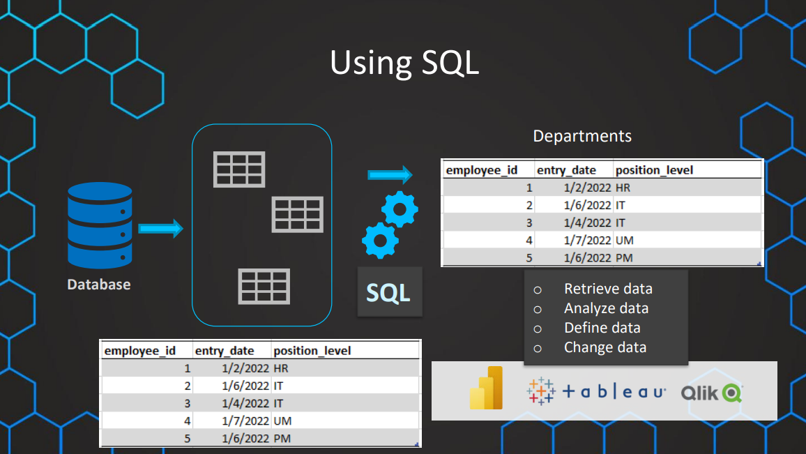
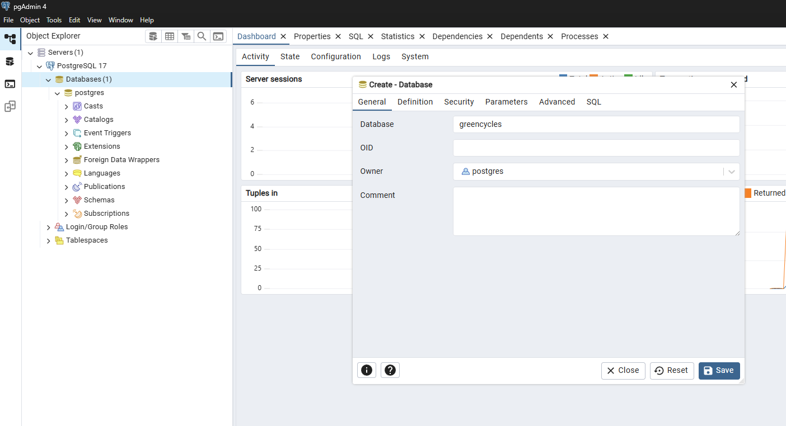
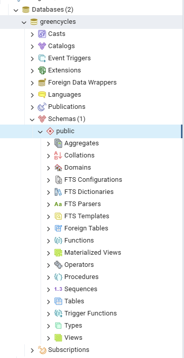
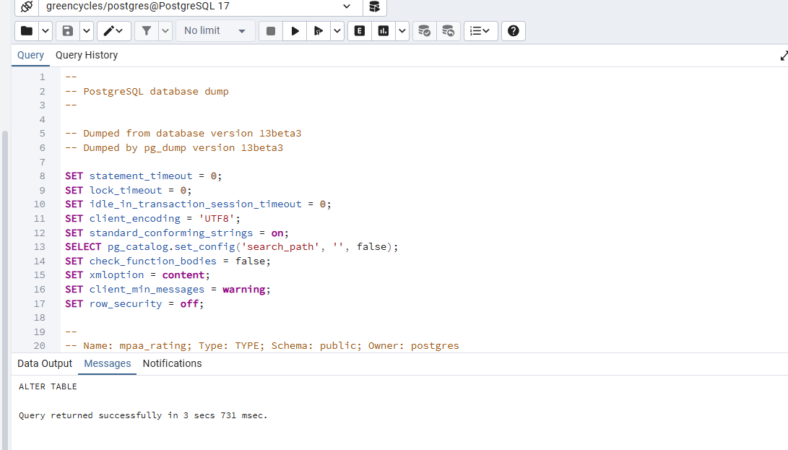
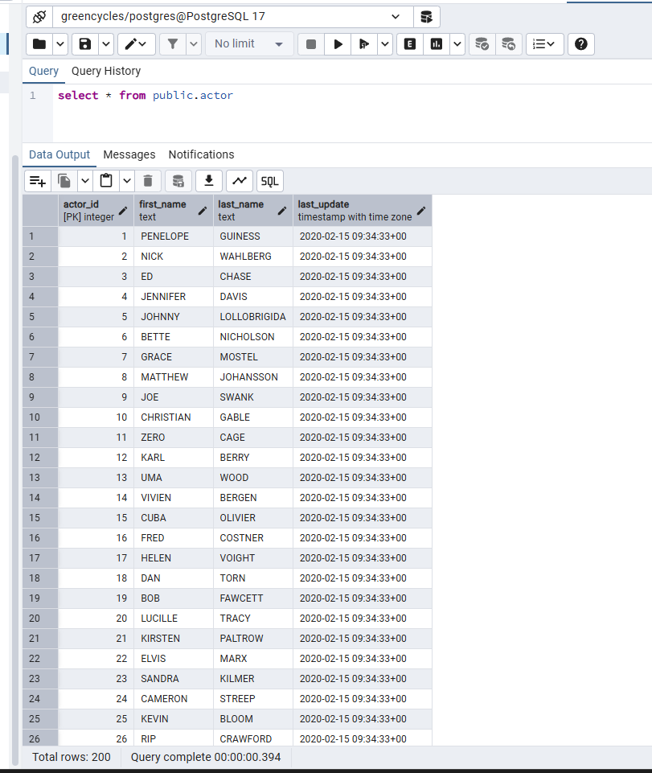
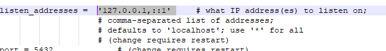

[← Table of Contents](ToC.md)
# Section 1: Getting Started with SQL!

**SQL = Structured Query Language**
Used to interact with databases

## Using SQL


## Why learn SQL?
* Data is everywhere & mostly stored in databases
* Maybe the most important skill as:
  * Data Analyst
  * Data Scientist
  * Business Analyst
* Easy & Intuitive
* Mastering SQL is a Career Booster

### Coding Exercise 1: Let's get started
There is a table already set up called payment.
You can select all columns in that table by using the command ``SELECT * FROM payment``

## What is a Database?
Tables with rows and columns.
Use SQL to interact with these databases.
Schema - additional layer to organise and structure data.
Databases are managed by software called a Database Management System (DBMS) i.e. PostgreSQL - PgAdmin is the GUI.
Other DBMS's - MSSQL Server, MySQL, MongoDB, MariaDB

### Quiz 1: Databases
**Q1: What is a schema?**
Schemas define the organization of data within a database, outlining how tables, fields, and relationships are arranged. This understanding is essential for effectively managing and utilizing database systems.

## Different dialects of SQL
* One Language
* All DBMS have slightly different dialects
* The differences are small
* PostgreSQL: 
  * Closest to Standard SQL
  * Most flexible
  * Free to download & use
  * Most advanced DBMS in the world
* Other options: MSSQL Server, MySQL, MongoDB, MariaDB

### Quiz 2: Different dialects of SQL
**Q1: How can the different dialects of SQL be described?**
No database is fully compatible with the SQL standard but they only have minor differences

**Q2: Which is dialect of SQL is considered the closest to the official SQL standard?**
PostgreSQL

## Installing PostgreSQL & pgAdmin (Windows)
[PostgreSQL Downloads Page](https://www.postgresql.org/download/)
[Windows Installers](https://www.enterprisedb.com/downloads/postgres-postgresql-downloads)

Latest version is 17.5 as of 03/06/25

Installation & data directory configured to ``D:\Programs\PostgreSQL\17``

Superuser configured as:
> username: postgres
> password: pwrd1

### Common Problems: Set binary path in pgAdmin
If you get an error related to setting the binary path just perform the following steps:
1. Open File -> Preferences
2. Go to Paths -> Binary Paths
3. Paste the path ``D:\Programs\PostgreSQL\17\bin`` in the binary path of your PostgreSQL version
4. Click on Save and try again.

_If it is still not working, just restart pgAdmin and try again._

## Setting up the database

1. Expand latest PostgreSQL server version in pgAdmin
2. Right click ``Databases``
3. Select ``Create``
4. Select ``Databases...``
5. Enter name ``greencycles``
6. Click ``Save``



**An empty database is now created**



### Importing tables
[ZIP file of database schema for course](resources/pagila-master.zip)

1. Unzip folder
2. Open Query Tool in pgAdmin (right-click Schema and select Query Tool)
3. Open file ``pagila-insert-data.sql``
4. Execute the query



### Running a query against the database

``select * from public.actor``



### Common problems: Slow performance
**PgAdmin is slow**
If you experience very slow performance in pgAdmin, you can make one important adjustment.
Make sure pgAdmin is closed.

1. Open the folder ``D:\Programs\PostgreSQL\17\data``
2. Open the file ``postgresql.conf`` by right-clicking it and selecting ``Edit`` or ``Edit with Notepad++``.
3. Press 'CTRL + F' and search for listen_addresses and replace ``*`` with ``127.0.0.1,::1``

4. Save the file
5. Open pgAdmin and your performance should be much better now!

## SELECT
* Most basic SQL statement
* Used to select and return data

### Examples
**Single column**
```sql
SELECT
first_name
FROM actor
```

**Multiple columns**
```sql
SELECT
first_name,
last_name
FROM actor
```

**All columns**
```sql
SELECT
*
FROM actor
```

### Coding Exercise 2: SELECT
From the ``books`` table only select the columns ``title`` and ``publication_year``.

```sql
SELECT title, publication_year FROM books
```

### Challenge: SELECT
>Your first day as a Data Analyst has started!
The Marketing Manager asks you for a list of all customers.
With first name, last name and the customer's email address.
**Write a SQL query to get that list!**

**Solution**
```sql
SELECT 
first_name,
last_name,
email
FROM customer
```

## ORDER BY
* Used to order results based on a columns value
* Alphabetically, numerically, chronologically etc.

### Examples
```sql
SELECT
first_name,
last_name
FROM actor
ORDER BY first_name
```

**Descending**
```sql
SELECT
first_name,
last_name
FROM actor
ORDER BY first_name DESC
```

**Ascending**
This is the way results are ordered by default - useful for readability
```sql
SELECT
first_name,
last_name
FROM actor
ORDER BY first_name ASC
```

**Multiple Columns**
```sql
SELECT
first_name,
last_name
FROM actor
ORDER BY first_name, last_name
```

**Multiple Columns Ascending/Descending**
```sql
SELECT
first_name,
last_name
FROM actor
ORDER BY first_name DESC, last_name
```

**Payments table example**
```sql
SELECT * 
FROM payment
ORDER BY customer_id, amount DESC
```

### Coding Exercise 3: SELECT & ORDER BY
Given the ``books`` table, write a SQL query to:
* Select all columns from the ``books`` table.
* Order the results by the ``price`` in descending order.
```sql
SELECT *
FROM books
ORDER BY price DESC
```

### Challenge: ORDER BY
>You need to help the Marketing team to work more easily
The Marketing Manager asks you to order the customer list by the last name.
They want to start from Z and work towards A.
In the case of the same last name the order should be based on the first name - also from Z to A
**Write a SQL query to get that list!**

**Solution**
```sql
SELECT 
first_name,
last_name,
email
FROM customer
ORDER BY last_name DESC, first_name DESC
```

Another tip - Instead of the column name we can also use the column number 
**Example**
```sql
SELECT 
first_name,
last_name,
email
FROM customer
ORDER BY 2 DESC, 1 DESC
```

## SELECT DISTINCT
* Used to SELECT the DISTINCT values in a table

### Syntax
```sql
SELECT DISTINCT
column_name
FROM table_name
```

### Examples
```sql
SELECT DISTINCT 
first_name
FROM actor
```

```sql
SELECT DISTINCT 
first_name
FROM actor
ORDER BY first_name
```

**Multiple Columns**
As long as there is a difference in either column the row will be returned - so it's essentially looking for unique combinates of the selected columns.
```sql
SELECT DISTINCT 
first_name, last_name
FROM actor
ORDER BY first_name
```

**Film tabling - distinct ratings**
```sql
SELECT DISTINCT
rating 
FROM film
```

**film table - distinch ratings and rental duration combinations**
```sql
SELECT DISTINCT
rating,
rental_duration
FROM film
```

### Challenge: SELECT DISTINCT
>A marketing team member asks you about the different prices that have been paid.
To make it easier for them order the prices from high to low.
**Write a SQL query to get the different prices!**

**Solution**
```sql
SELECT DISTINCT amount 
FROM payment
ORDER BY amount DESC
```

## LIMIT
* Used to LIMIT the number of rows in the output
* ALWAYS at the very end of your query
* Can help to get a quick idea about a table

### Syntax
```sql
SELECT
column_name1,
column_name2
FROM table_name
LIMIT n
```

### Examples
```sql
SELECT
first_name
FROM actor
LIMIT 4
```

```sql
SELECT
first_name
FROM actor
ORDER BY first_name
LIMIT 4
```
**rental table**
```sql
SELECT * FROM rental
ORDER BY rental_date DESC
LIMIT 100
```

### Coding Exercise 4: SELECT DISTINCT & LIMIT
Write a single SQL query to retrieve the first 5 unique genres in ascending alphabetical order.
Column: ``genre`` in the ``books`` table.
This query will test your ability to filter out duplicates and limit the result set.
Remember, the result should only show distinct genres, meaning if there are multiple books of the same genre, that genre should only appear once in your result set. Also, ensure the genres are listed in alphabetical order and limit the output to the first 5 genres

```sql
SELECT DISTINCT genre
FROM books
ORDER BY genre ASC
LIMIT 5
```

## COUNT()
* Used to COUNT the number of rows in a output
* Used often in combination with grouping & filtering

### Syntax
```sql
SELECT
COUNT(*)
FROM table_name
```
_OR_ 
```sql
SELECT
COUNT(column_name)
FROM table_name
```
Note: Nulls will not be counted in the case of column name being used

### Examples
```sql
SELECT
COUNT(first_name)
FROM actor
```

```sql
SELECT
COUNT(*)
FROM actor
```

````sql
SELECT
COUNT(DISTINCT first_name)
FROM actor
````

### Coding Exercise 5: COUNT()
Given the table ``employees``, write a single SQL query to count the total number of employees in the company.
**Table Name:** ``employees``
**Relevant Columns:** ``id`` (you can count rows using any column, but id is usually preferred for its uniqueness)
**Note:** To get the correct solution you need to use ``COUNT()`` in all-caps even though in reality both solutions work equally.

```sql
SELECT COUNT(id) 
FROM employees
```

## Section 1 Challenges
### Challenge 1
> Create a list of all the distinct districts customers are from.

**Solution** 
```sql
SELECT DISTINCT
district
FROM address
```

### Challenge 2
> What is the latest rental date?

**Solution**
```sql
SELECT rental_date 
FROM rental
ORDER BY rental_date DESC
LIMIT 1
```

### Challenge 3 
> How many films does the company have?

**Solution**
```sql
SELECT
COUNT(*)
FROM film
```

### Challenge 4
> How many distinct last names of the customers are there?

**Solution**
```sql
SELECT COUNT(DISTINCT last_name)
FROM CUSTOMER
```