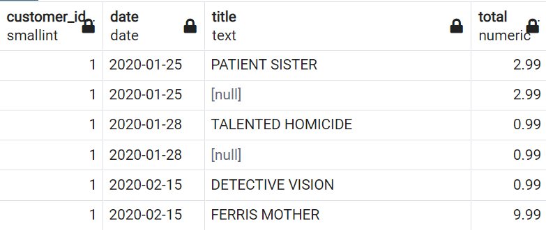

[← Table of Contents](ToC.md)
# Section 12: Grouping Sets, Rollups, Self-Joins

## `GROUPING SETS`
[Neon tutorial for GROUPING SETS](https://neon.com/postgresql/postgresql-tutorial/postgresql-grouping-sets)
* A grouping set is a set of columns by which you group using the GROUP BY clause.
* A grouping set is denoted by a comma-separated list of columns placed inside parentheses
    `(column1, column2, ...)`

### Sample Problem
A combination of the following 3 queries are needed to summarise sales by month, by staff member per month and by staff member in total

This could be done with 3 queries
```sql
SELECT
staff_id,
SUM(amount)
FROM payment
GROUP BY staff_id


SELECT
TO_CHAR(payment_date, 'Month'),
SUM(amount)
FROM payment 
GROUP BY TO_CHAR(payment_date, 'Month')

SELECT
TO_CHAR(payment_date, 'Month'),
staff_id,
SUM(amount)
FROM payment 
GROUP BY TO_CHAR(payment_date, 'Month'), staff_id
```
... In theory it can also be done with UNIONs but this is messy and expensive
i.e.
```sql
SELECT
NULL AS month,
staff_id,
SUM(amount)
FROM payment
GROUP BY staff_id
UNION
SELECT
TO_CHAR(payment_date, 'Month') AS month,
NULL as staff_id,
SUM(amount)
FROM payment 
GROUP BY TO_CHAR(payment_date, 'Month')
UNION
SELECT
TO_CHAR(payment_date, 'Month') AS month,
staff_id,
SUM(amount)
FROM payment 
GROUP BY TO_CHAR(payment_date, 'Month'), staff_id

```

But by using `GROUPING SETS` it can be combined 
```sql
SELECT
TO_CHAR(payment_date, 'Month') AS month,
staff_id,
SUM(amount)
FROM payment
GROUP BY 
	GROUPING SETS(
		(staff_id),
		(month),
		(staff_id, month))
ORDER BY month, staff_id
```

And an improved solution with the addittion of ordering by the month number so it's sequential and output makes more sense
```sql
SELECT
EXTRACT(month from payment_date) AS month_num,
TO_CHAR(payment_date, 'Month') AS month,
staff_id,
SUM(amount)
FROM payment
GROUP BY 
	GROUPING SETS(
		(staff_id),
		(month_num, month),
		(staff_id, month_num, month))
ORDER BY month_num, staff_id
```

### Challenge: `GROUPING SETS`
Write a query that returns the sum of the amount for each customer (`first_name` & `last_name`) and each `staff_id`.
Also add the overall revenue per customer.

**Solution:**
```sql
SELECT 
c.customer_id,
c.first_name,
c.last_name,
p.staff_id,
SUM(p.amount)
FROM payment p
INNER JOIN customer c 
ON p.customer_id = c.customer_id
GROUP BY 
	GROUPING SETS(
		(c.customer_id, c.first_name, c.last_name),
		(c.customer_id, c.first_name, c.last_name, p.staff_id))
ORDER BY c.customer_id, p.staff_id
```

### Additional Challenge: `GROUPING SETS`
Write a query that calculates the share of revenue each `staff_id` makes per customer

**Solution:**
```sql
SELECT 
c.customer_id,
c.first_name,
c.last_name,
p.staff_id,
SUM(p.amount) as total,
ROUND((SUM(p.amount)/FIRST_VALUE(SUM(p.amount)) 
	OVER(PARTITION BY c.customer_id ORDER BY SUM(p.amount) DESC)) * 100 , 2) AS percentage
FROM payment p
INNER JOIN customer c 
ON p.customer_id = c.customer_id
GROUP BY 
	GROUPING SETS(
		(c.customer_id, c.first_name, c.last_name),
		(c.customer_id, c.first_name, c.last_name, p.staff_id))
ORDER BY c.customer_id, p.staff_id

```

## `ROLLUP`
[Neon tutorial for ROLLUP](https://neon.com/postgresql/postgresql-tutorial/postgresql-rollup)
The PostgreSQL ROLLUP is a subclause of the GROUP BY clause that offers a shorthand for defining multiple grouping sets. A grouping set is a set of columns by which you group.

A common use of  ROLLUP is to calculate the aggregations of data by year, month, and date, considering the hierarchy year > month > date

### Syntax
The following illustrates the syntax of the PostgreSQL ROLLUP:
```sql
SELECT
    c1,
    c2,
    c3,
    aggregate(c4)
FROM
    table_name
GROUP BY
    ROLLUP (c1, c2, c3);
```

`ROLLUP(c1,c2,c3)` generates only four grouping sets, assuming the hierarchy c1 > c2 > c3 as follows:
```sql
(c1, c2, c3)
(c1, c2)
(c1)
()
```

Another example of the hierarchy created:
```sql
GROUP BY
ROLLUP (column1, column2, column3)
```
Results in:
```sql
GROUP BY
GROUPING SETS (
(column1, column2, column3),
(column1, column2),
(column1),
()
)
```

### Examples
Hierarchy of 
1. quarter
2. month
3. day
```sql

SELECT
'Q' || TO_CHAR(payment_date, 'Q') AS quarter_of_year,
EXTRACT(month FROM payment_date) AS month,
DATE(payment_date) AS day,
SUM(amount)
FROM payment
GROUP BY
ROLLUP(
	'Q' || TO_CHAR(payment_date, 'Q'),
	EXTRACT(month FROM payment_date),
	DATE(payment_date)
)
ORDER BY quarter_of_year, month, day
-- ORDER BY 1,2,3 as an alternative here
```
Sample Output:

| quarter_of_year | month | day        | sum      | notes                 |
|-----------------|-------|------------|----------|-----------------------|
| Q1              | 1     | 2020-01-24 | 86.81    | Sum of day            |
| Q1              | 1     | 2020-01-25 | 568.61   | Sum of day            |
| Q1              | 1     | 2020-01-26 | 743.30   | Sum of day            |
| Q1              | 1     | 2020-01-27 | 707.28   | Sum of day            |
| Q1              | 1     |            | 4819.45  | Sum of entire month   |
| Q1              | 2     | 2020-02-14 | 152.63   | Sum of day            |
| Q1              | 2     | 2020-02-15 | 1376.49  | Sum of day            |
| Q1              | 2     | 2020-02-16 | 1310.83  | Sum of day            |
| Q1              | 2     | 2020-02-17 | 1368.72  | Sum of day            |
| Q1              | 2     | 2020-02-18 | 1469.58  | Sum of day            |
| Q1              | 2     | 2020-02-19 | 1492.48  | Sum of day            |
| Q1              | 2     |            | 9631.88  | Sum of entire month   |
| Q1              | 3     | 2020-03-01 | 2808.24  | Sum of day            |
| Q1              | 3     | 2020-03-02 | 2550.05  | Sum of day            |
| Q1              | 3     | 2020-03-16 | 299.28   | Sum of day            |
| Q1              | 3     | 2020-03-20 | 2669.89  | Sum of day            |
| Q1              | 3     | 2020-03-21 | 2868.27  | Sum of day            |
| Q1              | 3     | 2020-03-23 | 2342.43  | Sum of day            |
| Q1              | 3     |            | 23886.56 | Sum of entire month   |
| Q1              |       |            | 38337.89 | Sum of entire quarter |


### Challenge: `ROLLUP`
Write a query that calculates a booking amount rollup for the hierarchy of quarter, month, week in month and day.

```sql
SELECT
EXTRACT(quarter FROM book_date) AS quarter,
EXTRACT(month FROM book_date) AS month,
TO_CHAR(book_date, 'w') AS week_in_month,
DATE(book_date) AS day,
SUM(total_amount)
FROM bookings
GROUP BY
ROLLUP(
	EXTRACT(quarter FROM book_date),
	EXTRACT(month FROM book_date),
	TO_CHAR(book_date, 'w'),
	DATE(book_date)
)
ORDER BY quarter, month, week_in_month, day
-- ORDER BY 1,2,3,4 as an alternative here
```

## `CUBE`
[Neon tutorial for CUBE](https://www.geeksforgeeks.org/postgresql/postgresql-cube/)
CUBE is a part of the GROUP BY clause used in SQL queries to generate multiple grouping sets simultaneously. This is particularly useful in scenarios where one needs to analyze the data across several dimensions without running multiple queries.

### Syntax
```sql
SELECT
column1,
column2,
column3,
aggregate (column4)
FROM
table_name
GROUP BY
CUBE (column1, column2, column3);
```
Returns **all** possible combinations of the sets included, order **does not** matter
i.e.
```sql
GROUP BY
CUBE (column1, column2, column3)
```
Results in:
```sql
GROUP BY
GROUPING SETS (
    (column1, column2, column3),
    (column1, column2),
    (column1, column3),
    (column2, column3),
    (column1),
    (column2),
    (column3),
    ()
)
```


### Example
**Totals per customer, per staff_id, per day i.e. there's no natural hierarchy**
```sql
SELECT 
DATE(payment_date),
staff_id,
customer_id,
SUM(amount)
FROM payment
GROUP BY
CUBE(
	DATE(payment_date),
	customer_id,
	staff_id
)
ORDER BY 1,2,3
```
Results in totals for every combination i.e. 
* per customer_id per_staff_id per_day
* per staff_id per day
* per staff_id per customer_id
* per customer_id per day
* per day
* per customer_id
* per staff_id
* total

### Challenge: `CUBE`
Write a query that returns all grouping sets in all combinations of customer_id, date and title with the aggregation of the payment amount.

The desired result looks like this:


How do you order the output to get that desired result?

**Solution:**
```sql
SELECT 
p.customer_id, 
DATE(p.payment_date) AS date,
f.title AS title,
SUM(amount) AS total
from payment p
INNER JOIN rental r 
ON p.rental_id = r.rental_id
INNER JOIN inventory i 
ON r.inventory_id = i.inventory_id
INNER JOIN film f 
ON i.film_id = f.film_id
GROUP BY
CUBE(
	p.customer_id,
	DATE(p.payment_date),
	f.title
)
ORDER BY p.customer_id, DATE(p.payment_date), f.title
--ORDER BY 1,2,3
```

## Self Joins
* Standard join with itself
* When we have a self-reference in a table


### Syntax
```sql
SELECT
t1.column1,
t2.column1
[,…]
FROM table1 t1
LEFT JOIN table1 t2
ON t1.column1=t2.column1
```

### Examples
**Sample Table & Data**
```sql
CREATE TABLE employee (
	employee_id INT,
	name VARCHAR (50),
	manager_id INT
);

INSERT INTO employee 
VALUES
	(1, 'Liam Smith', NULL),
	(2, 'Oliver Brown', 1),
	(3, 'Elijah Jones', 1),
	(4, 'William Miller', 1),
	(5, 'James Davis', 2),
	(6, 'Olivia Hernandez', 2),
	(7, 'Emma Lopez', 2),
	(8, 'Sophia Andersen', 2),
	(9, 'Mia Lee', 3),
	(10, 'Ava Robinson', 3);
```

**Sample Join**
```sql
SELECT 
emp.employee_id,
emp.name AS employee,
emp.manager_id,
mng.name AS manager,
mng.manager_id AS boss,
FROM employee emp
LEFT JOIN employee mng
ON emp.manager_id = mng.employee_id
```

**2nd Self Join.**
```sql
SELECT 
emp.employee_id,
emp.name AS employee,
emp.manager_id,
mng.name AS manager,
mng.manager_id AS managers_manager,
mng2.name
FROM employee emp
LEFT JOIN employee mng
ON emp.manager_id = mng.employee_id
LEFT JOIN employee mng2
ON mng.manager_id = mng2.employee_id
```

### Challenge: Self Joins
Find all the pairs of films with the same length!

**Solution:**
```sql
SELECT 
f.title,
f2.title,
f.length
FROM film f
LEFT JOIN film f2
ON f.length = f2.length 
    AND f.title <> f2.title
ORDER BY f.length DESC
```

## `CROSS JOIN`
[Neon Cross Join tutorial](https://neon.com/postgresql/postgresql-tutorial/postgresql-cross-join)
* Creates the Cartesian Product - All combinations of rows
* Number of resulting rows is the product of the number of rows in each table - duplicates are ignored so values dont matter
| letter  |
|:-------:|
|    A    |
|    B    |
`CROSS JOIN`
| number |
|:------:|
|   1    |
|   2    |
|   3    |
`Results In: `
| number | letter |
|:------:|:------:|
|   1    |   A    |
|   2    |   A    |
|   3    |   A    |
|   1    |   B    |
|   2    |   B    |
|   3    |   B    |

### Syntax
```sql
SELECT
t1.column1,
t2.column1
FROM table1 t1
CROSS JOIN table2 t2
```

### Examples
```sql
SELECT 
staff_id,
store.store_id,
last_name,
staff_id*store.store_id
FROM staff
CROSS JOIN store
```

## `NATURAL JOIN`
[Neon Natural Join Docs + Examples](https://neon.com/postgresql/postgresql-tutorial/postgresql-natural-join)
* Just like a normal JOIN
* Automatically joins using columns with the same column name

### Examples
customer_id is present in both tables so it's naturally determined
```sql
SELECT
*
FROM payment
NATURAL LEFT JOIN customer
```

```sql
SELECT
first_name,
last_name, 
SUM(amount)
FROM payment
NATURAL INNER JOIN customer
GROUP BY first_name, last_name
```

An example of an issue that can occur
The below doesn't work, both tables have `address_id` but they also both have `last_update` and because that's assumed in the join no rows are returned
```sql
SELECT * 
FROM customer
NATURAL INNER JOIN address
```