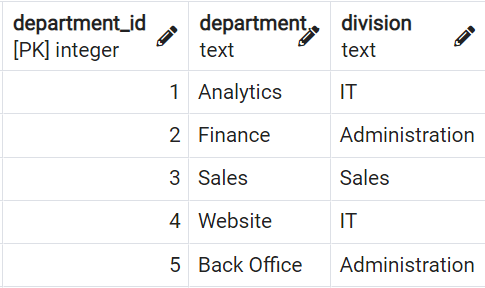
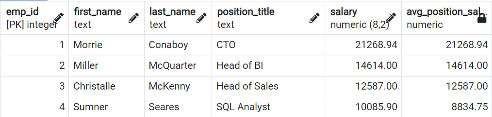
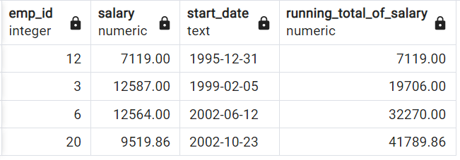
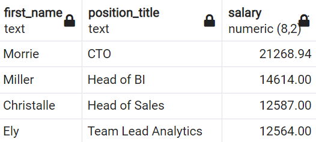
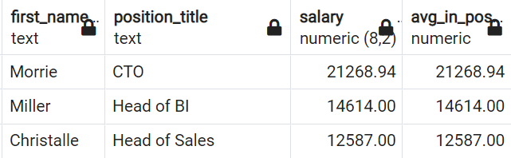
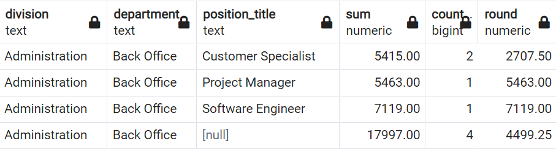
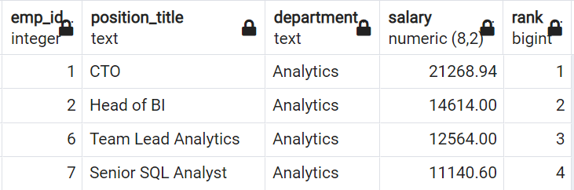

[← Table of Contents](ToC.md)
# Section 13: Course Project
* All using local database called `greencycles`
* * &#9989; = correct, &#10060; = incorrect - marked beside _My Solution_ for each question


## Task 1 - Create Tables
**Difficulty:** Moderate

### Task 1.1
In your company there hasn't been a database table with all the employee information yet.
You need to set up the table called `employees` in the following way:


There should be `NOT NULL` constraints for the following columns:
* `first_name`
* `last_name` 
* `job_position`
* `start_date DATE`
* `birth_date DATE`

**My Solution:** &#9989;
```sql
CREATE TABLE employees(
    emp_id SERIAL PRIMARY KEY,
    first_name TEXT NOT NULL,
    last_name TEXT NOT NULL,
    job_position TEXT NOT NULL,
    salary DECIMAL(8,2),
    start_date DATE NOT NULL,
    birth_date DATE NOT NULL,
    store_id INT REFERENCES store(store_id),
    department_id INT,
    manager_id INT
);
```
### Task 1.2
Set up an additional table called `departments` in the following way:

Additionally no column should allow nulls.

**My Solution:** &#9989;
```sql
CREATE TABLE departments(
    department_id SERIAL PRIMARY KEY,
    department TEXT NOT NULL,
    division TEXT NOT NULL
);
```

## Task 2 - Alter Tables
**Difficulty:** Moderate

Alter the employees table in the following way:
- Set the column `department_id` to not null.
- Add a default value of `CURRENT_DATE` to the column `start_date`.
- Add the column `end_date` with an appropriate data type (one that you think makes sense).
- Add a constraint called `birth_check` that doesn't allow birth dates that are in the future.
- Rename the column `job_position` to `position_title`.

**My Solution:** &#9989;
```sql
ALTER TABLE employees
ALTER COLUMN department_id SET NOT NULL,
ALTER COLUMN start_date SET DEFAULT CURRENT_DATE,
ADD COLUMN IF NOT EXISTS end_date DATE,
ADD CONSTRAINT birth_check CHECK(birth_date <= CURRENT_DATE)

-- Rename needs to be a seperate step
ALTER TABLE employees
RENAME COLUMN job_position TO position_title
```

## Task 3 - Insert Data
**Difficulty:** Moderate
### Task 3.1

Insert the following values into the employees table.

There will be most likely an error when you try to insert the values.

So, try to insert the values and then fix the error.

Columns:
```sql
(emp_id,first_name,last_name,position_title,salary,start_date,birth_date,store_id,department_id,manager_id,end_date)
```

Values:
```sql
(1,'Morrie','Conaboy','CTO',21268.94,'2005-04-30','1983-07-10',1,1,NULL,NULL),
(2,'Miller','McQuarter','Head of BI',14614.00,'2019-07-23','1978-11-09',1,1,1,NULL),
(3,'Christalle','McKenny','Head of Sales',12587.00,'1999-02-05','1973-01-09',2,3,1,NULL),
(4,'Sumner','Seares','SQL Analyst',9515.00,'2006-05-31','1976-08-03',2,1,6,NULL),
(5,'Romain','Hacard','BI Consultant',7107.00,'2012-09-24','1984-07-14',1,1,6,NULL),
(6,'Ely','Luscombe','Team Lead Analytics',12564.00,'2002-06-12','1974-08-01',1,1,2,NULL),
(7,'Clywd','Filyashin','Senior SQL Analyst',10510.00,'2010-04-05','1989-07-23',2,1,2,NULL),
(8,'Christopher','Blague','SQL Analyst',9428.00,'2007-09-30','1990-12-07',2,2,6,NULL),
(9,'Roddie','Izen','Software Engineer',4937.00,'2019-03-22','2008-08-30',1,4,6,NULL),
(10,'Ammamaria','Izhak','Customer Support',2355.00,'2005-03-17','1974-07-27',2,5,3,2013-04-14),
(11,'Carlyn','Stripp','Customer Support',3060.00,'2013-09-06','1981-09-05',1,5,3,NULL),
(12,'Reuben','McRorie','Software Engineer',7119.00,'1995-12-31','1958-08-15',1,5,6,NULL),
(13,'Gates','Raison','Marketing Specialist',3910.00,'2013-07-18','1986-06-24',1,3,3,NULL),
(14,'Jordanna','Raitt','Marketing Specialist',5844.00,'2011-10-23','1993-03-16',2,3,3,NULL),
(15,'Guendolen','Motton','BI Consultant',8330.00,'2011-01-10','1980-10-22',2,3,6,NULL),
(16,'Doria','Turbat','Senior SQL Analyst',9278.00,'2010-08-15','1983-01-11',1,1,6,NULL),
(17,'Cort','Bewlie','Project Manager',5463.00,'2013-05-26','1986-10-05',1,5,3,NULL),
(18,'Margarita','Eaden','SQL Analyst',5977.00,'2014-09-24','1978-10-08',2,1,6,2020-03-16),
(19,'Hetty','Kingaby','SQL Analyst',7541.00,'2009-08-17','1999-04-25',1,2,6,'NULL'),
(20,'Lief','Robardley','SQL Analyst',8981.00,'2002-10-23','1971-01-25',2,3,6,2016-07-01),
(21,'Zaneta','Carlozzi','Working Student',1525.00,'2006-08-29','1995-04-16',1,3,6,2012-02-19),
(22,'Giana','Matz','Working Student',1036.00,'2016-03-18','1987-09-25',1,3,6,NULL),
(23,'Hamil','Evershed','Web Developper',3088.00,'2022-02-03','2012-03-30',1,4,2,NULL),
(24,'Lowe','Diamant','Web Developper',6418.00,'2018-12-31','2002-09-07',1,4,2,NULL),
(25,'Jack','Franklin','SQL Analyst',6771.00,'2013-05-18','2005-10-04',1,2,2,NULL),
(26,'Jessica','Brown','SQL Analyst',8566.00,'2003-10-23','1965-01-29',1,1,2,NULL)
```

**My Solution:** &#9989;
```sql
INSERT INTO employees(emp_id,first_name,last_name,position_title,salary,start_date,birth_date,store_id,department_id,manager_id,end_date)
VALUES
(1,'Morrie','Conaboy','CTO',21268.94,'2005-04-30','1983-07-10',1,1,NULL,NULL),
(2,'Miller','McQuarter','Head of BI',14614.00,'2019-07-23','1978-11-09',1,1,1,NULL),
(3,'Christalle','McKenny','Head of Sales',12587.00,'1999-02-05','1973-01-09',2,3,1,NULL),
(4,'Sumner','Seares','SQL Analyst',9515.00,'2006-05-31','1976-08-03',2,1,6,NULL),
(5,'Romain','Hacard','BI Consultant',7107.00,'2012-09-24','1984-07-14',1,1,6,NULL),
(6,'Ely','Luscombe','Team Lead Analytics',12564.00,'2002-06-12','1974-08-01',1,1,2,NULL),
(7,'Clywd','Filyashin','Senior SQL Analyst',10510.00,'2010-04-05','1989-07-23',2,1,2,NULL),
(8,'Christopher','Blague','SQL Analyst',9428.00,'2007-09-30','1990-12-07',2,2,6,NULL),
(9,'Roddie','Izen','Software Engineer',4937.00,'2019-03-22','2008-08-30',1,4,6,NULL),
(10,'Ammamaria','Izhak','Customer Support',2355.00,'2005-03-17','1974-07-27',2,5,3,'2013-04-14'),
(11,'Carlyn','Stripp','Customer Support',3060.00,'2013-09-06','1981-09-05',1,5,3,NULL),
(12,'Reuben','McRorie','Software Engineer',7119.00,'1995-12-31','1958-08-15',1,5,6,NULL),
(13,'Gates','Raison','Marketing Specialist',3910.00,'2013-07-18','1986-06-24',1,3,3,NULL),
(14,'Jordanna','Raitt','Marketing Specialist',5844.00,'2011-10-23','1993-03-16',2,3,3,NULL),
(15,'Guendolen','Motton','BI Consultant',8330.00,'2011-01-10','1980-10-22',2,3,6,NULL),
(16,'Doria','Turbat','Senior SQL Analyst',9278.00,'2010-08-15','1983-01-11',1,1,6,NULL),
(17,'Cort','Bewlie','Project Manager',5463.00,'2013-05-26','1986-10-05',1,5,3,NULL),
(18,'Margarita','Eaden','SQL Analyst',5977.00,'2014-09-24','1978-10-08',2,1,6,'2020-03-16'),
(19,'Hetty','Kingaby','SQL Analyst',7541.00,'2009-08-17','1999-04-25',1,2,6,NULL),
(20,'Lief','Robardley','SQL Analyst',8981.00,'2002-10-23','1971-01-25',2,3,6,'2016-07-01'),
(21,'Zaneta','Carlozzi','Working Student',1525.00,'2006-08-29','1995-04-16',1,3,6,'2012-02-19'),
(22,'Giana','Matz','Working Student',1036.00,'2016-03-18','1987-09-25',1,3,6,NULL),
(23,'Hamil','Evershed','Web Developper',3088.00,'2022-02-03','2012-03-30',1,4,2,NULL),
(24,'Lowe','Diamant','Web Developper',6418.00,'2018-12-31','2002-09-07',1,4,2,NULL),
(25,'Jack','Franklin','SQL Analyst',6771.00,'2013-05-18','2005-10-04',1,2,2,NULL),
(26,'Jessica','Brown','SQL Analyst',8566.00,'2003-10-23','1965-01-29',1,1,2,NULL)
```

### Task 3.2
Insert the following values into the departments table.


**My Solution:** &#9989;
```sql
INSERT INTO departments
VALUES
-- specifying columns is optional but as we're filling every column here in the order they're defined there's no need
(1, 'Analytics', 'IT'),
(2, 'Finance', 'Administration'),
(3, 'Sales', 'Sales'),
(4, 'Website', 'IT'),
(5, 'Back Office', 'Administration')
```

## Task 4 - Update data
**Difficulty:** Moderate

### Task 4.1
Jack Franklin gets promoted to 'Senior SQL Analyst' and the salary raises to 7200.
Update the values accordingly.

**My Solution:** &#9989;
```sql
UPDATE employees
SET position_title = 'Senior SQL Analyst', salary = 7200
WHERE emp_id = 25
	AND first_name = 'Jack'
	AND last_name = 'Franklin'
```

### Task 4.2

The responsible people decided to rename the `position_title` "Customer Support" to "Customer Specialist".

Update the values accordingly.
**My Solution:** &#9989;
```sql 
UPDATE employees
SET position_title = 'Customer Specialist'
WHERE position_title = 'Customer Support'
```

### Task 4.3
All SQL Analysts including Senior SQL Analysts get a raise of 6%.
Update the salaries accordingly.

**My Solution:** &#9989;
```sql
UPDATE employees
SET salary = salary * 1.06
WHERE position_title LIKE '%SQL Analyst'
```

### Task 4.4
Question:
What is the average salary of a SQL Analyst in the company (excluding Senior SQL Analyst)?

Answer:
8834.75

**My Solution:** &#9989;
```sql
SELECT 
ROUND(AVG(salary), 2)
FROM employees
WHERE position_title = 'SQL Analyst'
```
Output:
|round|
|-----|
|8834.75|

## Task 5 - Create View
**Difficulty:** Advanced

### Task 5.1
1. Write a query that adds a column called `manager` that contains  `first_name` and `last_name` (in one column) in the data output.
2. Secondly, add a column called `is_active` with `false` if the employee has left the company already, otherwise the value is `true`.

**My Solution:** &#9989;
```sql
SELECT 
emp.*,
CASE WHEN emp.end_date IS NULL THEN 'true'
ELSE 'false' 
END as is_active,
mng.first_name ||' '|| mng.last_name AS manager_name
FROM employees emp
LEFT JOIN employees mng
ON emp.manager_id=mng.emp_id;
```

### Task 5.2
Create a view called `v_employees_info` from that previous query.

**My Solution:** &#9989;
```sql
CREATE VIEW v_employees_info
AS SELECT 
emp.*,
CASE WHEN emp.end_date IS NULL THEN 'true'
ELSE 'false' 
END as is_active,
mng.first_name ||' '|| mng.last_name AS manager_name
FROM employees emp
LEFT JOIN employees mng
ON emp.manager_id=mng.emp_id;
```

## Task 6 - Query Averages Per Role Title
**Difficulty:** Moderate
Write a query that returns the average salaries for each positions with appropriate roundings.

**My Solution:** &#9989;
```sql
SELECT 
position_title,
ROUND(AVG(salary), 2)
FROM employees
GROUP BY position_title
```
Output:
|position_title|round|
|--------------|-----|
|Head of BI    |14614.00|
|Head of Sales |12587.00|
|Software Engineer|6028.00|
|Customer Specialist|2707.50|
|Team Lead Analytics|12564.00|
|Web Developper|4753.00|
|Senior SQL Analyst|9535.76|
|CTO           |21268.94|
|Project Manager|5463.00|
|SQL Analyst   |8834.75|
|Marketing Specialist|4877.00|
|BI Consultant |7718.50|
|Working Student|1280.50|

Output
**Question:**
What is the average salary for a Software Engineer in the company.

**Answer:**
6028.00

## Task 7 - Query Averages Per Division
**Difficulty:** Moderate
Write a query that returns the average salaries per division.

**My Solution:** &#9989;
```sql
SELECT 
division,
ROUND(AVG(salary), 2)
FROM employees
INNER JOIN departments
ON employees.department_id = departments.department_id
GROUP BY division
```
Output:
|division|round|
|--------|-----|
|Administration|6230.88|
|Sales   |6107.41|
|IT      |9706.14|


Question:
What is the average salary in the Sales department?

Answer:
6107.41

## Task 8 - Window Functions/Correlated Subqueries
**Difficulty:** Advanced

### Task 8.1
Write a query that returns the following:

* emp_id,
* first_name,
* last_name,
* position_title,
* salary
* and a column that returns the average salary for every position_title.

Order the results by the `emp_id`.


**My Solution:** &#9989;
```sql
SELECT 
emp_id,
first_name,
last_name,
position_title,
salary,
ROUND((SELECT AVG(salary) FROM employees e2
	WHERE e1.position_title = e2.position_title), 2)
FROM employees e1
ORDER BY emp_id
```

**Course Solution:**
```sql
SELECT
emp_id,
first_name,
last_name,
position_title,
salary,
ROUND(AVG(salary) OVER(PARTITION BY position_title),2) as avg_position_sal
FROM employees
ORDER BY 1;
```

### Task 8.2
**Difficulty:** Advanced to Pro
How many people earn less than there avg_position_salary?
Write a query that answers that question.
Ideally, the output just shows that number directly.

**My Solution:** &#9989;
```sql
SELECT 
COUNT(*)
FROM employees e1
WHERE salary < 
   (SELECT AVG(salary) FROM employees e2
   WHERE e1.position_title = e2.position_title)
```
Answer:
9

## Task 9 - Window Function
**Difficulty:** Advanced

Write a query that returns a running total of the salary development by the start_date.

In your calculation, you can assume their salary has not changed over time, and you can disregard the fact that people have left the company (write the query as if they were still working for the company).



**My Solution:** &#9989;
```sql
SELECT 
emp_id,
salary,
start_date,
SUM(salary) OVER(ORDER BY start_date) AS running_total
FROM employees
```
Output:
|emp_id|salary   |start_date|running_total|
|------|---------|----------|-------------|
|11    |3060.00  |2013-09-06|166413.08    |
|18    |6335.62  |2014-09-24|172748.70    |
|22    |1036.00  |2016-03-18|173784.70    |
|24    |6418.00  |2018-12-31|180202.70    |
|9     |4937.00  |2019-03-22|185139.70    |
|2     |14614.00 |2019-07-23|199753.70    |


Question:
What was the total salary after 2018-12-31?

Answer:
180202.70

## Task 10 - Window Function & Unions
**Difficulty**: Pro / Very difficult
Create the same running total but now also consider the fact that people were leaving the company.

Note:
>This challenge is actually very difficult.
Don't worry if you can't solve it you are not expected to do so.
It is possible to solve the challenge even without the hints.
If you want you can try to solve it using the hints and it is still a difficult challenge.

Hints:
* Use the view v_employees_info.
* Create two separate queries: one with all employees and one with the people that have already left
* In the first query use start_date and in the second query use end_date instead of the start_date
* Multiply the salary of the second query with (-1).
* Create a subquery from that UNION and use a window function in that to create the running total.

**My Solution:** &#9989;
```sql
SELECT 
start_date,
SUM(salary) OVER(ORDER BY start_date)
FROM (
	SELECT 
	emp_id,
	salary,
	start_date
	FROM employees
	UNION 
	SELECT 
	emp_id,
	salary * -1,
	end_date
	FROM v_employees_info
	WHERE is_active ='false'
	ORDER BY start_date) 
```
Question:
What was the total salary after 2018-12-31?

Answer:
166802.84

**Course Solution:**
```sql
SELECT 
start_date,
SUM(salary) OVER(ORDER BY start_date)
FROM (
SELECT 
emp_id,
salary,
start_date
FROM employees
UNION 
SELECT 
emp_id,
-salary,
end_date
FROM v_employees_info
WHERE is_active ='false'
ORDER BY start_date) a 
```

## Task 11 - Ranking & Correlated Subqueries
**Difficulty:** Advanced to Pro

### Task 11.1

Write a query that outputs only the top earner per position_title including first_name and position_title and their salary.



**My Solution:** &#9989;
```sql
SELECT first_name, position_title, salary FROM(
	SELECT
	first_name,
	position_title,
	salary,
	RANK() OVER(PARTITION BY position_title ORDER BY SUM(salary)DESC) AS rank
	FROM employees
	GROUP BY first_name, position_title,salary
) WHERE rank = 1

```
Output:
|first_name|position_title|salary    |
|----------|--------------|----------|
|Guendolen |BI Consultant |8330.00   |
|Morrie    |CTO           |21268.94  |
|Carlyn    |Customer Specialist|3060.00   |
|Miller    |Head of BI    |14614.00  |
|Christalle|Head of Sales |12587.00  |
|Jordanna  |Marketing Specialist|5844.00   |
|Cort      |Project Manager|5463.00   |
|Clywd     |Senior SQL Analyst|11140.60  |
|Reuben    |Software Engineer|7119.00   |
|Sumner    |SQL Analyst   |10085.90  |
|Ely       |Team Lead Analytics|12564.00  |
|Lowe      |Web Developper|6418.00   |
|Zaneta    |Working Student|1525.00   |

Question:
What is the top earner with the position_title SQL Analyst?

Answer:
Sumner with 10085.90

**Course Solution:** 
```sql
SELECT
first_name,
position_title,
salary
FROM employees e1
WHERE salary = (SELECT MAX(salary)
			   FROM employees e2
			   WHERE e1.position_title=e2.position_title)
```

### Task 11.2



Add also the average salary per position_title.

**My solution:** &#9989;
```sql
SELECT first_name, position_title, salary, average_salary FROM(
	SELECT
	first_name,
	position_title,
	salary,
	ROUND((SELECT AVG(salary) FROM employees e2
   		WHERE e1.position_title=e2.position_title), 2) AS average_salary,
	RANK() OVER(PARTITION BY position_title ORDER BY SUM(salary)DESC) AS rank
	FROM employees e1
	GROUP BY first_name, position_title,salary
) WHERE rank = 1
```
Output:
|first_name|position_title|salary    |average_salary|
|----------|--------------|----------|--------------|
|Guendolen |BI Consultant |8330.00   |7718.50       |
|Morrie    |CTO           |21268.94  |21268.94      |
|Carlyn    |Customer Specialist|3060.00   |2707.50       |
|Miller    |Head of BI    |14614.00  |14614.00      |
|Christalle|Head of Sales |12587.00  |12587.00      |
|Jordanna  |Marketing Specialist|5844.00   |4877.00       |
|Cort      |Project Manager|5463.00   |5463.00       |
|Clywd     |Senior SQL Analyst|11140.60  |9535.76       |
|Reuben    |Software Engineer|7119.00   |6028.00       |
|Sumner    |SQL Analyst   |10085.90  |8834.75       |
|Ely       |Team Lead Analytics|12564.00  |12564.00      |
|Lowe      |Web Developper|6418.00   |4753.00       |
|Zaneta    |Working Student|1525.00   |1280.50       |

**Course Solution:** 
```sql
SELECT
first_name,
position_title,
salary,
(SELECT ROUND(AVG(salary),2) as avg_in_pos FROM employees e3
WHERE e1.position_title=e3.position_title)
FROM employees e1
WHERE salary = (SELECT MAX(salary)
			   FROM employees e2
			   WHERE e1.position_title=e2.position_title)
```


### Task 11.3
Remove those employees from the output of the previous query that has the same salary as the average of their position_title.
These are the people that are the only ones with their position_title.

**My Solution:** &#9989;
```sql
SELECT first_name, position_title, salary, average_salary FROM(
	SELECT
	first_name,
	position_title,
	salary,
	ROUND((SELECT AVG(salary) FROM employees e2
   		WHERE e1.position_title=e2.position_title), 2) AS average_salary,
	RANK() OVER(PARTITION BY position_title ORDER BY SUM(salary)DESC) AS rank
	FROM employees e1
	GROUP BY first_name, position_title,salary
) WHERE rank = 1
AND salary <> average_salary
```
Output:
|first_name|position_title|salary    |average_salary|
|----------|--------------|----------|--------------|
|Guendolen |BI Consultant |8330.00   |7718.50       |
|Carlyn    |Customer Specialist|3060.00   |2707.50       |
|Jordanna  |Marketing Specialist|5844.00   |4877.00       |
|Clywd     |Senior SQL Analyst|11140.60  |9535.76       |
|Reuben    |Software Engineer|7119.00   |6028.00       |
|Sumner    |SQL Analyst   |10085.90  |8834.75       |
|Lowe      |Web Developper|6418.00   |4753.00       |
|Zaneta    |Working Student|1525.00   |1280.50       |


**Course Solution**
```sql
SELECT
first_name,
position_title,
salary,
(SELECT ROUND(AVG(salary),2) as avg_in_pos FROM employees e3
WHERE e1.position_title=e3.position_title)
FROM employees e1
WHERE salary = (SELECT MAX(salary)
			   FROM employees e2
			   WHERE e1.position_title=e2.position_title)
AND salary<>(SELECT ROUND(AVG(salary),2) as avg_in_pos FROM employees e3
WHERE e1.position_title=e3.position_title)
ORDER BY position_title
```

## Task 12 - Grouping Sets
**Difficulty:** Pro

Write a query that returns all meaningful aggregations of
- sum of salary,
- number of employees,
- average salary

grouped by all meaningful combinations of
- division
- department
- position_title

Consider the levels of hierarchies in a meaningful way.


**My Solution:** &#9989;
```sql
SELECT division, department, position_title, SUM(salary), COUNT(*),ROUND(AVG(salary),2) FROM employees e
NATURAL JOIN departments
GROUP BY
	GROUPING SETS(
		(division, department, position_title),
		(division, department),
		(division),
		()
	)
ORDER BY division, department, position_title
```
Output:

|division|department|position_title|sum     |count|round   |
|--------|----------|--------------|--------|-----|--------|
|Administration|Back Office|Customer Specialist|5415.00 |2    |2707.50 |
|Administration|Back Office|Project Manager|5463.00 |1    |5463.00 |
|Administration|Back Office|Software Engineer|7119.00 |1    |7119.00 |
|Administration|Back Office|              |17997.00|4    |4499.25 |
|Administration|Finance   |Senior SQL Analyst|7632.00 |1    |7632.00 |
|Administration|Finance   |SQL Analyst   |17987.14|2    |8993.57 |
|Administration|Finance   |              |25619.14|3    |8539.71 |
|Administration|          |              |43616.14|7    |6230.88 |
|IT      |Analytics |BI Consultant |7107.00 |1    |7107.00 |
|IT      |Analytics |CTO           |21268.94|1    |21268.94|
|IT      |Analytics |Head of BI    |14614.00|1    |14614.00|
|IT      |Analytics |Senior SQL Analyst|20975.28|2    |10487.64|
|IT      |Analytics |SQL Analyst   |25501.48|3    |8500.49 |
|IT      |Analytics |Team Lead Analytics|12564.00|1    |12564.00|
|IT      |Analytics |              |102030.70|9    |11336.74|
|IT      |Website   |Software Engineer|4937.00 |1    |4937.00 |
|IT      |Website   |Web Developper|9506.00 |2    |4753.00 |
|IT      |Website   |              |14443.00|3    |4814.33 |
|IT      |          |              |116473.70|12   |9706.14 |
|Sales   |Sales     |BI Consultant |8330.00 |1    |8330.00 |
|Sales   |Sales     |Head of Sales |12587.00|1    |12587.00|
|Sales   |Sales     |Marketing Specialist|9754.00 |2    |4877.00 |
|Sales   |Sales     |SQL Analyst   |9519.86 |1    |9519.86 |
|Sales   |Sales     |Working Student|2561.00 |2    |1280.50 |
|Sales   |Sales     |              |42751.86|7    |6107.41 |
|Sales   |          |              |42751.86|7    |6107.41 |
|        |          |              |202841.70|26   |7801.60 |

**Course Solution:**
```sql
SELECT 
division,
department,
position_title,
SUM(salary),
COUNT(*),
ROUND(AVG(salary),2)
FROM employees
NATURAL JOIN departments
GROUP BY 
ROLLUP(
division,
department,
position_title
)
ORDER BY 1,2,3
```

## Task 13 - Ranking & Natural Join
**Difficulty:** Advanced to Pro
Write a query that returns all employees (emp_id) including their position_title, department, their salary, and the rank of that salary partitioned by department.
The highest salary per division should have rank 1.



**My Solution:** &#9989;
```sql
	SELECT
	emp_id,
	position_title,
	department,
	salary,
	DENSE_RANK() OVER(PARTITION BY department ORDER BY salary DESC) AS rank
	FROM employees
	NATURAL JOIN departments
	GROUP BY emp_id, position_title, department, salary

```
|emp_id|position_title|department|salary  |rank|
|------|--------------|----------|--------|----|
|1     |CTO           |Analytics |21268.94|1   |
|2     |Head of BI    |Analytics |14614.00|2   |
|6     |Team Lead Analytics|Analytics |12564.00|3   |
|7     |Senior SQL Analyst|Analytics |11140.60|4   |
|4     |SQL Analyst   |Analytics |10085.90|5   |
|16    |Senior SQL Analyst|Analytics |9834.68 |6   |
|26    |SQL Analyst   |Analytics |9079.96 |7   |
|5     |BI Consultant |Analytics |7107.00 |8   |
|18    |SQL Analyst   |Analytics |6335.62 |9   |
|12    |Software Engineer|Back Office|7119.00 |1   |
|17    |Project Manager|Back Office|5463.00 |2   |
|11    |Customer Specialist|Back Office|3060.00 |3   |
|10    |Customer Specialist|Back Office|2355.00 |4   |
|8     |SQL Analyst   |Finance   |9993.68 |1   |
|19    |SQL Analyst   |Finance   |7993.46 |2   |
|25    |Senior SQL Analyst|Finance   |7632.00 |3   |
|3     |Head of Sales |Sales     |12587.00|1   |
|20    |SQL Analyst   |Sales     |9519.86 |2   |
|15    |BI Consultant |Sales     |8330.00 |3   |
|14    |Marketing Specialist|Sales     |5844.00 |4   |
|13    |Marketing Specialist|Sales     |3910.00 |5   |
|21    |Working Student|Sales     |1525.00 |6   |
|22    |Working Student|Sales     |1036.00 |7   |
|24    |Web Developper|Website   |6418.00 |1   |
|9     |Software Engineer|Website   |4937.00 |2   |
|23    |Web Developper|Website   |3088.00 |3   |

Question:
Which employee (emp_id) is in rank 7 in the department Analytics?

Answer:
emp_id 26

**Course Solution:**
```sql
SELECT
emp_id,
position_title,
department,
salary,
RANK() OVER(PARTITION BY department ORDER BY salary DESC)
FROM employees
NATURAL LEFT JOIN departments
```

## Task 14 - Ranking & Natural Join

**Difficulty:** Pro
Write a query that returns only the top earner of each department including
their emp_id, position_title, department, and their salary.

**My Solution:** &#9989;
```sql
SELECT 
emp_id,
position_title,
department,
salary
FROM
	(SELECT
	emp_id,
	position_title,
	department,
	salary,
	DENSE_RANK() OVER(PARTITION BY department ORDER BY salary DESC) AS rank
	FROM employees
	NATURAL JOIN departments
	GROUP BY emp_id, position_title, department, salary)
WHERE rank=1
```
Output:
|emp_id|position_title|department|salary  |
|------|--------------|----------|--------|
|1     |CTO           |Analytics |21268.94|
|12    |Software Engineer|Back Office|7119.00 |
|8     |SQL Analyst   |Finance   |9993.68 |
|3     |Head of Sales |Sales     |12587.00|
|24    |Web Developer|Website   |6418.00 |


Question:
Which employee (emp_id) is the top earner in the department Finance?

Answer:
emp_id 8

**Course Solution:**
```sql
SELECT * FROM
(
SELECT
emp_id,
position_title,
department,
salary,
RANK() OVER(PARTITION BY department ORDER BY salary DESC)
FROM employees
NATURAL LEFT JOIN departments) a
WHERE rank=1
```