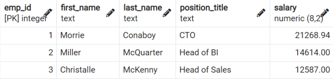

[← Table of Contents](ToC.md)
# Section 14: Stored Procedures, Transactions & User-Defined Functions

## User-Defined Functions
* Extend functionality
* Complex custom calculations

### Syntax
**Create**
```sql
CREATE FUNCTION <function_name> (param1, param2,…)
    RETURNS return_datatype
    LANGUAGE plpgsql [sql|c|...]
AS
$$
DECLARE
<variable declaration>;
BEGIN
<function definitions>;
END;
$$
```

**Create or Replace**
```sql
CREATE OR REPLACE FUNCTION <function_name> (param1, param2,…)
    RETURNS return_datatype
    LANGUAGE plpgsql [sql|c|...]
AS
$$
DECLARE
<variable declaration>;
BEGIN
<function definitions>;
END;
$$
```

### Examples
**Function that adds 3 to parameters**
```sql
CREATE OR REPLACE FUNCTION addThree (arg1 INT, arg2 INT)
    RETURNS INT
    LANGUAGE plpgsql
AS
$$
DECLARE
    answer INT;
BEGIN
    SELECT arg1 + arg2 + 3
    INTO answer;
    RETURN answer;
END;
$$
```

**Count number of films in range of rental rates**
```sql
CREATE FUNCTION count_rental_rate(min_rental_rate DECIMAL(4, 2), max_rental_rate DECIMAL(4, 2))
RETURNS INT
LANGUAGE plpgsql
AS
$$
DECLARE 
film_count INT;
BEGIN
	SELECT COUNT(*)
	INTO film_count
	FROM film
	WHERE rental_rate 
	BETWEEN min_rental_rate AND max_rental_rate;
RETURN film_count;
END;
$$
```

Can call this function with `SELECT count_rental_rate(3.99, 4.99)`
| count_rental_rate |
|:-----------------:|
|        336        |


### Challenge: User-Defined Functions
Create a function that expects the customer's first and last name and returns the total amount of payments this customer has made.

```sql
CREATE OR REPLACE FUNCTION name_search(f_name TEXT, l_name TEXT)
RETURNS DECIMAL(6, 2)
LANGUAGE plpgsql
AS
$$
DECLARE 
    total_amount DECIMAL(6, 2);
BEGIN
	SELECT SUM(amount)
	INTO total_amount
	FROM payment p
	INNER JOIN customer c
	ON p.customer_id = c.customer_id
	WHERE c.first_name = f_name AND c.last_name = l_name;
RETURN total_amount;
END;
$$
```

Sample use of this function within a query
```sql
SELECT 
customer_id,
first_name, 
last_name, 
name_search(first_name, last_name) AS total_spend
FROM customer
```

## Transactions
* Unit of work
* One or multiple operations
* Example: Bank Transfer


### Syntax
```sql
BEGIN; 
-- or 
BEGIN TRANSACTION; 
--or BEGIN WORK;

OPERATION1;
OPERATION2;

-- Not visible in other query windows until committed
COMMIT;
```

### Examples
**Code to setup examples**
```sql
CREATE TABLE acc_balance (
    id SERIAL PRIMARY KEY,
    first_name TEXT NOT NULL,
	last_name TEXT NOT NULL,
    amount DEC(9,2) NOT NULL    
);

INSERT INTO acc_balance
VALUES 
(1,'Tim','Brown',2500),
(2,'Sandra','Miller',1600)

SELECT * FROM acc_balance;
```

**Transfer Money from 1 account to another**
```sql
BEGIN;

-- 1st Operation
UPDATE acc_balance
SET amount = amount - 100
WHERE id = 1;

-- 2nd Operation
UPDATE acc_balance
SET amount = amount + 100
WHERE id = 2;

COMMIT;
```

### Challenge: Transactions
The two employees Miller McQuarter and Christalle McKenny have agreed to swap their positions incl. their salary.



```sql
BEGIN;
UPDATE employees
SET position_title = 'Head of Sales', salary = 12587.00
WHERE emp_id = 2;
UPDATE employees
SET position_title = 'Head of BI', salary = 14614.00
WHERE emp_id = 3;
COMMIT;
```

## Rollbacks
* Undo everything in the current transaction that has not been committed yet!

### Syntax
**Simple Rollback**
```sql
BEGIN;

OPERATION1;
OPERATION2;

ROLLBACK;
COMMIT;
```

**Savepoints**
* `ROLLBACK` - ends transaction
* `ROLLBACK TO SAVEPOINT` - does **not* end transaction*
```sql
BEGIN;

OPERATION1;
OPERATION2;
SAVEPOINT sp2;

OPERATION3;
SAVEPOINT sp3;

OPERATION4;

ROLLBACK TO SAVEPOINT sp2;
COMMIT;
```


**Deleting a Savepoint**
```sql
BEGIN;

OPERATION1;
OPERATION2;
SAVEPOINT op2;

OPERATION3;
SAVEPOINT op3;
OPERATION4;

RELEASE SAVEPOINT op3;
COMMIT;
```

### Examples
**`ROLLBACK`**
```sql
BEGIN;

UPDATE acc_balance
SET amount = amount - 10;

DELETE FROM acc_balance
WHERE id = 1;

ROLLBACK;
```

**`ROLLBACK TO SAVEPOINT`**
```sql
BEGIN;

UPDATE acc_balance
SET amount = amount - 10
WHERE id = 2;
SAVEPOINT s1;
DELETE FROM acc_balance
WHERE id = 1;

ROLLBACK TO SAVEPOINT s1;
```
## Store Procedures
* User-Defined Functions **cannot** execute transactions
* Store Procedures support transactions
* Cannot return an expression!
* Can use `RETURN` to stop the store procedure

### Syntax
`CREATE`
```sql
CREATE PROCEDURE <procedure_name> (param1, param2,…)
LANGUAGE plpgsql [sql|c|…]
AS
$$
DECLARE
    <variable declaration>
BEGIN
    <procedure_definition>
END;
$$
```

`CREATE OR REPLACE`
```sql
CREATE OR REPLACE PROCEDURE <procedure_name> (param1, param2,…)
LANGUAGE plpgsql [sql|c|…]
AS
$$
DECLARE
    <variable declaration>
BEGIN
    <procedure_definition>
END;
$$
```

**Stopping with `RETURN`**
```sql
CREATE OR REPLACE PROCEDURE <procedure_name> (param1, param2,…)
LANGUAGE plpgsql [sql|c|…]
AS
$$
DECLARE
    <variable declaration>
BEGIN
    <procedure_definition>
RETURN; -- immediately stops stored proc
END;
$$
```
### Examples
**Bank Transfer**

```sql
CREATE PROCEDURE bank_transfer
(tr_amount DECIMAL(6,2), sender_id INT, recipient_id INT)
	LANGUAGE plpgsql
AS
$$
BEGIN
	-- subtract from senders balance
	UPDATE acc_balance
	SET amount = amount - tr_amount
	WHERE id = sender_id;

	-- add to recipients balance
	UPDATE acc_balance
	SET amount = amount + tr_amount
	WHERE id = recipient_id;
COMMIT;
END;
$$
```
Call this using `CALL bank_transfer(100, 1, 2)`

### Challenge: Stored Procedures
Create a stored procedure called emp_swap that accepts two parameters `emp1` and `emp2` as input and swaps the two employees' position and salary.
Test the stored procedure with `emp_id` 2 and 3.

```sql

CREATE OR REPLACE PROCEDURE swap_job_titles(emp1 INT, emp2 INT)
	LANGUAGE plpgsql
AS
$$
-- Declare variables for storing original values
DECLARE 
emp1_title TEXT; 
emp2_title TEXT; 
emp1_salary DECIMAL(8,2); 
emp2_salary DECIMAL(8,2);

BEGIN
	-- Get existing value for emp1
	SELECT position_title, salary
	INTO emp1_title, emp1_salary
	FROM employees
	WHERE emp_id = emp1;
	RAISE NOTICE 'emp1_title: % , emp1_salary: %', emp1_title, emp1_salary;

	-- Get existing value for emp2
	SELECT position_title, salary
	INTO emp2_title, emp2_salary
	FROM employees
	WHERE emp_id = emp2;
	RAISE NOTICE 'emp2_title: % , emp12_salary: %', emp2_title, emp2_salary;
	
	-- Update values for emp1
	UPDATE employees
	SET position_title = emp2_title, salary = emp2_salary
	WHERE emp_id = emp1;
	
	-- update values for emp2
	UPDATE employees
	SET position_title = emp1_title, salary = emp1_salary
	WHERE emp_id = emp2;
COMMIT;
END
$$
```