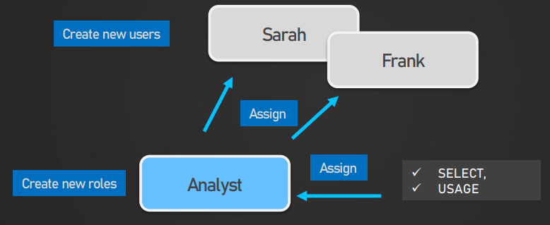
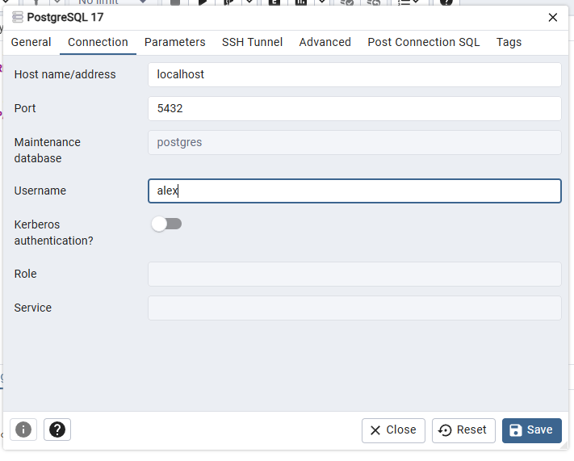
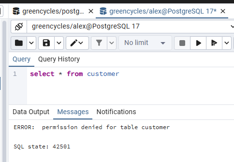
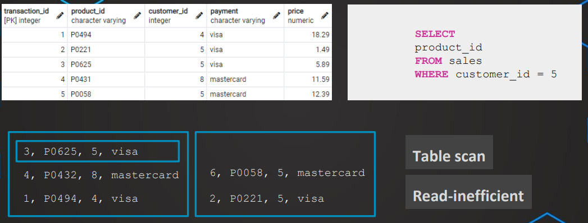
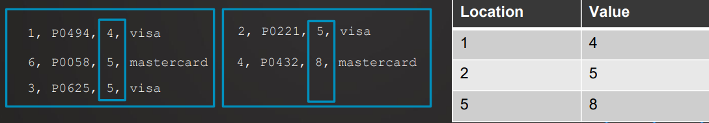
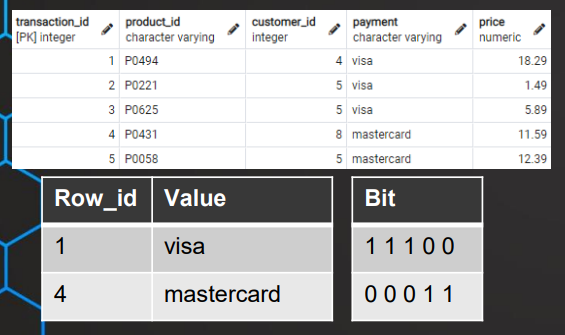
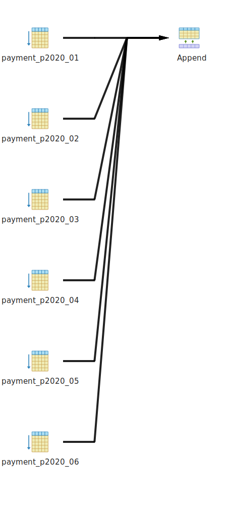
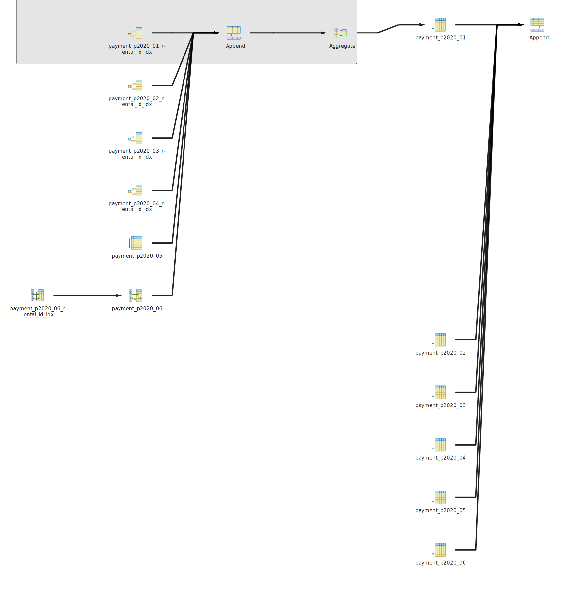

[← Table of Contents](ToC.md)
# Section 15: Indexes, Partitioning & Query Optimisation

## User Management

### Users
|   User    | Privileges |                               Notes                               |
|:---------:|:----------:|:-----------------------------------------------------------------:|
| superuser |    All     |                                 -                                 |
| New users |  ~~All~~   | Privileges need to be assigned for operations on existing objects |

### Roles
* We can create roles that have certain privileges
* These roles can then be assigned to users



## CREATE USER | ROLE

### Syntax
**USER**
```sql
CREATE USER <user_name>
WITH PASSWORD 'pwd123'
```
* Newly created users will always have access for the `public` schema that's created by default for a new database - i.e. view the tables
* Role = User + Login

The equivalent can be done with
```sql
CREATE ROLE <role_name>
WITH LOGIN PASSWORD 'pwd123'
```

**Example**
```sql
CREATE USER test_user
WITH PASSWORD 'pwd123';

CREATE ROLE test_role
WITH LOGIN PASSWORD 'pwd123';
```

Result in the same type of role being created with the same privileges, but _typically_ a role doesn't have a login


**Dropping USER**
```sql
DROP USER <user_name>
```
**Dropping ROLE**
```sql
DROP ROLE <role_name>
```
**Example**
```sql
DROP USER test_user;
DROP ROLE test_role;
```

### Examples

```sql
CREATE USER sarah
WITH PASSWORD 'sarah1234';

CREATE ROLE alex
WITH LOGIN PASSWORD 'alex1234';
```
**Using a new user**
1. Right click server i.e. PostgreSQL 17
2. Select properties
3. Select connection tab and change username 

4. Right click server
5. Disconnect from server
6. Reconnect to server and enter password
7. Open new query tool tab
8. We don't have permission to query tables in the public schema as no privileges have been assigned to that user


## GRANT & REVOKE Privileges
### `GRANT`
Privileges that can be granted are:
* `SELECT`
* `INSERT`
* `UPDATE`
* `DELETE`
* `TRUNCATE`
* `USAGE`
* `ALL`

#### Syntax
```sql
GRANT privilege
ON database_object
TO USER | ROLE | PUBLIC
```

#### Examples
**Grant `SELECT` on a specific table**
```sql
GRANT SELECT
ON customer -- table
TO alex -- user
```

**Grant `SELECT` on all tables in a schema**
```sql
GRANT SELECT
ON ALL TABLES IN SCHEMA schema_name -- schema
TO alex -- user
```

**Grant `ALL` privileges on all tables in a schema**
```sql
GRANT ALL
ON ALL TABLES IN SCHEMA schema_name -- schema
TO alex -- user
```

**Allow user to grant same privilege to others**
```sql
GRANT ALL
ON ALL TABLES IN SCHEMA schema_name -- schema
TO alex WITH GRANT OPTION
```

### `REVOKE`
#### Syntax
```sql
REVOKE privilege
ON database_object
FROM USER | ROLE | PUBLIC
```

#### Examples
**Revoke privileges granted by a specific user**
```sql
REVOKE privilege
ON database_object
FROM USER | ROLE | PUBLIC
GRANTED BY USER | ROLE
```

**Revoke permission to grant a privilege from a user**
```sql
REVOKE GRANT OPTION FOR privilege
ON database_object
FROM USER | ROLE | PUBLIC
GRANTED BY USER | ROLE 
```

### Privileges
| Privilege  | Applicable Object Types                                                     |
|:----------:|:----------------------------------------------------------------------------|
|  `SELECT`  | TABLE (and table-like objects i.e. Views, Materialized Views), table column |
|  `INSERT`  | TABLE, table column                                                         |
|  `UPDATE`  | TABLE, table column                                                         |
|  `DELETE`  | TABLE                                                                       |
| `TRUNCATE` | TABLE                                                                       |
|  `CREATE`  | DATABASE, SCHEMA                                                            |
| `CONNECT`  | DATABASE                                                                    |
| `EXECUTE`  | FUNCTION, PROCEDURE                                                         |
|  `USAGE`   | SCHEMA                                                                      |


#### Examples of Typical Statements
```sql
-- CREATE User
CREATE USER amar
WITH PASSWORD 'amar1234';

--GRANT usage on schema
GRANT USAGE 
ON SCHEMA public
TO amar;

-- GRANT Select & Update
GRANT SELECT, UPDATE
ON customer
TO amar;

-- GRANT all privileges on schema
GRANT ALL
ON ALL TABLES IN SCHEMA public
TO amar;

-- GRANT all privileges on database
GRANT ALL
ON DATABASE greencycles
TO amar;

-- GRANT privilege to create databases
ALTER USER amar CREATEDB;

-- GRANT role TO user
GRANT analyst TO amar;

-- REVOKE INSERT privilege
REVOKE INSERT ON customer FROM amar;

-- REVOKE ALL privileges
REVOKE ALL PRIVILEGES ON customer FROM PUBLIC;

-- REVOKE role
REVOKE analyst FROM amar;
```

### Privileges - Hands-on
1. Create Users
    ```sql
    CREATE USER ria
    WITH PASSWORD 'ria123';

    CREATE USER mike
    WITH PASSWORD 'mike123';
    ```
2. Create Roles
    ```sql
    CREATE ROLE read_only;
    CREATE ROLE read_update;   
    ```
3. Grant Usage
    ```sql
    GRANT USAGE
    ON SCHEMA public
    TO read_only;
    ```
4. Grant SELECT on tables
    ```sql
    GRANT SELECT
    ON ALL TABLES IN SCHEMA public
    TO read_only;
    ```
5. Assign read_only to read_update role
    ```sql
    GRANT read_only
    TO read_update;
    ```
6. Grant all privileges on all tables in public to role
    ```sql
    GRANT ALL
    ON ALL TABLES IN SCHEMA public
    TO read_update;
    ```
7. Revoke some privileges
    ```sql
    REVOKE DELETE, INSERT
    ON ALL TABLES IN SCHEMA public
    FROM read_update;
    ```
8. Assign role to users
    ```sql
    GRANT read_update
    TO ria;
    ```
9. DROP roles
    ```sql
    DROP ROLE mike;
    DROP ROLE read_update;
    ```
10. Removing dependancies
    ```sql
    DROP OWNED BY read_update;
    DROP ROLE read_update;
    ```
    
### Challenge: Privileges
In this challenge you need to create a user, a role and add privileges.

Your tasks are the following:
1. Create the user mia with password 'mia123'
2. Create  the role analyst_emp;
3. Grant SELECT on all tables in the public schema to that role.
4. Grant INSERT and UPDATE on the employees table to that role.
5. Add the permission to create databases to that role.
6. Assign that role to mia and test the privileges with that user.

**Solution:**
```sql
-- 1. Create the user mia with password 'mia123'
CREATE USER mia
WITH PASSWORD 'mia123'

-- 2. Create  the role analyst_emp;
CREATE ROLE analyst_emp;

-- 3. Grant SELECT on all tables in the public schema to that role.
GRANT SELECT
ON ALL TABLES IN SCHEMA public
TO analyst_emp;

-- 4. Grant INSERT and UPDATE on the employees table to that role.
GRANT INSERT, UPDATE
ON employees
TO analyst_emp;

-- 5. Add the permission to create databases to that role.
ALTER ROLE analyst_emp CREATEDB;

-- 6. Assign that role to mia and test the privileges with that user.
GRANT analyst_emp TO mia;
```

## Indexes
**Pros:** Indexes are used to increase the performance of read operations**
**Cons:** Can make data writes slower & additional table will take up more storage

### Using indexes
* Under the hood data is stored without a particular order
* Full Table scans are Read-inefficient
* There are different types of indexes for different situations


#### Example
* Placing an index on the `customer_id` column would create a lookup table with pointers to the rows
* i.e. Record with `customer_id` is in location 1


### B-Tree index
* Most common type of index
* Multi-level tree structure
* Breaks data down into pages or blocks
* Should be used for high-cardinality (unique) columns i.e. good for a PK
* Not entire table (costy in terms of storage)
* In PostgreSQL there is an index on primary keys by default


### Bitmap index
* Particularly good for data warehouses i.e. A central repository 
* Good for large amounts of data with low-cardinality (many repeating values)
* Very storage efficient
* More optimised for read & few DML(data manipulation) operations



* `1 1 1 0 0` - meaning "visa" can be found in rows 1, 2 & 3
* `0 0 0 1 1` - meaning "mastercard" can be found in row 4 & 5

### Indexes - Guidelines

|                              B-Tree Index                               |      Bitmap Index      |
|:-----------------------------------------------------------------------:|:----------------------:|
|                              Default Index                              | Slow to update/insert  |
| Unique Columns (range of different values)<br>Phone numbers, names, PKs |   Storage efficient    |
|                                                                         | Great read performance |

* Should we put an index on every column? No, they come with a cost
  * Storage
  * Create/Update time
* Only when necessary - if we experience slow query performance due to full table scans
* Small tables do not require indexes
* On which columns? Columns that are used as filters (i.e. `WHERE` clauses & `JOIN`)

### Demo: Creating Indexes
#### Syntax
**Single column with default (B-Tree) index type**
```sql
CREATE INDEX index_name
ON table_name
   (
      column_name
   );
```
**Multiple columns**
```sql
CREATE INDEX index_name
ON table_name [USING method]
   (
      column_name
      [,…]
   );
```
**Multiple columns with default (B-Tree) index type**
```sql
CREATE INDEX index_name
ON table_name [USING method]
   (
      column_name1,
      column_name2
   );
```

**Dropping an index**
```sql
DROP INDEX <index_name>
```

#### Examples
An example of a costly correlated subquery - took 34.978s
```sql
SELECT
(SELECT AVG(amount) FROM payment p2
	WHERE p2.rental_id = p1.rental_id
) FROM payment p1
```

Put an index on `rental_id`
```sql
CREATE INDEX idx_rental_id_payment
ON payment
(rental_id)
```

Now running this took 1.237s
```sql
SELECT
(SELECT AVG(amount) FROM payment p2
	WHERE p2.rental_id = p1.rental_id
) FROM payment p1
```

### Assignment 3: Creating indexes
Execute the following query:
```sql
SELECT * FROM flights f2
WHERE flight_no < (SELECT MAX(flight_no)
   FROM flights f1
WHERE f1.departure_airport=f2.departure_airport
)
```

This query has a very bad performance - ~44s 

Test indexes on different columns and compare their performance.

Also consider an index on multiple columns.

**Questions for this assignment**
On which column(s) would you place an index to get the best performance in the query?
`flight_no` & `departure_airport`

```sql
CREATE INDEX idx_flights_flight_on
ON flights
(flight_no, departure_airport)
```

## Execution Plan & Query Performance

**Execution Plan** - Order of steps to execute a query
**Query optimizer** - Find the best way to execute the query

### Explain Function in pgAdmin
* An estimate of how the query will be executed




### Explain Analyse Function in pgAdmin
* Shows how the query was executed
* Can click on each of the operations to see how long they took


```sql
SELECT
(SELECT AVG(amount)
 FROM payment p2
 WHERE p2.rental_id=p1.rental_id)
FROM payment p1
```

