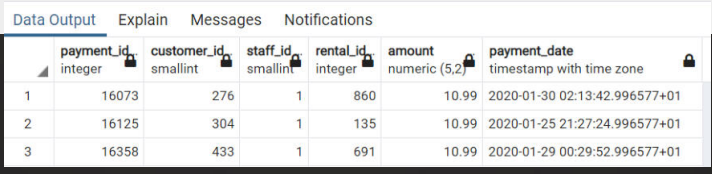
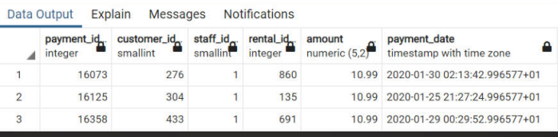
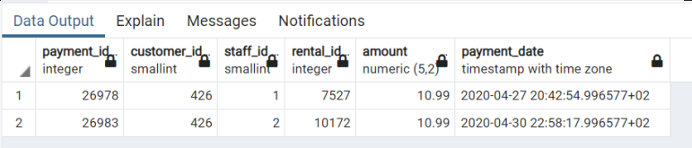

[← Table of Contents](ToC.md)
# Section 2 - Basics: Filtering
## WHERE
* Used to FILTER the data in the output
* Always after ``FROM``

### Syntax
```sql
SELECT
column_name1,
column_name2
FROM table_name
WHERE condition
```

### Examples
```sql
SELECT
*
FROM payment
WHERE amount = 10.99
```

```sql
SELECT
first_name,
last_name
FROM customer
WHERE first_name = 'ADAM'
```

```sql
SELECT count(* )
FROM payment
WHERE AMOUNT = 0
```

### Coding Exercise 6: WHERE
Write a SQL query to find all products in the 'Electronics' ``category``. Select only the ``name`` of the product and the ``price``.
You need to use only the ``SELECT``, ``WHERE``, and ``ORDER BY`` clauses to achieve this. Sort the results by price in ascending order.

**Table and Column Names:**
* Table: ``products``
* Columns: ``product_id``, ``name``, ``category``, ``price``

```sql
SELECT
name, price
FROM products
WHERE category = 'Electronics'
ORDER BY price ASC
```

### Challenge 1 : WHERE
> How many payment were made by the customer with customer_id = 100?

**Solution**
```sql
SELECT count(*) AS NumberOfPayments
FROM payment
WHERE customer_id = 100
```

### Challenge 2 : WHERE
> What is the last name of our customer with first name 'ERICA'?

**Solution**
```sql
SELECT last_name
FROM customer
WHERE first_name = 'ERICA'
```

## WHERE Operators
### Examples

**Greater Than**
```sql 
SELECT
*
FROM payment
WHERE amount > 10.99
```

**Less Than**
```sql 
SELECT
*
FROM payment
WHERE amount < 10.99
```

**Less Than or Equals - Ordered**
```sql 
SELECT
*
FROM payment
WHERE amount <= 10.99
ORDER BY amount DESC
```

**Not Equal To**
```sql 
SELECT
*
FROM payment
WHERE amount != 10.99
```

**Not Equal To - Alternative**
```sql 
SELECT
*
FROM payment
WHERE amount <> 10.99
```

**Is NULL**
```sql 
SELECT
first_name,
last_name
FROM customer
WHERE first_name is null
```

**Is Not NULL**
```sql 
SELECT
first_name,
last_name
FROM customer
WHERE first_name is not null
```

**Equality**
String matching is case sensitive i.e.
```sql 
SELECT
first_name,
last_name
FROM customer
WHERE first_name = 'adam'
```
is **NOT** the same as 
```sql 
SELECT
first_name,
last_name
FROM customer
WHERE first_name = 'ADAM'
```

### Coding Exercise 7: WHERE Operators
Write a SQL query to find all products (only select ``name`` and ``price``) that have a price of more than 200.
You need to use only the ``SELECT``, ``WHERE``, and ``ORDER BY`` clauses to achieve this. Sort the results by price in ascending order.

**Table and Column Names:**
* Table: ``products``
* Columns: ``product_id``, ``name``, ``category``, ``price``

```sql
SELECT
name, price
FROM products
WHERE price > 200
ORDER BY price ASC
```

### Challenge 1: WHERE Operators
>The inventory manager asks you how rentals have not been returned yet (return_date is null).

**Solution**
```sql
SELECT 
COUNT(*)
FROM rental
WHERE return_date IS NULL
```
### Challenge 2: WHERE Operators
>The sales manager asks you how for a list of all the payment_ids with an amount less than or equal to $2. Include payment_id and the amount

**Solution**
```sql
SELECT 
payment_id, 
amount
FROM payment
WHERE amount <= 2.00
```

## WHERE with AND/OR
* Used to connect conditions

### Syntax
```sql
SELECT
column_name1,
column_name2
FROM table_name
WHERE condition1
AND condition2
AND condition3
```

### Examples
**AND**
With ``AND`` **ALL** conditions must be true
```sql
SELECT
*
FROM payment
WHERE amount = 10.99
AND customer_id = 426
```

**OR**
With ``OR`` **EITHER** conditions can be true
```sql
SELECT
*
FROM payment
WHERE amount = 10.99
OR amount = 9.99
```

**AND + OR 1**
```sql
SELECT
*
FROM payment
WHERE amount = 10.99
OR amount = 9.99
AND customer_id = 426
```


**AND + OR 2**
```sql
SELECT
*
FROM payment
WHERE amount = 10.99
OR (amount = 9.99
AND customer_id = 426)
```


**AND + OR 3**
```sql
SELECT
*
FROM payment
WHERE (amount = 10.99
OR amount = 9.99)
AND customer_id = 426
```



### Coding Exercise 8: WHERE with AND/OR
Write a SQL query to find all products in the 'Electronics' category that have a price of more than 200.You need to use only the ``SELECT``, ``WHERE``, and ``ORDER BY`` clauses to achieve this. Sort the results by price in ascending order.

**Table and Column Names:**
* Table: ``products``
* Columns: ``product_id``, ``name``, ``category``, ``price``

```sql
SELECT
name, price
FROM products
WHERE price > 200
AND category = 'Electronics'
ORDER BY price ASC
```

### Challenge: WHERE with AND/OR
> The support manager asks you about a list of all the payment of the customer 322, 346 and 354 where the amount is either less than $2 or greater than $10.
It should be ordered by the customer first (ascending) and then as second condition order by amount in a descending order.

**Solution**
```sql
SELECT *
FROM payment
WHERE 
(customer_id = 322 OR customer_id = 346 OR customer_id = 354)
AND 
(amount > 10.00 OR amount < 2.00)
ORDER BY customer_id, amount DESC
```

## Note on Timezones
To avoid the data output looking a bit different in your case you can change the time zone of the database we have set up. To do that just open up the query tool from the greencycles database and run the following code:

``ALTER DATABASE greencycles SET timezone TO 'Europe/Berlin';``

## BETWEEN
* Used to filter a range of values

### Syntax & Examples
**Between**
```sql
SELECT
payment_id,
amount
FROM payment
WHERE amount BETWEEN 1.99 AND 6.99
```
**NOT Between**
```sql
SELECT
payment_id,
amount
FROM payment
WHERE amount NOT BETWEEN 1.99 AND 6.99
```
**Dates**
Dates are internally transformed to the start of the day i.e. 2020-01-26 is 2020-01-26 00:00
```sql
SELECT
payment_id,
amount,
payment_date
FROM payment
WHERE payment_date BETWEEN '2020-01-24' AND '2020-01-26' -- 'YYYY-MM-DD'
```
**Dates with Times**
```sql
SELECT
payment_id,
amount,
payment_date
FROM payment
WHERE payment_date BETWEEN '2020-01-24 22:00' AND '2020-01-26 12:00' -- 'YYYY-MM-DD HH:mm'
```
**Another Date with Times**
```sql
select * from rental
where rental_date between '2005-05-24' and '2005-05-26 23:59'
order by rental_date desc
```
### Coding Exercise 9: BETWEEN
Write a single SQL query to find all transactions from the the table sales that occurred between ``2024-01-10`` and ``2024-02-10``, inclusive. Display the transaction ID, date, and amount. Order the results by the date of the transaction.
Make sure you return:
* id
* date
* amount
Order by the transaction date.

```sql
select id, date, amount from sales
where date between '2024-01-10' and '2024-02-10 23:59'
order by date asc
```

### Challenge: BETWEEN
> There have been some faulty payments and you need to help to found out how many payments have been affected.
How many payments have been made on January 26th and 27th 2020 (including entire 27th) with an amount between 1.99 and 3.99?

**Solution**
```sql
SELECT COUNT(*) FROM payment
WHERE amount BETWEEN 1.99 AND 3.99
AND payment_date BETWEEN '2020-01-26' AND '2020-01-28'
```

## IN Operator
### Examples
**IN**
```sql
SELECT * FROM customer
WHERE customer_id IN (123, 212, 323, 243, 353, 432)
```

**NOT IN**
```sql
SELECT * FROM customer
WHERE customer_id NOT IN (123, 212, 323, 243, 353, 432)
```
### Coding Exercise 10: IN Operator
Write a single SQL query to select all distinct customer IDs who ordered either a 'Laptop', 'Tablet', or 'Smartphone'. Order the result by customer ID in ascending order.
**Table Name:** ``orders``
**Important Columns:** ``customer_id``, ``product_name``

```sql
SELECT DISTINCT customer_id FROM orders
WHERE product_name IN ('Laptop','Tablet','Smartphone')
ORDER BY customer_id ASC
```

### Challenge: IN Operator
> There have been 6 complaints of customers about their payments. 
> customer_id: 12,25,67,93,124,234
> The concerned payments are all the payments of these customers with amounts 4.99, 7.99 and 9.99 in January 2020.

**Solution**
```sql
SELECT * FROM payment
WHERE customer_id IN (12,25,67,93,124,234)
AND amount IN (4.99, 7.99, 9.99)
AND payment_date BETWEEN '01-01-2020' AND '01-02-2020'
```

## LIKE
* Used to filter by matching against a pattern
* Use wildcards i.e. ``_`` = any character, ``%`` = any sequence of characters
* **It's case-sensitive**
* ``ILIKE`` is case-INsensitive

### Examples
**Starts with**
```sql
SELECT * 
FROM actor
WHERE first_name LIKE 'A%'
```

**ILIKE**
Case insensitive pattern match
```sql
SELECT * FROM film
WHERE description ILIKE '%drama%'
```
```sql
SELECT * 
FROM actor
WHERE first_name ILIKE 'a%'
```

**Contains**
```sql
SELECT * 
FROM actor
WHERE first_name LIKE '%A%'
```

**Understore - Single Character**
i.e. 2nd character of first_name value is "A"
```sql
SELECT * 
FROM actor
WHERE first_name LIKE '_A%'
```
3rd character of first_name value is "A"
```sql
SELECT * 
FROM actor
WHERE first_name LIKE '__A%'
```

**NOT LIKE**
```sql
SELECT * 
FROM actor
WHERE first_name NOT LIKE '%A%'
```

**Description Contains "Drama" and Title begins with "T"**
```sql
select * 
from film
where description LIKE '%Drama%'
and title LIKE 'T%'
```
**Description Contains "Drama" and Title has "T" as its 2nd character**
```sql
select * 
from film
where description LIKE '%Drama%'
and title LIKE '_T%'
```

### Coding Exercise 11: LIKE
Write a SQL query to find all reviews that mention the word "love" (case insensitive) in their review text. Your query should return the ``CustomerName``, ``ProductID``, and ``ReviewText``.
**Table Name:** ``CustomerReviews``
**Column Names:** ``CustomerName``, ``ProductID``, ``ReviewText``

```sql
SELECT
CustomerName,
ProductID,
ReviewText
FROM CustomerReviews
WHERE ReviewText ILIKE '%love%'

```

### Challenge 1: LIKE
>You need to help the inventory manager to find out:
>How many movies are there that contain the "Documentary" in the description?

**Solution**
```sql
SELECT COUNT(*)
FROM film
WHERE description LIKE '%Documentary%'
```

### Challenge 2: LIKE
>How many customers are there with a first name that is
3 letters long and either an 'X' or a 'Y' as the last letter in the last name?

**Solution**
```sql
SELECT COUNT(*)
FROM customer
WHERE first_name LIKE '___'
AND (last_name LIKE '%X' OR last_name LIKE '%Y')
```

## Comments & Aliases
* Comment to make code more readable & understandable
* ``--`` for a single line comment
* ``/* ... */`` for multi-line comment

### Comment Syntax
**Single Line**
```sql
-- 2020/07/01 by Nikolai
-- Query that filters amount
SELECT
*
FROM payment
WHERE amount = 10.99
```

**Multi-line**
```sql
/* 2020/07/01 by Nikolai
Query to filter by amount*/
SELECT
*
FROM payment
WHERE amount = 10.99
```

### Alias Syntax
**Rename output**
```sql
SELECT
payment_id AS invoice_no
FROM payment
```
```sql
SELECT
COUNT(*) AS number_of_movies
FROM film
WHERE description LIKE '%Documentary%'
```

## Section 1 Challenges
### Challenge 1
>How many movies are there that contain 'Saga' in the description and where the title starts either with 'A' or ends with 'R'?
Use the alias 'no_of_movies'.

**Solution**
```sql
SELECT COUNT(*) AS no_of_movies
FROM film
WHERE description LIKE '%Saga%'
AND (title LIKE 'A%' OR title LIKE '%R')
```

### Challenge 2
>Create a list of all customers where the first name contains
'ER' and has an 'A' as the second letter.
Order the results by the last name descendingly.

**Solution**
```sql
SELECT *
FROM customer
WHERE first_name LIKE '%ER%'
AND first_name LIKE '_A%'
ORDER BY last_name DESC
```

### Challenge 3
>How many payments are there where the amount is either 0 or is between 3.99 and 7.99 and in the same time has happened on 2020-05-01.

**Solution**
```sql
SELECT COUNT(*)
FROM payment
WHERE (amount = 0 OR amount BETWEEN 3.99 AND 7.99)
AND payment_date BETWEEN '2020-05-01' AND '2020-05-02'
```