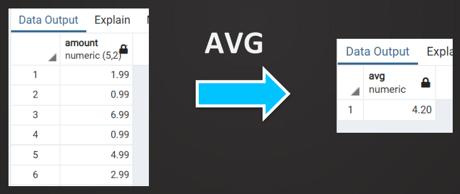
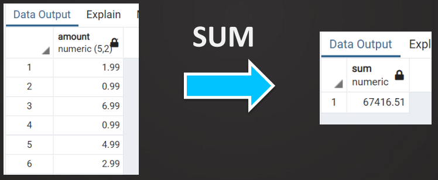
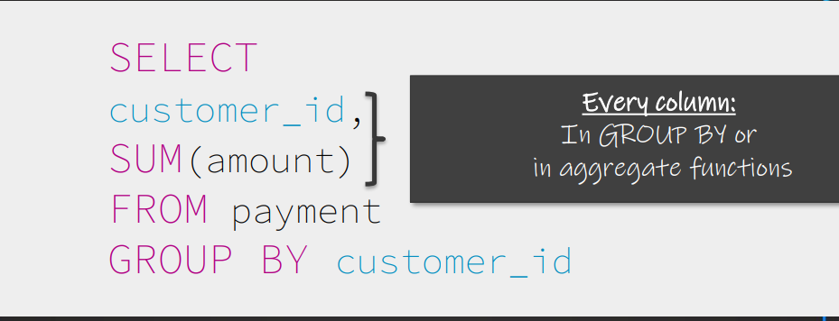

[← Table of Contents](ToC.md)
# Section 3: Basics - Grouping
## Aggregate Functions
* Aggregate values in multiple rows to one value
* You can **NOT** include another column





### Most Common Aggregate Functions
* ``SUM()``
* ``AVG()``
* ``MIN()``
* ``MAX()``
* ``COUNT()``

### Examples
**SUM()**
```sql
SELECT
SUM(amount)
FROM payment
```

**COUNT()**
The only function where we don't need to specify a column name
```sql
SELECT
COUNT(*)
FROM payment
```

**AVG()**
```sql
SELECT
AVG(amount)
FROM payment
```
**Multiple Aggregations**
```sql
SELECT
SUM(amount) AS Sum,
COUNT(*) AS NumberOfPayments,
AVG(amount) AS Average
FROM payment
```

You can **NOT** include another column when using an aggregate function, for example the below **WON'T** work
This is only possible with grouping
```sql
SELECT
SUM(amount)
payment_id
FROM payment
```

**Round AVG()**
Example to round to 2 decimal places
```sql
SELECT
ROUND(AVG(amount), 2) as rounded_value
FROM payment
```


### Coding Exercise 12: Aggregate Functions
Your challenge is to write a single SQL query to find the total number of orders and the average order amount from the ``Orders`` table. 
The solution should include only orders made in August 2023.

Use the aliases ``TotalOrders`` and ``AverageOrderAmount`` in your query.
**Column names:**
* ``OrderID`` ,
* ``Amount`` ,
* ``OrderDate``

```sql
SELECT 
COUNT(*) AS TotalOrders,
AVG(Amount) AS AverageOrderAmount
FROM Orders
WHERE OrderDate BETWEEN '2023-08-01' AND '2023-09-01'
```
### Challenge: Aggregate Functions
> Your manager wants to get a better understanding of the films.
That's why you are asked to write a query to see the
    • Minimum
    • Maximum
    • Average (rounded)
    • Sum
of the replacement cost of the films

**Solution**
```sql
SELECT 
MIN(replacement_cost) AS min_replacement_cost,
MAX(replacement_cost) AS max_replacement_cost,
ROUND(AVG(replacement_cost), 2) AS average_replacement_cost,
SUM(replacement_cost) AS total_replacement_cost
FROM film
```

## GROUP BY
* Used to GROUP aggregations BY specific columns

### Examples
**SUM of each customers spend**
```sql
SELECT 
customer_id, 
SUM(amount)
FROM payment 
GROUP BY customer_id
ORDER BY customer_id
```

**SUM of each customers spend ordered by spend amount with Alias**
```sql
SELECT 
customer_id, 
SUM(amount) as totalSpend
FROM payment 
GROUP BY customer_id
ORDER BY totalSpend DESC
```

**SUM of each customers spend split by staff member**
```sql
SELECT 
customer_id, 
SUM(amount),
staff_id
FROM payment 
GROUP BY customer_id, staff_id
ORDER BY customer_id
```

**SUM of each customers spend with WHERE**
```sql
SELECT 
customer_id, 
SUM(amount)
FROM payment 
WHERE customer_id > 3
GROUP BY customer_id
ORDER BY customer_id
```

**NB:** If a column is not used by an Aggregate function it **MUST** be included in the ``GROUP BY`` clause


### Coding Exercise 13: GROUP BY
Using the ``sales_data`` table, write a SQL query to calculate the total ``quantity`` sold and the total ``sale_amount`` for each ``category``.
Your query should return columns for the ``category``, the sum of ``quantity`` as ``total_quantity``, and the sum of ``sale_amount`` as ``total_sales_amount``. 

Order the results by ``total_sales_amount`` in descending order.

**Important columns:**
* ``category``
* ``quantity``
* ``sale_amount``

```sql
SELECT 
SUM(quantity) AS total_quantity,
SUM(sale_amount) AS total_sales_amount,
category 
FROM sales_data
GROUP BY category
ORDER BY total_sales_amount DESC
```

### Challenge: GROUP BY
> 1. Your manager wants to which of the two employees (staff_id) is responsible for more payments?
     Which of the two is responsible for a higher overall payment amount? 
> 
> 2. How do these amounts change if we don't consider amounts equal to 0?
> 
> Write two SQL queries to get the answers!


**Solution 1**
```sql
SELECT
staff_id,
SUM(amount) AS totalpayment,
COUNT(*)
FROM payment
GROUP BY staff_id
ORDER BY totalpayment DESC
```

**Solution 2**
```sql
SELECT
staff_id,
SUM(amount) AS totalpayment,
COUNT(*)
FROM payment
WHERE amount <> 0
GROUP BY staff_id
ORDER BY totalpayment DESC
```

## GROUP BY - Multiple Columns