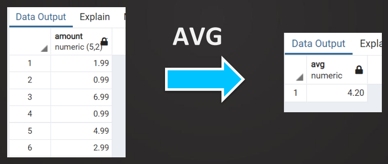
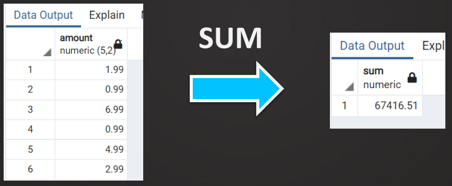

[← Table of Contents](ToC.md)
# Section 3: Grouping
## Aggregate Functions
* Aggregate values in multiple rows to one value
* You can **NOT** include another column





### Most Common Aggregate Functions
* ``SUM()``
* ``AVG()``
* ``MIN()``
* ``MAX()``
* ``COUNT()``

### Examples
**SUM()**
```sql
SELECT
SUM(amount)
FROM payment
```

**COUNT()**
The only function where we don't need to specify a column name
```sql
SELECT
COUNT(*)
FROM payment
```

**AVG()**
```sql
SELECT
AVG(amount)
FROM payment
```
**Multiple Aggregations**
```sql
SELECT
SUM(amount) AS Sum,
COUNT(*) AS NumberOfPayments,
AVG(amount) AS Average
FROM payment
```

You can **NOT** include another column when using an aggregate function, for example the below **WON'T** work
This is only possible with grouping
```sql
SELECT
SUM(amount)
payment_id
FROM payment
```

**Round AVG()**
Example to round to 2 decimal places
```sql
SELECT
ROUND(AVG(amount), 2) as rounded_value
FROM payment
```


### Coding Exercise 12: Aggregate Functions
Your challenge is to write a single SQL query to find the total number of orders and the average order amount from the ``Orders`` table. 
The solution should include only orders made in August 2023.

Use the aliases ``TotalOrders`` and ``AverageOrderAmount`` in your query.
**Column names:**
* ``OrderID`` ,
* ``Amount`` ,
* ``OrderDate``

```sql
SELECT 
COUNT(*) AS TotalOrders,
AVG(Amount) AS AverageOrderAmount
FROM Orders
WHERE OrderDate BETWEEN '2023-08-01' AND '2023-09-01'
```
### Challenge: Aggregate Functions
> Your manager wants to get a better understanding of the films.
That's why you are asked to write a query to see the
    • Minimum
    • Maximum
    • Average (rounded)
    • Sum
of the replacement cost of the films

**Solution**
```sql
SELECT 
MIN(replacement_cost) AS min_replacement_cost,
MAX(replacement_cost) AS max_replacement_cost,
ROUND(AVG(replacement_cost), 2) AS average_replacement_cost,
SUM(replacement_cost) AS total_replacement_cost
FROM film
```

## GROUP BY
* Used to GROUP aggregations BY specific columns

### Examples
**SUM of each customers spend**
```sql
SELECT 
customer_id, 
SUM(amount)
FROM payment 
GROUP BY customer_id
ORDER BY customer_id
```

**SUM of each customers spend ordered by spend amount with Alias**
```sql
SELECT 
customer_id, 
SUM(amount) as totalSpend
FROM payment 
GROUP BY customer_id
ORDER BY totalSpend DESC
```

**SUM of each customers spend split by staff member**
```sql
SELECT 
customer_id, 
SUM(amount),
staff_id
FROM payment 
GROUP BY customer_id, staff_id
ORDER BY customer_id
```

**SUM of each customers spend with WHERE**
```sql
SELECT 
customer_id, 
SUM(amount)
FROM payment 
WHERE customer_id > 3
GROUP BY customer_id
ORDER BY customer_id
```

**NB:** If a column is not used by an Aggregate function it **MUST** be included in the ``GROUP BY`` clause


### Coding Exercise 13: GROUP BY
Using the ``sales_data`` table, write a SQL query to calculate the total ``quantity`` sold and the total ``sale_amount`` for each ``category``.
Your query should return columns for the ``category``, the sum of ``quantity`` as ``total_quantity``, and the sum of ``sale_amount`` as ``total_sales_amount``. 

Order the results by ``total_sales_amount`` in descending order.

**Important columns:**
* ``category``
* ``quantity``
* ``sale_amount``

```sql
SELECT 
SUM(quantity) AS total_quantity,
SUM(sale_amount) AS total_sales_amount,
category 
FROM sales_data
GROUP BY category
ORDER BY total_sales_amount DESC
```

### Challenge: GROUP BY
> 1. Your manager wants to which of the two employees (staff_id) is responsible for more payments?
     Which of the two is responsible for a higher overall payment amount? 
> 
> 2. How do these amounts change if we don't consider amounts equal to 0?
> 
> Write two SQL queries to get the answers!


**Solution 1**
```sql
SELECT
staff_id,
SUM(amount) AS totalpayment,
COUNT(*)
FROM payment
GROUP BY staff_id
ORDER BY totalpayment DESC
```

**Solution 2**
```sql
SELECT
staff_id,
SUM(amount) AS totalpayment,
COUNT(*)
FROM payment
WHERE amount <> 0
GROUP BY staff_id
ORDER BY totalpayment DESC
```

## GROUP BY - Multiple Columns

**SUM of each customers spend split by staff member**
```sql
SELECT
staff_id,
customer_id, 
COUNT(*) AS num_rentals,
SUM(amount) AS total
FROM payment 
GROUP BY customer_id, staff_id
ORDER BY num_rentals DESC
```

### Coding Exercise 14: GROUP BY multiple columns
Create a query showing the total sales amount (AS total_sales_amount) and total number of items sold  (AS total_items_sold), grouped by ``category`` and ``sale_date``. Order the results by ``category`` in ascending order and then by ``sale_date`` in ascending order.

Use the ``sales`` table with columns: ``category``, ``sale_date``, ``amount``.

```sql
SELECT 
category,
sale_date,
COUNT(*) as total_items_sold,
SUM(amount) as total_sales_amount
FROM sales
GROUP BY sale_date, category
ORDER BY category ASC
```

### Challenge: GROUP BY multiple columns
> There are two competitions between the two employees.
>  1. Which employee had the highest sales amount in a single day?
>  2. Which employee had the most sales in a single day (not counting payments with amount = 0?
> 
> Write two SQL queries to get the answers!

**Solution 1**
```sql
SELECT 
staff_id,
DATE(payment_date) AS date,
SUM(amount) AS sales_total_amount
FROM payment
GROUP BY staff_id, date
ORDER BY sales_total_amount DESC
LIMIT 1
```

**Solution 2**
```sql
SELECT 
staff_id,
COUNT(*) as num_sales,
DATE(payment_date) AS date
FROM payment
WHERE amount <> 0
GROUP BY staff_id, date
ORDER BY num_sales DESC
LIMIT 1
```

## HAVING
* Used to filter aggregate functions in GROUP BY clauses
* ``HAVING`` **can only be used with** ``GROUP BY``

### Examples
**Customers with total spend greater than 200**
```sql
SELECT 
customer_id,
SUM(amount)
FROM payment
GROUP BY customer_id 
HAVING SUM(amount) > 200
```

**Staff members with number of sales over 300 grouped by date**
``` sql
SELECT 
staff_id,
COUNT(*) as num_sales,
DATE(payment_date) AS date
FROM payment
WHERE amount <> 0
GROUP BY staff_id, date 
HAVING COUNT(*) > 300 
ORDER BY num_sales DESC
```

**Staff members with number of sales over 300 OR less than 50 grouped by date**
``` sql
SELECT 
staff_id,
COUNT(*) as num_sales,
DATE(payment_date) AS date
FROM payment
WHERE amount <> 0
GROUP BY staff_id, date 
HAVING COUNT(*) > 300 OR COUNT(*) < 50
ORDER BY num_sales DESC
```

### Coding Exercise 15: HAVING
Find the cities with more than two transactions where the average transaction amount exceeds $150.00. List the city and the average transaction amount (AS AverageAmount), sorted by the average transaction amount in descending order.

**Necessary Information:**
* **Table name:** ``Sales``
* **Columns to consider:** ``City``, ``Amount``, ``TransactionID``

```sql
SELECT
City,
AVG(amount) AS AverageAmount
FROM Sales
GROUP BY City
HAVING AVG(Amount) > 150 AND COUNT(*) > 2
ORDER BY AVG(Amount) DESC
```

### Challenge: HAVING
> In 2020, April 28, 29 and 30 were days with very high revenue. That's why we want to focus in this task only on these days(filter accordingly).
Find out what is the average payment amount grouped by customer and day – consider only the days/customers with more than 1 payment (per customer and day).
Order by the average amount in a descending order. 
> Write a SQL query to find out!

**Solution**
```sql
SELECT
customer_id,
DATE(payment_date),
ROUND(AVG(amount), 2) as avg_amount,
COUNT(*) as num_sales
FROM payment
WHERE DATE(payment_date) IN('2020-04-28', '2020-04-29', '2020-04-30')
GROUP BY customer_id, DATE(payment_date)
HAVING COUNT(*) > 1
ORDER BY avg_amount DESC
```
**OR**

```sql
SELECT
customer_id,
DATE(payment_date),
ROUND(AVG(amount), 2) as avg_amount,
COUNT(*) as num_sales
FROM payment
WHERE payment_date BETWEEN '2020-04-28' AND '2020-05-01'
GROUP BY customer_id, DATE(payment_date)
HAVING COUNT(*) > 1
ORDER BY avg_amount DESC
```

## Setting up the 2nd project
[flight_database.zip](resources/flight_database.zip)

1. Open CLI in pgAdmin by right-clicking any database and select PSQL tool
2. Paste command ``\i' D:/Documents/Repositories/silver-barnacle/courses/udemy-master-sql/resources/flight_database/flight_database.sql'``
3. Hit Enter, this will execute the commands to create a database called **demo**
