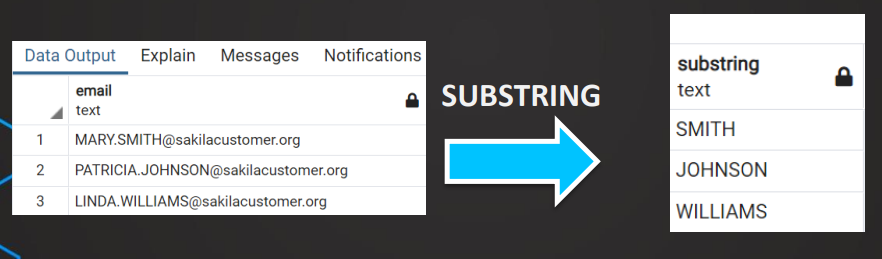

[← Table of Contents](ToC.md)
# Section 4: Functions

## LENGTH, LOWER & UPPER
### Syntax & Examples
```sql
SELECT 
UPPER(email) AS email_upper,
LOWER(email) AS email_lower,
LENGTH(email) AS email_length
FROM customer
```

```sql
SELECT 
UPPER(email) AS email_upper,
LOWER(email) AS email_lower,
LENGTH(email) AS email_length
FROM customer
WHERE LENGTH(email) < 30
```

### Coding Exercise 16: LENGTH, LOWER & UPPER
Write a SQL query to find all reviews for ``product_id = 101`` where the review text contains the word "great" (case insensitive), and order the results by the length of the review text (from shortest to longest).

Return the ``review_id``, ``review_text``, and the length of the ``review_text`` (use alias ``review_length``).#

**Relevant table:**
``customer_reviews``


```sql
SELECT 
review_id,
review_text,
LENGTH(review_text) AS review_length
FROM customer_reviews
WHERE product_id = 101
AND LOWER(review_text) LIKE '%great%'
ORDER BY LENGTH(review_text) ASC
```

### Challenge: LENGTH, LOWER & UPPER
> In the email system there was a problem with names where either the first name or the last name is more than 10 characters long.
Find these customers and output the list of these first and last names in all lower case.

**Solution**
```sql
SELECT 
LOWER(first_name),
LOWER(last_name),
LOWER(email)
FROM customer
WHERE LENGTH(first_name) > 10 
OR LENGTH(last_name) > 10
```

## LEFT & RIGHT
### Syntax & Examples

**LEFT**
Parameters - value, number of characters
```sql
SELECT 
LEFT(first_name, 2) as substring,
first_name
FROM customer
```
Output:

| substring | first_name |
|-----------|------------|
| MA        | MARY       |
| PA        | PATRICIA   |
| LI        | LINDA      |
| BA        | BARBARA    |
| EL        | ELIZABETH  |

**RIGHT**
Parameters - value, number of characters
```sql
SELECT 
RIGHT(first_name, 2) as substring,
first_name
FROM customer
```
Output:

| substring | first_name |
|-----------|------------|
| RY        | MARY       |
| IA        | PATRICIA   |
| DA        | LINDA      |
| RA        | BARBARA    |
| TH        | ELIZABETH  |

**LEFT & RIGHT**
Extract **Only** the 2nd character
```sql
SELECT 
RIGHT(LEFT(first_name, 2), 1) as substring,
first_name
FROM customer
```
Output:

| substring | first_name |
|-----------|------------|
| A         | MARY       |
| A         | PATRICIA   |
| I         | LINDA      |
| A         | BARBARA    |
| L         | ELIZABETH  |

### Challenge: LEFT & RIGHT
>Extract the last 5 characters of the email address first.
The email address always ends with '.org'.
How can you extract just the dot '.' from the email address?
Write an SQL query to find out!


```sql
SELECT
email,
RIGHT(email, 5),
LEFT(RIGHT(email, 4), 1) AS dots
FROM customer
```

## Concatenate
### Syntax & Examples
**1st character from ``first_name`` & 1st character from ``last_name``**
```sql
SELECT
LEFT(first_name, 1) || LEFT(last_name, 1) as initials,
first_name,
last_name
FROM customer
```

Output:
| initials | first_name | last_name |
|----------|------------|-----------|
| MS       | MARY       | SMITH     |
| PJ       | PATRICIA   | JOHNSON   |
| LW       | LINDA      | WILLIAMS  |
| BJ       | BARBARA    | JONES     |
| EB       | ELIZABETH  | BROWN     |

**1st character from ``first_name`` & 1st character from ``last_name`` with dots**
```sql
SELECT
LEFT(first_name, 1) || '.' || LEFT(last_name, 1) || '.' as initials,
first_name,
last_name
FROM customer
```

Output:
| initials | first_name | last_name |
|----------|------------|-----------|
| M.S.     | MARY       | SMITH     |
| P.J.     | PATRICIA   | JOHNSON   |
| L.W.     | LINDA      | WILLIAMS  |
| B.J.     | BARBARA    | JONES     |
| E.B.     | ELIZABETH  | BROWN     |

### Coding Exercise 17: Concatenate
Write a single SQL query to concatenate the product name, category, and price into a single string for each product, formatted as: ``Product Name - Category: Price``. 
Use alias AS _product_summary_. Ensure the price is prefixed with a dollar sign ($), e.g. $1.99. 
Order the results by the product name in ascending order.

**Available columns:** `product_id`, `name`, `category`, and `price` from the `products` table.

```sql
SELECT
name || ' - ' || category || ': ' || '$' || price AS product_summary
FROM products
ORDER BY name ASC
```

### Challenge: Concatenate
> You need to create an anonymized form of the email addresses in the following way:
>       `M***@sakilacustomer.org`
> It should be the first character followed by "***" and then the last part starting with "@"
> Note that the email address always ends with 'sakilacustomer.org'


**Solution:**
```sql
SELECT LEFT(email, 1) || '***' || RIGHT(email, 19),
email
FROM customer
```

## POSITION
### Syntax & Examples
**Find position of a particular character**
```sql
SELECT
email,
POSITION('@' IN email)
FROM customer
```
Output:
| email                               | position |
|-------------------------------------|----------|
| MARY.SMITH@sakilacustomer.org       | 11       |
| PATRICIA.JOHNSON@sakilacustomer.org | 17       |
| LINDA.WILLIAMS@sakilacustomer.org   | 15       |
| BARBARA.JONES@sakilacustomer.org    | 14       |
| ELIZABETH.BROWN@sakilacustomer.org  | 16       |

**Nested with LEFT**
```sql
SELECT
email,
LEFT(email, POSITION('@' IN email))
FROM customer
```

Output:
| email                               | left              |
|-------------------------------------|-------------------|
| MARY.SMITH@sakilacustomer.org       | MARY.SMITH@       |
| PATRICIA.JOHNSON@sakilacustomer.org | PATRICIA.JOHNSON@ |
| LINDA.WILLIAMS@sakilacustomer.org   | LINDA.WILLIAMS@   |

**Nested with LEFT and subtraction**
```sql
SELECT
email,
LEFT(email, POSITION('@' IN email) - 1)
FROM customer
```

Output:
| email                               | left             |
|-------------------------------------|------------------|
| MARY.SMITH@sakilacustomer.org       | MARY.SMITH       |
| PATRICIA.JOHNSON@sakilacustomer.org | PATRICIA.JOHNSON |
| LINDA.WILLIAMS@sakilacustomer.org   | LINDA.WILLIAMS   |

**Search for another column value i.e. search for last name to get first name**
```sql
SELECT
email,
LEFT(email, POSITION(last_name IN email) - 2)
FROM customer
```

Output:
| email                               | left     |
|-------------------------------------|----------|
| MARY.SMITH@sakilacustomer.org       | MARY     |
| PATRICIA.JOHNSON@sakilacustomer.org | PATRICIA |
| LINDA.WILLIAMS@sakilacustomer.org   | LINDA    |
| BARBARA.JONES@sakilacustomer.org    | BARBARA  |

### Challenge: POSITION
> In this challenge you have only the email address and the last name of the customers.
> You need to extract the first name from the email address and concatenate it with the last name. It should be in the form: "Last name, First name".

**Solution:**
```sql
SELECT
last_name || ', ' || LEFT(email, POSITION('.' in email)-1)
FROM customer
```

## SUBSTRING
* Used to **EXTRACT** a ``SUBSTRING`` from a string 


### Syntax
```sql
SUBSTRING(string from start [for length])
```

### Examples
**Extract from position 2**
```sql
SELECT 
SUBSTRING(email from 2),
email 
FROM customer
```
Output:
| substring                          | email                               |
|------------------------------------|-------------------------------------|
| ARY.SMITH@sakilacustomer.org       | MARY.SMITH@sakilacustomer.org       |
| ATRICIA.JOHNSON@sakilacustomer.org | PATRICIA.JOHNSON@sakilacustomer.org |
| INDA.WILLIAMS@sakilacustomer.org   | LINDA.WILLIAMS@sakilacustomer.org   |
| ARBARA.JONES@sakilacustomer.org    | BARBARA.JONES@sakilacustomer.org    |


**Extract from position 2 for 3 characters**
```sql
SELECT 
SUBSTRING(email from 2 for 3),
email 
FROM customer
```
Output:
| substring | email                               |
|-----------|-------------------------------------|
| ARY       | MARY.SMITH@sakilacustomer.org       |
| ATR       | PATRICIA.JOHNSON@sakilacustomer.org |
| IND       | LINDA.WILLIAMS@sakilacustomer.org   |
| ARB       | BARBARA.JONES@sakilacustomer.org    |

**SUBTRING with POSITION function**
```sql
SELECT 
SUBSTRING(email from POSITION('@' in email)),
email 
FROM customer
```
Output:
| substring           | email                               |
|---------------------|-------------------------------------|
| @sakilacustomer.org | MARY.SMITH@sakilacustomer.org       |
| @sakilacustomer.org | PATRICIA.JOHNSON@sakilacustomer.org |
| @sakilacustomer.org | LINDA.WILLIAMS@sakilacustomer.org   |
| @sakilacustomer.org | BARBARA.JONES@sakilacustomer.org    |

**With character position manipulation**
```sql
SELECT 
SUBSTRING(email from POSITION('.' in email) + 1 for 3),
email 
FROM customer
```
Output:
| substring | email                               |
|-----------|-------------------------------------|
| SMI       | MARY.SMITH@sakilacustomer.org       |
| JOH       | PATRICIA.JOHNSON@sakilacustomer.org |
| WIL       | LINDA.WILLIAMS@sakilacustomer.org   |
| JON       | BARBARA.JONES@sakilacustomer.org    |

**Using LENGTH function**
```sql
SELECT 
SUBSTRING(email from POSITION('.' in email) + 1 for LENGTH(last_name)),
email 
FROM customer
```

Output:
| substring | email                               |
|-----------|-------------------------------------|
| SMITH     | MARY.SMITH@sakilacustomer.org       |
| JOHNSON   | PATRICIA.JOHNSON@sakilacustomer.org |
| WILLIAMS  | LINDA.WILLIAMS@sakilacustomer.org   |
| JONES     | BARBARA.JONES@sakilacustomer.org    |

**POSITION Dynamic example**
```sql
SELECT 
SUBSTRING(email from POSITION('.' in email) + 1 for POSITION('@' in email ) - POSITION('.' in email )-1),
email 
FROM customer
```
Output:
| substring | email                               |
|-----------|-------------------------------------|
| SMITH     | MARY.SMITH@sakilacustomer.org       |
| JOHNSON   | PATRICIA.JOHNSON@sakilacustomer.org |
| WILLIAMS  | LINDA.WILLIAMS@sakilacustomer.org   |
| JONES     | BARBARA.JONES@sakilacustomer.org    |

### Challenge: SUBSTRING
> 1. You need to create an anonymized form of the email addresses in the following way:
> ``M***.S***@sakilacustomer.org``
> 
> 2. In a second query create an anonymized form of the email addresses in the following way: 
> ``***A.J***@sakilacustomer.org ``

**Solution 1:**
```sql
SELECT email,
LEFT(email, 1) 
|| '***' 
|| SUBSTRING(email from POSITION('.' in email) for 2) 
|| '***' 
|| SUBSTRING(email from POSITION('@' in email)) 
FROM customer
```

**Solution 2:**
```
SELECT email,
'***' 
|| SUBSTRING(email from POSITION('.' in email) - 1 for 3) 
|| '***' 
|| SUBSTRING(email from POSITION('@' in email)) 
FROM customer
```

## EXTRACT
* Used to EXTRACT parts of timestamp/date


### Date/Time Types
| Type                               | Description            | Example(s)                       |
|------------------------------------|------------------------|----------------------------------|
| `date`                             | Just date without time | `2022-11-28`                     |
| `time` with/without time zone      | Just time without date | `01:02:03.678`,`01:02:03.678+02` |
| `timestamp` with/without time zone | Date & time            | `2022-11-28 01:02:03.678+02`     |
| `intervals`                        | Time interval          | `3 days 01:02:03.678`            |

### SYNTAX


| Field              | Extract from timestamp/date                                      |
|--------------------|------------------------------------------------------------------|
| `CENTURY`          | century                                                          |
| `DAY`              | day of month (1-31)                                              |
| `DECADE`           | decade that is year divided by 10                                |
| `DOW`              | day of week Sunday (0) to Saturday (6)                           |
| `DOY`              | day of year that ranges from 1 to 366                            |
| `EPOCH`            | number of seconds since 1970-01-01 00:00:00 UTC                  |
| `HOUR`             | hour (0-23)                                                      |
| `ISODOW`           | day of week based on ISO 8601 Monday (1) to Sunday (7)           |
| `ISOYEAR`          | ISO 8601 week number of year                                     |
| `MICROSECONDS`     | seconds field, including fractional parts, multiplied by 1000000 |
| `MILLENNIUM`       | millennium                                                       |
| `MILLISECONDS`     | seconds field, including fractional parts, multiplied by 1000    |
| `MINUTE`           | minute (0-59)                                                    |
| `MONTH`            | month (1-12)                                                     |
| `QUARTER`          | quarter of year                                                  |
| `SECOND`           | second                                                           |
| `TIMEZONE`         | timezone offset from UTC, measured in seconds                    |
| `TIMEZONE_HOUR`    | hour component of time zone offset                               |
| `TIMEZONE_MINUTE`  | minute component of time zone offset                             |
| `WEEK`             | number of ISO 8601 week-numbering week of year                   |
| `YEAR`             | year                                                             |

### Examples
**Get the count of rentals by day of the month**
```sql
SELECT 
EXTRACT(day from rental_date),
COUNT(*)
FROM rental
GROUP BY EXTRACT(day from rental_date)
ORDER BY COUNT(*) DESC
```
**Get the count of rentals by month**
```sql
SELECT
EXTRACT(month from rental_date),
COUNT(*)
FROM rental
GROUP BY EXTRACT(month from rental_date)
ORDER BY COUNT(*) DESC
```
Output:
| month | count |
|-------|-------|
| 7     | 6709  |
| 8     | 5686  |
| 6     | 2311  |
| 5     | 1156  |
| 2     | 182   |

### Challenge: EXTRACT
> You need to analyze the payments and find out the following:
> * What's the month with the highest total payment amount?
> * What's the day of week with the highest total payment amount? (0 is Sunday)
> * What's the highest amount one customer has spent in a week?

**Solution 1:**
```sql
SELECT 
EXTRACT(month FROM payment_date) AS month_number,
SUM(amount) AS total_payment_amount
FROM payment
GROUP BY month_number
ORDER BY SUM(amount) DESC
LIMIT 1
```
**Solution 2:**
```sql
SELECT 
EXTRACT(dow FROM payment_date) AS dayofweek,
SUM(amount)
FROM payment
GROUP BY dayofweek
ORDER BY SUM(amount) DESC
LIMIT 1
```
**Solution 3:**
```sql
SELECT 
customer_id,
EXTRACT(week FROM payment_date) AS weekofyr,
SUM(amount)
FROM payment
GROUP BY weekofyr, customer_id
ORDER BY SUM(amount) DESC
LIMIT 1
```

## TO_CHAR
* Used to get custom formats timestamp/date/numbers
* Full documentation can be seen [here](https://www.postgresql.org/docs/current/functions-formatting.html)


### Syntax
``TO_CHAR (date/time/interval, format)``

### Examples
**Get MM-YYYY Format**
```sql
SELECT
TO_CHAR(rental_date, 'MM-YYYY')
FROM rental
```

**Get MM/YYYY Format**
```sql
SELECT
TO_CHAR(rental_date, 'MM/YYYY Day')
FROM rental
```

**Day DD Month YYYY Format**
```sql
SELECT
TO_CHAR(rental_date, 'Day DD Month YYYY')
FROM rental
```
Output: `Tuesday 24 May 2005`

**GROUP BY Formatted**
```sql
SELECT
SUM(amount),
TO_CHAR(payment_date, 'Day, Month YYYY')
FROM payment
GROUP BY TO_CHAR(payment_date, 'Day, Month YYYY')
```

### Challenge: TO_CHAR
>You need to sum payments and group in the following formats:


**Solution 1:**
```sql
SELECT
SUM(amount) as total_amount,
TO_CHAR(payment_date, 'Dy, DD/MM/YYYY') as "day"
FROM payment
GROUP BY "day"
ORDER BY total_amount DESC
```

**Solution 2:**
```sql
SELECT
SUM(amount) as total_amount,
TO_CHAR(payment_date, 'Mon, YYYY') as "month"
FROM payment
GROUP BY "month"
ORDER BY total_amount DESC
```

**Solution 3:**
```sql
SELECT
SUM(amount) as total_amount,
TO_CHAR(payment_date, 'Dy, HH24:MI') as "day_time"
FROM payment
GROUP BY "day_time"
ORDER BY total_amount DESC
```

## Intervals & Timestamps
* `CURRENT_DATE` = 2025-06-05
* `CURRENT_TIMESTAMP` = 2025-06-05 17:23:00.668716+01

### Examples
**Automatically Create an Interval**
```sql
SELECT
CURRENT_TIMESTAMP,
CURRENT_TIMESTAMP - rental_date as how_long_ago
FROM rental
ORDER BY how_long_ago asc
```

**How many days did a rental last**
```sql
SELECT
CURRENT_TIMESTAMP,
EXTRACT(day from return_date - rental_date) as rental_length
FROM rental
```

**How many hours a rental lasted**
```sql
SELECT
rental_date,
EXTRACT(day from return_date - rental_date)*24 + EXTRACT(hour from return_date - rental_date) || ' hours'
FROM rental
WHERE return_date is not NULL
order by rental_date desc
```


### Challenge: Intervals & Timestamps
> 1. You need to create a list for the support team of all rental durations of customer with customer_id 35.
> 2. Also you need to find out for the support team which customer has the longest average rental duration?
> 

**Solution 1:**
```sql
select
customer_id, 
return_date - rental_date as rental_length
from rental 
where customer_id = 35
```

**Solution 2:**
```sql
select
customer_id,
AVG(return_date - rental_date) as rental_length
from rental 
where return_date is not null
group by customer_id
order by rental_length desc
```
